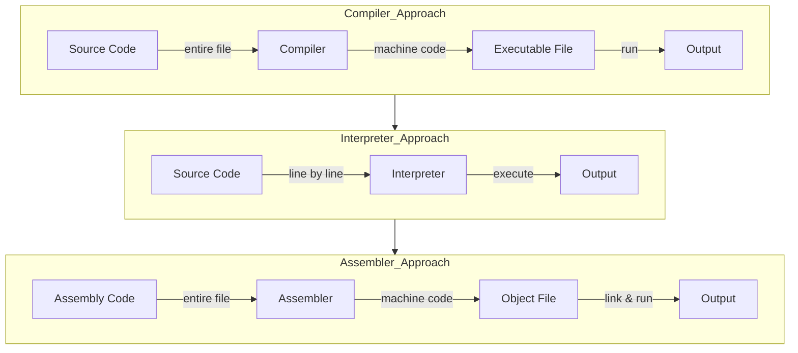
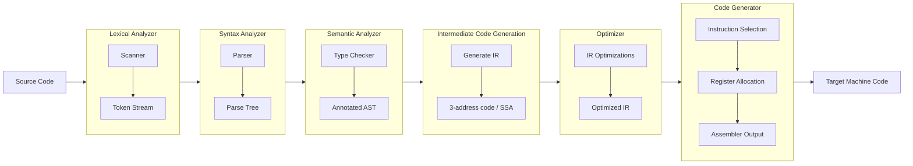
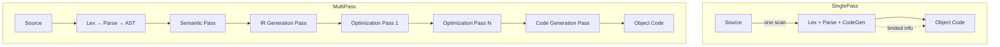
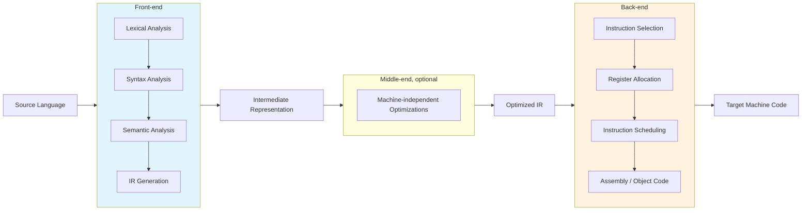
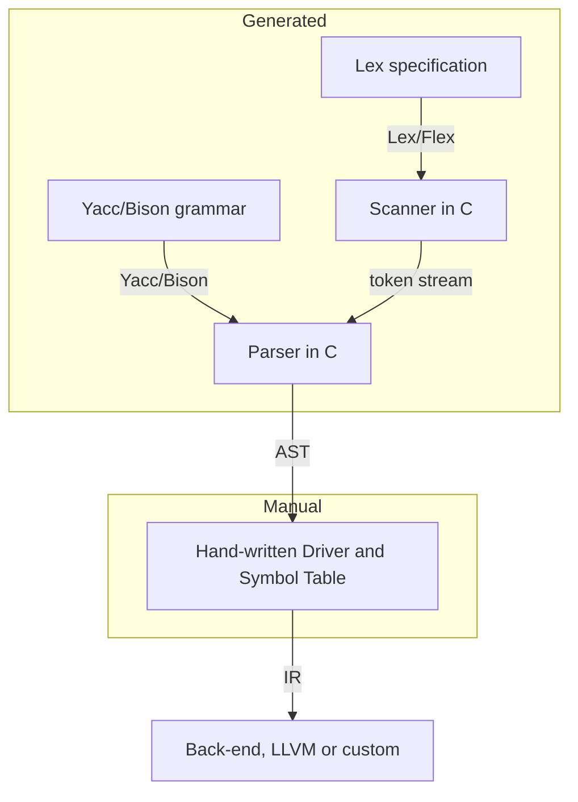

## Chapter 1: Introduction to Compilers

### 1. What is a Compiler?

A **compiler** is a system software that translates a program written in a **source language** (e.g., C, Java) into an equivalent program in a **target language** (typically machine code or assembly) **before execution**. The translation is performed as a single batch process, producing an executable file that can be run independently.

To understand compilers better, it is essential to contrast them with **interpreters** and **assemblers**.

| Feature               | Compiler                                      | Interpreter                                   | Assembler                                     |
| --------------------- | --------------------------------------------- | --------------------------------------------- | --------------------------------------------- |
| **Translation**       | Entire source code → target machine code     | One statement at a time → immediate execution | Assembly code (mnemonics) → machine code      |
| **Execution speed**   | Faster (no runtime translation overhead)     | Slower (repeated translation per statement)   | Very fast (direct mapping)                    |
| **Memory usage**      | Higher (object code + runtime system)         | Lower (interpreter plus source)               | Low (produces compact object code)            |
| **Error detection**   | Compile-time errors (syntax, type)            | Runtime errors (easy to debug interactively)  | Syntax errors in mnemonics / directives       |
| **Output**            | Standalone executable file                    | No permanent output – results computed on fly | Object code (relocatable or absolute)         |
| **Examples**          | GCC, Clang, javac                             | Python, Ruby, JavaScript (traditional)        | NASM, MASM, GNU as                            |

The following diagram illustrates the core distinction:

### 2. Need for Compilers

High-level programming languages are designed for human readability, productivity, and portability. However, processors only understand **binary machine code** (specific to an instruction set architecture, e.g., x86, ARM). Compilers bridge this semantic gap by performing **source-to-target translation** with several key benefits:

- **Abstraction** – Programmers can write in expressive, type-safe, memory-managed languages without worrying about register allocation or instruction scheduling.
- **Portability** – The same source code can be recompiled for different CPU architectures (e.g., Windows vs. embedded ARM) without modification.
- **Optimization** – Compilers apply complex transformations (loop unrolling, inlining, constant folding) to produce efficient machine code, often outperforming hand-written assembly.
- **Security & Diagnostics** – Compile-time checks (type consistency, unreachable code, memory safety) catch errors early, before deployment.

### 3. Major Phases of a Compiler

A compiler is typically partitioned into **phases**, each transforming the program representation from one abstract form to the next. The classic six phases (plus optional optimizer) are:

#### Detailed description of each phase:

1. **Lexical Analysis (Scanning)**  
   Reads the source character stream, groups characters into **lexemes**, and produces a stream of **tokens** (e.g., `IDENTIFIER`, `NUMBER`, `PLUS`). It removes whitespace and comments.  
   *Example:* `x = 42 + y` → `<ID,x> <ASSIGN> <NUM,42> <PLUS> <ID,y>`

2. **Syntax Analysis (Parsing)**  
   Checks the token sequence against the grammar of the source language, constructing a **parse tree** or **abstract syntax tree (AST)**. Reports syntax errors (e.g., missing semicolon, mismatched parentheses).

3. **Semantic Analysis**  
   Verifies context‑sensitive rules: type compatibility, variable declaration/use, scope rules, and inheritance. It decorates the AST with symbol table information and performs type checking.  
   *Example:* Rejecting adding a string to an integer.

4. **Intermediate Code Generation**  
   Translates the semantically verified AST into a **machine‑independent intermediate representation (IR)** such as three‑address code, static single assignment (SSA), or bytecode. The IR is easier to optimize and retarget.

5. **Optimization (Middle‑end)**  
   Applies transformations to improve the IR without changing its meaning. Common optimisations: constant folding, dead code elimination, loop invariant hoisting, inlining. The result is a more efficient IR.

6. **Code Generation**  
   Maps the optimized IR to actual machine instructions for the target architecture. Includes instruction selection, register allocation, and instruction scheduling. Produces assembly code or relocatable object code.

### 4. Passes: Single‑Pass vs. Multi‑Pass Compilers

A **pass** is a complete traversal of the entire program representation (source, AST, IR) to perform a particular task. Compilers are categorised by the number of passes.

| Aspect               | Single‑Pass Compiler                             | Multi‑Pass Compiler                                 |
| -------------------- | ------------------------------------------------ | --------------------------------------------------- |
| **Traversal count**  | One scan of source code                          | Multiple scans over intermediate representations   |
| **Memory usage**     | Very low (no full AST stored)                    | Higher (stores IR/AST between passes)               |
| **Language support** | Simple languages (Pascal subset, early C)        | All modern languages (C++, Java, Rust)              |
| **Forward references** | Not allowed or require backpatching            | Natural support                                     |
| **Optimization**     | Very limited (peephole only)                     | Global and interprocedural optimisations possible   |

Most production compilers (GCC, LLVM, javac) are **multi‑pass**, because they perform sophisticated optimizations and support complex language features (e.g., forward class references, generics).

### 5. Front‑end vs. Back‑end

The compiler is logically split into a **front‑end** and a **back‑end**, separated by the intermediate representation (IR). This division enables retargetability: the same front‑end can support multiple source languages, and the same back‑end can emit code for many target machines.

- **Front‑end** – depends on the source language but is independent of the target machine. Performs lexical, syntax, and semantic analysis; produces an IR.
- **Back‑end** – depends on the target machine but is independent of the source language. Performs code generation, register allocation, and machine‑specific optimisations.
- **Middle‑end** (optional, often part of back‑end) – performs machine‑independent optimizations on the IR (e.g., constant propagation, dead code elimination).

### 6. Compiler Construction Tools

Modern compilers are rarely written from scratch. A set of **compiler‑compilers** and generators automate the implementation of the front‑end phases.

| Tool                     | Purpose                                      | Input                                               | Output                                 |
| ------------------------ | -------------------------------------------- | --------------------------------------------------- | -------------------------------------- |
| **Lex** / **Flex**       | Lexical analyzer generator                   | Regular expressions (token definitions)             | C code for a scanner (finite automaton) |
| **Yacc** / **Bison**     | Parser generator (LALR(1))                   | Context‑free grammar (production rules)             | C code for a parser (shift‑reduce)     |
| **ANTLR**                | Parser generator (LL(*)) for multiple langs | Extended grammar with actions                       | Parser in Java, C++, Python, etc.      |
| **LLVM**                 | IR, optimizer, backend framework             | IR (LLVM bitcode)                                   | Optimized machine code for many CPUs    |
| **libpopt** / **gperf**  | Helper libraries for symbol tables, hash etc. | –                                                   | –                                      |

Typical usage in a compiler project:

- **Lex** generates a finite automaton that recognizes tokens and invokes user‑defined actions (e.g., returning a token type).
- **Yacc** (Yet Another Compiler Compiler) produces a LALR(1) parser that calls the lexer for tokens and builds a parse tree based on grammar rules.
- Together they free the compiler writer from implementing lexing and parsing manually, allowing focus on semantic analysis and optimization.

---

### Summary

This chapter introduced the fundamental role of a compiler as a language translator, distinguished it from interpreters and assemblers, and explained the necessity of compilation for abstraction, portability, and performance. The major phases—lexical, syntactic, semantic, IR generation, optimization, and code generation—form the classic pipeline. The concepts of single‑pass vs. multi‑pass architectures and front‑end/back‑end separation provide the structural basis for retargetable and optimising compilers. Finally, tools like Lex and Yacc automate the construction of the front‑end, enabling rapid development of production‑grade compilers.