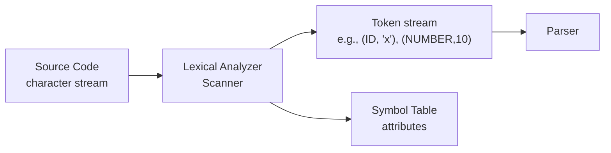
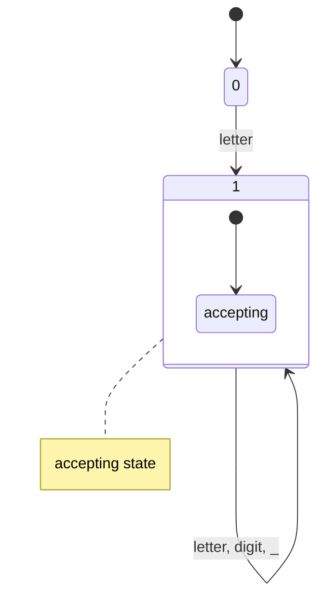
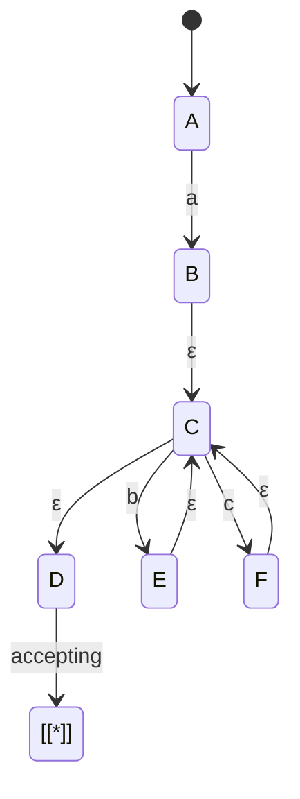
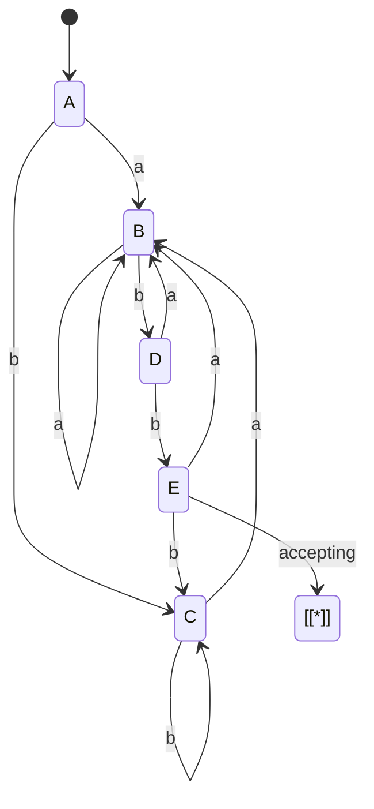
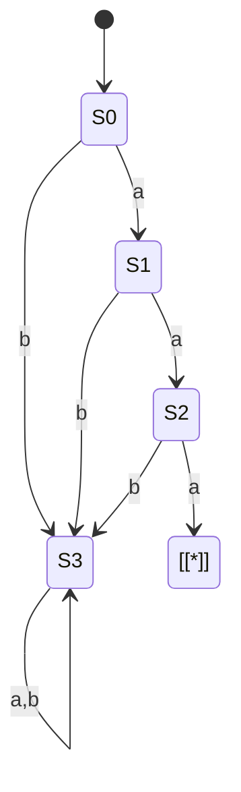
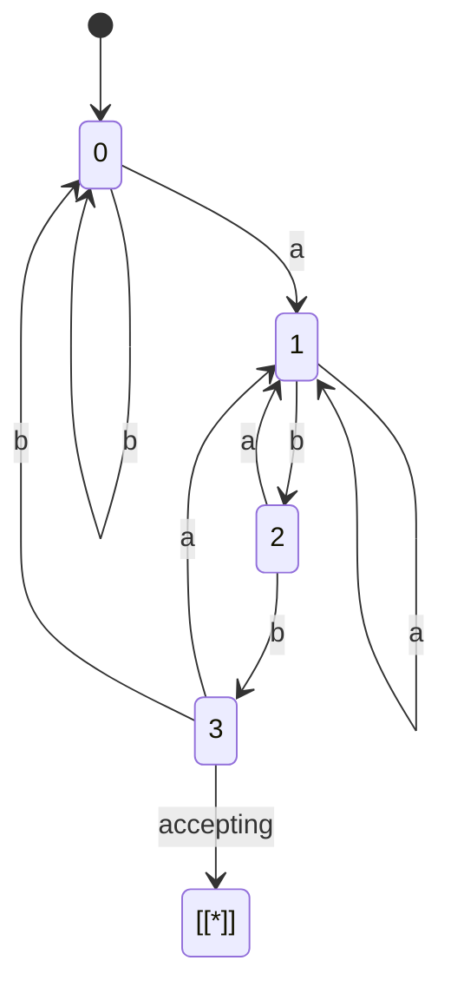
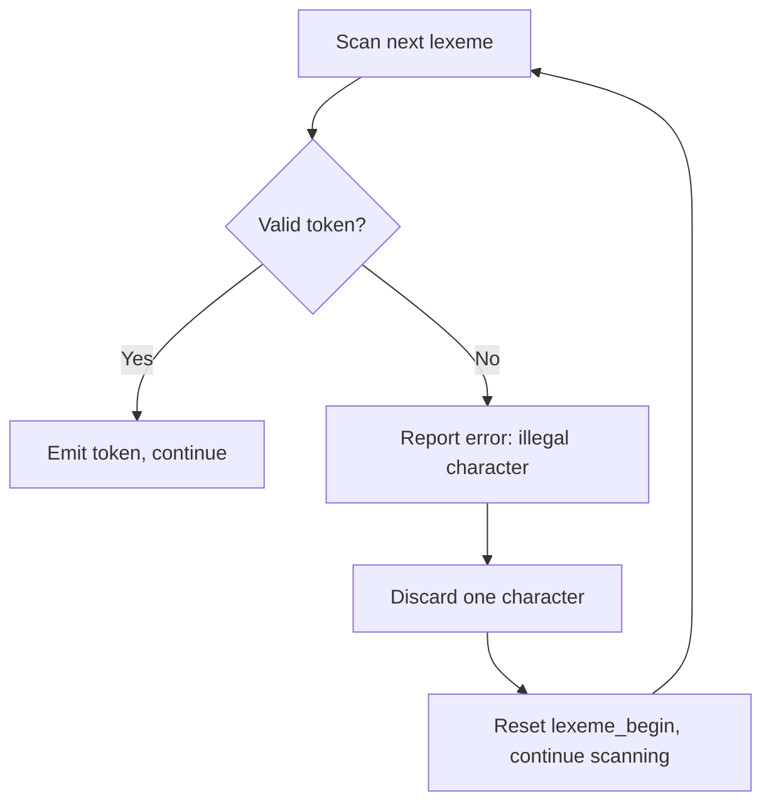

## Chapter 2: Lexical Analysis

### 1. Role of the Lexical Analyzer (Scanner)

The lexical analyzer is the first compiler phase. It reads the source character stream, groups characters into **lexemes**, and produces a stream of **tokens** for the parser. It also removes whitespace/comments and handles lexical errors.

**Example:**  
`if (x > 10) result = 5;`  
Tokens: `<KEYWORD, if>`, `<LPAREN>`, `<IDENT, x>`, `<GT>`, `<NUMBER, 10>`, `<RPAREN>`, `<IDENT, result>`, `<ASSIGN>`, `<NUMBER, 5>`, `<SEMICOLON>`

---

### 2. Input Buffering

Efficient lookahead is needed (e.g., distinguishing `=` from `==`). Two‑buffer + sentinel scheme is standard.

**Two‑buffer scheme with sentinel:**  
Two buffers of size *N* are used alternately. A sentinel (`EOF` or a special char) is placed at each buffer’s end. When the `forward` pointer hits the sentinel, the scanner refills the other buffer.

```mermaid
flowchart TD
    subgraph Buffer1
        B1["... x > = y ... &#124; SENTINEL"]
    end
    subgraph Buffer2
        B2["... next part ... &#124; SENTINEL"]
    end
    P1["lexeme_begin"] --> B1
    P2["forward"] --> B1
    
    P2 -- "forward reaches sentinel" --> Decision{Refill?}
    Decision -- "not end of file" --> Refill["Load next block into Buffer2"]
    Refill --> Reset["Reset lexeme_begin, forward"]
```

**Sentinels** remove explicit bounds checks at each character access – the sentinel is tested only when reached.

---

### 3. Tokens, Patterns, Lexemes

| Term     | Definition                                                                 | Example                       |
|----------|-----------------------------------------------------------------------------|-------------------------------|
| Token    | Category of lexical unit                                                    | `IDENTIFIER`, `NUMBER`, `IF`  |
| Pattern  | Rule (regular expression) describing lexemes for a token                    | `letter (letter\|digit)*`     |
| Lexeme   | Actual character sequence that matches a pattern                           | `count`, `123`, `if`          |

**Example:**  
`total = 0;` → lexeme `total` matches pattern `letter+` → token `IDENTIFIER`.

---

### 4. Specifications of Tokens Using Regular Expressions

Regular expressions (RE) define token patterns. Basic operations:

| Operation     | Notation | Meaning                              |
|---------------|----------|--------------------------------------|
| Concatenation | `r s`    | `r` then `s`                         |
| Alternation   | `r \| s` | `r` or `s`                           |
| Kleene star   | `r*`     | zero or more repetitions of `r`      |
| Positive closure | `r+`  | one or more (`r r*`)                 |
| Optional      | `r?`     | zero or one (`r \| ε`)               |

**Common patterns:**
- Identifier: `[a-zA-Z_][a-zA-Z0-9_]*`
- Integer: `[0-9]+`
- Float: `[0-9]+\.[0-9]+((E|e)(+|-)?[0-9]+)?`

---

### 5. Finite Automata

#### 5.1 Deterministic Finite Automaton (DFA)

`(Q, Σ, δ, q0, F)` with `δ: Q × Σ → Q` (total, deterministic). No ε‑moves.

**Example DFA for identifiers (letters, digits, underscore):**

#### 5.2 Non‑deterministic Finite Automaton (NFA)

`δ: Q × (Σ ∪ {ε}) → P(Q)` – multiple possible transitions, including ε.

**Example NFA for `a(b|c)*`:**

#### 5.3 Conversion: NFA → DFA (Subset Construction)

**Algorithm:**
1. Compute **ε‑closure** of NFA states.
2. For each DFA state (set of NFA states) and symbol `c`, compute `ε‑closure(move(T, c))` as a new DFA state.
3. Repeat until no new states.

**Example: NFA for `(a|b)*abb` → DFA**

State meanings (example):
- A = ε‑closure({0})
- B = ε‑closure(move(A,a))
- C = ε‑closure(move(A,b))
- D = ε‑closure(move(B,b))
- E = ε‑closure(move(D,b)) (accepting, contains NFA accepting state)

#### 5.4 DFA Minimization (Hopcroft’s Algorithm – Conceptual)

**Idea:** Partition states into **indistinguishable** groups. Initially: accepting vs. non‑accepting. Repeatedly split groups if transitions on a symbol go to different groups.

**Example DFA before minimization (redundant states):**

After minimization, S1 and S2 might be merged if they behave identically. The minimized DFA has fewer states while accepting the same language.

---

### 6. From Regular Expressions to DFA

**Two routes:**

#### Route 1: RE → NFA (Thompson) → DFA (Subset construction)

Thompson’s construction builds an NFA inductively:

```mermaid
flowchart LR
    subgraph Base cases
        direction LR
        E1[ε] --> E1F(( ))
        A[a] --> AF(( ))
    end
    subgraph Induction
        direction TB
        R1[ r ] --> C1[ concatenation ]
        R2[ s ] --> C1
        R1 --> Alt["alternation r&#124;s"]
        R2 --> Alt
        R1 --> Star["Kleene star r*"]
    end
```

**Example:** Build NFA for `(a|b)*abb`, then convert to DFA (see section 5.3 for final DFA).

#### Route 2: Direct RE → DFA (e.g., Brzozowski derivatives, or using **followpos** from RE syntax tree)

**Final minimal DFA for `(a|b)*abb`:**

This DFA accepts exactly strings ending with `abb`.

---

### 7. Lexical Errors and Error Recovery

**Common lexical errors:**
- Illegal character (e.g., `@` in C)
- Unterminated string literal (`"hello`)
- Unterminated comment (`/* comment`)
- Too long identifier/number (if limit enforced)

**Panic‑mode recovery (simplest and widely used):**
- Upon error, discard characters until a character that can start a valid token is found.
- Report one error per offending lexeme.

**Example:**  
Source: `int @x = 5;`  
Scanner sees `@` → error "Illegal character '@' ignored". Discards `@`, then scans `x` as an identifier.

---

## Summary Table

| Topic                          | Key Point                                                      |
|--------------------------------|----------------------------------------------------------------|
| Role of scanner                | Token stream generation, whitespace/comments removal, error handling |
| Input buffering                | Two‑buffer + sentinel eliminates per‑character bounds checks    |
| Token / pattern / lexeme       | Token: category, pattern: rule, lexeme: actual text             |
| Regular expressions            | Formal notation for token patterns (concatenation, alternation, closure) |
| DFA                            | Deterministic, O(n) time; no ε‑moves                            |
| NFA                            | Non‑deterministic, simpler to build from RE                     |
| NFA → DFA                      | Subset construction (exponential worst‑case, rare in practice)  |
| DFA minimization               | Hopcroft’s algorithm merges indistinguishable states            |
| RE → DFA                       | Via NFA (Thompson) or direct (followpos, derivatives)           |
| Lexical errors                 | Illegal chars, unterminated strings; panic mode recovery        |

This foundation enables efficient lexical analyzers, often generated automatically by tools like **lex** / **flex** that convert regular expressions into a DFA.