# Chapter 03 - Syntax Analysis (Parsing)

A comprehensive, in-depth reference on syntax analysis (parsing) in compiler design. This guide covers context-free grammars, top-down parsing (LL(1)), bottom-up parsing (LR family), and error recovery strategies. Designed for students, engineers, and compiler enthusiasts.

## 1. Context‑Free Grammars (CFG)

A **Context-Free Grammar** is a 4‑tuple $G = (N, T, P, S)$ where:
- $N$ : finite set of **non‑terminals**
- $T$ : finite set of **terminals** (tokens from the lexer)
- $P$ : finite set of **productions** of the form $A \to \alpha$ ( $A \in N, \alpha \in (N \cup T)^*$ )
- $S \in N$ : **start symbol**

**Example grammar for arithmetic expressions:**
```text
E → E + T | T
T → T * F | F
F → ( E ) | id
```

### 1.1 Derivations
Derivation replaces a non‑terminal by the right‑hand side of a production.

- **Leftmost derivation** – replace the leftmost non‑terminal at each step.
- **Rightmost derivation** – replace the rightmost non‑terminal at each step.

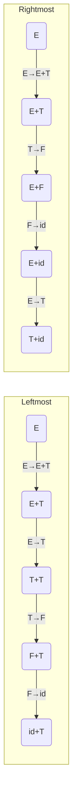

### 1.2 Parse Trees and Abstract Syntax Trees (AST)

A **parse tree** (concrete syntax tree) represents the derivation graphically, with all grammar symbols as nodes.

An **AST** abstracts away punctuation and irrelevant details, keeping only essential structure.

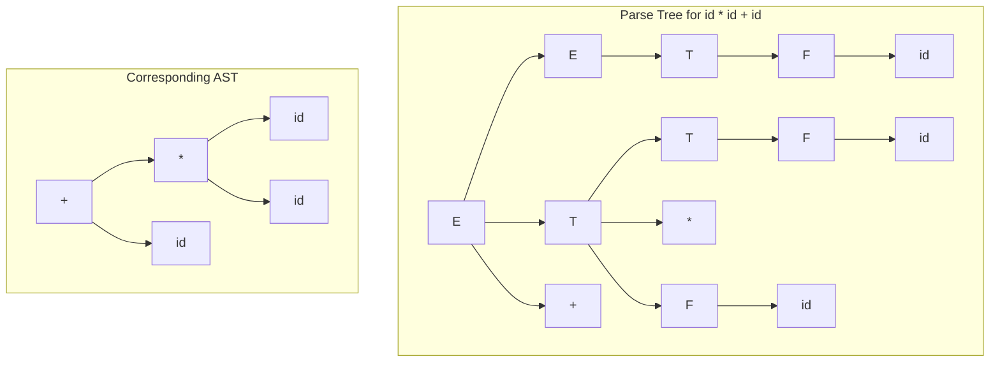

### 1.3 Ambiguity in Grammars
A grammar is **ambiguous** if there exists a string with two distinct parse trees (or leftmost derivations).

**Classic example – dangling‑else:**
```text
stmt → if expr then stmt | if expr then stmt else stmt | other
```
For the string `if e1 then if e2 then s1 else s2`, two parse trees exist.

**Removing ambiguity:** Rewrite the grammar to enforce a rule (e.g., `else` matches the closest unmatched `if`).
```text
stmt → matched_stmt | unmatched_stmt
matched_stmt → if expr then matched_stmt else matched_stmt | other
unmatched_stmt → if expr then stmt | if expr then matched_stmt else unmatched_stmt
```

### 1.4 Eliminating Left Recursion
Left recursion ($A \to A\alpha \mid \beta$) causes infinite loops in top‑down parsers.

**Algorithm** – Replace
$$
A \to A\alpha_1 \mid A\alpha_2 \mid \dots \mid A\alpha_m \mid \beta_1 \mid \beta_2 \mid \dots \mid \beta_n
$$
with
$$
\begin{aligned}
A &\to \beta_1 A' \mid \beta_2 A' \mid \dots \mid \beta_n A' \\
A' &\to \alpha_1 A' \mid \alpha_2 A' \mid \dots \mid \alpha_m A' \mid \varepsilon
\end{aligned}
$$

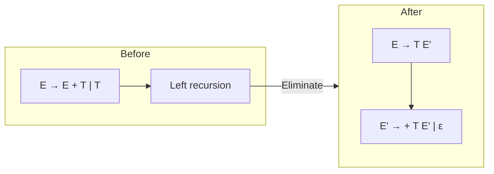

**Example:**
```text
E → E + T | T      becomes:   E → T E'
T → T * F | F                E' → + T E' | ε
F → (E) | id                 T → F T'
                             T' → * F T' | ε
                             F → (E) | id
```

### 1.5 Left Factoring
When two productions of a non‑terminal share a common prefix, left factoring delays the decision:
$$
A \to \alpha\beta_1 \mid \alpha\beta_2 \quad\Rightarrow\quad A \to \alpha A',\; A' \to \beta_1 \mid \beta_2
$$

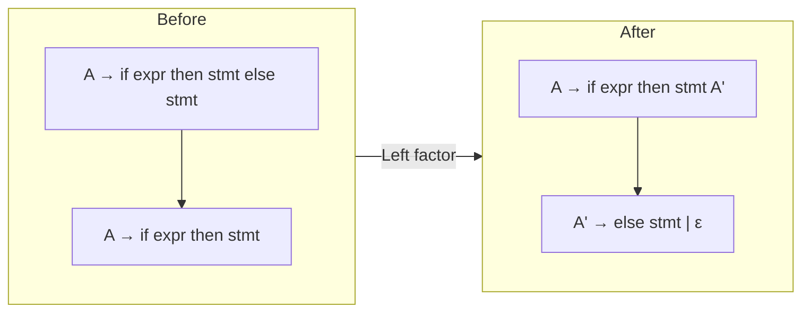

---

## 2. Top‑Down Parsing

Top‑down parsers build the parse tree from the root (start symbol) to leaves, using leftmost derivation.

### 2.1 Recursive Descent Parsing (with Backtracking)
A set of recursive functions, one per non‑terminal. Backtracking is used when a production fails.

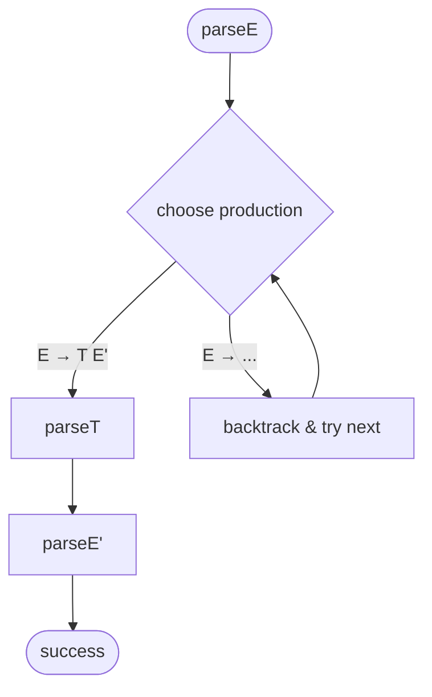

**Drawback:** Exponential time and complicated error reporting.

### 2.2 Predictive Parsing (without Backtracking)
Uses a **parsing table** and a stack, no backtracking. The grammar must be **LL(1)**.

### 2.3 FIRST and FOLLOW Sets

**FIRST(α)** – set of terminals that begin strings derivable from α.  
**FOLLOW(A)** – set of terminals that can appear immediately to the right of A in some derivation.

**Construction rules (FIRST):**
1. If $a \in T$, then $a \in \text{FIRST}(a)$.
2. If $A \to \varepsilon$, then $\varepsilon \in \text{FIRST}(A)$.
3. If $A \to X_1 X_2 \dots X_k$, add $\text{FIRST}(X_1)$ to $\text{FIRST}(A)$. If $X_1 \Rightarrow^* \varepsilon$, add $\text{FIRST}(X_2)$, etc.

**Construction rules (FOLLOW):**
1. $\$ \in \text{FOLLOW}(S)$ (end‑of‑input marker)
2. If $A \to \alpha B \beta$, then $\text{FIRST}(\beta) \setminus \{\varepsilon\} \subseteq \text{FOLLOW}(B)$
3. If $A \to \alpha B$ or $A \to \alpha B \beta$ with $\varepsilon \in \text{FIRST}(\beta)$, then $\text{FOLLOW}(A) \subseteq \text{FOLLOW}(B)$

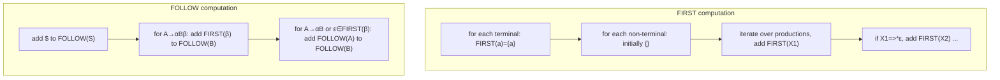

### 2.4 LL(1) Grammars
A grammar is **LL(1)** if for every pair of productions $A \to \alpha \mid \beta$:
- $\text{FIRST}(\alpha) \cap \text{FIRST}(\beta) = \emptyset$
- If $\varepsilon \in \text{FIRST}(\alpha)$, then $\text{FIRST}(\beta) \cap \text{FOLLOW}(A) = \emptyset$ (and vice versa)

**LL(1) Parsing Table Construction:**
- For each production $A \to \alpha$:
  - For each $t \in \text{FIRST}(\alpha)$, set $M[A, t] = A \to \alpha$
  - If $\varepsilon \in \text{FIRST}(\alpha)$, then for each $b \in \text{FOLLOW}(A)$, set $M[A, b] = A \to \alpha$

### 2.5 LL(1) Parsing Algorithm (Stack‑Based)

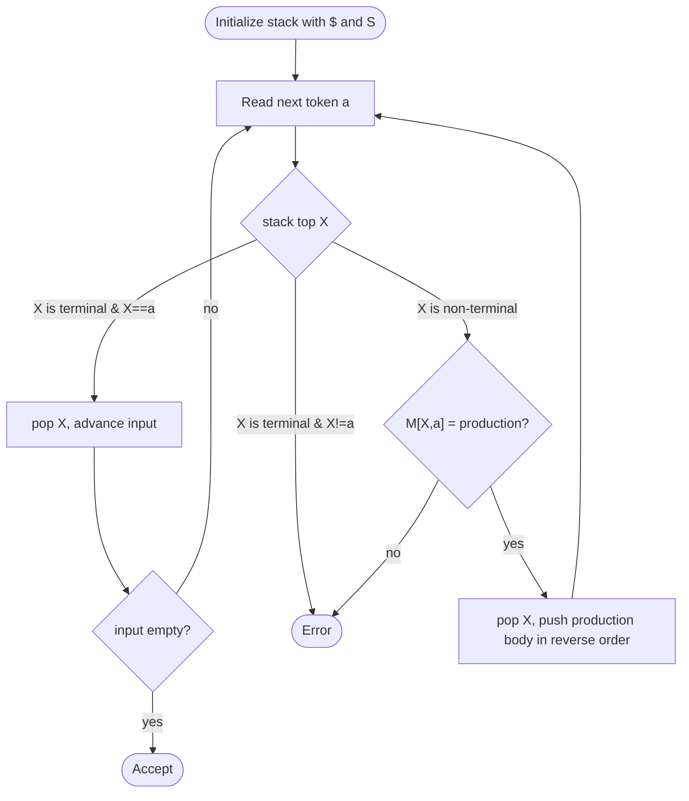

**Example table for simplified expression grammar:**

| Non‑terminal | id   | +    | *    | (    | )    | $    |
|--------------|------|------|------|------|------|------|
| E            | E→TE'|      |      | E→TE'|      |      |
| E'           |      | E'→+TE'|    |      | E'→ε | E'→ε |
| T            | T→FT'|      |      | T→FT'|      |      |
| T'           |      | T'→ε | T'→*FT'|    | T'→ε | T'→ε |
| F            | F→id |      |      | F→(E)|      |      |

### 2.6 Error Recovery in LL(1)

- **Panic mode:** Skip input tokens until a synchronising token (e.g., `;` or `}`) in FOLLOW set of the popped non‑terminal.
- **Phrase‑level recovery:** Insert / delete symbols locally based on the parsing table.
- **Error productions:** Augment grammar with productions that explicitly catch common errors.

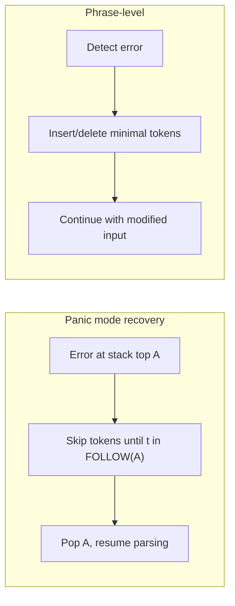

---

## 3. Bottom‑Up Parsing

Bottom‑up parsers construct the parse tree from leaves (input tokens) up to the start symbol. The most common family is **LR parsers**.

### 3.1 Handle Pruning
A **handle** is a substring that matches the right‑hand side of a production, whose reduction leads to the start symbol. Pruning means repeatedly replacing handles by their non‑terminals (reverse of rightmost derivation).

**Viable prefix** – a prefix of a right‑sentential form that can appear on the stack of a shift‑reduce parser.

### 3.2 LR Parsing Overview

An LR parser uses:
- A **stack** (states and grammar symbols)
- A **parsing table** (ACTION and GOTO)
- An **input buffer**

**LR Items:** A production with a dot (•) indicating how much has been seen.  
Example: $A \to \alpha \cdot \beta$ means we have already parsed $\alpha$, expect $\beta$.

**Closure(I)** – adds items that become reachable when the dot is before a non‑terminal.  
**Goto(I, X)** – moves the dot past symbol X in all items of I where X follows the dot.

### 3.3 LR(0) Automaton
States are sets of LR(0) items. Transitions correspond to GOTO.

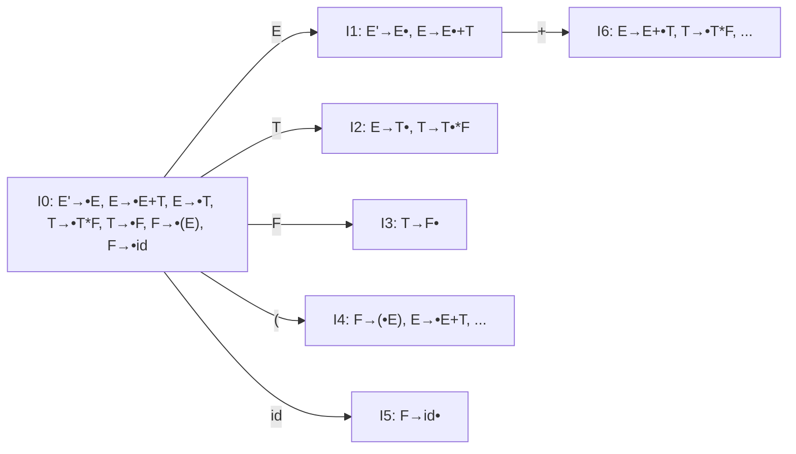

### 3.4 SLR(1) Parsing (Simple LR) – Most Asked in GATE
Uses LR(0) items + FOLLOW sets to resolve conflicts.

**Parsing table construction:**
1. Build LR(0) automaton.
2. ACTION[i, t] = **shift j** if GOTO(i, t) = j (t terminal)
3. ACTION[i, $] = **accept** if i contains $S' \to S \cdot$
4. For each item $A \to \alpha \cdot$ in state i, for each $b \in \text{FOLLOW}(A)$, set ACTION[i, b] = **reduce $A \to \alpha$**
5. GOTO[i, A] = j if GOTO(i, A) = j (A non‑terminal)

**Conflicts:**
- **Shift‑reduce conflict** – a state has both a shift and a reduce action on the same terminal.
- **Reduce‑reduce conflict** – a state has two different reduce actions on the same terminal.

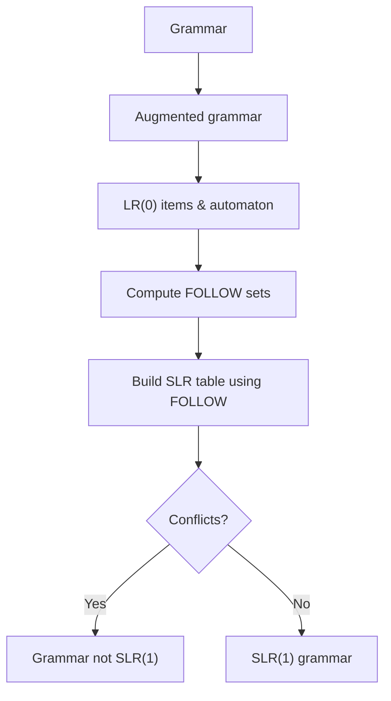

### 3.5 Canonical LR(1) Items
LR(1) items include a **lookahead** symbol. Form: $[A \to \alpha \cdot \beta, a]$ where $a$ is a terminal or \$.  
Reduction only when the next token matches the lookahead. More powerful than SLR(1) but many more states.

### 3.6 LALR(1) Parsing (Lookahead LR)
Merges states with identical LR(0) cores (ignoring lookaheads) from LR(1) automaton.  
**Power:** LALR(1) = SLR(1) < LALR(1) < LR(1) in terms of language recognition.  
Most practical parsers (YACC, Bison, ANTLR) generate LALR(1) tables.

### 3.7 Shift‑Reduce & Reduce‑Reduce Conflicts

| Conflict type | Meaning | Example |
|---------------|---------|---------|
| Shift‑reduce | Parser can either shift or reduce | $E \to E+E \cdot , +$ (shift vs reduce) |
| Reduce‑reduce | Two different reductions possible | $A \to \alpha \cdot$ and $B \to \alpha \cdot$ on same lookahead |

**Resolution:**
- Prefer shift (dangling‑else)
- Use associativity / precedence declarations
- Rewrite grammar

### 3.8 Comparison: LL(1) vs SLR(1) vs LALR(1) vs LR(1)

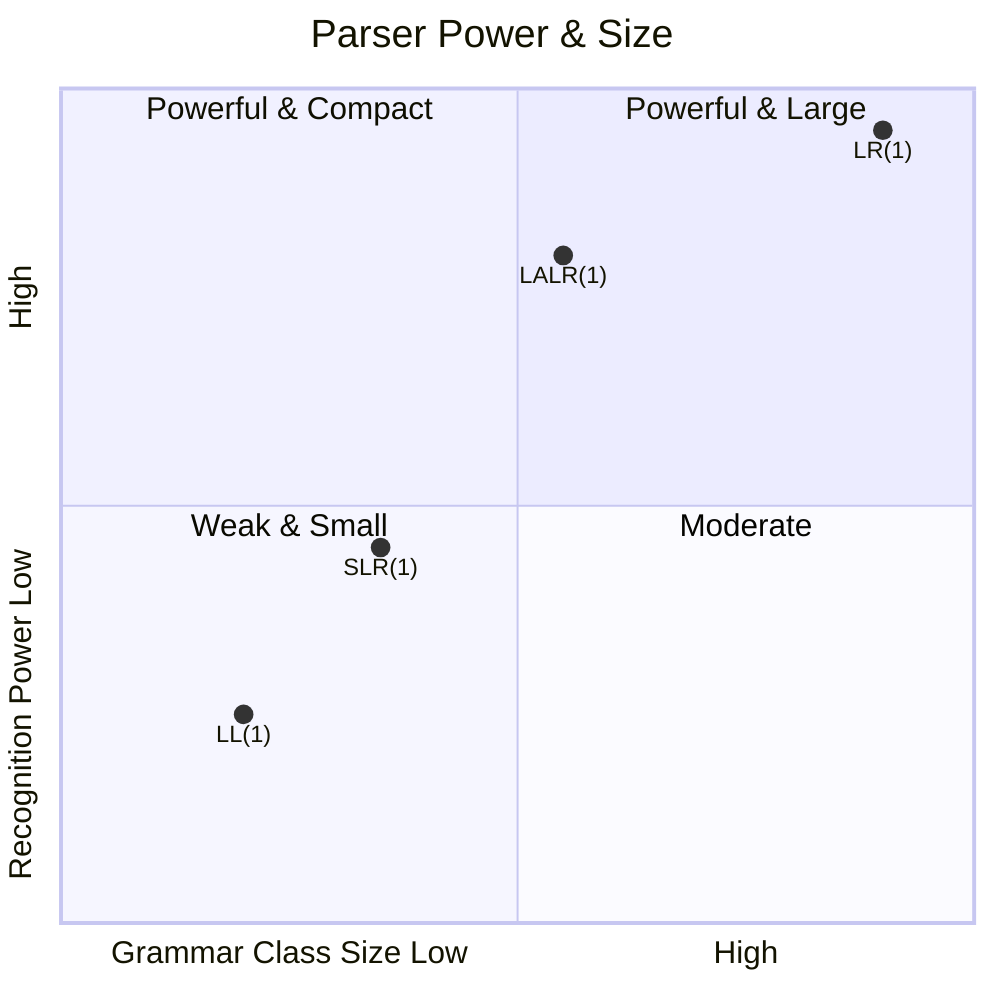

| Feature | LL(1) | SLR(1) | LALR(1) | LR(1) |
|---------|-------|--------|---------|-------|
| Parsing direction | Top‑down | Bottom‑up | Bottom‑up | Bottom‑up |
| Table size | Small | Medium | Medium | Huge |
| Grammar coverage | Least | More | More than SLR(1) | Most |
| Conflict detection | FIRST/FOLLOW | FOLLOW | Lookahead | Full lookahead |
| Typical implementation | Recursive descent | Table‑driven | YACC/Bison | Theoretical |

---

## 4. Error Handling in Parsing

### 4.1 Panic Mode Recovery
When an error occurs, the parser discards input tokens until a **synchronising token** (e.g., `;`, `}`) appears. It then pops stack symbols until a state that can handle that token is found.

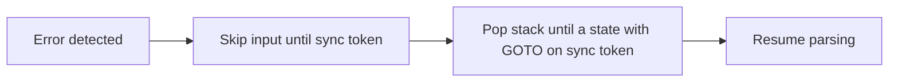

### 4.2 Phrase‑Level Recovery
Attempts to repair the error locally by inserting, deleting, or replacing tokens. Often implemented by modifying the parsing table or by adding error productions.

### 4.3 Error Productions
Add productions specifically for erroneous constructs, e.g.:
```text
stmt → error ;        # skip to semicolon
stmt → if expr then stmt else error
```

When an error production is used, the parser can recover gracefully.

---

## Summary

| Topic | Key takeaway |
|-------|---------------|
| CFG | Formal definition of language syntax |
| Left recursion elimination | Enables top‑down parsing |
| Left factoring | Delays decision, avoids backtracking |
| FIRST/FOLLOW | Core of LL(1) table construction |
| LL(1) | Predictive parser; fast, small tables |
| LR(0) automaton | Basis for all LR parsers |
| SLR(1) | Simple, uses FOLLOW for reduction decisions |
| LR(1) | Full lookahead, large tables |
| LALR(1) | Practical, used in parser generators |
| Conflicts | Shift‑reduce / reduce‑reduce; resolved by precedence or grammar rewrite |
| Error recovery | Panic mode, phrase‑level, error productions |

This guide serves as a complete reference for syntax analysis. Clone this repository and experiment with the grammars and algorithms to solidify your understanding.
