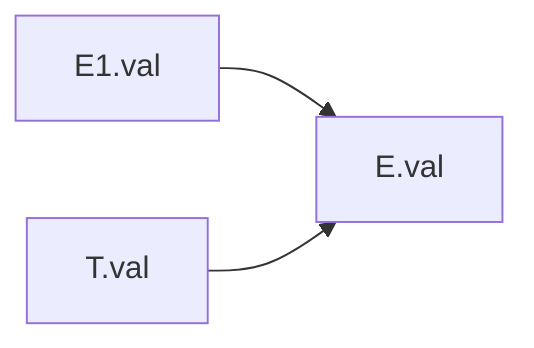
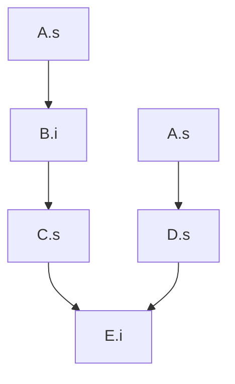
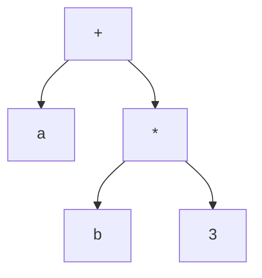
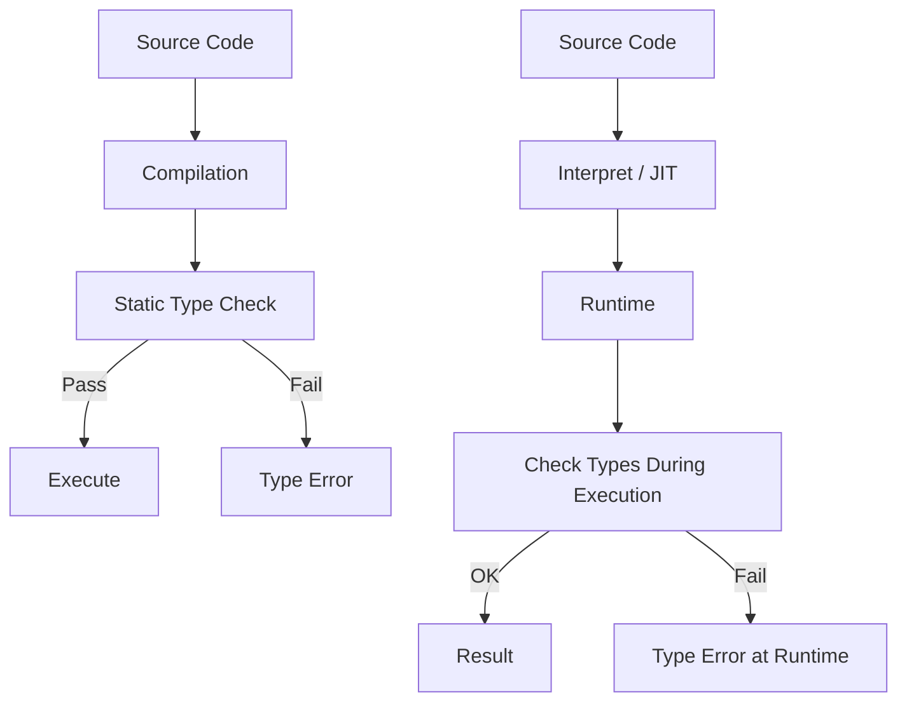
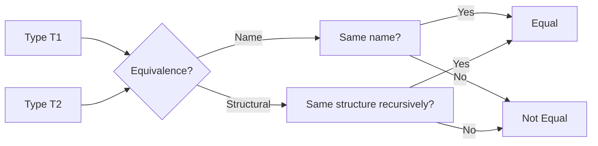
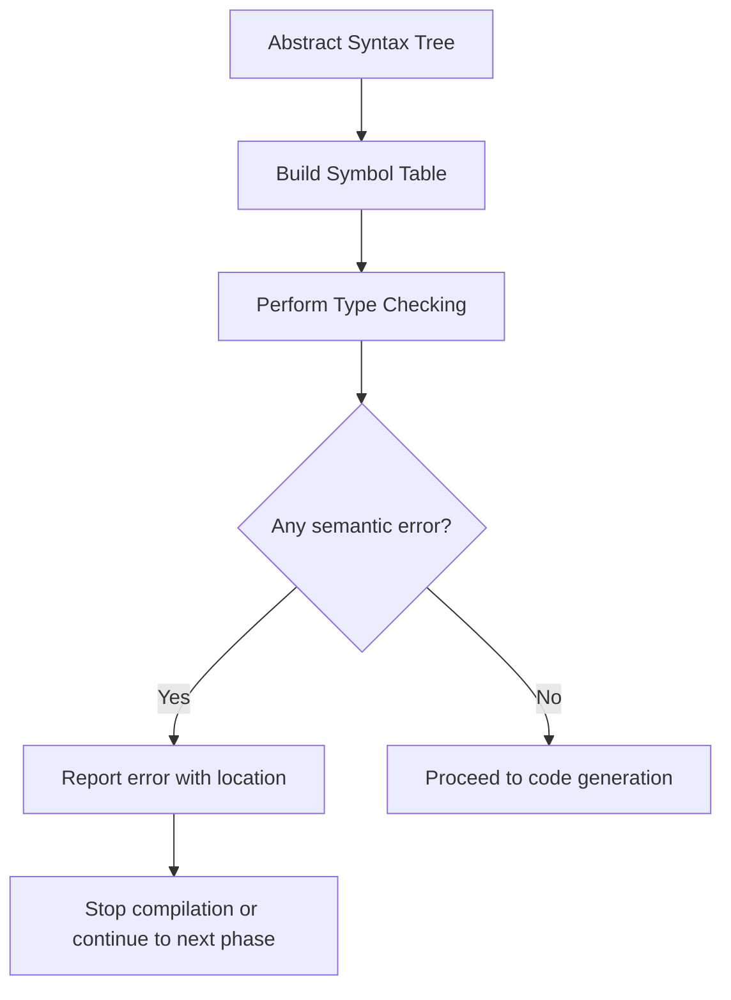

# Chapter 4: Syntax-Directed Translation (SDT)

This chapter covers how to associate semantic information (attributes, actions) with grammar productions to perform translation and type checking during parsing.

---

## 1. Syntax-Directed Translation (SDT)

SDT is a method where we attach **semantic rules** or **actions** to grammar productions. It drives the translation (e.g., code generation, type checking) while parsing the input.

Two formalisms:
- **Syntax-Directed Definition (SDD)** – uses attributes (values attached to grammar symbols) and semantic rules.
- **Syntax-Directed Translation Scheme** – embeds program fragments (actions) directly within productions.

---

## 2. Syntax-Directed Definitions (SDD)

An SDD assigns **attributes** to grammar symbols and defines **semantic rules** for each production.

### 2.1 Synthesized Attributes
- Computed from children nodes (bottom‑up).
- Example: `E.val = E1.val + T.val` (value of an expression from its parts).

### 2.2 Inherited Attributes
- Passed from parent or siblings to a child.
- Example: a declaration’s type inherited from the parent to a variable.

**Example:** Simple calculator for digit sequences  
Grammar: `L → E`  `E → E1 + T`  `E → T`  `T → F`  `T → F * T`  `F → digit`  `F → ( E )`

Synthesized attribute `val` (no inheritance needed):

| Production            | Semantic Rule                   |
|-----------------------|---------------------------------|
| L → E                 | L.val = E.val                   |
| E → E1 + T            | E.val = E1.val + T.val          |
| E → T                 | E.val = T.val                   |
| T → F                 | T.val = F.val                   |
| T → F * T1            | T.val = F.val * T1.val          |
| F → digit             | F.val = digit.lexval            |
| F → ( E )             | F.val = E.val                   |

---

## 3. Dependency Graphs and Evaluation Order

A **dependency graph** shows which attribute must be computed before another (arrows from used attributes to computed attributes).  
Evaluation must follow a **topological order** – any linear ordering that respects the dependencies.

### Example: Production `E → E1 + T` with synthesized attributes `val`.

Attributes: `E.val`, `E1.val`, `T.val`.  
Dependencies: `E.val` ← `E1.val` and `E.val` ← `T.val` (arrow from used to computed). Graph:



For a parse tree, you compute attributes in bottom‑up order (post‑order) for synthesized-only definitions.

**Topological sort example** – a more complex tree with mixed attributes:



Valid topological order: `A.s → B.i → C.s → D.s → E.i` (or `A.s → D.s → B.i → C.s → E.i`). Any order that respects arrows works.

---

## 4. S-Attributed Definitions

An SDD is **S-attributed** if it uses **only synthesized attributes**.  
Evaluation is straightforward: bottom‑up, in one pass, e.g., during LR parsing.

**Example:** Expression grammar with `val` (synthesized).  
Parse tree evaluation: compute leaves (digit.lexval) → up to root.

---

## 5. L-Attributed Definitions

An SDD is **L-attributed** if:
- For each production `A → X1 X2 ... Xn`, each inherited attribute of `Xj` depends only on:
  - Attributes of `A` (inherited attributes of the left side)
  - Attributes of `X1 ... Xj-1` (previous siblings)
  - Synthesized attributes of `X1 ... Xj-1` (but no restrictions on synthesized attributes of `Xj` or later siblings).

L‑attributed definitions can be evaluated by a **left‑to‑right depth‑first** traversal.

**Example:** Type declaration `D → T L` where `T` has synthesized `type`, `L` has inherited `type` from `T`.

| Production       | Semantic Rules                                   |
|------------------|--------------------------------------------------|
| D → T L          | L.in = T.type                                    |
| L → id , L1      | id.type = L.in; L1.in = L.in                     |
| L → id           | id.type = L.in                                   |

Here `L.in` is inherited from left side of `D` via `L.in = T.type`, and then passed to `L1.in`. All dependencies are left‑to‑right.

---

## 6. Syntax-Directed Translation Schemes

A **translation scheme** is an SDD where semantic actions are embedded in curly braces `{ }` within the production body.

Example (postfix translation):
```
E → E1 + T  { print('+'); }
E → T
T → F * T1  { print('*'); }
T → F
F → digit   { print(digit.lexval); }
```

During parsing, when we reduce by a production, we execute its actions. For LR parsing, actions are placed at the end (postfix). For LL parsing, actions can be in the middle.

---

## 7. Building Abstract Syntax Trees (AST) Using SDT

AST discards punctuation and keeps essential structure. Each node has an operator and pointers to children.

**Grammar with AST construction (S‑attributed):**

```
E → E1 + T   { E.node = new Node('+', E1.node, T.node) }
E → T        { E.node = T.node }
T → F * T1   { T.node = new Node('*', F.node, T1.node) }
T → F        { T.node = F.node }
F → ( E )    { F.node = E.node }
F → id       { F.node = new Leaf(id.lexval) }
F → num      { F.node = new Leaf(num.val) }
```

**Example AST for `a + b * 3`:**  
`+` node with left leaf `a`, right `*` node; `*` node has left leaf `b`, right leaf `3`.



---

## 8. Translation of Expressions, Control Flow, and Declarations

### 8.1 Expressions (Three‑Address Code)
Use SDT to generate three‑address code (TAC) like `t1 = b * 3`, `t2 = a + t1`.

**Scheme:**
```
E → E1 + T   { E.code = E1.code || T.code || new Temp() '=' E1.place '+' T.place; E.place = new Temp() }
E → T        { E.code = T.code; E.place = T.place }
T → F * T1   { similar with '*' }
```

### 8.2 Control Flow Statements (if‑then‑else, while)
Use labels and backpatching or generate TAC with jumps.

**Example for if‑then‑else:**
```
S → if E then S1 else S2
    {
        E.true = newlabel();
        E.false = newlabel();
        S1.next = S.next;
        S2.next = S.next;
        S.code = E.code || label(E.true) || S1.code || goto(S.next) || label(E.false) || S2.code
    }
```

### 8.3 Declarations
Process `D → T id ; D` by inserting `id` into symbol table with type `T.type`. Use inherited attributes to pass type.

**SDT (L‑attributed):**
```
D → T id ; D1   { id.type = T.type; enter(id.name, T.type); D1.in = T.type }  // D1 inherits type
D → ε
```

---

## 9. Type Checking

### 9.1 Static vs Dynamic Typing

| Static Typing                                 | Dynamic Typing                               |
|-----------------------------------------------|-----------------------------------------------|
| Types checked at compile time                 | Types checked at runtime                      |
| Errors caught early                           | More flexible but may crash at runtime        |
| Examples: C, Java, Rust                       | Examples: Python, JavaScript, Ruby            |

**Mermaid comparison:**



### 9.2 Type Equivalence

- **Name equivalence:** Two types are equal iff they have the same name (or are the same type expression).  
  Example: `typedef int feet;` in C – `feet` is not equal to `int` in strict name equivalence.
- **Structural equivalence:** Two types are equal iff their structures are identical (e.g., same fields in same order).  
  Example: `struct { int x; float y; }` equals another with same fields, even if different names.

**Mermaid diagram for type equivalence checking:**



### 9.3 Type Conversion (Coercion)

**Implicit coercion** (automatic) vs **explicit conversion** (cast).  
Widening (int → float) safe, narrowing (float → int) may lose precision.

**Example:** In `int a = 5; float b = a + 2.5;`, `a` is coerced to float automatically.

**Semantic rule for coercion (expression):**
```
E → E1 + E2
    if (E1.type == int and E2.type == int) then E.type = int
    else if (E1.type == float or E2.type == float) then
        E.type = float
        if (E1.type == int) coerce E1 to float
        if (E2.type == int) coerce E2 to float
```

### 9.4 Semantic Errors

Types of semantic errors (detected during semantic analysis):
- Type mismatch: `int + string` without coercion.
- Undeclared variable.
- Scope violation: using a variable outside its region.
- Duplicate declaration.
- Invalid control flow (e.g., break outside loop).
- Incompatible assignment: `int x = "hello"`.

**Mermaid flowchart for typical semantic error handling:**



---

## 10. Summary

| Concept                  | Key Points                                                                 | Example                                                       |
|--------------------------|----------------------------------------------------------------------------|---------------------------------------------------------------|
| SDD                      | Attributes + rules; synthesized (from children) or inherited (from parent) | `E.val = E1.val + T.val`                                      |
| Dependency graph         | Arrows from used to computed attributes; need topological order            | Graph for `E → E1 + T` has two arrows to `E.val`              |
| S‑attributed             | Only synthesized; evaluate bottom‑up                                      | Calculator                                                    |
| L‑attributed             | Inherited allowed if left‑to‑right dependency                             | Type declaration processing                                   |
| Translation scheme       | Actions embedded in productions                                           | `E → E1 + T { print('+'); }`                                  |
| AST construction         | Build tree with operators as nodes, leaves as operands                    | `+` node with children `a` and `*` node                       |
| Type checking (static)   | Compile‑time safety                                                       | Java: `int x = "abc";` error at compile                       |
| Type equivalence         | Name vs structural                                                        | C structs: name equivalence by default, but can compare       |
| Coercion                 | Implicit widening                                                         | `int` to `float` in `3 + 2.5`                                 |
| Semantic errors          | Undeclared variables, type mismatch, scope errors                         | `break` outside loop                                          |

All these mechanisms form the backbone of semantic analysis and intermediate code generation in compilers.