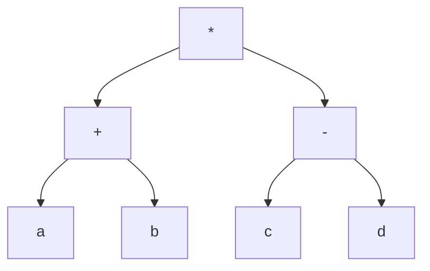
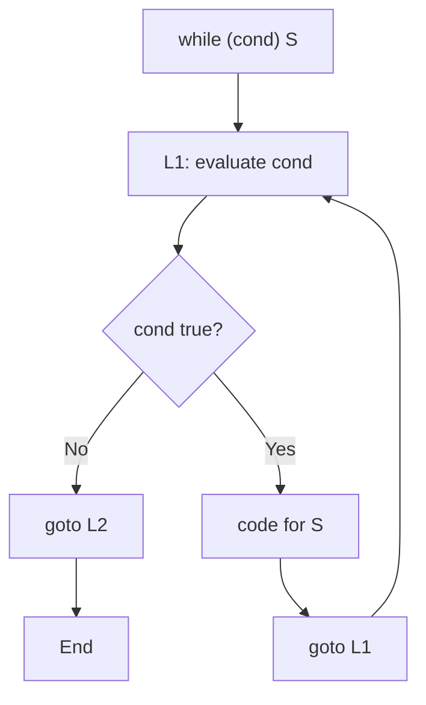
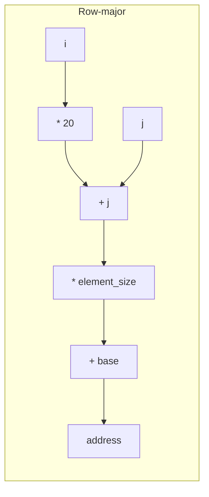

## Chapter 5: Intermediate Code Generation

Intermediate code generation is the phase in a compiler that converts the abstract syntax tree (AST) or annotated parse tree into a machine‑independent intermediate representation (IR). This IR is easier to optimize and translate into target machine code.

---

## 1. Need for Intermediate Representation (IR)

**Why use an IR?**  
- **Retargetability**: The same front‑end (lexical, syntax, semantic analysis) can be reused for different machines by writing only the back‑end from IR to each target.
- **Optimization**: Many optimizations are performed on IR (e.g., dead code elimination, constant folding) independently of the source or target language.
- **Simplifies translation**: IR has a small, regular instruction set, making code generation easier.

**Real‑world analogy**:  
*Think of a translator who converts English (source) to French (target). Instead of directly translating word‑by‑word, they first convert to a neutral “interlanguage” like Esperanto (IR). That interlanguage can then be translated into French, German, or Spanish without redoing the English‑to‑Esperanto step.*

---

## 2. Three‑Address Code (TAC)

**Three‑address code** is a linear IR where each instruction has at most one operator and three addresses (two operands, one result).  
Addresses can be:  
- Variables (source‑level names)  
- Temporary variables (e.g., `t1`, `t2`)  
- Constants  
- Labels

Example: `x = y + z * 2` becomes  
```
t1 = z * 2
x = y + t1
```

### 2.1 Representations of TAC

| Representation | Description | Example for `a = b + c * d` |
|----------------|-------------|-------------------------------|
| **Quadruples** | Four fields: `(op, arg1, arg2, result)` | `(*, c, d, t1)`<br>`(+, b, t1, t2)`<br>`(=, t2, , a)` |
| **Triples** | Uses position numbers instead of temporaries; result referenced by its index | `(0) (*, c, d)`<br>`(1) (+, b, (0))`<br>`(2) (=, (1), a)` |
| **Indirect triples** | A list of pointers to triples; allows reordering of code without changing triples | `[0, 1, 2]` pointing to same triples as above |

**Real‑world analogy**:  
*Quadruples are like a grocery list where each item is `(action, ingredient1, ingredient2, result)` – e.g., “mix flour, sugar, bowl”. Triples are like a recipe with step numbers: step 1: mix flour, sugar; step 2: add step 1 to eggs; step 3: bake step 2. Indirect triples are like a play list: you can reorder the songs (steps) without rewriting each song.*

---

## 3. Common TAC Instructions

| Category               | Instructions                                          | Example                       |
|------------------------|-------------------------------------------------------|-------------------------------|
| Assignment             | `x = y`, `x = y op z`, `x = op y` (unary)             | `t1 = b * c`                  |
| Arithmetic             | `+`, `-`, `*`, `/`, `%`                               | `t2 = t1 + d`                 |
| Conditional jumps      | `if x relop y goto L` (relop: `<, >, ==, !=, <=, >=`) | `if a < b goto L1`            |
| Unconditional jumps    | `goto L`                                              | `goto L2`                     |
| Procedure calls        | `param x` (pass argument), `call p, n` (n args)       | `param a`<br>`param b`<br>`call max, 2` |
| Return                 | `return x`                                            | `return t3`                   |
| Indexed assignment     | `x = y[i]`, `x[i] = y` (array access)                 | `t1 = a[i]`                   |

---

## 4. Translation of Expressions (Syntax Tree → TAC)

We traverse the AST and generate TAC using temporary variables.

**Algorithm**: For each node `op` with children `left` and `right`:
- Recursively generate code for `left` → place `Lplace`
- Recursively generate code for `right` → place `Rplace`
- Create new temp `t`
- Emit `t = Lplace op Rplace`
- Return `t` as the place for this node.

**Example**: Expression `(a + b) * (c - d)`



TAC:
```
t1 = a + b
t2 = c - d
t3 = t1 * t2
```

**Real‑world analogy**:  
*Like building a piece of furniture from a diagram: you first assemble subparts (left and right), label each subassembly (temp variable), then combine them to form the final product.*

---

## 5. Translation of Control Flow

Control flow statements are translated into conditional and unconditional jumps, often using labels.

### 5.1 If‑Then‑Else
```
if (cond) S1 else S2
```
TAC:
```
    evaluate cond, jump to L1 if true
    goto L2
L1: code for S1
    goto L3
L2: code for S2
L3:
```

### 5.2 While Loop
```
while (cond) S
```
TAC:
```
L1: evaluate cond, jump to L2 if false
    code for S
    goto L1
L2:
```

### 5.3 Do‑While Loop
```
do S while (cond);
```
TAC:
```
L1: code for S
    evaluate cond, jump to L1 if true
L2:
```

### 5.4 For Loop
```
for (init; cond; incr) S
```
TAC:
```
    init
L1: evaluate cond, jump to L2 if false
    code for S
L3: incr
    goto L1
L2:
```

**Mermaid diagram for while loop translation flow**:



---

## 6. Short‑Circuit Code for Logical Operators (&&, ||)

In languages like C, `&&` and `||` are short‑circuited: evaluation stops as soon as the truth value is determined.  
This is implemented using jumps, not by computing the full boolean value.

**Translation scheme** (using labels `true` and `false` for the context):

- For `E1 && E2`:  
  Generate code for `E1` with its `true` label pointing to code for `E2`, and `false` label as the overall false label.
- For `E1 || E2`:  
  Generate code for `E1` with its `true` label as the overall true label, and `false` label pointing to code for `E2`.

**Example**: `(a < b) && (c > d)`  
TAC:
```
    if a < b goto L1
    goto Lfalse
L1: if c > d goto Ltrue
    goto Lfalse
Ltrue: ...  (code for true branch)
Lfalse: ... (code for false branch)
```

**Real‑world analogy**:  
*You check two safety conditions: “Is the door locked? AND is the alarm on?” If the door is not locked, you don’t bother checking the alarm. Short‑circuit skips the second check.*

---

## 7. Translation of Arrays: Address Calculation

Arrays are stored in contiguous memory. The address of `A[i][j]` depends on row‑major or column‑major layout.

**Formula** (row‑major, 0‑based indexing):  
`address = base + ((i * num_cols) + j) * element_size`

**Example**: `int A[10][20]` (10 rows, 20 columns). `A[i][j]` address = `base + ((i * 20) + j) * 4` (assuming 4 bytes per int).

**Three‑address code for `x = A[i][j]`** (row‑major):
```
t1 = i * 20
t2 = t1 + j
t3 = t2 * 4
t4 = base + t3
x = *t4   (or x = A[t4])
```

**Mermaid: address calculation flow**:



**Real‑world analogy**:  
*Finding a seat in a cinema: row‑major means you go to row i (i steps), then walk j seats along that row. Column‑major means you go to column j first, then walk i rows down.*

---

## 8. Translation of Procedures and Function Calls

**Calling sequence** (simplified):
1. Evaluate arguments (right‑to‑left or left‑to‑right).
2. Use `param` instructions to push arguments onto a stack or into dedicated registers.
3. Use `call p, n` to jump to the procedure, passing `n` arguments.
4. Procedure returns using `return` or jump back.

**Example**: `result = add(a, b)`
TAC:
```
param a
param b
call add, 2
result = retval   (some compilers use a special temporary)
```

**Handling nested procedures** (static links/display) – for GATE, understand that each procedure has an activation record with access to enclosing scopes.

**Real‑world analogy**:  
*Calling a friend on the phone: you dial (param) their number (arguments), they pick up (call), talk (execute), then hang up (return) and you continue.*

---

## 9. Handling of Boolean Expressions – Backpatching (Conceptual)

**Backpatching** is a technique to generate code for boolean expressions when you don’t yet know the target labels for `true` and `false` jumps. Instead, you leave empty “holes” (symbolic labels) and later fill them after the entire expression is processed.

**Why needed?** In one‑pass compilation, when generating code for `if (E) S`, the target label for the “true” branch of `E` is not known until after we generate `S`. Backpatching solves this by keeping a list of jumps that need to be filled.

**Process**:
- For each boolean expression, maintain two lists: `truelist` and `falselist` (lists of jump instructions whose targets are not yet known).
- For `&&` and `||`, merge lists according to short‑circuit rules.
- At the end of an `if`‑`then`‑`else`, backpatch `truelist` to the label of the then‑part, and `falselist` to the else‑part.

**Example**: `if (a < b && c > d) S;`  
Generated code with holes ( `_` indicates unfilled label):
```
    if a < b goto _L1
    goto _Lfalse
_L1: if c > d goto _Ltrue
    goto _Lfalse
```
Later, after we know that the `true` label should be the beginning of `S`, we fill `_Ltrue` with that label. `_Lfalse` is filled with the label after `S`.

**Real‑world analogy**:  
*Writing a “choose your own adventure” book: you leave placeholder notes like “turn to page X” and after you finish writing all pages, you go back and fill the correct page numbers.*

---

## 10. Summary Table with Real‑World Analogies

| Topic                      | Key Points                                    | Real‑World Analogy                                      |
|----------------------------|-----------------------------------------------|----------------------------------------------------------|
| Need for IR                | Retargetability, optimization, simplification | Esperanto as intermediate language for translation       |
| TAC (quadruples/triples)   | Three‑address code; stored as records         | Grocery list, recipe steps, playlist                     |
| Common TAC instructions    | Assign, arithmetic, jumps, calls              | Cooking instructions, directions with turns              |
| Expression translation     | Traverse AST, generate temps                  | Building furniture from sub‑assemblies                   |
| Control flow translation   | If, while, do‑while, for → conditional jumps  | Route planning with detours and loops                    |
| Short‑circuit logic        | Jump chains for &&, \|\|                       | Skipping unnecessary checks                              |
| Arrays (address calc)      | Row‑major / column‑major formula              | Finding cinema seats by row then column                  |
| Procedure calls            | param, call, return                          | Phone call: dial, talk, hang up                          |
| Backpatching (boolean)     | Fill jump labels after code is generated     | Writing page numbers in a book after all pages are ready |

---

## 11. Complete Example: From Source to TAC

**Source**:  
```
int x = 0;
while (x < 10) {
    if (x % 2 == 0) {
        print(x);
    }
    x = x + 1;
}
```

**TAC (with labels)**:
```
    x = 0
L1: if x < 10 goto L2
    goto L6
L2: t1 = x % 2
    if t1 == 0 goto L3
    goto L4
L3: param x
    call print, 1
L4: x = x + 1
    goto L1
L6:
```

This IR can then be optimized (e.g., replace `x % 2 == 0` with bitwise `x & 1 == 0`) and translated to assembly.

