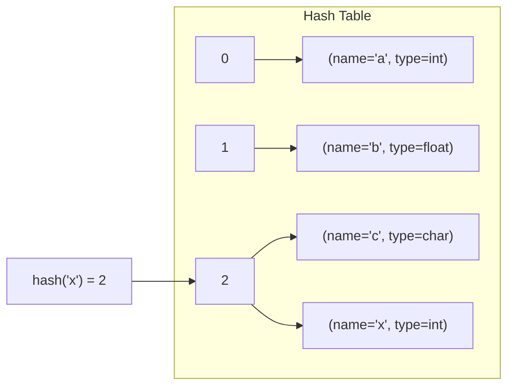
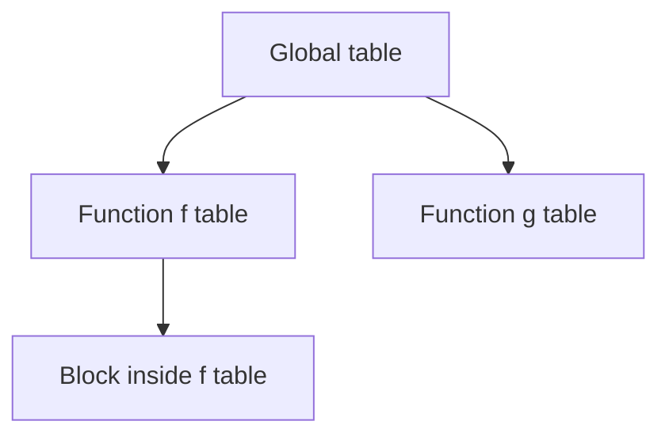
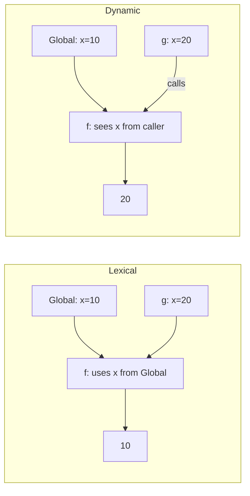
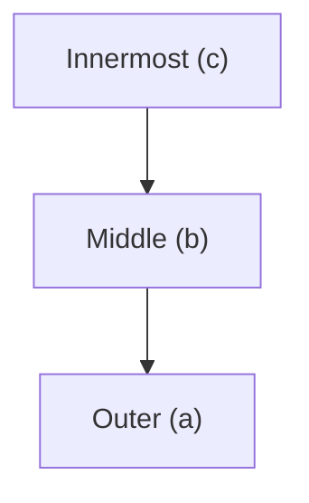
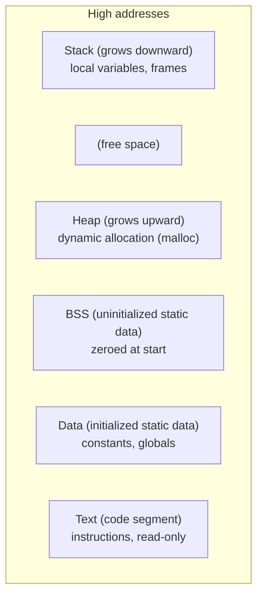
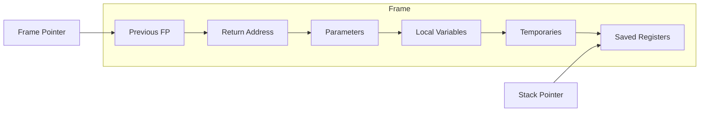
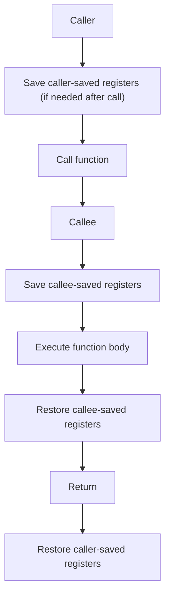
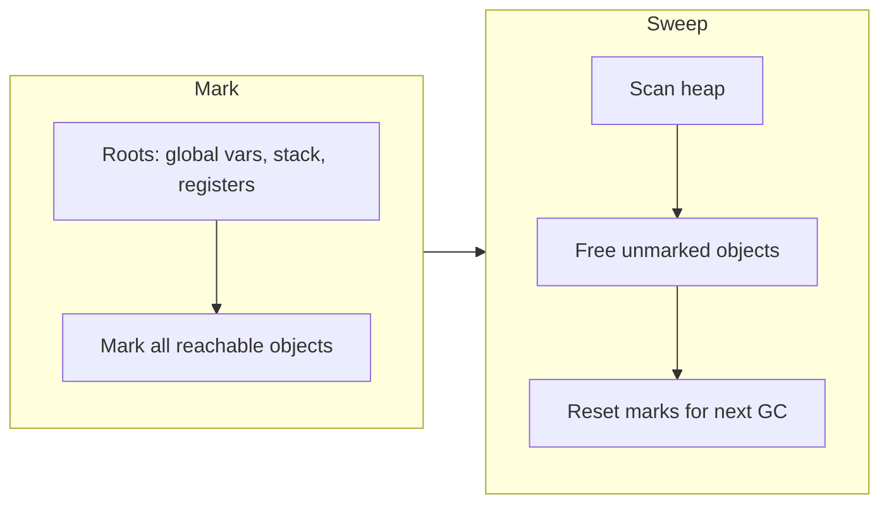
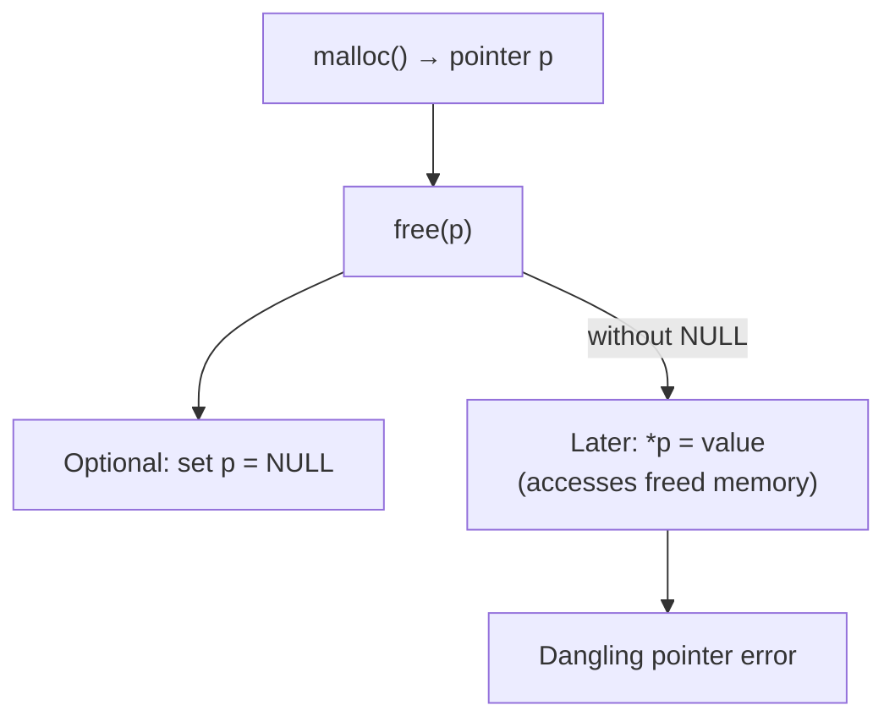
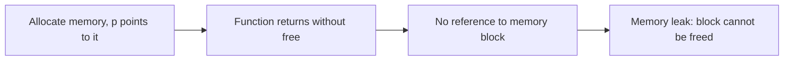

## Symbol Table and Runtime Environment

This chapter covers two critical aspects of a compiler’s semantic analysis and execution model: the **symbol table** (for storing information about identifiers) and the **runtime environment** (how a program organizes memory during execution).

---

## Part 1: Symbol Table

The symbol table is a data structure used by the compiler to record information about identifiers (variables, functions, types, labels, etc.) appearing in the source program.

### 1.1 Information Stored in a Symbol Table

For each identifier, the symbol table typically stores:

| Attribute          | Description                                      | Example                               |
|--------------------|--------------------------------------------------|---------------------------------------|
| Name               | The identifier’s spelling (string)               | `count`, `max`, `printf`              |
| Type               | Data type (int, float, struct, function pointer) | `int`, `char*`, `void(int)`           |
| Scope              | Region where the identifier is visible           | global, block `{...}`, function       |
| Memory location    | Offset or address (relative to frame pointer)    | `-8(%rbp)`, `0x1000`                  |
| Size               | Bytes occupied                                   | 4 (int), 8 (pointer)                  |
| Line of declaration| For debugging                                    | `line 42`                             |
| Initialization status| Whether initialized (for error detection)      | initialized / uninitialized           |

**Example symbol table entries** for C program:
```c
int global_x = 10;
void func(int p) {
    int local;
    static int s;
}
```

| Name     | Type          | Scope      | Location      | Size |
|----------|---------------|------------|---------------|------|
| global_x | int           | global     | static data   | 4    |
| func     | void(int)     | global     | code segment  | -    |
| p        | int           | func       | stack offset  | 4    |
| local    | int           | func block | stack offset  | 4    |
| s        | static int     | func       | static data   | 4    |

---

### 1.2 Data Structures for Symbol Tables

| Structure      | Characteristics                                    | Use case                         |
|----------------|----------------------------------------------------|----------------------------------|
| **Hash table** | O(1) average lookup, good for flat scopes         | Many compilers (C, Java)        |
| **Linked list**| Simple, allows scope nesting by list per level    | Small languages, teaching        |
| **Tree**       | Balanced tree (e.g., red‑black) O(log n)          | When ordering matters (e.g., debug info) |

**Mermaid: Hash table symbol table**  


For nested scopes, a **chain of symbol tables** is common:



When a new scope opens, a new table is created and linked to the previous (outer) table. Lookup searches from innermost outward.

---

### 1.3 Scopes: Lexical (Static) vs Dynamic Scoping

| Feature               | Lexical (Static) Scoping                              | Dynamic Scoping                                   |
|-----------------------|-------------------------------------------------------|---------------------------------------------------|
| Definition            | Scope determined by program text (nesting)            | Scope determined by run‑time call stack           |
| Variable resolution   | Use the declaration from the enclosing block at write time | Use the declaration from the most recent active call at run time |
| Common in             | Most languages (C, Java, Python, Rust)                | Early Lisps, some scripting languages (old Perl)  |
| Example (pseudo)      | See below                                             | See below                                         |

**Lexical scoping example** (C‑like):
```c
int x = 10;
void f() { printf("%d", x); }  // prints global x = 10
void g() { int x = 20; f(); }  // still prints 10, because f's x is statically from global
```

**Dynamic scoping example** (hypothetical):
```
x = 10
function f() { print x }
function g() { x = 20; f() }   // prints 20 because f sees the most recent x
```

**Mermaid: Lexical vs Dynamic lookup**  


---

### 1.4 Nested Scopes and Symbol Table Organization

Languages like C (with `{ }`) and Java allow nested blocks. Organization uses a **stack of symbol tables**.

**Example**:
```c
int a;                 // outer block
{ 
    int b;             // inner block 1
    { 
        int c;         // innermost
    }
}
```

**Symbol table stack during parsing** (after entering innermost block):



When a new block begins, push a new table. When block ends, pop it. Lookup: search from top downwards.

**Handling of same name in nested scopes**: The innermost declaration hides outer ones.

---

## Part 2: Runtime Environment

The runtime environment defines how a compiled program uses memory during execution.

### 2.1 Memory Layout of a Running Program (Unix/Linux)



**Segments in detail**:

| Segment     | Contents                                                             | Growth direction | Example                      |
|-------------|----------------------------------------------------------------------|------------------|------------------------------|
| **Text**    | Executable machine code, read‑only                                   | Fixed            | `main()`, `printf`           |
| **Data**    | Initialized global/static variables                                  | Fixed            | `int x = 5;`                 |
| **BSS**     | Uninitialized global/static variables (zeroed at load)               | Fixed            | `int y;` (outside any function) |
| **Heap**    | Dynamically allocated memory (`malloc`, `new`)                       | Upward           | `int *p = malloc(100);`      |
| **Stack**   | Activation records (stack frames), automatic variables, return addresses | Downward      | `int local;` in a function   |

**Real‑world analogy**:  
*A running program is like a multi‑floor building: code is the foundation (text), data is the ground floor (initialized goods), BSS is an empty but reserved basement, heap is an expandable warehouse, stack is a spring‑loaded pile of trays that grows down.*

---

### 2.2 Activation Records (Stack Frames)

An activation record (frame) is pushed onto the call stack each time a function is called. It contains:

| Field                     | Purpose                                                              |
|---------------------------|----------------------------------------------------------------------|
| **Return address**        | Where to resume after function returns                              |
| **Previous frame pointer**| Restore caller’s frame pointer (dynamic link)                       |
| **Static link (access link)** | For accessing non‑local variables in nested functions (lexical scoping) |
| **Parameters**            | Actual arguments passed to the function                             |
| **Local variables**       | Automatic variables declared inside the function                    |
| **Temporaries**           | Compiler‑generated temp values                                      |
| **Saved registers**       | Registers that must be restored on exit (caller‑saved or callee‑saved) |

**Mermaid: typical stack frame layout** (grows downward, frame pointer `FP` points to fixed location):



**Example** for C function:  
```c
int add(int a, int b) {
    int c;
    c = a + b;
    return c;
}
```
Activation record for `add` (simplified):
```
high addresses: ... (caller’s frame)
                return address
                old FP
                a (parameter)
                b (parameter)
                c (local)
                ... (temporaries)
low addresses:  stack pointer after locals
```

---

### 2.3 Calling Conventions: Caller‑saved vs Callee‑saved Registers

To preserve register values across function calls, registers are partitioned:

| Type               | Responsibility                     | Examples (x86‑64) |
|--------------------|------------------------------------|-------------------|
| **Caller‑saved**   | Caller must save before call and restore after | `rax`, `rcx`, `rdx`, `rsi`, `rdi`, `r8`‑`r11` |
| **Callee‑saved**   | Callee must save before using and restore before returning | `rbx`, `rbp`, `r12`‑`r15` |

**Calling sequence** (simplified):
1. Caller pushes arguments (or uses registers).
2. Caller saves any caller‑saved registers it needs after the call.
3. Caller executes `call` (pushes return address).
4. Callee saves callee‑saved registers it will use.
5. Callee allocates local frame.
6. Callee does work.
7. Callee restores callee‑saved registers.
8. Callee returns (`ret` pops return address).
9. Caller restores caller‑saved registers.

**Mermaid: Caller and callee responsibilities**



---

### 2.4 Heap Management: Dynamic Memory Allocation

The heap is used for data whose lifetime is not tied to a stack frame (e.g., objects created with `new`, `malloc`).

**Basic operations**:
- `malloc(size)` – allocates a block of at least `size` bytes, returns pointer.
- `free(ptr)` – deallocates block pointed by `ptr` (C/C++).

**Common heap management strategies**:
- **Free list** – linked list of free blocks; allocation uses first‑fit, best‑fit, etc.
- **Segregated free lists** – separate lists for small and large objects.

**Garbage Collection (GC)** – automatic deallocation of unreachable memory. Basics for GATE:

| GC Technique           | How it works                                                                 | Pros / Cons                                 |
|------------------------|------------------------------------------------------------------------------|---------------------------------------------|
| **Reference counting** | Each object has count of references; when count goes to 0, delete.           | Immediate reuse; cannot handle cycles.      |
| **Mark‑and‑sweep**     | 1. Mark all reachable objects from roots. 2. Sweep (free) unmarked objects.  | Handles cycles; may cause pauses.           |

**Mermaid: Mark‑and‑Sweep GC**



**Real‑world analogy for GC**:  
*Mark‑and‑sweep is like cleaning a room: you mark all items you can reach from the door (roots), then sweep the room and throw away anything not marked.*

---

### 2.5 Dangling Pointers and Memory Leaks (Conceptual)

| Problem                  | Definition                                                                 | Cause                                     | Example                               |
|--------------------------|----------------------------------------------------------------------------|-------------------------------------------|---------------------------------------|
| **Dangling pointer**     | Pointer that refers to memory that has already been freed.                 | Using `free(ptr)` but not setting `ptr = NULL`. Later dereference. | `int *p = malloc(10); free(p); *p = 5;` |
| **Memory leak**          | Memory that is no longer referenced but not freed, causing waste.          | Forgetting to `free` after `malloc`.      | `void f() { int *p = malloc(100); }` // p lost, no free |

**Mermaid: Dangling pointer scenario**  



**Memory leak diagram**:



**Real‑world analogy**:  
- Dangling pointer: you give back a hotel room key but still hold a copy; later you try to enter the room (it may have new occupants or be locked).  
- Memory leak: you borrow a tool, forget to return it, and lose the address of the rental shop – the tool is lost forever.

---

## Summary Table: Symbol Table vs Runtime Environment

| Aspect               | Symbol Table                                     | Runtime Environment                            |
|----------------------|--------------------------------------------------|------------------------------------------------|
| Purpose              | Compile‑time information storage                | Execution‑time memory organization             |
| Timing               | During parsing and semantic analysis             | During program execution                       |
| Key data structures  | Hash tables, lists, trees                        | Stack frames, heap free lists                  |
| Key concepts         | Scope, name resolution, type checking            | Activation records, calling conventions, GC    |
| Examples             | `st_insert("x", TYPE_INT)`                       | `push %rbp`, `call function`, `malloc(16)`     |
