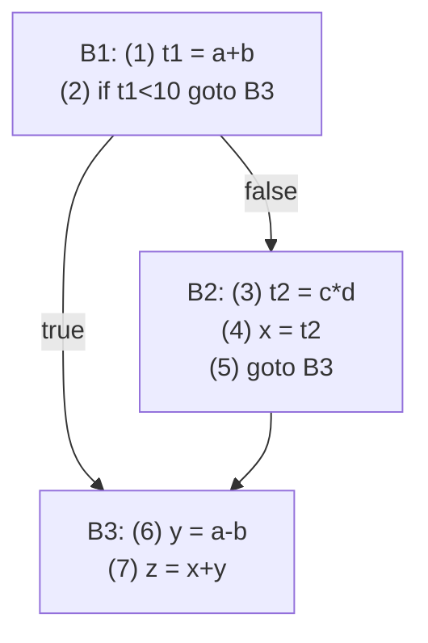
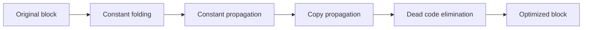
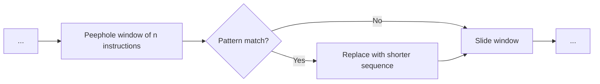
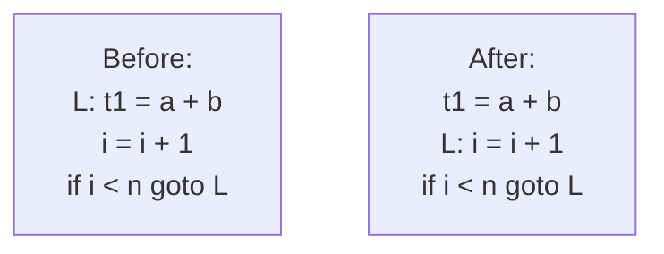
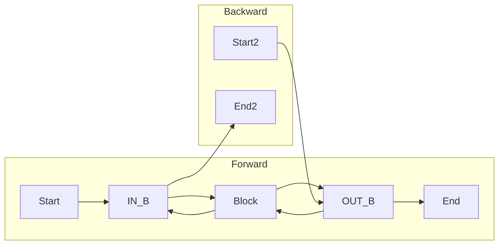
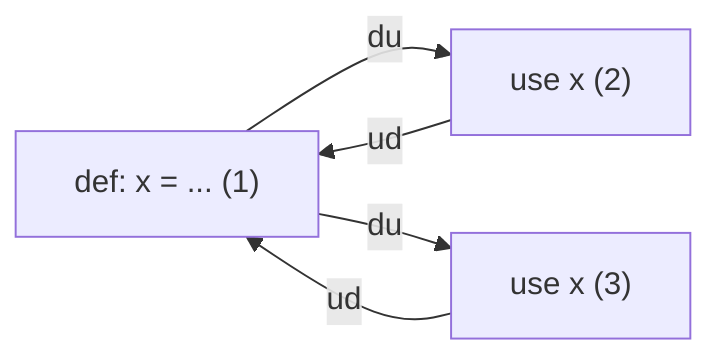
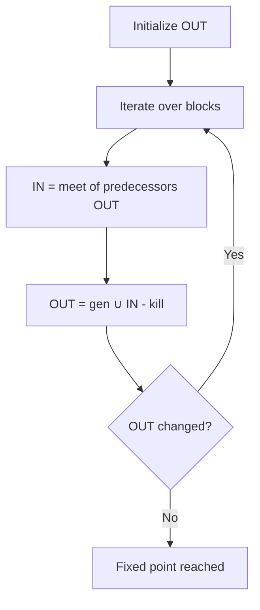
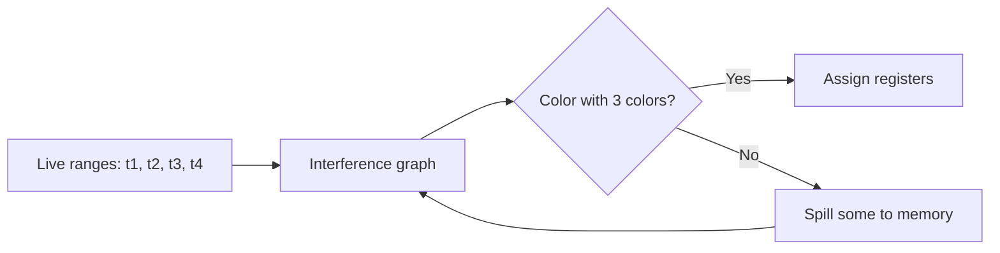
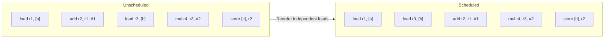

## Chapter 7: Code Optimization 

Code optimization improves a program’s execution time, memory usage, or power consumption without changing its behavior. Optimizations are applied at intermediate code or target code levels.

---

## 1. Basic Concepts

Before applying optimizations, we must analyze the program structure.

### 1.1 Basic Blocks and Flow Graphs

**Basic block**: A maximal sequence of three‑address instructions with:
- Single entry (only first instruction is a target)
- Single exit (only last instruction can be a branch or jump)
- No internal branches or branch targets.

**Leaders**: First instruction of a basic block. Rules:
1. First instruction of the function is a leader.
2. Any target of a conditional/unconditional jump is a leader.
3. Any instruction immediately after a jump is a leader.

**Partitioning into basic blocks**:
1. Identify all leaders.
2. A block consists of all instructions from a leader until the next leader (exclusive).

**Example TAC**:
```
(1)  t1 = a + b
(2)  if t1 < 10 goto (6)
(3)  t2 = c * d
(4)  x = t2
(5)  goto (7)
(6)  y = a - b
(7)  z = x + y
```
Leaders: (1), (3), (6) [since (2) jumps to (6), (5) jumps to (7), and (7) follows a jump? Actually (7) follows (6) and (6) is a leader, (7) is not a target; (6) is target, (7) is after a jump? Instruction after jump (5) is (6) already counted; so leaders: 1,3,6. Blocks: B1: (1)-(2); B2: (3)-(5); B3: (6)-(7).

### 1.2 Control Flow Graph (CFG)

A directed graph where nodes are basic blocks, edges represent possible flow of control.

**Mermaid CFG for above example**:



CFG is used for global optimizations and data flow analysis.

---

## 2. Machine‑Independent Optimizations

These optimizations do not depend on the target machine.

### 2.1 Local Optimizations (Within a Basic Block)

| Optimization        | Description                                        | Example                                                |
|---------------------|----------------------------------------------------|--------------------------------------------------------|
| **Constant folding**| Compute constant expressions at compile time       | `x = 2 + 3` → `x = 5`                                 |
| **Constant propagation** | Replace variable with its known constant value | `x = 5; y = x + 3` → `y = 5 + 3` → `y = 8`           |
| **Copy propagation**| Replace use of variable with its copied source     | `t = x; y = t + 1` → `y = x + 1`                     |
| **Dead code elimination**| Remove instructions whose result is never used | `x = 5; y = x + 2;` if `y` unused, delete it           |
| **Algebraic simplification**| Use algebraic identities                   | `x = y * 0` → `x = 0`; `x = y * 1` → `x = y`         |

**Mermaid: Local optimization flow inside a block**:



### 2.2 Peephole Optimization

Examines a small sliding window (peephole) of instructions and replaces a sequence with a shorter/faster one.

**Examples**:
- `add r1, r1, #0` → `nop` or remove
- `mov r1, r2; mov r2, r1` → swap? Actually optimize `mov r1, r2; mov r2, r1` to `xchg` (if available)
- `jump L; L:` → remove jump

**Mermaid: Peephole window**:



### 2.3 Global Optimizations (Across Basic Blocks)

| Optimization                  | Description                                                                 | Example                                                      |
|-------------------------------|-----------------------------------------------------------------------------|--------------------------------------------------------------|
| **Common subexpression elimination (CSE)** | Compute same expression once, reuse result         | `t1 = a+b; t2 = a+b;` → `t1 = a+b; t2 = t1`                |
| **Code motion** (loop‑invariant code) | Move calculations out of loops that don’t change | `while (i < n) { x = y+z; i++; }` → `x = y+z; while(...)` |
| **Induction variable elimination** | Replace loop index variable with simpler form   | `for (i=0; i<n; i++) { j = 4*i; }` → use `j+=4`           |
| **Strength reduction**        | Replace expensive op with cheaper one                | `x*2` → `x<<1`; `x*15` → `(x<<4) - x`                       |
| **Loop unrolling**            | Duplicate loop body to reduce iteration overhead     | Loop body repeated 2 times, decrement step                |
| **Loop fusion/fission**       | Fuse two loops with same bounds or split a loop      | Fusion: less loop overhead; fission: improve locality      |
| **Function inlining**         | Replace call with function body (conceptual)          | `inline int sq(int x) { return x*x; }` replaces call       |

**Mermaid: Code motion (loop‑invariant code movement)**:



---

## 3. Data Flow Analysis

Data flow analysis collects information about how values flow through a program. It is used to enable optimizations.

### 3.1 Fundamental Analyses

| Analysis                | Direction | May/Must | Information gathered                                      |
|-------------------------|-----------|----------|-----------------------------------------------------------|
| **Reaching definitions**| Forward   | May      | Which assignments may reach a program point               |
| **Live variables**      | Backward  | May      | Which variables are live (will be used later)             |
| **Available expressions**| Forward  | Must     | Which expressions are already computed (available) at point |
| **Very busy expressions**| Backward | Must     | Which expressions will be used regardless of path         |

**Notation**: For each basic block `B`, we compute:
- `IN[B]`: information before B
- `OUT[B]`: information after B
- Transfer function: `OUT[B] = gen_B ∪ (IN[B] - kill_B)`
- Equations depend on analysis.

**Mermaid: Forward vs Backward data flow**:



**Example: Reaching definitions** (forward, may analysis).  
Definition: an assignment `d: x = ...` reaches a point if there exists a path where `d` was the last assignment to `x`.

**Data flow equations**:
```
OUT[entry] = ∅
OUT[B] = gen_B ∪ (IN[B] - kill_B)
IN[B] = ∪ OUT[P] for all predecessors P
```

For each block `B`:  
- `gen_B`: definitions that are generated (i.e., defined in B before any redefinition)  
- `kill_B`: definitions of same variable elsewhere in program that are killed by definitions in B.

### 3.2 Use‑Define Chains (ud‑chains) and Def‑Use Chains (du‑chains)

- **ud‑chain**: For a use of a variable, list of all definitions that could reach that use.
- **du‑chain**: For a definition, list of all uses that the definition can reach.

Used in optimization (e.g., constant propagation, dead code elimination).

**Example**:
```
1: x = a + b
2: y = x * c
3: z = x + y
```
For use of `x` in statement 2, ud‑chain = {1}.  
For definition `x` in 1, du‑chain = {2, 3}.

**Mermaid: ud‑chain and du‑chain illustration**:



### 3.3 Data Flow Equation Framework

General framework:

- **Direction**: forward (from entry to exit) or backward (exit to entry).
- **May vs Must**: 
  - May: union of info from predecessors (`∪`). Example: reaching definitions.
  - Must: intersection of info from predecessors (`∩`). Example: available expressions.
- **Lattice** (meet operator): `∧` = union for may, intersection for must.
- **Transfer function**: `out = f(in) = gen ∪ (in - kill)` for bitvector analyses.

**Iterative algorithm** (worklist):
```
for each block B: OUT[B] = ∅ (or appropriate initial)
while changes:
    for each block B:
        IN[B] = ∧ (OUT[P]) for all predecessors P
        OUT[B] = f_B(IN[B])
```

**Mermaid: Generic data flow iteration**:



---

## 4. Machine‑Dependent Optimizations

These depend on target machine characteristics (number of registers, pipeline, etc.)

### 4.1 Register Allocation

Goal: Assign many temporary variables (virtual registers) to a limited set of physical registers.

**Graph Coloring**:
- Build an interference graph: nodes = temporaries; edge if two temporaries are live simultaneously.
- Color graph with at most `k` colors (k = number of physical registers).
- NP‑complete; use heuristics (Chaitin’s algorithm).
- **Spilling**: If coloring fails, store some temporaries to memory (spill) and retry.

**Mermaid: Interference graph coloring**:



**Example**: Three registers R0,R1,R2. Interferences: t1 with t2, t3; t2 with t1, t4; t3 with t1; t4 with t2. Possible coloring: t1=R0, t2=R1, t3=R2, t4=R2? t4 interferes with t2 (R1) so t4 can share R2 with t3 if t3 not interfere with t4 (no edge). So possible.

### 4.2 Instruction Scheduling

Reorders instructions to hide latencies (e.g., pipeline stalls). Important for superscalar and pipelined processors.

**Basic concept**: Find independent instructions that can execute in parallel or after a latency.

**List scheduling algorithm**:
1. Build a DAG of data dependencies (def‑use edges).
2. Assign priorities to nodes.
3. Keep a ready list of nodes whose predecessors are scheduled.
4. Each cycle, pick highest priority ready node and issue.

**Mermaid: Instruction scheduling example** (pipeline):



**Real‑world analogy**:  
*Instruction scheduling is like a chef preparing a meal: instead of chopping carrots then waiting to chop onions (serial), they chop both in parallel, then use them.*

---

## 5. Complete Example: Optimization Pipeline

**Original TAC** (unoptimized):
```
1:  t1 = 10 * 2        // constant folding
2:  t2 = a + b
3:  t3 = a + b         // common subexpression
4:  i = 0
5:  L: if i >= n goto end
6:      t4 = c + d     // loop invariant
7:      t5 = i * 4
8:      t6 = t4 + t5
9:      i = i + 1
10:     goto L
11: end: t7 = t2 + t3
```

**After local and global optimizations**:
```
1:  t1 = 20            // constant folded
2:  t2 = a + b
3:  t3 = t2            // copy propagation of common subexpression
4:  i = 0
5:  t4 = c + d         // code motion: moved out of loop
6:  L: if i >= n goto end
7:      t5 = i * 4     // could be induction variable elimination
8:      t6 = t4 + t5
9:      i = i + 1
10:     goto L
11: end: t7 = t2 + t2   // t3 replaced by t2
```

Further strength reduction: `i * 4` → `i << 2`.

---

## Summary Table

| Category                     | Examples                                                                 |
|------------------------------|--------------------------------------------------------------------------|
| Basic blocks & CFG           | Partition leaders, build graph                                           |
| Local optimizations          | Constant folding, propagation, dead code, algebraic simplification      |
| Peephole                     | Remove redundant loads/stores, jumps                                     |
| Global optimizations         | CSE, code motion, induction variable elimination, strength reduction, loop unrolling |
| Data flow analysis           | Reaching defs, live variables, available expressions, ud/du chains       |
| Machine‑dependent            | Register allocation (graph coloring), instruction scheduling             |
