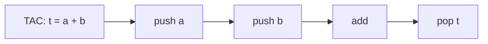
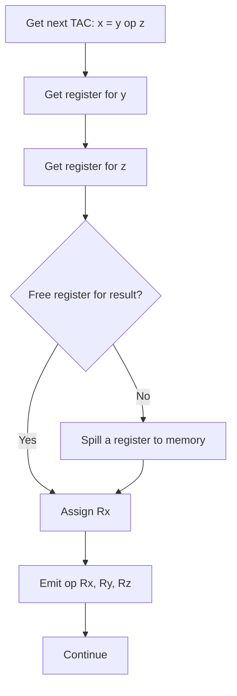
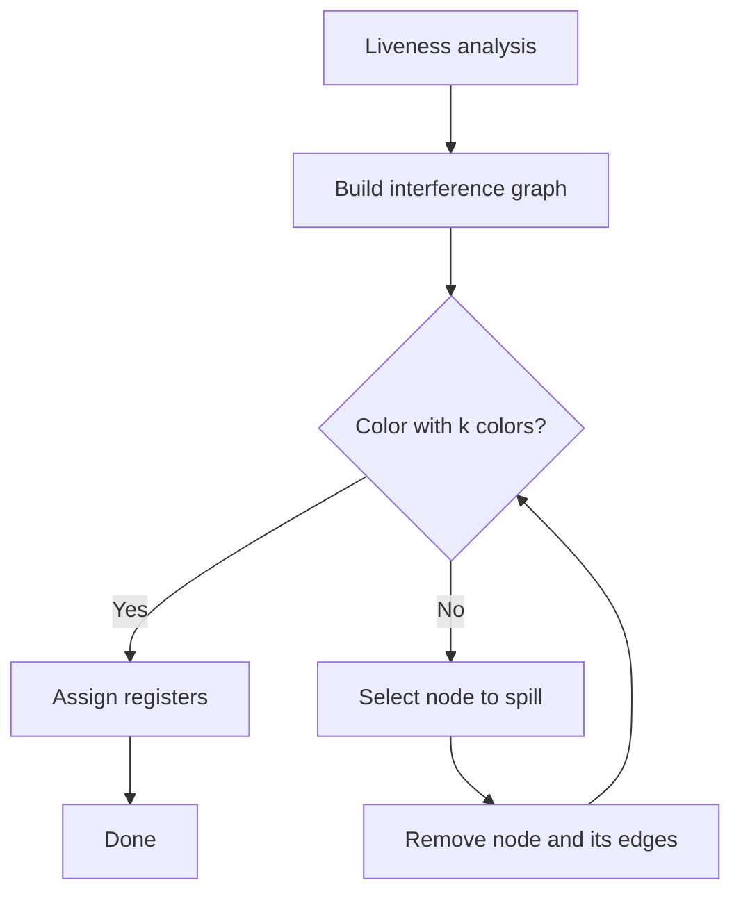
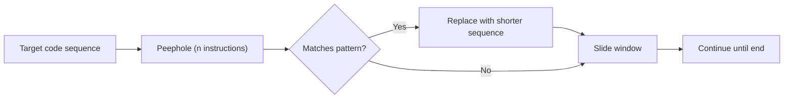
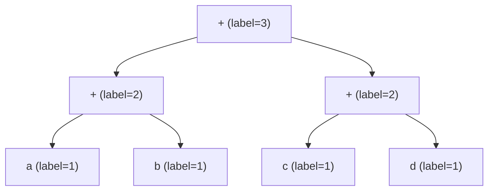
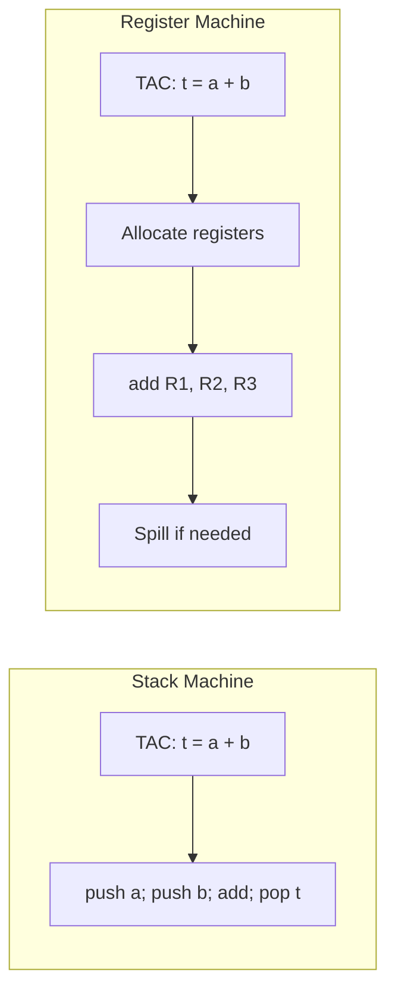
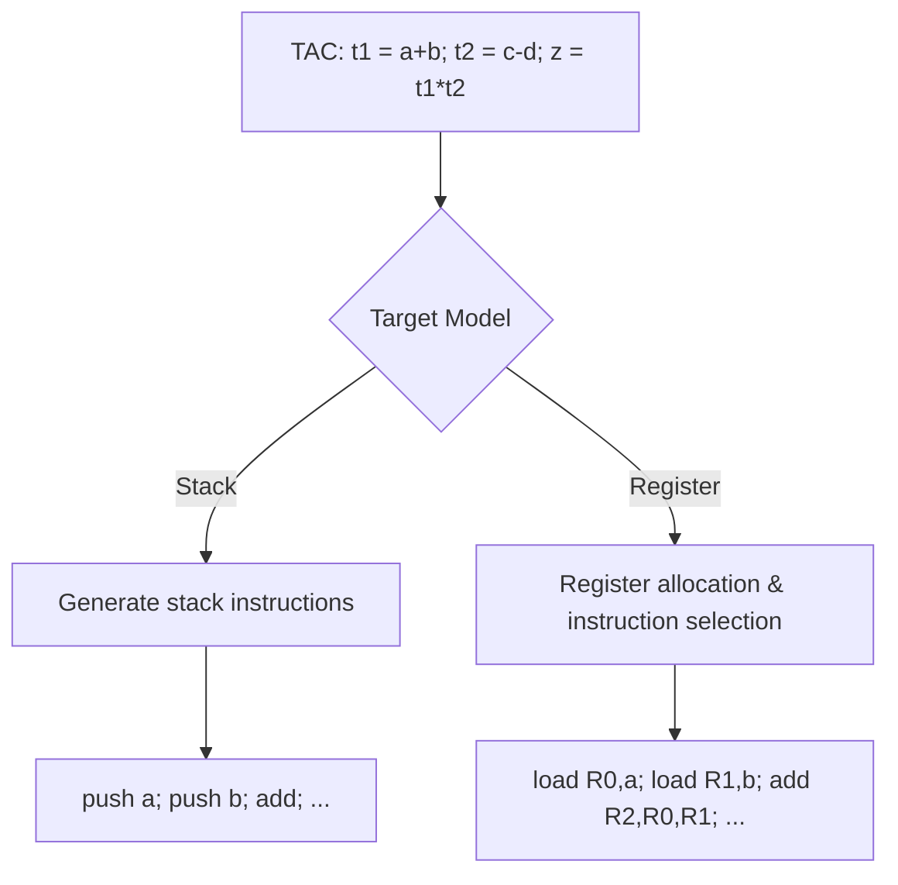

## Chapter 8: Code Generation 

Code generation is the final phase of a compiler that translates the optimized intermediate representation (IR) into target machine code (assembly or object code). This chapter covers the challenges, algorithms, and target models.

---

## 1. Issues in Code Generation

Three main issues must be addressed:

| Issue                     | Description                                                                 | Example                                                                 |
|---------------------------|-----------------------------------------------------------------------------|-------------------------------------------------------------------------|
| **Instruction selection** | Choosing the appropriate target instructions for each IR operation.         | `x = y + z` → `add x, y, z` (RISC) or `mov eax, y; add eax, z; mov x, eax` (CISC) |
| **Register allocation**   | Assigning variables/temporaries to a limited set of machine registers.      | Mapping 10 virtual registers to 8 physical registers, spilling some to memory. |
| **Evaluation order**      | Determining the sequence of instruction execution to minimize register usage or latency. | Compute `a + b * c` as multiply first, then add.                        |

These issues are interdependent (e.g., instruction selection affects register pressure).

**Real‑world analogy**:  
*Packaging a product for shipment: instruction selection = choosing box size and material; register allocation = fitting items into limited compartments; evaluation order = sequence of packing steps to avoid repacking.*

---

## 2. Simple Code Generation from TAC

A naive approach generates code for each TAC instruction independently, using a stack or unlimited temporaries.

### 2.1 Using a Stack Machine Model

Assume a stack machine (e.g., Java Virtual Machine). Each TAC operation becomes:

| TAC instruction | Stack code                     |
|----------------|--------------------------------|
| `t = a + b`    | `push a; push b; add; pop t`   |
| `t = a`        | `push a; pop t`                |
| `if a < b goto L` | `push a; push b; lt; jump_if_true L` |

**Mermaid: Stack machine code generation**:



### 2.2 Using a Register Machine with Spilling

When registers are limited (e.g., 4 general‑purpose registers), we keep temporaries in registers as long as possible. When no free register, spill a value to memory.

**Simple algorithm** (for each TAC instruction `x = y op z`):
- Get registers `Ry`, `Rz` (load from memory if not already in register).
- If no free register for result, evict one (spill to memory).
- Emit `op Rx, Ry, Rz`.
- Record that `x` is in `Rx`.

**Mermaid: Register allocation with spilling**:



---

## 3. Register Allocation Using Graph Coloring – Basic Idea

Graph coloring is a global method to assign physical registers to many virtual registers (temporaries).

**Steps**:
1. **Liveness analysis**: Compute live ranges for each temporary.
2. **Build interference graph**: Nodes = temporaries; edge between two if they are live at the same time (interfere).
3. **Color the graph** with `k` colors (k = number of physical registers). If a node can be colored without adjacent nodes having same color → assign registers.
4. **Spilling**: If a node cannot be colored, mark it for spilling (store in memory), remove it from the graph, and try again.

**Example**: 3 physical registers (R0,R1,R2). Temporaries: `a, b, c, d`.  
Interferences: a with b, c; b with a, d; c with a; d with b.  
Possible coloring: a=R0, b=R1, c=R2, d=R2? But d interferes with b (R1) so can share R2 with c if c and d do not interfere (no edge). Yes.

**Mermaid: Graph coloring process**:



**Real‑world analogy**:  
*Graph coloring is like seating guests at tables (registers) where guests who dislike each other (interfere) cannot sit at the same table.*

---

## 4. Peephole Optimization on Target Code

Peephole optimization examines a small sliding window of target instructions and replaces inefficient patterns.

**Common peephole optimizations for target code**:

| Original pattern               | Optimized pattern                     | Benefit                |
|--------------------------------|----------------------------------------|------------------------|
| `mov r1, r2`<br>`mov r2, r1`  | `mov r1, r2` (or `xchg` if beneficial)| Remove redundant moves |
| `add r1, #0`                   | (delete)                               | Shorter code           |
| `jmp L`<br>`L:`                | `L:` (delete jump)                     | Eliminate jump to next |
| `push a`<br>`pop a`            | (delete)                               | Dead push‑pop pair     |
| `mov [r1], r2`<br>`mov r2, [r1]`| `mov [r1], r2` (delete second if no change) | Remove useless load |

**Mermaid: Peephole window scanning**:



---

## 5. Generating Code for Expressions – Sethi‑Ullman Algorithm (Conceptual)

The **Sethi‑Ullman algorithm** generates optimal code for expressions on a register machine with a given number of registers by choosing the evaluation order of subtrees to minimize register usage.

**Key idea**: Label each node with the minimal number of registers needed to evaluate it without spilling.

- **Label calculation** (for binary operator node `op` with left child `L`, right child `R`):
  ```
  if label(L) == label(R):
      label = label(L) + 1
  else:
      label = max(label(L), label(R))
  ```
- For leaf (variable or constant): label = 1 (needs one register to load).

**Code generation strategy** (using `k` registers):
- Evaluate the child with larger label first (to free registers).
- If both children have labels `≥ k`, one must be spilled.

**Example**: Expression `(a + b) + (c + d)`, assume `k=2`.  
Tree: `+` with left `+(a,b)` and right `+(c,d)`. Labels: leaves=1. For `+(a,b)`: left=1, right=1 → equal → label=2. Similarly `+(c,d)` label=2. Root: labels equal (2,2) → label=3. But with k=2, we need spilling.  
Optimal order: evaluate left subtree, store result in memory, evaluate right, then add.

**Mermaid: Sethi‑Ullman labeling**:



**Algorithm steps for k=2**:
1. Evaluate left `(a+b)` → uses 2 registers (R1,R2) → result in R1.
2. Spill R1 to memory (M1) because right subtree also needs 2 registers.
3. Evaluate right `(c+d)` → uses R1,R2 → result in R1.
4. Load M1 into R2.
5. Add R1,R2 → result in R1.

**Real‑world analogy**:  
*Sethi‑Ullman is like a cook with two hands (registers) preparing a complex recipe: always cook the side that needs more hands first, then store it aside, free hands for the other side.*

---

## 6. Target Machine Models: Stack Machine vs Register Machine

| Feature                | Stack Machine                                        | Register Machine                                    |
|------------------------|------------------------------------------------------|-----------------------------------------------------|
| **Operand access**     | Implicit top‑of‑stack (push/pop)                    | Explicit register names                            |
| **Instruction size**   | Very short (e.g., `add` without operands)           | Larger (need register specifiers)                  |
| **Code density**       | High (compact)                                      | Lower                                               |
| **Register allocation**| Not needed (stack is memory)                        | Essential (limited registers)                      |
| **Example architectures**| JVM, WebAssembly, early HP calculators             | x86, ARM, RISC‑V                                   |
| **Code generation ease**| Trivial – each TAC translates directly             | Requires register allocation and spilling          |

**Mermaid: Comparison of code generation flows**:



**Example**: Same expression `x = (a + b) * c` on both models.

**Stack machine code**:
```
push a
push b
add      ; top = a+b
push c
mul      ; top = (a+b)*c
pop x
```

**Register machine code** (with 3 registers):
```
load R1, a
load R2, b
add R3, R1, R2
load R1, c
mul R1, R3, R1
store x, R1
```

---

## 7. Complete Example: From TAC to Target Code

**TAC** (for `z = (a + b) * (c - d)`):
```
t1 = a + b
t2 = c - d
z = t1 * t2
```

**Stack machine code**:
```
push a
push b
add     ; t1 = a+b
push c
push d
sub     ; t2 = c-d
mul     ; z = t1 * t2
pop z
```

**Register machine code** (assuming 3 registers R0,R1,R2; no spilling needed):
```
load R0, a
load R1, b
add R2, R0, R1   ; R2 = t1
load R0, c
load R1, d
sub R0, R0, R1   ; R0 = t2 (reuse R0)
mul R0, R2, R0   ; R0 = z
store z, R0
```

**Mermaid: Complete code generation pipeline**:



---

## Summary Table

| Topic                         | Key Points                                                                 |
|-------------------------------|----------------------------------------------------------------------------|
| Issues in code generation     | Instruction selection, register allocation, evaluation order               |
| Simple TAC to code            | Stack machine (push/pop) or register machine with naive spilling           |
| Graph coloring allocation     | Build interference graph, color with k colors, spill if needed             |
| Peephole optimization         | Replace short patterns on target code (e.g., `mov r1,r2; mov r2,r1` → `mov r1,r2`) |
| Sethi‑Ullman algorithm        | Label expression tree with minimal register needs; evaluate heavier subtree first |
| Stack machine vs register machine | Stack: compact, no reg alloc; Register: faster but needs alloc, spilling |
