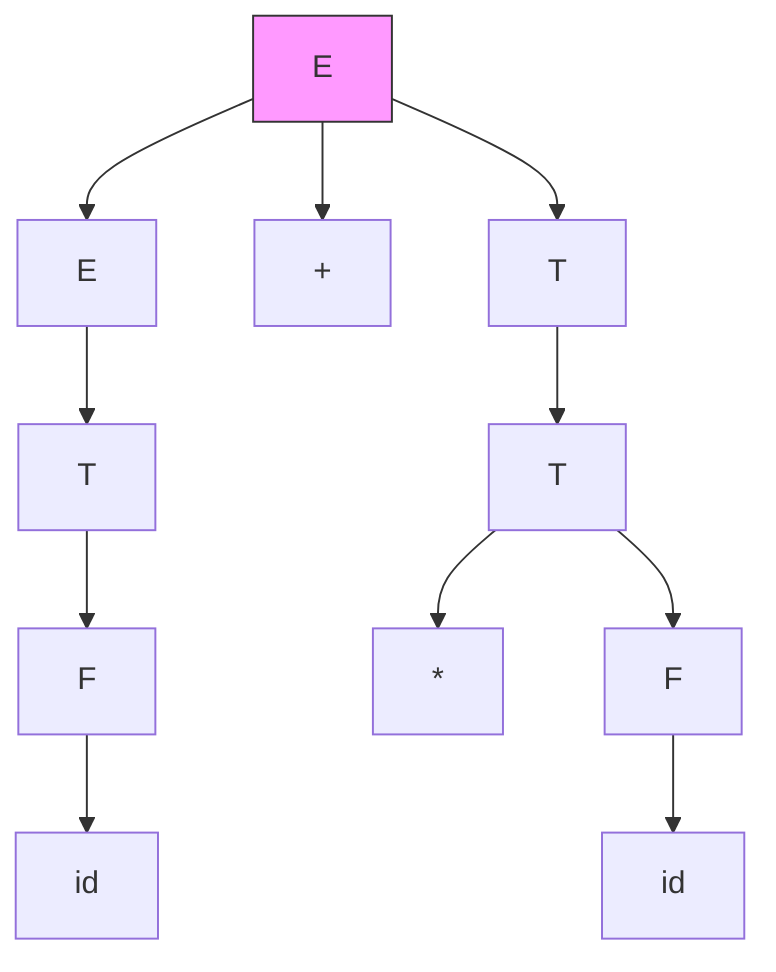
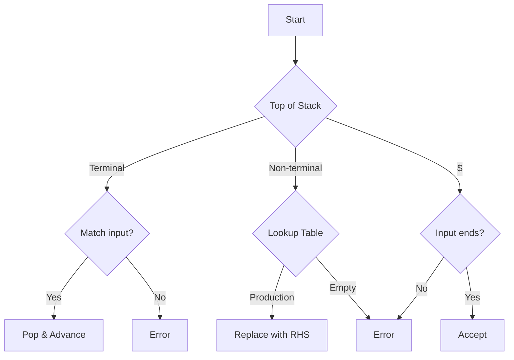
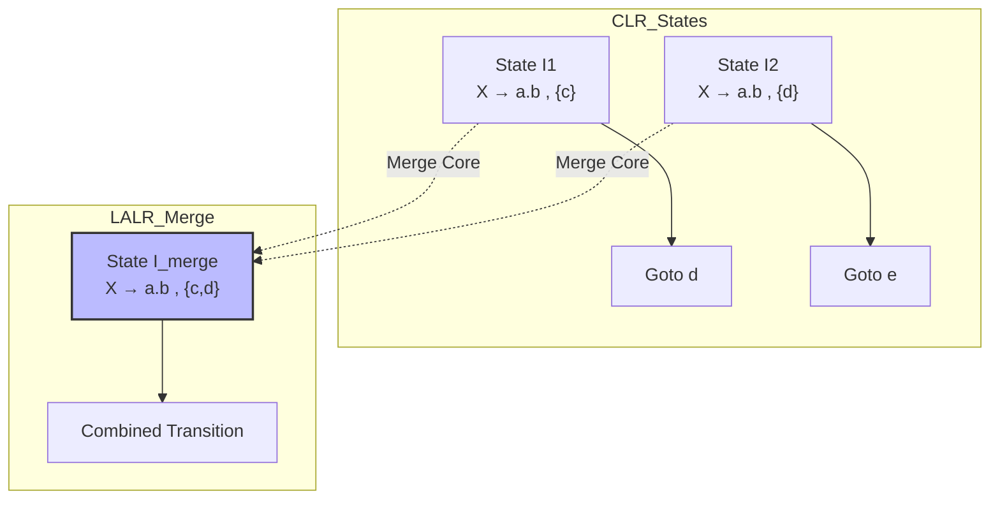

# Chapter 9: Parsing Algorithms in Depth 

Welcome to the most exhaustive guide on parsing algorithms. This chapter is the heart of compiler design. Whether you are a beginner trying to understand **why parsers exist**, a university student preparing for exams, or a software engineer facing an interview, this guide will take you from **intuition** to **exam-ready depth**.

We will cover every line of your syllabus with **real-world analogies**, **step-by-step solved examples**, **Mermaid diagrams**, **common mistakes**, **GATE secrets**, and **interview one-liners**.

---

## Introduction: The Role of a Parser

A parser takes a stream of **tokens** from the lexical analyzer and checks if they follow the **grammar** of the language. Think of it as a **grammar police officer**:

- **Top-Down Parsers** (LL, Recursive Descent): Start with the *sentence* (Start Symbol) and try to derive the *input string*. Analogy: You have a complete puzzle box image (Start Symbol). You break it down into smaller pieces (Non-terminals) until you match the actual puzzle pieces on the table (Tokens).
- **Bottom-Up Parsers** (LR, SLR, LALR): Start with the *input tokens* and try to *reduce* them back to the Start Symbol. Analogy: You see scattered Lego bricks (Tokens). You combine them into small structures, then bigger ones, until you form the final model (Start Symbol).

---

## Topic 1: Parser Types Comparison (Recursive Descent, LL(1), SLR(1), LALR(1), CLR(1))

This is your **toolbox**. Choosing the right parser is a trade-off between **power** (which grammars it can handle) and **memory** (table size).

### The Grand Analogy: GPS Navigation Systems
- **Recursive Descent (Hand-coded)**: You have a paper map and a flashlight. You navigate by manually writing instructions for every intersection. You can handle detours (backtracking) but you might get lost (infinite recursion) if you don't remove left turns (left recursion). **High flexibility, zero memory overhead.**
- **LL(1)**: A basic GPS that gives you directions by looking only at the *next street sign* (single lookahead). It never backtracks. It requires clear, unambiguous signs (grammar). **Small memory, fast, but less powerful.**
- **SLR(1)**: A slightly smarter GPS that looks at the road you are on (LR(0) items) and the possible destinations after the road (FOLLOW sets). **Medium memory, okay power.**
- **CLR(1)**: The ultimate military-grade GPS. It tracks your exact lane, exact destination, and the exact traffic situation for every possible route. **Huge memory (state explosion), maximal power.**
- **LALR(1)**: The practical Google Maps. It merges GPS routes that share the same road (core) but have slightly different destinations. It saves 90% of memory while keeping almost all the power. **The industry standard (YACC/Bison).**

### Detailed Comparison Table

| Feature | Recursive Descent | LL(1) | SLR(1) | LALR(1) | CLR(1) |
| :--- | :--- | :--- | :--- | :--- | :--- |
| **Table Size** | None (Code) | Small (2D array) | Medium | Medium | **Very Large** |
| **Power** | LL(*) / Any | Deterministic Top-Down | Weakest LR | Medium LR | **Full LR(1)** |
| **Grammar Class** | Unambiguous (with backtracking) | Unambiguous, no left recursion | Unambiguous | Unambiguous | Unambiguous |
| **Lookahead** | k (manual) | 1 token | 1 token (via FOLLOW) | 1 token | 1 token (in state) |
| **Conflicts** | Solved by ordering | LL(1) conflicts | SR/RR conflicts | RR conflicts (rare) | Least conflicts |
| **Implementation** | Code (easy) | Table-driven (pushdown) | Table-driven | Table-driven | Table-driven |
| **Use Case** | Hand-written compilers, JSON parsers | Simple DSLs, Exams | GATE basics | **YACC, Bison, C/C++ compilers** | Theoretical boundary |
| **Interview Importance** | **High** (Coding) | Medium (Theory) | Low (GATE only) | Medium (GATE/Industry) | Low (GATE only) |

### Advantages & Disadvantages
- **Recursive Descent**: ✅ Easy to debug, error recovery is simple. ❌ Left recursion causes infinite loops.
- **LL(1)**: ✅ Fast, O(n) time. ❌ Cannot handle left-recursive or ambiguous grammars.
- **SLR(1)**: ✅ Smaller table than CLR. ❌ Weak; many practical grammars have conflicts.
- **LALR(1)**: ✅ Table size of SLR, power close to CLR. ❌ Merging states can introduce Reduce-Reduce conflicts.
- **CLR(1)**: ✅ Parses every unambiguous grammar. ❌ Massive memory (hundreds of states for simple grammars).

---

## Topic 2: Converting Ambiguous Grammar to Unambiguous Grammar

### The Problem
An ambiguous grammar allows a single string to have **two distinct parse trees** (or two leftmost derivations). A deterministic parser cannot choose which path to take.
**Analogy**: A sentence like *"I saw the man with the telescope"* – does the man have the telescope, or did I use the telescope to see the man? Ambiguity in natural language causes confusion. In programming, `a + b * c` – is it `(a+b)*c` or `a+(b*c)`?

### The Fix: Precedence & Associativity
We transform the grammar to reflect the mathematical rules:
1.  **Precedence**: Operators with higher precedence are placed **deeper** in the parse tree (closer to the leaves).
2.  **Associativity**: Left-associative operators (`+`, `-`, `*`, `/`) use **left recursion**. Right-associative operators (`=` assignment, `^` exponent) use **right recursion**.

### Step-by-Step Algorithm
1.  Identify all levels of precedence (Lowest to Highest).
2.  Create a non-terminal for each level.
3.  The lowest precedence becomes the top-level non-terminal (`E` for expression).
4.  For left-assoc: `E → E + T | T`. For right-assoc: `E → T + E | T`.

### Solved Example 1: Arithmetic (`+`, `*`, `()`)
- **Ambiguous**: `E → E + E | E * E | id | (E)`
- **Unambiguous**:
  ```
  E → E + T | T       (Addition, low precedence, left assoc)
  T → T * F | F       (Multiplication, medium precedence, left assoc)
  F → id | (E)        (Highest precedence)
  ```
  **Intuition**: If you see `id + id * id`, the `E` calls `T`, which calls `F` for the first `id`, then recursively handles the `*`, ensuring `*` binds tighter.

### Solved Example 2: Right-Associative Exponentiation (`^`)
- **Ambiguous**: `E → E ^ E | id`
- **Unambiguous**:
  ```
  E → T ^ E | T      (Right recursion forces right associativity)
  T → id
  ```
  **String**: `id ^ id ^ id` parses as `id ^ (id ^ id)`.

### Solved Example 3: Dangling-Else Problem (Classic)
- **Ambiguous**: `S → if E then S | if E then S else S | other`
  This is ambiguous because `if a then if b then c else d` can match `else` with either `if`.
- **Unambiguous (Standard rule: match else with nearest unmatched if)**:
  ```
  S → Matched | Unmatched
  Matched → if E then Matched else Matched | other
  Unmatched → if E then S | if E then Matched else Unmatched
  ```

### Mermaid: Parse Tree for Unambiguous Grammar

This clearly shows `*` lower in the tree (higher priority).

**Exam Point**: If a grammar is ambiguous, **no** deterministic parser (LL or LR) can handle it without conflicts. Resolving ambiguity is mandatory.

---

## Topic 3: Removing Left Recursion

### Why?
Top-down parsers (LL, Recursive Descent) enter an **infinite loop** if they encounter `A → A α`. They call `A()` which immediately calls `A()` again without consuming input.

### 3.1 Direct Left Recursion
**Problem**: `A → A α1 | A α2 | ... | A αm | β1 | β2 | ... | βn` (where β does not start with A).
**Solution**: Rewrite as:
- `A  → (β1 | β2 | ... | βn) A'`
- `A' → (α1 | α2 | ... | αm) A' | ε`

**Analogy**: You are standing in a line (queue). Your turn depends on the person behind you. Instead of `I am dependent on the person behind me` (left recursion), we say `I process the current token (β), and if there's more, I call the rest (A')`.

**Solved Example**:
- Input: `E → E + T | T`
- Here `A=E`, `α=+T`, `β=T`.
- Output:
  ```
  E  → T E'
  E' → + T E' | ε
  ```

### 3.2 Indirect Left Recursion
**Problem**: `A → B a`, `B → A b | d`. This is a cycle.
**Algorithm**:
1.  Sort the non-terminals in some order (e.g., `A1, A2, ..., An`).
2.  For `i = 1 to n`:
    - For `j = 1 to i-1`:
      - Replace each production `Ai → Aj γ` with `Ai → δ1 γ | δ2 γ | ...` where `Aj → δ1 | δ2 | ...`.
    - Eliminate the direct left recursion for `Ai`.

**Solved Example**:
- Grammar:
  ```
  A → B a | c
  B → A b | d
  ```
- Sort: `A` (i=1), `B` (i=2).
- For `i=1` (A): No indirect recursion (j=0). Direct? `A → c` (no left rec).
- For `i=2` (B): `j=1` (A). Replace `B → A b` with `B → (B a | c) b` (since `A → B a | c`).
  - New productions for B: `B → B a b | c b | d`.
  - Now direct left recursion on B (`B → B a b`).
  - Remove it: `B → (c b | d) B'`, `B' → (a b) B' | ε`.
- Final Grammar:
  ```
  A → B a | c
  B → c b B' | d B'
  B' → a b B' | ε
  ```

### General Algorithm (Formula)
```
Arrange non-terminals in order A1, A2, ..., An.
for i = 1 to n:
   for j = 1 to i-1:
      if Ai → Aj γ:
         replace Ai → Aj γ with Ai → δ1 γ | δ2 γ | ... (where Aj → δ1 | δ2 ...)
   eliminate direct left recursion among Ai productions.
```

**Common Mistake**: Forgetting to remove **indirect** recursion before eliminating direct recursion. Always apply the algorithm top to bottom.

**GATE Tip**: Removing left recursion introduces ε (epsilon) productions. This will affect `FIRST` and `FOLLOW` sets (used in LL(1)).

---

## Topic 4: Left Factoring

### Why?
If two productions share a common prefix, the parser cannot decide which one to choose until it sees further ahead. This causes **backtracking**.
**Problem**: `A → α β1 | α β2`. The parser sees `α` and stalls.
**Analogy**: A restaurant menu says "Burger" and "Burger with Cheese". You order a "Burger" – the cashier must ask "with cheese?" We extract the common part to make the choice deterministic: `Order → Burger Extra`, `Extra → with Cheese | ε`.

### General Algorithm
```
For each non-terminal A:
   Find the longest common prefix α among its productions.
   If α != ε:
      A → α A'
      A' → β1 | β2 | ...
   Repeat until no two productions have a common prefix.
```

### Solved Example 1: Simple Prefix
- Input: `A → a B | a C | d`
- Factor: `A → a A' | d`, `A' → B | C`

### Solved Example 2: Dangling-Else (Again)
- Input: `S → if E then S else S | if E then S`
- Factor out `if E then S`:
  ```
  S → if E then S S'
  S' → else S | ε
  ```
  *(Note: This resolves the ambiguity by matching else with the nearest if via left-to-right associativity in the parser.)*

**Common Mistake**: Left factoring is **not** the same as removing left recursion. Left recursion handles loops; left factoring handles common prefixes. Do both!

---

## Topic 5: LL(1) Parsing (Predictive Parsing)

LL(1) is a **Top-Down, Left-to-right, Leftmost derivation** parser that uses **1 token** of lookahead. It is table-driven.

### 5.1 FIRST and FOLLOW Sets (The Foundation)

#### FIRST(X)
The set of terminals that begin strings derivable from X.
- **Rule 1**: If `X` is a terminal, `FIRST(X) = {X}`.
- **Rule 2**: If `X → ε`, add `ε` to `FIRST(X)`.
- **Rule 3**: If `X → Y1 Y2 ... Yk`:
  - Add `FIRST(Y1)` to `FIRST(X)` (excluding ε).
  - If `Y1` can derive ε, add `FIRST(Y2)` (excluding ε).
  - If all `Y1...Yk` derive ε, add `ε`.

#### FOLLOW(A)
The set of terminals that can appear immediately to the right of non-terminal `A` in some sentential form.
- **Rule 1**: If `A` is the start symbol, add `$` (end-of-input) to `FOLLOW(A)`.
- **Rule 2**: If `A → α B β`: Add `FIRST(β)` (excluding ε) to `FOLLOW(B)`.
- **Rule 3**: If `A → α B` OR `A → α B β` where `β` derives `ε`: Add `FOLLOW(A)` to `FOLLOW(B)`.

#### Solved Example: Compute FIRST & FOLLOW
- Grammar (Arithmetic, left-recursion removed):
  ```
  E  → T E'
  E' → + T E' | ε
  T  → F T'
  T' → * F T' | ε
  F  → ( E ) | id
  ```
- **FIRST**:
  - `FIRST(F) = {(, id}`
  - `FIRST(T') = {*, ε}`
  - `FIRST(T) = FIRST(F) = {(, id}`
  - `FIRST(E') = {+, ε}`
  - `FIRST(E) = FIRST(T) = {(, id}`
- **FOLLOW** (Start is `E`):
  - `FOLLOW(E) = {$, )}` (from `F → (E)`, `)` is after `E`; and start rule gives `$`)
  - `FOLLOW(E')`: Rule 3 from `E → T E'` -> add `FOLLOW(E) = {$, )}`. Also Rule 2 from `E' → + T E'`? No, `E'` is at end. So `FOLLOW(E') = {$, )}`.
  - `FOLLOW(T)`: Rule 2 from `E → T E'` -> add `FIRST(E')` excluding ε = `{+}`. Rule 3 from `E' → ε`? Actually from `E → T E'`, if `E'` derives ε, then add `FOLLOW(E)` to `FOLLOW(T)`. So add `{$, )}`. Also from `T' → * F T'`? We'll do that later. So `FOLLOW(T) = {+, $, )}`.
  - `FOLLOW(T')`: Rule 3 from `T → F T'` -> add `FOLLOW(T) = {+, $, )}`. Rule 2 from `T' → * F T'` (no, self).
  - `FOLLOW(F)`: Rule 2 from `T → F T'` -> add `FIRST(T')` excluding ε = `{*}`. Rule 3 from `T' → ε` -> add `FOLLOW(T) = {+, $, )}`. So `FOLLOW(F) = {*, +, $, )}`.

### 5.2 LL(1) Parsing Table Construction
For each production `A → α`:
1.  For each terminal `t` in `FIRST(α)` (excluding ε), put `A → α` in `M[A, t]`.
2.  If `ε` is in `FIRST(α)`, then for each terminal `b` in `FOLLOW(A)`, put `A → α` in `M[A, b]`.
3.  If `ε` is in `FIRST(α)` and `$` is in `FOLLOW(A)`, put `A → α` in `M[A, $]`.

**Conflict**: If any cell has two entries, the grammar is **not LL(1)**.

### 5.3 Predictive Parsing Algorithm (Stack-based)
- **Input**: Input string + `$`, Stack starts with `$` and Start Symbol (push Start, then `$` at bottom).
- **Repeat**:
  1. If top of stack is terminal `x` and input is `x`: pop and advance.
  2. If top is non-terminal `A` and input is `a`: look at `M[A, a]`. If production `A → β` is found, pop `A` and push `β` in reverse.
  3. If top is `$` and input is `$`: accept.
  4. Else: error.

#### Solved Example: Parsing `id + id * id`
Using the above grammar and table (assume table built).
- Stack: `$ E`, Input: `id + id * id $`
- `E` on top, see `id` -> production `E → T E'` -> Stack: `$ E' T`.
- `T` on top, see `id` -> `T → F T'` -> Stack: `$ E' T' F`.
- `F` on top, see `id` -> `F → id` -> pop `id`, advance input to `+`. Stack: `$ E' T'`.
- `T'` on top, see `+` -> `T' → ε` (because `+` is in FOLLOW(T')). Pop `T'`.
- `E'` on top, see `+` -> `E' → + T E'` -> pop, consume `+`, push `E' T`.
- ... continue until `$` matches.

**Mermaid: LL(1) Parsing Flow**


**Common Mistakes**:
- Forgetting `ε` in FIRST leads to missing entries in the table.
- Forgetting `$` in FOLLOW for the start symbol.
- Not handling left recursion **before** computing FIRST/FOLLOW.

**Interview Tip**: If asked "What makes a grammar LL(1)?", answer: "The parsing table must have no multiply-defined entries. This is guaranteed if for every non-terminal, the FIRST sets of its productions are disjoint, and if a production derives ε, its FIRST set is disjoint from the FOLLOW set of the non-terminal."

---

## Topic 6: SLR(1) Parsing (Simple LR)

SLR is the simplest Bottom-Up parser. It uses **LR(0) items** and **FOLLOW sets** to resolve conflicts.

### 6.1 LR(0) Items
An LR(0) item is a production with a dot (`•`) somewhere in the RHS. The dot indicates how much of the RHS we have seen.
- Example: `A → • X Y` (seen nothing), `A → X • Y` (seen X), `A → X Y •` (seen everything, ready to reduce).

### 6.2 Closure of an Item Set
Given a set of items `I`:
- Add all items in `I`.
- If `A → α • B β` is in the closure, and `B → γ` is a production, add `B → • γ` to the closure (if not already present).
**Intuition**: If we expect to see `B` next, we must be prepared to see whatever `B` derives.

### 6.3 Goto Function
`GOTO(I, X)` where `X` is a grammar symbol:
- Take all items in `I` of the form `A → α • X β`.
- Move the dot past `X` to get `A → α X • β`.
- Take the closure of this new set.

### 6.4 Canonical Collection of LR(0) Items
- Start with `I0 = Closure({S' → • S})` (augmented grammar).
- Repeat: Compute `GOTO(I, X)` for all `I` and all grammar symbols `X`. Add new states.
- Stop when no new states appear.

### 6.5 SLR Parsing Table Construction
1.  **Augment**: `S' → S`.
2.  Build canonical collection `C = {I0, I1, ..., In}`.
3.  For state `Ii`:
    - **Action (shift)**: If `A → α • a β` is in `Ii` and `GOTO(Ii, a) = Ij`, set `ACTION[i, a] = shift j` (where `a` is terminal).
    - **Action (reduce)**: If `A → α •` is in `Ii` (dot at end), then for all `b` in `FOLLOW(A)`, set `ACTION[i, b] = reduce A → α`. (This is the SLR difference from LR(0) – it uses FOLLOW).
    - **Accept**: If `S' → S •` is in `Ii`, set `ACTION[i, $] = accept`.
    - **Goto**: For non-terminal `A`, if `GOTO(Ii, A) = Ij`, set `GOTO[i, A] = j`.

### 6.6 Conflicts
- **Shift-Reduce (SR)** Conflict: A state has both a shift and a reduce on the same terminal. SLR sometimes has this; CLR usually resolves it.
- **Reduce-Reduce (RR)** Conflict: A state has two different reduce actions on the same terminal. Grammar is not SLR(1).

**Solved Example**:
Grammar: `S → E`, `E → E + T | T`, `T → id`.
*(Note: This is left-recursive, SLR handles it because it's bottom-up.)*
- Augment: `S' → S`.
- `I0 = Closure({S' → • S})`. Add `S → • E`, `E → • E + T`, `E → • T`, `T → • id`.
- ... Build states. The dot moves across symbols.
- Table construction yields shift on `+` and reduce on `$` in the appropriate states, resolving correctly.

**GATE Point**: SLR is **weaker** than LALR(1) and CLR(1). It fails on grammars where FOLLOW sets overlap.

---

## Topic 7: CLR(1) / LR(1) Parsing (Canonical LR)

CLR(1) is the **most powerful** deterministic parsing method. It can parse any unambiguous context-free grammar. It does this by carrying **lookahead** information inside each item.

### 7.1 LR(1) Items
An item is `[A → α • β, a]`, where `a` is a terminal or `$`. This `a` is the **lookahead**. It means: we are in the middle of `A → αβ`, and we will reduce by this production only if the **next input token** is `a`.

### 7.2 Closure for LR(1)
Given `I`:
- For each item `[A → α • B β, a]` in `I`:
  - For each production `B → γ`:
  - For each terminal `b` in `FIRST(β a)` (i.e., first of `β` concatenated with `a`), add `[B → • γ, b]`.

**Why?** We have seen `α`, and we are about to see `B β`. After we finish `B`, the next symbol could be something from `β` or `a` if `β` is empty.

### 7.3 Goto for LR(1)
Same as SLR but carried over: `GOTO(I, X)` = closure of items `[A → α X • β, a]` for all items in `I`.

### 7.4 Canonical Collection and Table Construction
- Start with `I0 = Closure({[S' → • S, $]})`.
- Build all states via GOTO.
- Table construction:
  - **Shift**: If `[A → α • a β, b]` is in `Ii` and `GOTO(Ii, a) = Ij`, set `ACTION[i, a] = shift j`.
  - **Reduce**: If `[A → α •, a]` is in `Ii`, set `ACTION[i, a] = reduce A → α`. (Only reduce on the specific lookahead `a`).
  - **Accept**: If `[S' → S •, $]` is in `Ii`, set `ACTION[i, $] = accept`.

### 7.5 Complete Worked Example
**Grammar**: `S' → S`, `S → CC`, `C → cC | d`
This is the classic GATE example.

1. **I0** = Closure(`[S' → • S, $]`):
   - Add `[S → • C C, $]`.
   - For `[S → • C C, $]`: `B=C`, `β = C`, `a=$`. `FIRST(C $)` = `FIRST(C)` = `{c, d}` (since C -> cC | d). So add `[C → • c C, c]` and `[C → • d, c]` and also `[C → • c C, d]` and `[C → • d, d]`? Wait careful: `FIRST(C $)` = `FIRST(C)` because `C` doesn't derive ε. `FIRST(C)` = `{c, d}`. So for each `b` in `{c, d}`, add `[C → • c C, b]` and `[C → • d, b]`.
   - So `I0` has 5 items.

2. **I1** = `GOTO(I0, S)` = `[S' → S •, $]` (Accept).

3. **I2** = `GOTO(I0, C)` = `[S → C • C, $]`.
   - Closure adds `[C → • c C, $]` and `[C → • d, $]` (because `FIRST(C $)` = `{c,d}`).

4. **I3** = `GOTO(I0, c)` = `[C → c • C, c]` and `[C → c • C, d]`? Actually from I0, we have `[C → • c C, c]` and `[C → • c C, d]`. Move dot: `[C → c • C, c]` and `[C → c • C, d]`. Closure adds `[C → • c C, c]`, `[C → • d, c]`, `[C → • c C, d]`, `[C → • d, d]` (because FIRST(C) = {c,d}).
   - Wait, this is bulky. This is why CLR(1) has state explosion!

5. Continue building I4 (`GOTO(I0, d)`), I5 (`GOTO(I2, C)`), I6 (`GOTO(I2, c)`), I7 (`GOTO(I2, d)`), etc.

**Table Construction**: In I3, if we have a reduce `[C → d •, c]` and `[C → d •, d]` etc., we set ACTION[state, c] = reduce C→d, and ACTION[state, d] = reduce C→d. This is highly specific.

**GATE Secret**: CLR(1) has **no SR conflicts** if the grammar is unambiguous. It resolves everything via lookaheads.

---

## Topic 8: LALR(1) Parsing (Look-Ahead LR)

LALR(1) is the **practical compromise**. It starts with the CLR(1) states and **merges** states that have the same **core** (the same set of productions with the dot in the same position, ignoring the lookaheads).

### 8.1 Core Items
The core of an LR(1) item `[A → α • β, a]` is `A → α • β` (drop the lookahead). Two CLR(1) states with identical cores can be merged.

**Analogy**: In a library, two people are reading the exact same page (core) of a book, but they are looking up slightly different footnotes (lookaheads). LALR merges them into one reading room, saving space.

### 8.2 The Merging Process
- Build the full CLR(1) canonical collection.
- For each state, extract the core.
- Combine states with identical cores into a single state. The lookahead sets for each item are **unioned**.
- Recompute the GOTO function for the merged states.

### 8.3 Advantages and Limitations
- **Advantage**: Table size is drastically reduced (often to SLR size). Parsing power is very close to CLR(1).
- **Limitation**: Merging can cause a **Reduce-Reduce (RR) conflict** that did not exist in the original CLR(1). This happens when two different reductions with different lookaheads are merged into the same state, and their lookahead sets overlap. *Crucial Fact*: Merging **cannot** introduce a Shift-Reduce (SR) conflict. If CLR(1) had no SR conflicts, LALR(1) will have no SR conflicts.

### 8.4 Worked Example (Same Grammar: S → CC, C → cC | d)
- CLR(1) states (say I3 and I6) have similar cores.
- Merging them significantly reduces the number of states from ~10 to ~6.
- The resulting table is the famous LALR(1) table used by YACC.

**Mermaid: LALR Merging Process**

*Note: If the merged state has a reduction on `c` from one core and a reduction on `c` from another core, that's an RR conflict.*

**GATE Point**: If a grammar is **LR(1)**, it may or may not be LALR(1). But if it is LALR(1), it is definitely SLR(1)? No, that's false. LALR(1) is strictly more powerful than SLR(1). SLR is the weakest, then LALR, then CLR.

---

## Topic 9: Comprehensive Comparison of LL(1), SLR(1), LALR(1), CLR(1)

### 9.1 Parsing Power Hierarchy
```
Unambiguous Grammars ⊃ CLR(1) ⊃ LALR(1) ⊃ SLR(1) ⊃ LL(1)
```
- **LL(1)** is the most restrictive. It cannot handle left recursion.
- **SLR(1)** is weak because it uses global FOLLOW sets, which are too coarse.
- **LALR(1)** is the workhorse. It merges states but retains specific lookaheads.
- **CLR(1)** is the maximum deterministic power.

### 9.2 Memory Requirements
- **LL(1)**: Table size = `(#Non-terminals) × (#Terminals + 1)`. Very small.
- **SLR(1)**: Similar to CLR(0) states (often similar to LALR).
- **LALR(1)**: Same number of states as SLR(1) (because merging CLR(1) usually yields SLR state count). Medium.
- **CLR(1)**: `2^n` states in worst case (exponential). Very large.

### 9.3 Conflict Handling
- **LL(1)**: Conflicts resolved by grammar transformations (left factoring, removing left recursion).
- **SLR(1)**: May have SR/RR conflicts. If conflict, grammar is not SLR.
- **LALR(1)**: May have RR conflicts (but fewer than SLR). No new SR conflicts from CLR.
- **CLR(1)**: Minimal conflicts. If the grammar is unambiguous, CLR(1) has no conflicts.

### 9.4 Exam-Oriented Comparison Table

| Feature | LL(1) | SLR(1) | LALR(1) | CLR(1) |
| :--- | :--- | :--- | :--- | :--- |
| **Parser Type** | Top-Down | Bottom-Up | Bottom-Up | Bottom-Up |
| **Item Type** | Predict | LR(0) | LR(1) merged | LR(1) |
| **Lookahead** | Implicit in table | FOLLOW set | Per item | Per item |
| **Grammar Class** | LL(1) | SLR(1) | LALR(1) | LR(1) |
| **Table Size** | Small | Medium | Medium | Very Large |
| **Conflicts** | LL(1) conflicts | SR, RR | RR only (no new SR) | Least |
| **Implementation** | Simple stack | Stack | Stack | Stack (theoretical) |
| **Used in Practice** | Simple DSLs | Rare | YACC, Bison | Rare |

**Important Formulas**:
- **FIRST(α)** computation: Recursive descent.
- **FOLLOW(A)** computation: Fixed-point iteration.
- **LL(1) condition**: For any non-terminal `A` with productions `A → α1 | α2 ... | αn`:
  - `FIRST(αi)` ∩ `FIRST(αj)` = ∅ for all `i != j`.
  - If `αi` derives ε, then `FIRST(αj)` ∩ `FOLLOW(A)` = ∅ for all `j != i`.
- **SLR(1) condition**: No state has a shift-reduce conflict based on FOLLOW.
- **CLR(1) condition**: No state has a shift-reduce or reduce-reduce conflict (using item lookaheads).

---

## Concise Revision Notes (Per Topic)

### Topic 1: Parser Types
- **Recursive Descent**: Manual coding, high flexibility, no table.
- **LL(1)**: Top-down, predictive, uses FIRST/FOLLOW.
- **SLR(1)**: Bottom-up, LR(0) items + FOLLOW.
- **LALR(1)**: Merged CLR(1) states, industry standard.
- **CLR(1)**: Full LR(1), maximal power, huge memory.

### Topic 2: Ambiguity Fix
- **Precedence**: Higher precedence -> deeper in tree.
- **Associativity**: Left-assoc -> left recursion; Right-assoc -> right recursion.
- **Dangling-else**: Separate into `Matched` and `Unmatched`.

### Topic 3: Left Recursion Removal
- **Direct**: `A → Aα | β` => `A → βA'`, `A' → αA' | ε`.
- **Indirect**: Sort non-terminals, substitute, then remove direct.

### Topic 4: Left Factoring
- Common prefix extraction: `A → αβ1 | αβ2` => `A → αA'`, `A' → β1 | β2`.
- **Dangling-else** is solved by left factoring.

### Topic 5: LL(1)
- **FIRST** and **FOLLOW** must be perfect.
- **Table**: `M[A, t]` = production if `t` in FIRST(α) or (ε in FIRST(α) and t in FOLLOW(A)).
- **Conflict**: Multiple entries => not LL(1).

### Topic 6: SLR(1)
- LR(0) items + Closure + Goto.
- Reduce actions only on terminals in FOLLOW.
- Conflicts: SR and RR.

### Topic 7: CLR(1)
- Item = `[A → α•β, a]`.
- Closure uses `FIRST(βa)`.
- Reduce only on its specific lookahead.
- State explosion.

### Topic 8: LALR(1)
- Merge CLR(1) states with identical core.
- Union lookaheads.
- Cannot introduce SR conflicts (only RR).
- Used in YACC.

### Topic 9: Comparison
- **Power**: CLR(1) > LALR(1) > SLR(1) > LL(1).
- **Memory**: CLR(1) >> LALR(1) = SLR(1) ≈ LL(1) (depending).
- **Conflict**: LL(1) conflicts are resolved by factoring/recursion. LALR RR conflicts are rare.

---

## One-Page Exam Cheat Sheet

### Important Formulas & Algorithms

| Algorithm | Steps |
| :--- | :--- |
| **Removing Left Recursion** | `A → Aα | β` → `A → βA'`, `A' → αA' | ε`. For indirect, substitute first. |
| **Left Factoring** | `A → αβ1 | αβ2` → `A → αA'`, `A' → β1 | β2`. |
| **FIRST(X)** | If terminal → itself. If `X → ε` → ε. If `X → Y1...Yk`, add FIRST(Yi) if previous derive ε. |
| **FOLLOW(A)** | Start → $. If `A → αBβ`, add FIRST(β) to FOLLOW(B). If `β` derives ε, add FOLLOW(A). |
| **LL(1) Table** | `M[A, t] = A→α` if `t∈FIRST(α)` OR (`ε∈FIRST(α)` and `t∈FOLLOW(A)`). |
| **SLR Table** | Shift on terminals in GOTO. Reduce on FOLLOW(A) for item `A → α•`. |
| **CLR(1) Closure** | `[A→α•Bβ, a]` → add `[B→•γ, b]` for all `b∈FIRST(βa)`. |
| **LALR Merge** | Merge states with same core; union lookaheads. Check for RR conflicts. |

### Common Mistakes to Avoid
- **Mistake 1**: Forgetting to add `$` to FOLLOW of the start symbol.
- **Mistake 2**: Adding `ε` to FOLLOW sets. FOLLOW never contains ε.
- **Mistake 3**: Confusing `FIRST` with `FOLLOW`. FIRST is the beginning of a string; FOLLOW is what comes after a non-terminal.
- **Mistake 4**: Thinking LALR(1) is less powerful than SLR(1). It is actually **more** powerful.
- **Mistake 5**: In CLR(1) closure, forgetting to compute `FIRST(β a)` and instead just using `FIRST(β)`.

---

### Final Interview Tip
When asked *"Design a parser for a simple language"*:
1.  Start by writing an **Ambiguous Grammar**.
2.  Remove ambiguity using **Precedence/Associativity**.
3.  If you are implementing it in code, use **Recursive Descent** (remove left recursion and left factor).
4.  If they ask about large-scale compilers, say: *"I would use a parser generator like YACC, which generates an LALR(1) parser because it provides the best trade-off between memory and power."*

You now possess the complete arsenal to ace any parsing question. Go forth and parse!