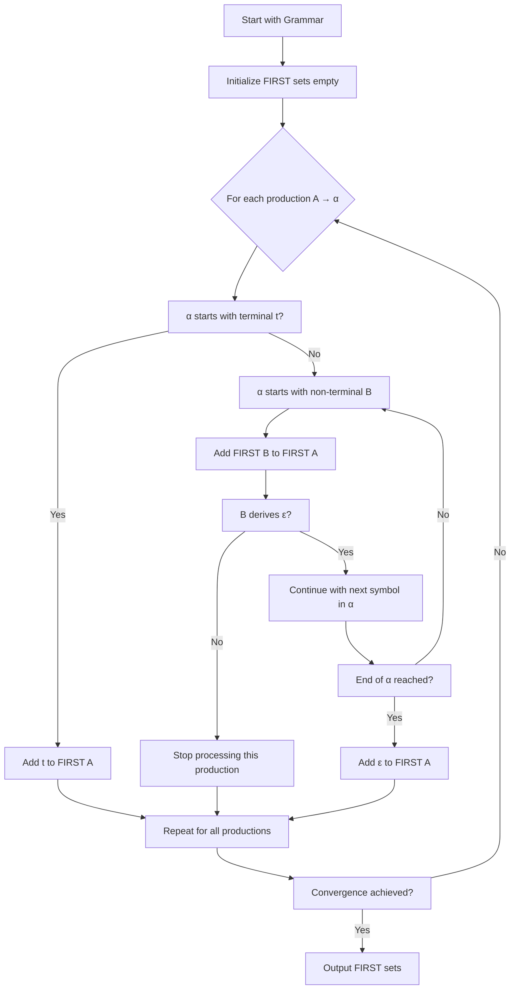
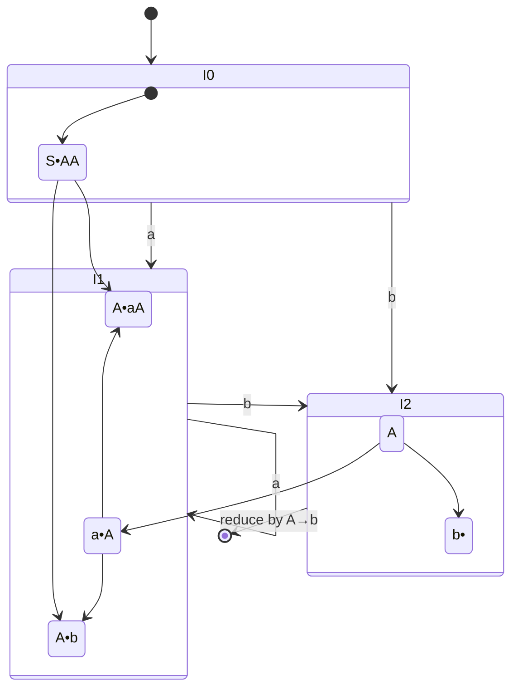
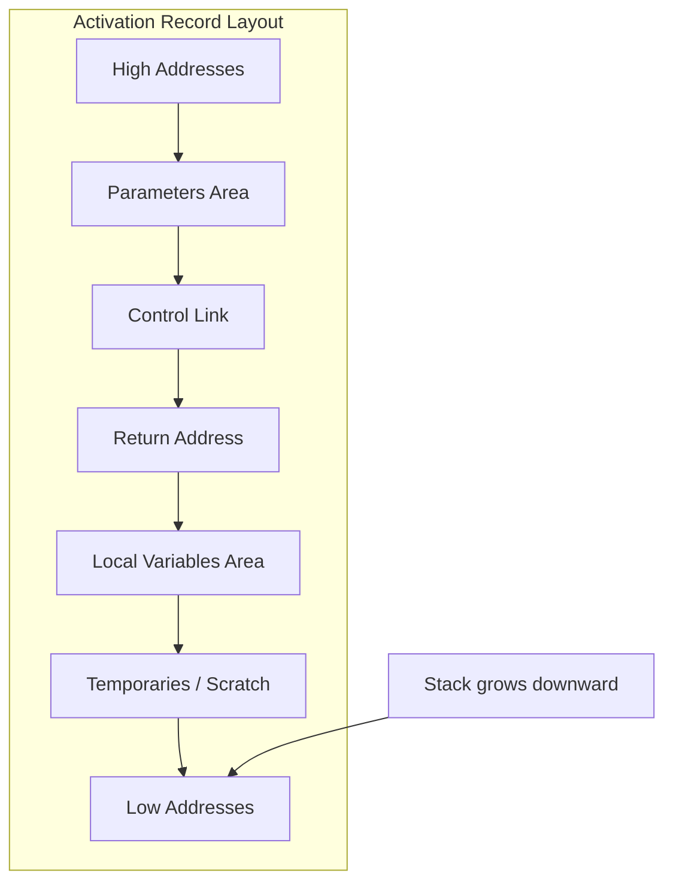
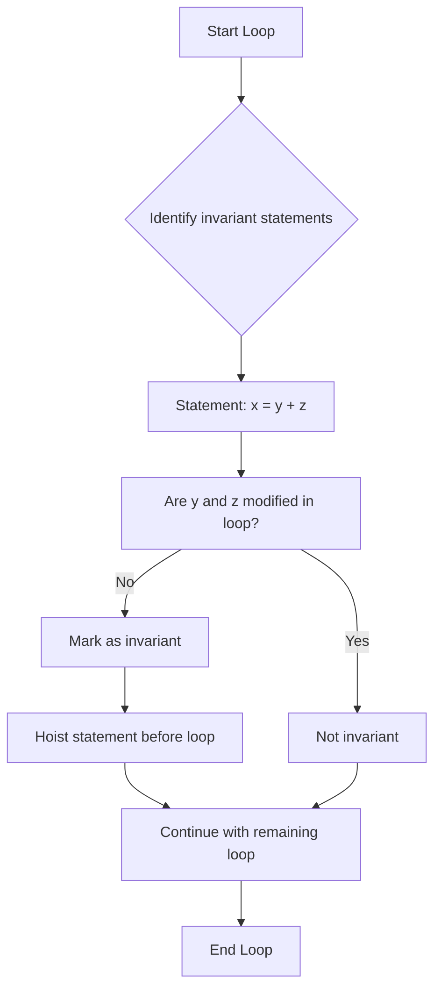
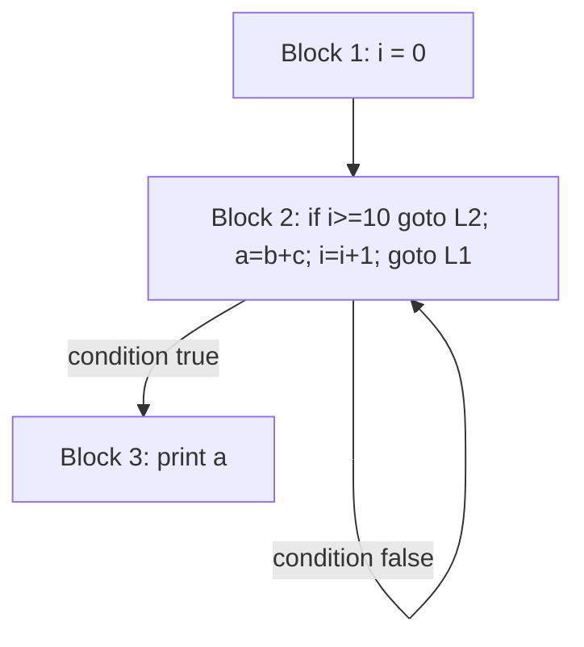
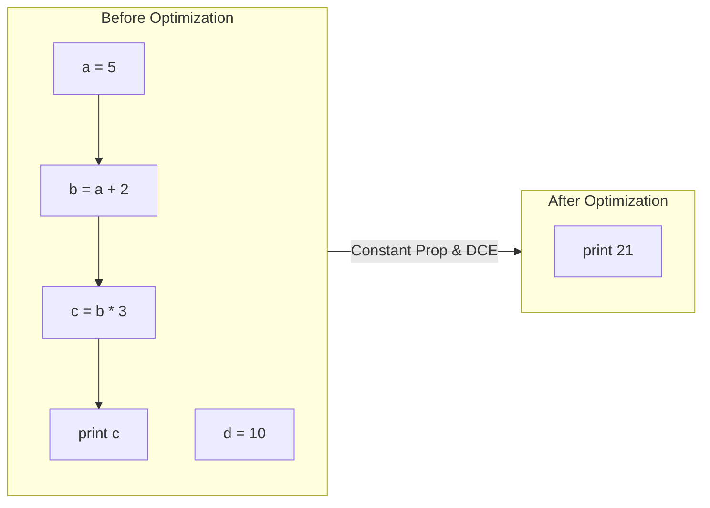
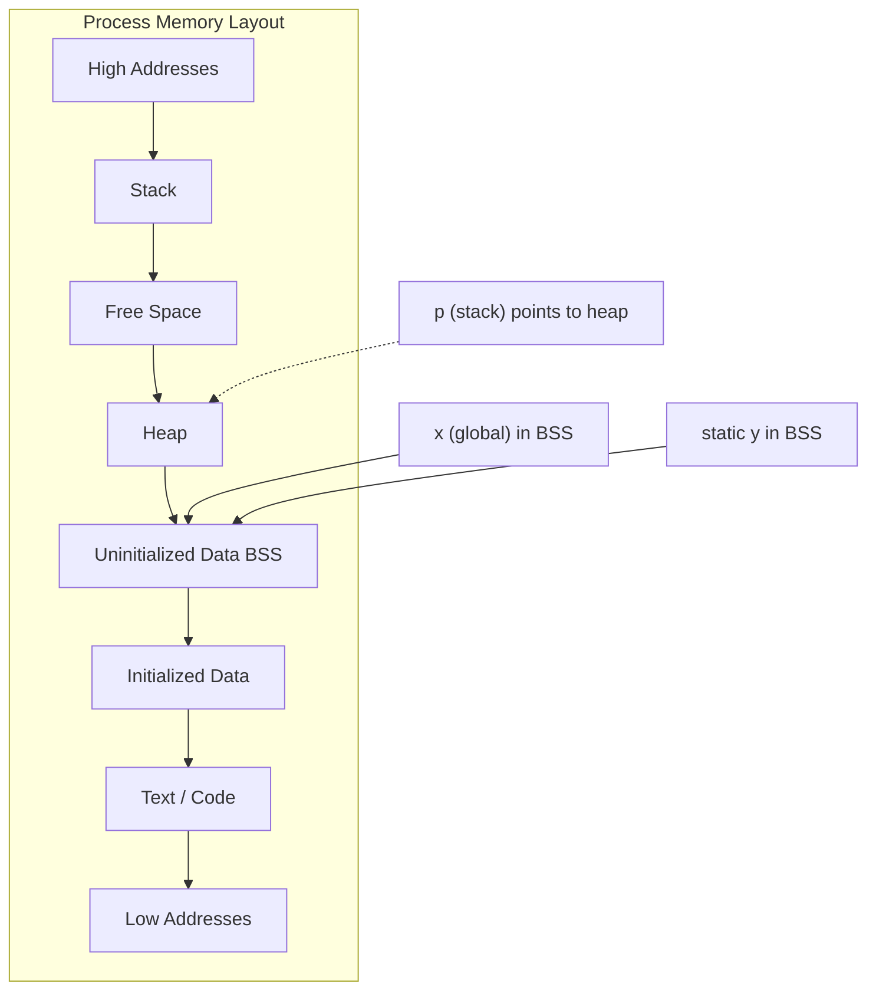
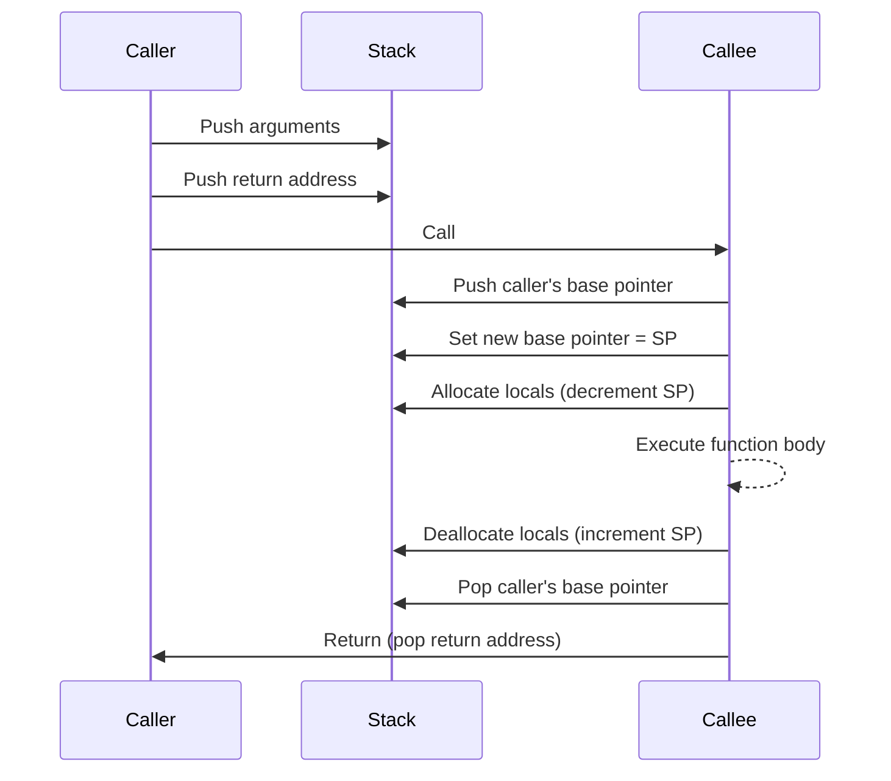

## Comprehensive Guide to Compiler Design Principles and Practice

This document provides a detailed exposition of fundamental compiler construction algorithms and common interview problems. The explanations are grounded in theoretical concepts, illustrated with concrete examples, and supplemented with structural diagrams to enhance conceptual clarity.

---

### Part I: Numerical Problems in Compiler Construction

#### 1. Computing FIRST and FOLLOW Sets

**Conceptual Foundation**
The FIRST set of a non-terminal A contains all terminal symbols that can appear as the first symbol of any string derivable from A. The FOLLOW set of A contains all terminal symbols that can appear immediately to the right of A in some sentential form.

**Algorithmic Approach**
- For FIRST: Iterate over productions. If a production starts with a terminal, add that terminal. If it starts with a non-terminal, add the FIRST of that non-terminal (accounting for ε-transitions).
- For FOLLOW: Place $ in FOLLOW of the start symbol. For a production A → α B β, add FIRST(β) (excluding ε) to FOLLOW(B). If β derives ε or is absent, add FOLLOW(A) to FOLLOW(B).

**Example Grammar**
```
E  → T E'
E' → + T E' | ε
T  → F T'
T' → * F T' | ε
F  → ( E ) | id
```

**Computed Sets**
- FIRST(E) = FIRST(T) = { (, id }
- FIRST(E') = { +, ε }
- FIRST(T) = FIRST(F) = { (, id }
- FIRST(T') = { *, ε }
- FIRST(F) = { (, id }
- FOLLOW(E) = { $, ) }
- FOLLOW(E') = FOLLOW(E) = { $, ) }
- FOLLOW(T) = { +, $, ) }
- FOLLOW(T') = FOLLOW(T) = { +, $, ) }
- FOLLOW(F) = { *, +, $, ) }

**Real-Life Analogy**
Consider planning a journey. FIRST is the set of possible first destinations (terminal cities) you can visit starting from a given state. FOLLOW is the set of possible next destinations that can follow a given state in a complete itinerary. These sets are prerequisites for building a predictive navigation system.

**Mermaid Diagram for FIRST Computation Flow**



---

#### 2. LL(1) Grammar Validation and Parse Table Construction

**Definition**
A grammar is LL(1) if for every pair of productions A → α and A → β, the intersection of FIRST(α) and FIRST(β) is empty, and if α derives ε, then FIRST(β) ∩ FOLLOW(A) = ∅.

**Parse Table Construction**
For each production A → α:
- For each terminal t in FIRST(α), place the production in M[A][t].
- If ε is in FIRST(α), place the production in M[A][t] for each t in FOLLOW(A).

**Example with the Arithmetic Grammar**
The grammar provided is LL(1). The parsing table entries include:
- M[E][(] and M[E][id] point to E → T E'.
- M[E'][+] points to E' → + T E'; M[E'][)] and M[E'][$] point to E' → ε.
- Similar entries exist for T, T', and F.

**Real-Life Analogy**
An LL(1) parser is analogous to a deterministic decision tree at a restaurant. Given the current course (non-terminal) and the next item on the menu (terminal), the waiter (parser) knows exactly which recipe (production) to apply without ambiguity.

**Mermaid Parse Table Visualization**

```mermaid
flowchart LR
    subgraph Table[LL(1) Parsing Table]
        direction LR
        A["M[E, id] = E→T E'"] 
        B["M[E, (] = E→T E'"]
        C["M[E', +] = E'→+ T E'"]
        D["M[E', )] = E'→ε"]
        E["M[E', $] = E'→ε"]
        F["M[T, id] = T→F T'"]
        G["M[T, (] = T→F T'"]
        H["M[T', *] = T'→* F T'"]
        I["M[T', +] = T'→ε"]
        J["M[T', )] = T'→ε"]
        K["M[T', $] = T'→ε"]
        L["M[F, id] = F→id"]
        M["M[F, (] = F→( E )"]
    end
```

---

#### 3. LR(0) Items and SLR(1) Conflict Detection

**LR(0) Items**
An LR(0) item is a production with a dot (•) placed somewhere on the right-hand side, indicating the parsing progress. The closure operation augments the set by adding items for non-terminals immediately after the dot.

**SLR(1) Conflict Resolution**
A conflict exists if a state contains:
- A shift item (A → α • t β) and a reduce item (B → γ •) such that t ∈ FOLLOW(B) → Shift-Reduce conflict.
- Two reduce items (A → α •) and (B → β •) such that FOLLOW(A) ∩ FOLLOW(B) ≠ ∅ → Reduce-Reduce conflict.

**Example Grammar for LR(0) Items**
```
S → A A
A → a A | b
```

**LR(0) State Transition Example**
State I0 = { S → • A A, A → • a A, A → • b }.
- On reading 'a', transition to state I1 = { A → a • A, A → • a A, A → • b }.
- On reading 'b', transition to state I2 = { A → b • }.

**Real-Life Analogy**
LR parsing is akin to an assembly line where each item represents a partially assembled product. The dot marks the current assembly step. Conflicts arise when the line operator cannot decide whether to continue assembling (shift) or to ship the current component (reduce) based on the incoming part.

**Mermaid State Machine for LR(0) Items**



**Conflict Identification**
If FOLLOW(A) contains 'a' or 'b' in a state with a reduce item, a conflict arises. In SLR(1), we use FOLLOW sets to decide; if no conflict, the grammar is SLR(1).

---

#### 4. Counting Temporary Variables in Three-Address Code (TAC)

**Principle**
Three-address code represents expressions using a sequence of instructions of the form `x = y op z`, where `x` is a temporary variable. For an expression tree, the number of temporaries required equals the number of internal nodes that are not directly assigned to a final variable, assuming a simple register allocation strategy (e.g., Sethi-Ullman algorithm).

**Example Expression**
`(a + b) * (c + d) - (a + b)`

**TAC Generation**
```
t1 = a + b
t2 = c + d
t3 = t1 * t2
t4 = a + b   // Note: Common subexpression, but without optimization, we recompute
t5 = t3 - t4
```
Number of temporary variables = 5 (t1 through t5).

**Optimized TAC (with CSE)**
```
t1 = a + b
t2 = c + d
t3 = t1 * t2
t5 = t3 - t1
```
Optimized temporaries = 3 (t1, t2, t3/t5 can reuse t1? Actually t1 is used later, so we need separate t5). Still, we reduce one.

**Real-Life Analogy**
Temporaries are like scratch pads or sticky notes used during a multi-step calculation. Each intermediate result requires a separate note unless you erase and reuse notes wisely (optimization).

---

#### 5. Activation Record Size Computation

**Components**
An activation record (stack frame) typically contains:
- Return address (1 word)
- Control link (pointer to caller's frame)
- Access link (for non-local variables, optional)
- Parameters (n words)
- Local variables (m words)
- Temporary storage (optional)

**Example**
A function `int foo(int a, int b) { int c, d, e; ... }` on a 64-bit machine (8 bytes per word).
- Parameters: 2 × 8 = 16 bytes.
- Locals: 3 × 8 = 24 bytes.
- Return address: 8 bytes.
- Control link: 8 bytes.
- Total = 16 + 24 + 8 + 8 = 56 bytes.

**Real-Life Analogy**
An activation record is analogous to a project folder. Each folder (function call) contains the project’s return address (who to report back to), the list of inputs (parameters), internal working documents (local variables), and a reference to the parent folder (control link).

**Mermaid Memory Layout Diagram**



---

#### 6. Loop-Invariant Code Identification

**Definition**
A code statement inside a loop is loop-invariant if its operands are either constants or variables whose values do not change within the loop.

**Detection Algorithm**
For each statement `x = y op z` inside a loop:
- Mark it invariant if both `y` and `z` are constants, or if all definitions of `y` and `z` are outside the loop.
- Iteratively mark statements that depend on other invariant statements.

**Example Loop**
```
while (i < 10) {
    x = y + z;   // y and z not modified inside loop → invariant
    i = i + 1;   // i is modified → not invariant
}
```

**Optimization (Hoisting)**
Move `x = y + z` before the loop to avoid repeated computation.

**Real-Life Analogy**
Consider a factory assembly line where a robot must paint a part. If the color (y+z) is fixed, you can pre-mix the paint once before the line starts, rather than mixing it for every part.

**Mermaid Flow for Hoisting**



---

#### 7. Basic Blocks and Flow Graph Construction

**Basic Block Definition**
A maximal sequence of consecutive three-address instructions where:
- Control enters only at the first instruction.
- Control leaves only at the last instruction (no jumps to the middle).

**Leader Identification**
- The first instruction is a leader.
- Any instruction that is the target of a conditional or unconditional jump is a leader.
- Any instruction immediately following a jump is a leader.

**Example Code Snippet**
```
1:  i = 0
2:  L1: if i >= 10 goto L2
3:      a = b + c
4:      i = i + 1
5:      goto L1
6:  L2: print(a)
```

**Basic Blocks**
- Block B1: {1}
- Block B2: {2, 3, 4, 5}
- Block B3: {6}

**Flow Graph Edges**
- B1 → B2
- B2 → B2 (self-loop) and B2 → B3

**Real-Life Analogy**
Basic blocks are like segments of a highway between exits. Control flow is like a car that cannot leave the highway except at designated exits (jump targets), and cannot enter except at on-ramps (leaders).

**Mermaid Flow Graph**



---

#### 8. Constant Propagation and Dead Code Elimination

**Constant Propagation**
Replace variables that have known constant values with those constants throughout the program. This is a forward data-flow analysis.

**Dead Code Elimination**
Remove instructions that compute values never used subsequently, or that have no observable effect.

**Example Program**
```
a = 5;
b = a + 2;    // b becomes 7 (constant propagation)
c = b * 3;    // c becomes 21
print(c);
d = 10;       // d is never used → dead code
```

**Optimized Version**
```
a = 5;
print(21);
```

**Real-Life Analogy**
Constant propagation is like solving a puzzle where you replace variable placeholders with their known values early. Dead code elimination is like clearing out obsolete files from a project directory that are no longer referenced by any part of the system.

**Mermaid Data-Flow Diagram**



---

### Part II: Interview-Style Problems

#### 1. Regular Expression for C Variable Names

**Requirements**
- Must start with a letter (uppercase or lowercase) or underscore.
- Subsequent characters can be letters, digits, or underscores.
- Cannot be a C keyword (this is a semantic restriction, not captured by regex).

**Regular Expression**
`^[A-Za-z_][A-Za-z0-9_]*$`

**Explanation**
- `^` anchors to start.
- `[A-Za-z_]` first character class.
- `[A-Za-z0-9_]*` zero or more valid subsequent characters.
- `$` anchors to end.

---

#### 2. DFA for Strings with Equal Number of 0s and 1s

**Theoretical Note**
The language `L = { w ∈ {0,1}* | #0(w) = #1(w) }` is not regular. This is proven by the Pumping Lemma. A DFA would require an infinite number of states to keep track of the difference count (which can be arbitrarily large). Therefore, a DFA does not exist for this language.

**Alternative Solution**
A Pushdown Automaton (PDA) using a stack can recognize this language. Alternatively, a Context-Free Grammar is:
```
S → 0 S 1 | 1 S 0 | S S | ε
```

**For Bounded Length**
If the problem restricts the length to a fixed n, a DFA can be constructed with states representing the difference, but the number of states grows with n. For example, for length 2, the DFA accepts strings "01" and "10".

**Interview Response**
The correct professional response is to state the impossibility and then provide the CFG or PDA as a valid solution for the context-free language.

---

#### 3. Balanced Parentheses Check Using a Stack

**Algorithm**
1. Initialize an empty stack.
2. For each character `ch` in the input string:
   - If `ch` is an opening bracket `(`, `{`, `[`, push it.
   - If `ch` is a closing bracket:
     - If stack is empty, return false.
     - Pop the top element. If it does not match the corresponding opening bracket, return false.
3. After processing all characters, return true if stack is empty, else false.

**Example**
Input: `({[]})` → true. Input: `([)]` → false.

**Real-Life Analogy**
This is akin to a tray stack in a cafeteria. When you pick up a tray (open), you place it on the stack. When you put one down (close), you must take the topmost tray; if the trays do not match types, the stack is invalid.

---

#### 4. Predictive Parser for a Simple Arithmetic Grammar

**Recursive Descent Implementation**
Given grammar:
```
E → T E'
E' → + T E' | ε
T → F T'
T' → * F T' | ε
F → ( E ) | num
```

**Parser Functions (Pseudocode)**
```python
def E():
    T()
    E_prime()

def E_prime():
    if lookahead == '+':
        match('+')
        T()
        E_prime()

def T():
    F()
    T_prime()

def T_prime():
    if lookahead == '*':
        match('*')
        F()
        T_prime()

def F():
    if lookahead == '(':
        match('(')
        E()
        match(')')
    elif lookahead == 'num':
        match('num')
    else:
        error()
```

**LL(1) Table-Driven Parser**
The parsing table is built using FIRST and FOLLOW sets. The driver uses the stack to simulate leftmost derivation.

**Real-Life Analogy**
The parser is like a map reader who, at each intersection (non-terminal), looks at the next road sign (terminal) to decide which highway (production) to take.

---

#### 5. Three-Address Code Generation from an AST

**AST Representation**
For expression `(a + b) * c`, the AST has a root `*` with left child `+` (with children `a` and `b`) and right child `c`.

**Traversal Algorithm**
Post-order traversal: generate code for left child, right child, then perform the operation on the current node, assigning to a new temporary.

**Generated TAC**
```
t1 = a + b
t2 = t1 * c
```

**Handling Assignments**
For `x = (a + b) * c`, the final temporary `t2` is assigned to `x`: `x = t2`.

---

#### 6. Memory Layout of a C Program

**Program Components**
- **Text Segment**: Contains executable machine code (read-only).
- **Data Segment**:
  - **Initialized Data**: Global/static variables with explicit initial values (e.g., `int x = 10;`).
  - **Uninitialized Data (BSS)**: Global/static variables without explicit initial values (zero-initialized by default, e.g., `int x;` at global scope).
- **Heap**: Dynamically allocated memory via `malloc`, grows upward.
- **Stack**: Stores activation records for function calls, grows downward.

**Example Declaration Analysis**
`int x;` at global scope → stored in BSS (uninitialized data).
`static int y;` inside a function or global → stored in BSS (static storage duration, zero-initialized).
`int *p = malloc(10);` inside a function:
- The variable `p` itself is a local pointer, stored on the stack.
- The memory allocated by `malloc(10)` resides in the heap. `p` holds the address of this heap memory.

**Mermaid Memory Layout**



---

#### 7. Stack Frame Creation on Function Call

**Steps During Function Call**
1. **Caller** pushes arguments onto the stack (often in reverse order).
2. **Caller** executes a call instruction, which pushes the return address onto the stack.
3. **Callee** saves the caller's base pointer (EBP/RBP) by pushing it.
4. **Callee** sets its own base pointer to the current stack pointer.
5. **Callee** allocates space for local variables by decrementing the stack pointer.
6. **Callee** optionally saves callee-saved registers.

**During Return**
1. **Callee** places return value in a designated register (EAX/RAX).
2. **Callee** restores the stack pointer to the base pointer.
3. **Callee** pops the old base pointer.
4. **Callee** executes a return instruction, which pops the return address and transfers control.

**Mermaid Stack Frame Creation**



---

#### 8. Eliminating Common Subexpressions from a Basic Block

**Definition**
Common subexpression elimination (CSE) identifies expressions that are computed multiple times and replaces subsequent computations with a reference to the previously computed result.

**Algorithm**
1. Traverse the basic block instruction by instruction.
2. For each expression `x = y op z`, compute a hash key based on `(op, y, z)`.
3. If the key already exists in a hash table, replace the current instruction with `x = t`, where `t` is the previous result variable.
4. Otherwise, insert the expression into the hash table with the current variable `x` as its value.

**Example Basic Block**
```
a = b + c
d = b + c
e = d + f
f = b + c
```

**After CSE**
```
t1 = b + c
a = t1
d = t1
e = d + f
f = t1
```

**Real-Life Analogy**
This is like memorizing the result of a frequently used calculation (e.g., 7 × 8 = 56) and writing it on a whiteboard. Every time you need that product, you look at the whiteboard instead of recalculating.

**Mermaid CSE Workflow**

```mermaid
flowchart TD
    A[Instruction: a = b + c] --> B{Check hash for (+, b, c)}
    B -->|Not found| C[Add to hash: (+,b,c) → a]
    C --> D[Next: d = b + c]
    D --> E{Check hash}
    E -->|Found: a| F[Replace with d = a]
    F --> G[Next: e = d + f]
    G --> H{Check hash for (+, d, f)}
    H -->|Not found| I[Add to hash: (+,d,f) → e]
    I --> J[Next: f = b + c]
    J --> K{Check hash}
    K -->|Found: a| L[Replace with f = a]
    L --> M[End]
```

---

This comprehensive treatment provides both the theoretical underpinnings and practical algorithmic details necessary for compiler construction and analysis, supported by clear visualizations and relatable analogies.