# Chapter 1: Introduction to Computer Networks

Welcome to the world of computer networks! In this chapter, we’ll learn what computer networks are, why we use them, how to judge their quality, and the different shapes and styles they come in.

---

## 1.1 Definition and Goals of Computer Networks

**Definition:**  
A computer network is a group of two or more computers (or devices like printers, smartphones, game consoles) connected together so they can share information and resources.

Think of it like a neighborhood of houses connected by roads – the roads let people visit each other, exchange news, or share tools. Similarly, a network lets computers send data back and forth.

**Main goals of a computer network:**

1. **Resource sharing** – Share hardware (printers, scanners), software (applications), and files (documents, photos) across many computers.  
   *Example: In an office, 10 people can use one networked printer instead of buying 10 printers.*

2. **Communication** – People can send emails, chat, make video calls, or work together on documents.  
   *Example: Zoom calls or WhatsApp messages travel over networks.*

3. **Cost reduction** – Sharing expensive devices and centralizing data storage saves money.  
   *Example: A school stores all student records on one central server instead of every teacher’s PC.*

4. **Reliability** – If one computer fails, others can take over (with backup systems).  
   *Example: Large websites like Google use thousands of servers so that if a few break, the site still works.*

5. **Scalability** – You can add more computers or devices without breaking the existing network.  
   *Example: Your home Wi‑Fi works with 2 phones today and 5 phones next month – just connect them.*

---

## 1.2 Network Criteria – How to Judge a Network

Not all networks are equally good. We judge them by three main criteria: **Performance**, **Reliability**, and **Security**.

### 1.2.1 Performance

- **Throughput** – How much data can be sent per second (measured in Mbps or Gbps).  
- **Delay (Latency)** – The time it takes for a piece of data to travel from source to destination.  
- **Jitter** – Variation in delay. For voice/video calls, low jitter is important.  
- **Number of users** – More users sharing the network usually slows it down.

### 1.2.2 Reliability

- **Fault tolerance** – The network keeps working even if some parts fail.  
- **Error rate** – How often data gets corrupted during transmission.  
- **Uptime** – The percentage of time the network is available.

### 1.2.3 Security

- **Confidentiality** – Only authorized people can see the data.  
- **Integrity** – Data is not changed by accident or on purpose.  
- **Availability** – Authorized people can access the network when they need to.  
- **Authentication** – Verify that a user or device is who they claim to be.

---

## 1.3 Types of Networks

| Type | Full Name | Range | Typical Use |
|------|-----------|-------|--------------|
| **PAN** | Personal Area Network | A few meters | Connecting phone, laptop, smartwatch |
| **LAN** | Local Area Network | A building or campus | Sharing files, printers, internet in an office |
| **MAN** | Metropolitan Area Network | A city | Connecting multiple buildings of a university across a city |
| **WAN** | Wide Area Network | Countries or continents | The Internet, or a company with global offices |
| **WLAN** | Wireless Local Area Network | Same as LAN, but wireless | Home Wi‑Fi, airport Wi‑Fi |

### 1.3.1 PAN (Personal Area Network)

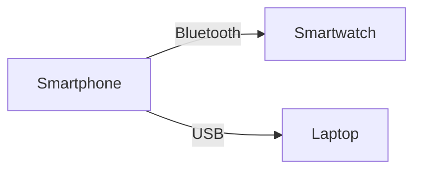

### 1.3.2 LAN (Local Area Network)

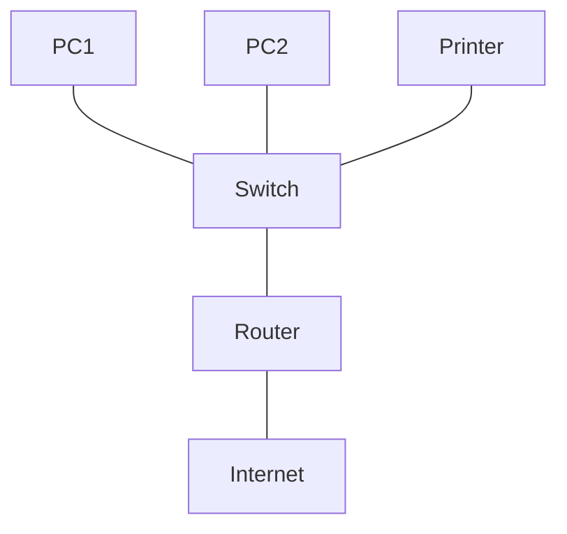

### 1.3.3 MAN (Metropolitan Area Network)

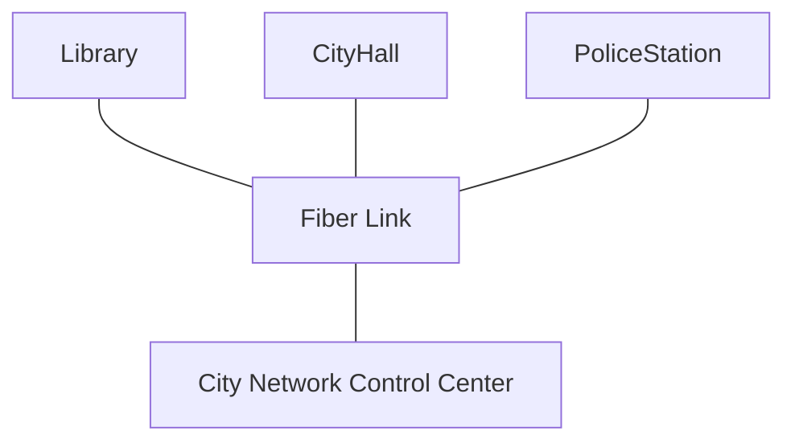

### 1.3.4 WAN (Wide Area Network)

### 1.3.5 WLAN (Wireless Local Area Network)

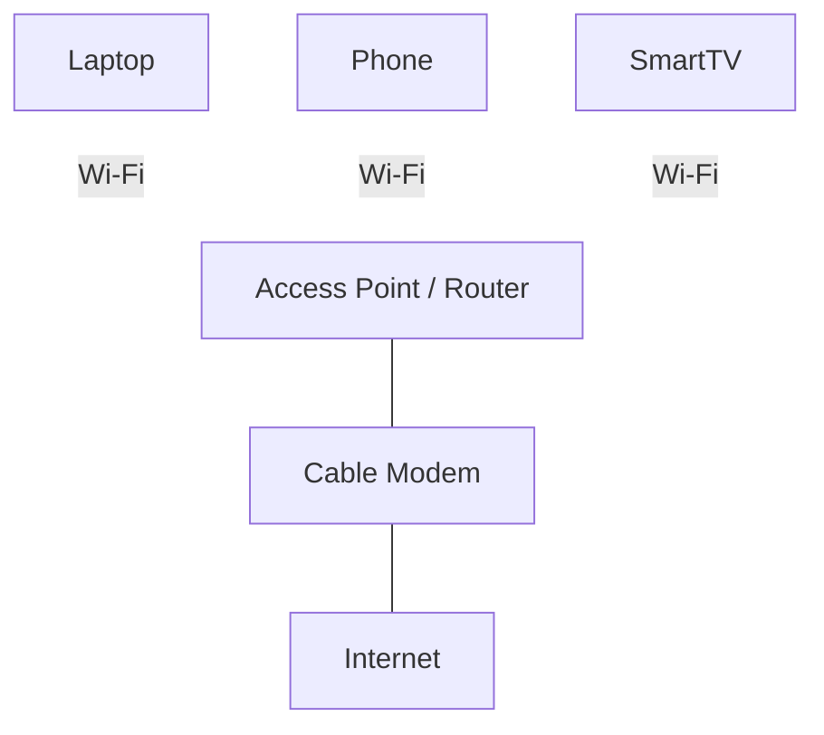

---

## 1.4 Network Topologies

### 1.4.1 Bus Topology

All devices share a single central cable (the bus). Data travels both ways; every device sees the data, but only the intended recipient accepts it.

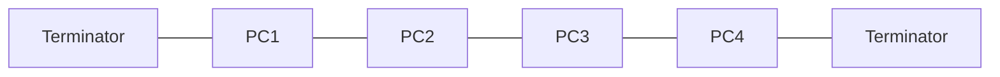

- **Advantages:** Cheap, easy to install, uses little cable.
- **Disadvantages:** A break in the bus brings down the whole network. Only one device can send at a time.
- **Example:** Very old Ethernet networks – rarely used today.

### 1.4.2 Star Topology

All devices connect to a central switch or hub. Every message goes through the center.

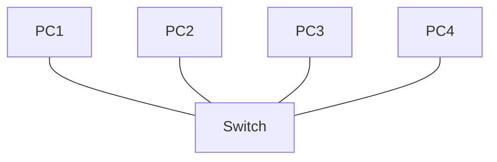

- **Advantages:** If one cable fails, only that device is affected. Easy to add devices. Easy to find faults.
- **Disadvantages:** If the central switch fails, the whole network goes down. Requires more cable than bus.
- **Example:** Most home and office networks today (Ethernet switches, Wi‑Fi access points).

### 1.4.3 Ring Topology

Devices are connected in a closed loop. Data travels in one direction (or both directions in some rings) from device to device.

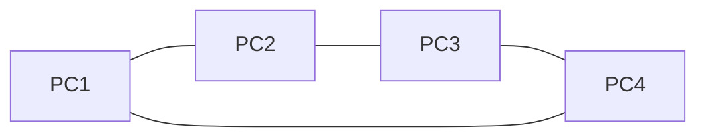

- **Advantages:** Orderly data flow (no collisions). Each device can repeat the signal, allowing longer distances.
- **Disadvantages:** A break in the ring or a failed device can bring down the whole network (unless it’s a dual ring).
- **Example:** Older IBM Token Ring networks, some fiber optic rings (SONET).

### 1.4.4 Mesh Topology

Every device is connected to every other device. This gives many redundant paths.

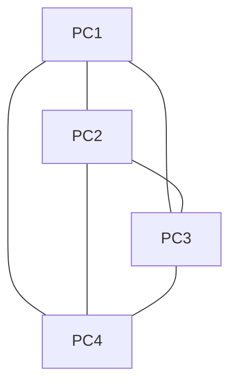

- **Advantages:** Very reliable – many alternative paths. No single point of failure.
- **Disadvantages:** Expensive – needs many cables and ports. Complex to set up.
- **Example:** Backbone of the Internet, military networks, large data centers.

### 1.4.5 Hybrid Topology

Combines two or more basic topologies (e.g., stars connected by a bus backbone).

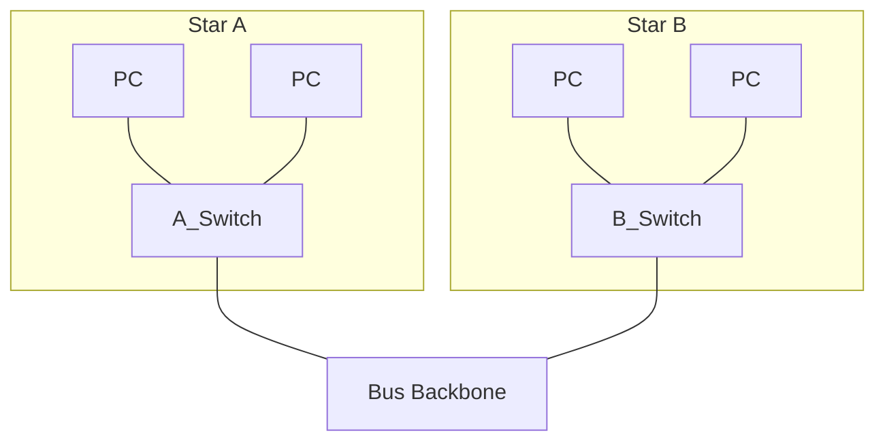

- **Advantages:** Flexible, can be designed to fit specific needs.
- **Disadvantages:** Complex design, more expensive, harder to troubleshoot.
- **Example:** Large corporate networks (each department is a star, linked via a ring or bus backbone).

---

## 1.5 Network Models

### 1.5.1 Client‑Server Model

- **Server** – A powerful computer (or software) that provides services.
- **Client** – Any device that asks the server for something.

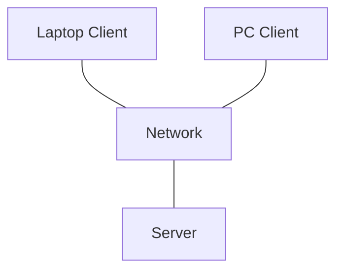

**How it works:**  
Client sends a request (“give me file.pdf”). Server processes it and sends back the answer.

**Examples:** Web browsing, email, online banking.

**Advantages:** Centralized management, easy access control, powerful servers.  
**Disadvantages:** Server is a single point of failure; expensive; needs an administrator.

### 1.5.2 Peer‑to‑Peer (P2P) Model

Every computer (peer) is equal. Each peer can act as both a client (asking) and a server (sharing). No central server.

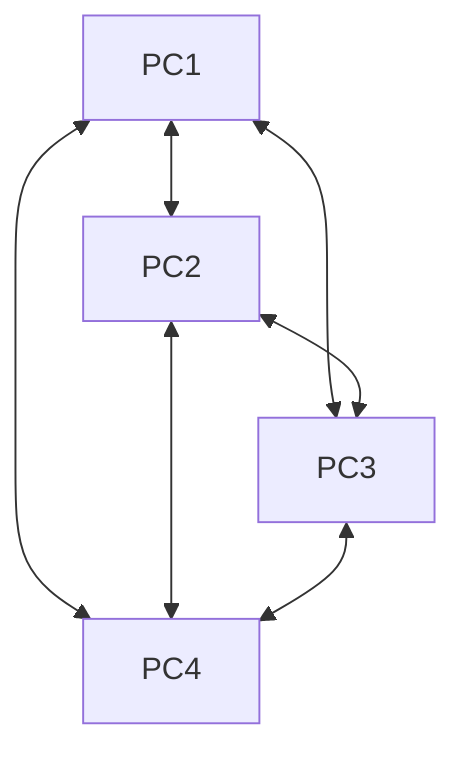

(Arrows show that any two peers can communicate directly.)

**Examples:** BitTorrent, old file‑sharing apps, small home or office workgroups.

**Advantages:** No expensive server, easy to set up, very scalable.  
**Disadvantages:** Security risks, no central backup, performance depends on the slowest peer.

### Comparison Table

| Feature | Client‑Server | Peer‑to‑Peer |
|---------|---------------|---------------|
| Central control | Yes (server) | No |
| Cost | Higher (server needed) | Lower |
| Security | Better (central policies) | Weaker |
| Reliability | Single point of failure | No single failure point (but peers can leave) |
| Example | Web, email, databases | BitTorrent, Windows Workgroup |

---

## Summary

- A **computer network** connects devices to share resources and communicate.
- Three key **criteria** to judge a network: performance, reliability, security.
- **Types of networks** range from small (PAN) to huge (WAN); LAN and WLAN are most common.
- **Topologies** describe the layout: Bus, Star, Ring, Mesh, Hybrid. Star is most popular today.
- **Network models** are either Client‑Server (centralized) or Peer‑to‑Peer (decentralized). Each has its own strengths.

Now you have a solid foundation to understand how networks are built. In the next chapter, we’ll explore how data is actually sent across these networks using layers, protocols, and addressing.