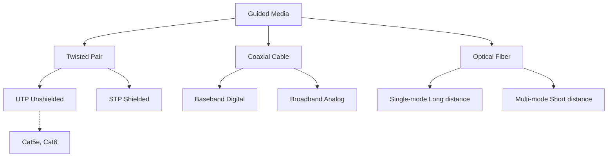
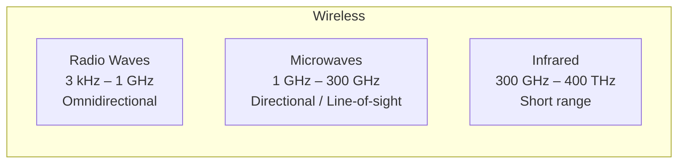
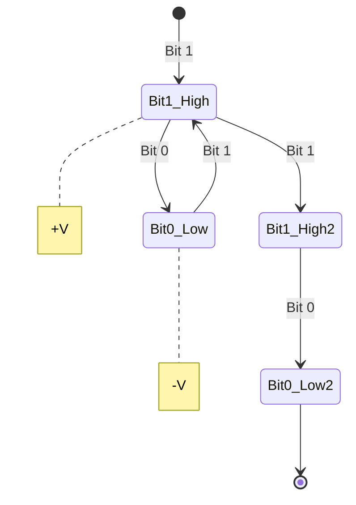
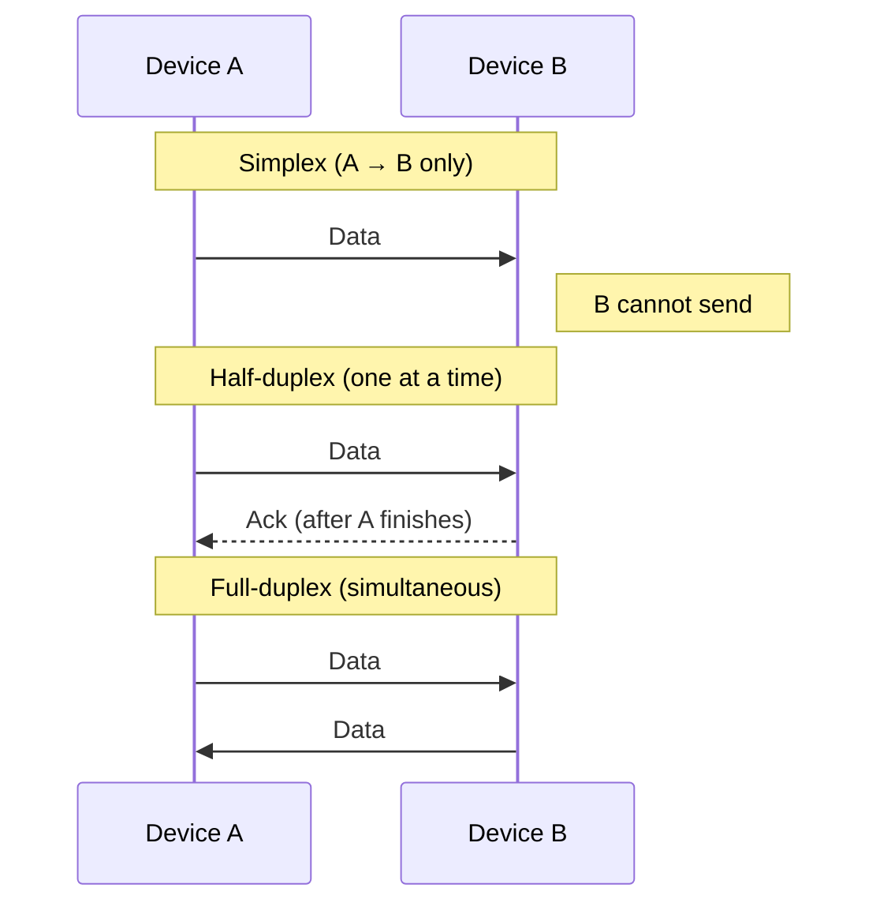
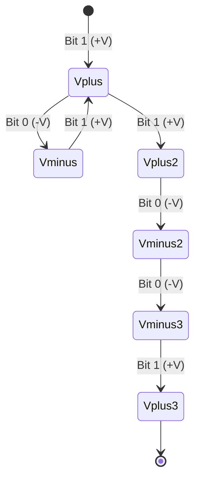
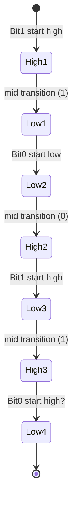
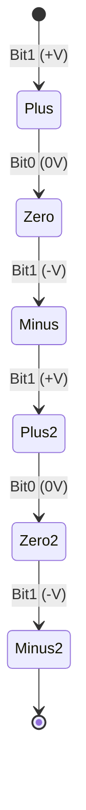
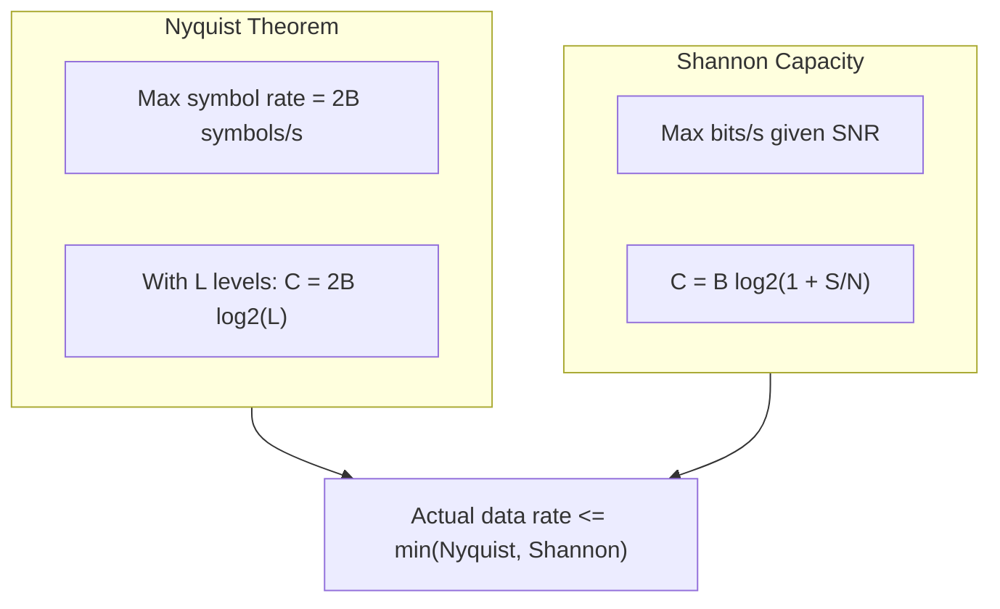

## Chapter 3: Physical Layer

### 1. Transmission Media

#### 1.1 Guided Media (Wired)



#### 1.2 Unguided Media (Wireless)



---

### 2. Signal Types: Analog vs Digital
**Digital Signal:** A digital signal is a discrete signal that represents data using specific values, usually in binary form (0 and 1). It changes in steps rather than continuously. Digital signals are less affected by noise, easier to store, process, and transmit, and are widely used in computers and modern communication systems.
*Digital signal representation using state diagram* – each state is a voltage level over a bit interval:


**Analog Signal:** An analog signal is a continuous signal that varies smoothly with time. It can take an infinite number of values within a given range. These signals represent real-world physical quantities such as sound, temperature, and light. However, analog signals are more prone to noise and distortion during transmission.

---

### 3. Transmission Modes



---

### 4. Line Coding Techniques

Instead of `gantt`, I use **state diagrams** to show voltage levels over time.

#### 4.1 NRZ‑L (Non‑Return to Zero, Level)

Bits: `1 0 1 1 0 0 1`  
Voltage: `+V` for 1, `-V` for 0.



#### 4.2 Manchester Coding (IEEE 802.3)

Each bit has a mid‑bit transition:  
- `1` = high→low  
- `0` = low→high

Bits: `1 0 1 0`



*Simpler view* – use a table:

| Bit | Start level | Mid transition | End level |
|-----|-------------|----------------|-----------|
| 1   | High        | → Low          | Low       |
| 0   | Low         | → High         | High      |
| 1   | High        | → Low          | Low       |
| 0   | Low         | → High         | High      |

#### 4.3 Bipolar AMI (Alternate Mark Inversion)

- `0` → 0V  
- `1` → alternating +V and -V  

Bits: `1 0 1 1 0 1`



---

### 5. Data Rate Concepts

#### 5.1 Nyquist Theorem (Noiseless)

Formula:

```text
C = 2B log2(L)  | B = Bandwidth, L = number of levels,C = Capacity
```

#### 5.2 Shannon Capacity (Noisy)

Formula:

```text
C = B log2(1 + S/N) | C = Capacity, B = Bandwidth, S/N = Signal to Noise Ratio
```

**Relationship diagram** – using a flowchart:



**Key insight**:  
- Nyquist tells how fast you can send symbols (no noise).  
- Shannon tells how many bits per symbol you can actually use (with noise).  

**Example**: Telephone line with B = 3.1 kHz, SNR = 30 dB (S/N = 1000)  
- Shannon: C ≈ 3100 × log₂(1001) ≈ 30.9 kbps  
- Nyquist with L=4 (2 bits/symbol): C = 2×3100×2 = 12.4 kbps  
→ The channel is limited by Nyquist if you only use 4 levels. With better SNR you could increase L, but noise limits L to √(1+S/N) ≈ 31.6, giving Nyquist C ≈ 2×3100×log₂(31.6) ≈ 30.9 kbps – same as Shannon.

---

## Summary Table

| Concept | Formula | Limiting Factor |
|---------|---------|----------------|
| **Nyquist** | C = 2B log2(L) | Bandwidth & number of levels |
| **Shannon** | C = B log2(1+S/N) | Bandwidth & SNR |

---
