# Chapter 4: Data Link Layer

The Data Link Layer is Layer 2 of the OSI model. Its job is to transfer data between two directly connected nodes reliably. This chapter covers all its essential functions, error detection techniques, flow and error control protocols, and the MAC sub‑layer.

## 4.1 Functions of the Data Link Layer

The Data Link Layer performs four main tasks:

1. **Framing** – It takes raw bits from the physical layer and groups them into frames (like putting letters into envelopes). Each frame has a header, payload, and trailer.

2. **Error detection and correction** – It checks if bits got flipped during transmission. It can detect errors and sometimes fix them without retransmission.

3. **Flow control** – It prevents a fast sender from overwhelming a slow receiver. The receiver tells the sender when it is ready for more data.

4. **Access control** – When multiple devices share the same medium (like Wi‑Fi or Ethernet cable), this decides who gets to transmit at a given time.

**Diagram – Data Link Layer in context:**

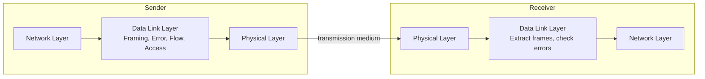

---

## 4.2 Error Detection

When data travels, noise can flip bits. These methods help detect errors. If an error is found, the receiver asks the sender to retransmit.

### 4.2.1 Parity Check

A single extra bit (parity bit) is added to make the total number of 1s even (even parity) or odd (odd parity).

**Example**: Send `1011010` with even parity.  
Count of 1s = 4 (already even) → parity bit = 0 → transmitted frame = `10110100`.

If a single bit flips, the receiver will detect an odd number of 1s and know an error occurred.

**Limitation**: Cannot detect two bit flips (error cancels out).

**Diagram**:

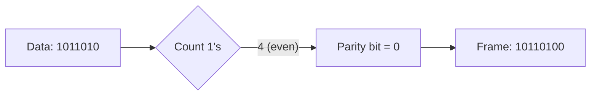

### 4.2.2 Checksum

Used in protocols like TCP/IP and UDP. The data is divided into fixed‑size segments. All segments are added using one’s complement arithmetic. The final sum is complemented and sent as the checksum.

**Example** (simplified): Data = `01001100 01101010` (two 8‑bit segments).  
Add: `01001100 + 01101010 = 10110110`. One’s complement of the sum = `01001001` (checksum).  
Receiver adds all segments including checksum. If the result is all 1s (`11111111`), data is correct.

**Diagram**:

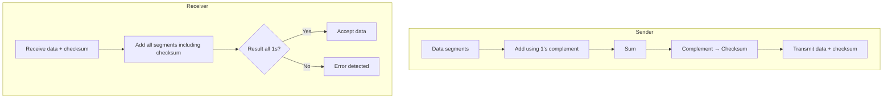

### 4.2.3 Cyclic Redundancy Check (CRC)

CRC is the most powerful error detection method used in Ethernet, Wi‑Fi, and many storage systems. It treats the data as a large binary number and divides it by a fixed divisor (generator polynomial). The remainder is the CRC code.

**Example**: Data = `110101`, Generator = `1011` (4 bits → CRC of 3 bits).  
Append 3 zeros to data → `110101000`. Divide by `1011` using XOR. Remainder = `001` → transmitted frame = `110101001`.  
Receiver divides the received frame by the same generator. If remainder is zero, no error.

**Common generators**:
- CRC‑16: `10001000000100001` (used in Bluetooth)
- CRC‑32: used in Ethernet (32‑bit check)

**Diagram**:

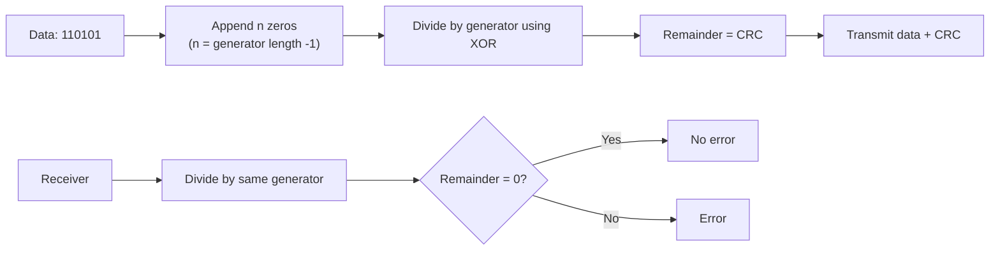

### 4.2.4 Hamming Code

Hamming code can detect and **correct** single‑bit errors. It adds parity bits at positions that are powers of two (1, 2, 4, 8, …). Each parity bit checks a specific set of data bits.

**Example**: Send 4‑bit data `1011` using Hamming(7,4).  
Positions: 1(p1),2(p2),3(d1),4(p3),5(d2),6(d3),7(d4) where d1=1, d2=0, d3=1, d4=1.  
Compute parity:
- p1 covers positions 1,3,5,7 → 1,1,0,1 → even parity → p1=1
- p2 covers 2,3,6,7 → 1,1,1,1 → even → p2=1
- p3 covers 4,5,6,7 → 1,0,1,1 → odd → p3=0  
Final codeword: `1 1 1 0 0 1 1` (positions 1‑7).

If bit 5 flips to 1, receiver recomputes parity and finds the error position by adding the failed parity bit positions. Then it flips the bit back.

**Diagram**:

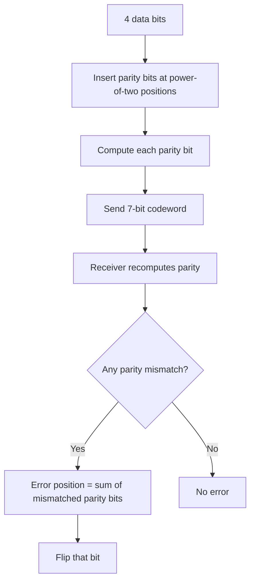

---

## 4.3 Flow & Error Control Protocols

These protocols ensure that data is sent at the right speed and errors are handled.

### 4.3.1 Stop‑and‑Wait

The sender sends one frame and then waits for an acknowledgment (ACK) from the receiver before sending the next frame. If the ACK does not arrive within a timeout, the sender retransmits.

**Example**: A sends frame 1 → B receives → B sends ACK → A sends frame 2 → …

**Efficiency** = (transmission time) / (transmission time + round‑trip time). Poor for long‑distance links.

**Diagram**:

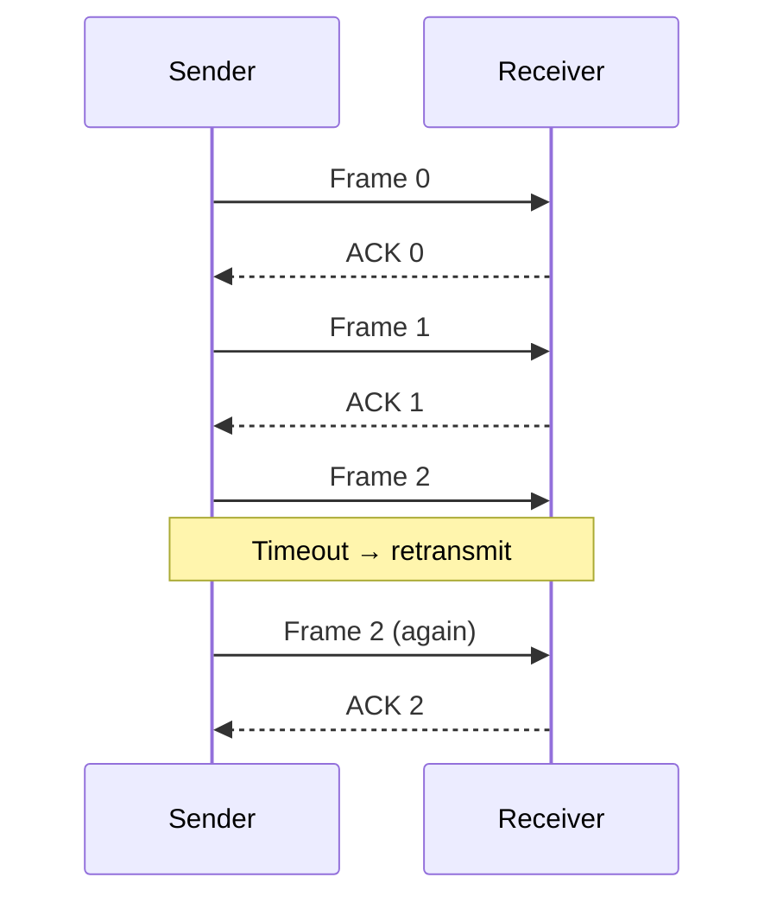

### 4.3.2 Sliding Window

The sender can send multiple frames before waiting for an ACK. Both sides maintain a window of sequence numbers. The window size determines how many outstanding (unacknowledged) frames are allowed.

- **Sender window**: frames sent but not yet acknowledged.
- **Receiver window**: frames that can be accepted out of order.

As ACKs arrive, the window slides forward.

**Diagram**:

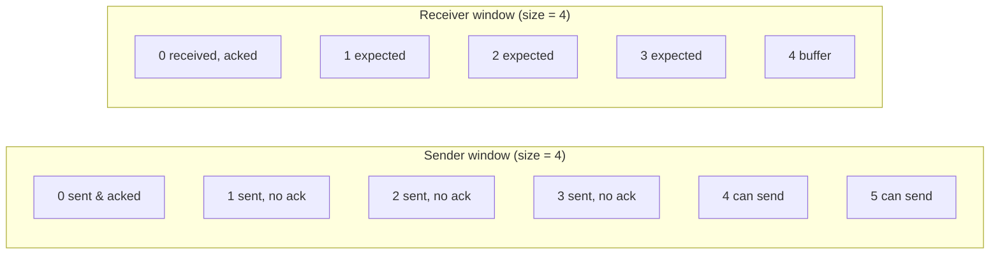

### 4.3.3 Automatic Repeat Request (ARQ) Protocols

ARQ combines error detection with retransmission.

#### Stop‑and‑Wait ARQ

Same as basic Stop‑and‑Wait, but adds sequence numbers (0 and 1) to distinguish retransmissions from new frames.

**Diagram** (simplified):

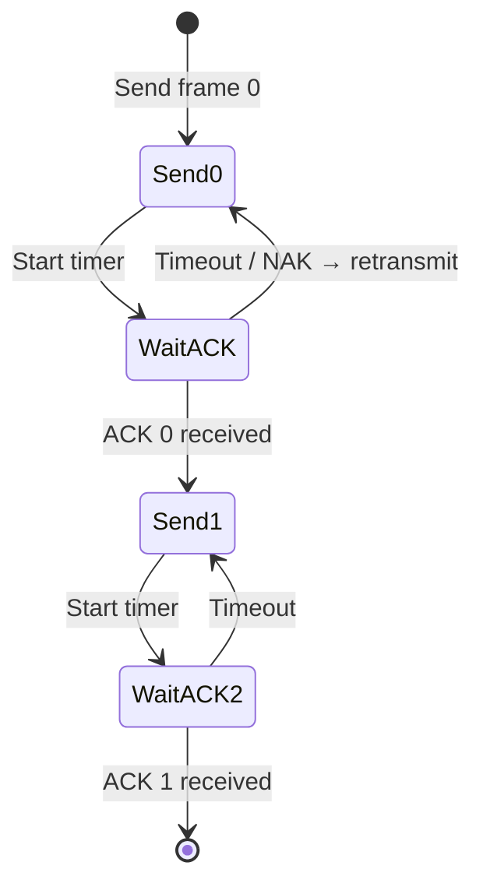

#### Go‑Back‑N ARQ

Sender can send up to N frames without ACK. If an error occurs, the receiver discards all subsequent frames, and the sender goes back to the lost frame and retransmits everything from that point.

**Example**: Window size = 4. Frames 0,1,2,3 sent. Frame 1 lost. Receiver gets frame 2 but discards it (out of order) and keeps asking for frame 1. Sender receives ACK for frame 0 only, then timeout → retransmits frames 1,2,3.

**Diagram**:

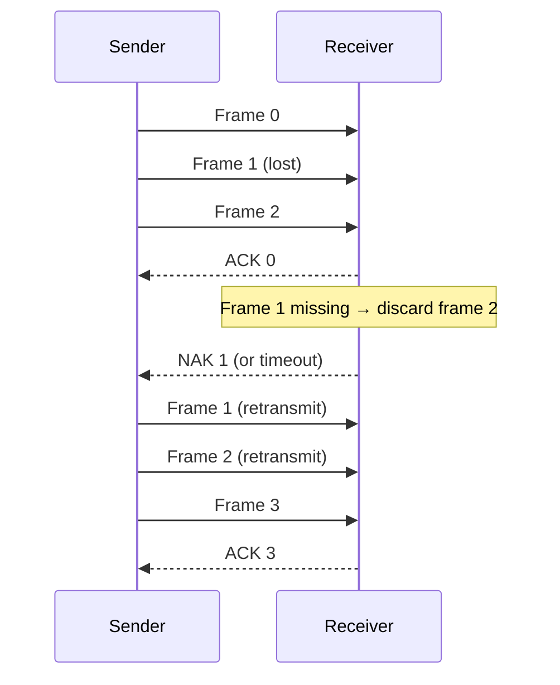

#### Selective Repeat ARQ

Only the lost frame is retransmitted. The receiver buffers out‑of‑order frames. Sender retransmits only the missing frame(s). Requires larger receiver buffer and more complex logic.

**Example**: Frames 0,1,2,3 sent. Frame 1 lost. Receiver buffers frame 2 and 3. Sender retransmits only frame 1. Then receiver delivers all frames in order.

**Diagram**:

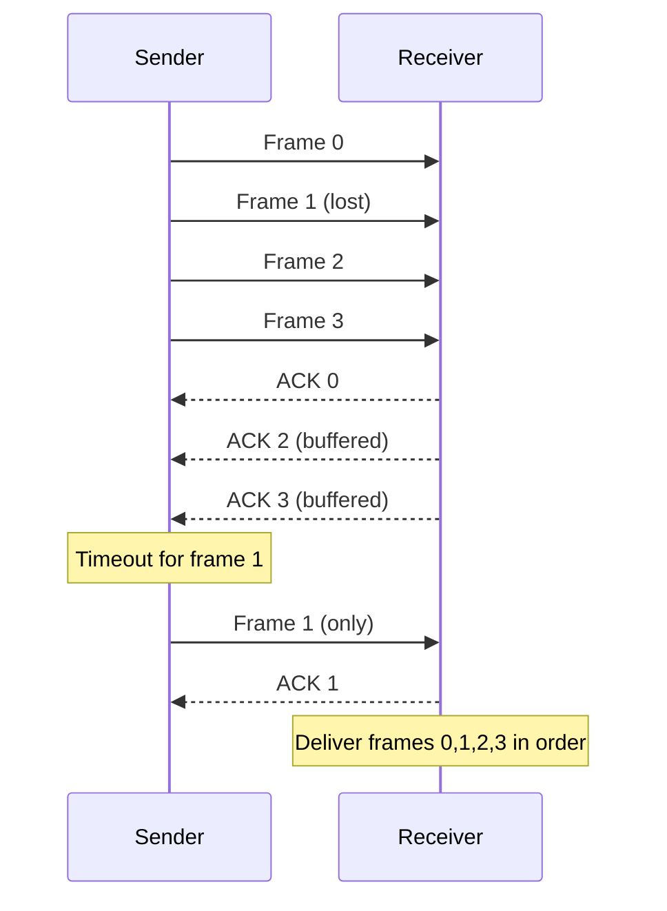

---

## 4.4 MAC Sub‑layer

The Media Access Control (MAC) sub‑layer is part of the Data Link Layer (the lower half). It handles addressing and channel access.

### 4.4.1 MAC Addressing

A MAC address is a unique 48‑bit (or 64‑bit) hardware address burned into network interfaces (NICs). It is written as six hexadecimal pairs, e.g., `00:1A:2B:3C:4D:5E`.

- **Purpose**: Identifies devices on the same local network. IP addresses change as you move; MAC addresses stay the same.
- **Structure**: First 24 bits = OUI (Organizationally Unique Identifier, assigned to manufacturer); last 24 bits = device serial.

**Diagram**:

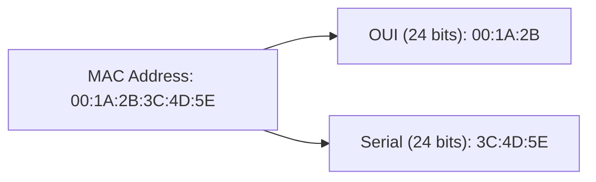

### 4.4.2 Channel Access Protocols

When many devices share the same medium (like a Wi‑Fi channel or Ethernet cable), they need rules to avoid collisions.

#### ALOHA (Pure and Slotted)

**Pure ALOHA**: Devices transmit whenever they have data. If a collision happens, they wait a random time and retransmit. Maximum efficiency = 18.4%.

**Slotted ALOHA**: Time is divided into slots. Devices can only transmit at the start of a slot. This reduces collisions and doubles efficiency to 36.8%.

**Diagram**:

```mermaid
gantt
    title ALOHA Comparison
    dateFormat HH:mm:ss
    axisFormat %H:%M:%S
    section Pure ALOHA
    Station A :a1, 00:00:00, 1s
    Station B :b1, after a1, 0.5s
    Collision :crit, after a1, 0.5s
    section Slotted ALOHA
    Station A :a2, 00:00:00, 1s
    Station B :b2, 00:00:01, 1s
    No collision :done, 00:00:01, 1s
```

#### CSMA/CD (Carrier Sense Multiple Access with Collision Detection)

Used in wired Ethernet. Devices **listen** before talking (Carrier Sense). If the channel is idle, they transmit. If a collision is detected (while transmitting), they stop, send a jam signal, and wait a random time before retransmitting.

**Example**: Two computers on the same Ethernet cable. Both sense idle and transmit at nearly the same time → collision detected → both stop and back off.

**Diagram**:

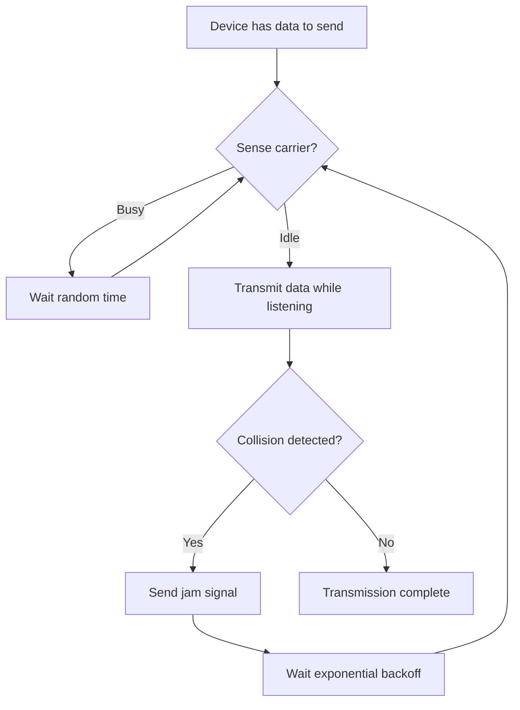

#### CSMA/CA (Collision Avoidance)

Used in wireless networks (Wi‑Fi). Collision detection is impossible because a device cannot listen while transmitting (half‑duplex radio). So CSMA/CA **avoids** collisions using:

- **Request to Send (RTS) / Clear to Send (CTS)** handshake.
- **Network Allocation Vector (NAV)** – a timer that tells others how long the channel will be busy.

**Process**:
1. Sender sends RTS to access point (AP).
2. AP replies with CTS, which all nearby devices hear.
3. Other devices set their NAV and stay silent.
4. Sender transmits data.
5. Receiver sends ACK.

**Example**: Laptop A wants to send to Wi‑Fi router. Laptop B is within range of A but not the router (hidden node problem). A sends RTS → router sends CTS (B hears CTS and defers) → A sends data without collision.

**Diagram**:

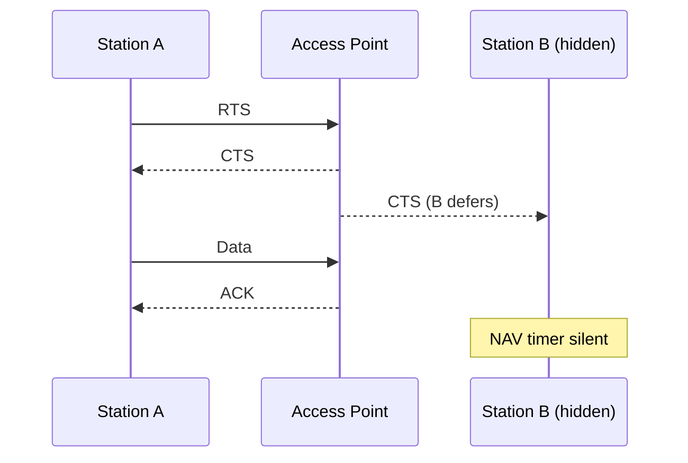

---

## 4.5 Summary Table

| Function / Protocol | Key Idea | Example Use |
|---------------------|----------|--------------|
| Framing | Group bits into frames | Ethernet frame with header/trailer |
| Parity Check | One extra bit for even/odd count | Simple serial links |
| Checksum | Sum of segments, complement | TCP/UDP |
| CRC | Polynomial division | Ethernet, Wi‑Fi |
| Hamming Code | Parity bits at power‑of‑two positions | Memory error correction |
| Stop‑and‑Wait | Send one frame, wait for ACK | Simple modems |
| Sliding Window | Multiple outstanding frames | TCP, HDLC |
| Go‑Back‑N | Retransmit from lost frame onward | Satellite links |
| Selective Repeat | Retransmit only lost frames | Reliable networks |
| CSMA/CD | Listen, then transmit; detect collision | Wired Ethernet |
| CSMA/CA | Avoid collision using RTS/CTS | Wi‑Fi |

This chapter gives you the foundation to understand how data reliably moves across a single link. The next step is to explore how these protocols work together in real networks like Ethernet and Wi‑Fi.
