# Chapter 5: Network Layer

The network layer (Layer 3) is responsible for end-to-end communication across multiple networks. Its main functions are:

- **Logical addressing** – Assigning unique identifiers (IP addresses) to devices.
- **Routing** – Determining the best path from source to destination.
- **Packet forwarding** – Moving packets from an incoming interface to the correct outgoing interface.

Below we explore each topic in depth with practical examples and Mermaid diagrams.

---

## 1. Functions of the Network Layer

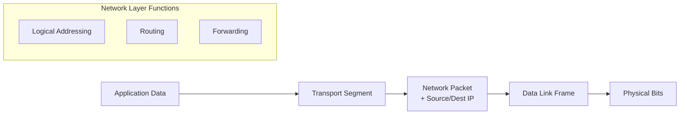

- **Logical addressing** – Every host gets an IP address (e.g., 192.168.1.10). This address is used to identify the source and destination.
- **Routing** – Routers exchange information about network topologies and build routing tables.
- **Forwarding** – When a packet arrives, the router looks up the destination IP in its table and sends it to the next hop.

---

## 2. IP Addressing

### 2.1 IPv4 Address Classes

IPv4 addresses are 32 bits long, usually written as four decimal octets. Originally, addresses were divided into **classes**:

| Class | Leading Bits | Range (First Octet) | Default Mask | Purpose          |
|-------|--------------|---------------------|--------------|------------------|
| A     | 0            | 1 – 126             | 255.0.0.0    | Large networks   |
| B     | 10           | 128 – 191           | 255.255.0.0  | Medium networks  |
| C     | 110          | 192 – 223           | 255.255.255.0| Small networks   |
| D     | 1110         | 224 – 239           | None         | Multicast        |
| E     | 1111         | 240 – 255           | None         | Experimental     |

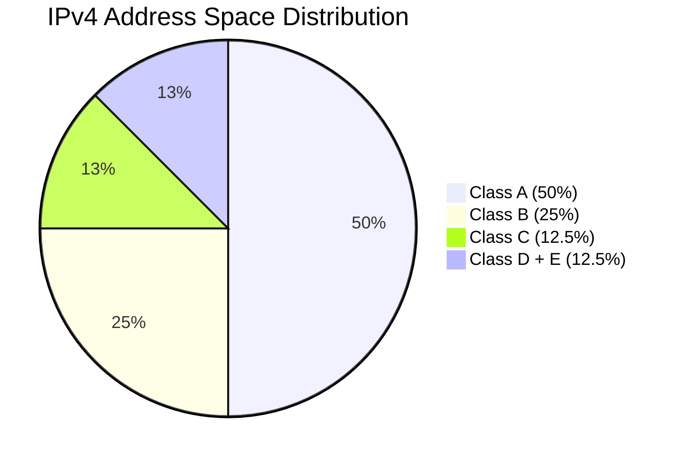

**Example**:  
- 10.0.0.1 is a Class A address (network: 10.0.0.0, host: 0.0.0.1).  
- 172.16.0.1 is Class B (network: 172.16.0.0).  
- 192.168.1.1 is Class C (network: 192.168.1.0).

### 2.2 Subnetting

Subnetting divides a large network into smaller, manageable subnets. It borrows host bits for the network portion.

**Example**:  
Given `192.168.1.0/24` (Class C, 256 addresses). We need 4 subnets with at least 50 hosts each.

- Borrow 2 bits from the host part → new subnet mask = `/26` (255.255.255.192).
- Number of subnets = 2² = 4.  
- Hosts per subnet = 2⁶ – 2 = 62.

| Subnet | Network Address | Usable Range          | Broadcast   |
|--------|----------------|-----------------------|-------------|
| 1      | 192.168.1.0    | 192.168.1.1 – 62      | 192.168.1.63|
| 2      | 192.168.1.64   | 192.168.1.65 – 126    | 192.168.1.127|
| 3      | 192.168.1.128  | 192.168.1.129 – 190   | 192.168.1.191|
| 4      | 192.168.1.192  | 192.168.1.193 – 254   | 192.168.1.255|

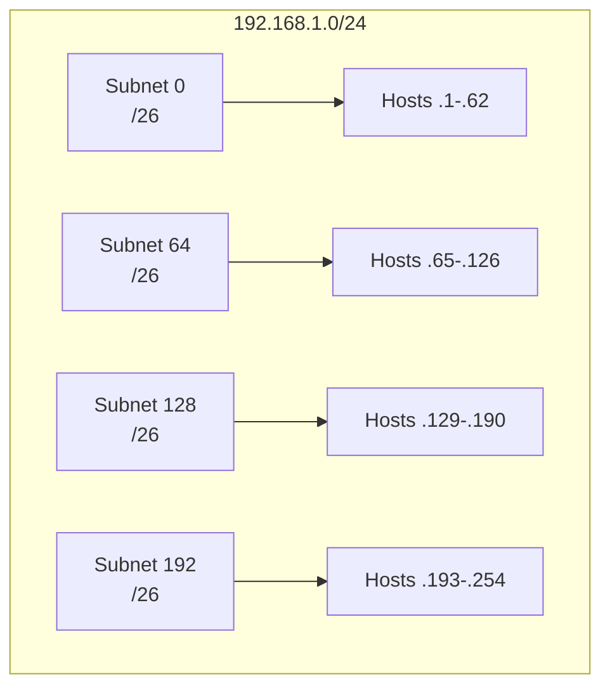

### 2.3 CIDR (Classless Inter‑Domain Routing)

CIDR removes class boundaries. An IP address is written with a prefix length (e.g., `/20`). It allows **supernetting** – aggregating multiple networks into one route.

**Example**:  
Combine `192.168.0.0/24`, `192.168.1.0/24`, `192.168.2.0/24`, `192.168.3.0/24` into `192.168.0.0/22` (because the first 22 bits are common).  
- This reduces routing table entries.

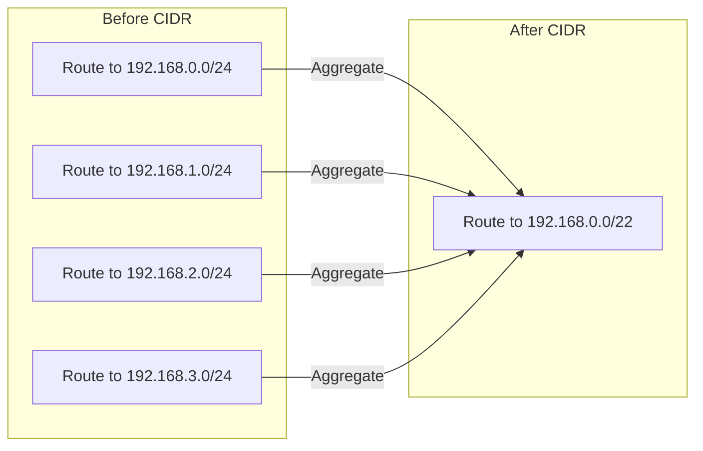

### 2.4 IPv6 Basics

IPv6 uses 128‑bit addresses (written as 8 groups of 4 hex digits). Main features:
- **No broadcast** – uses multicast and anycast.
- **Auto‑configuration** (SLAAC).
- **Simplified header** (no checksum, no fragmentation at routers).
- **Example**: `2001:0db8:85a3:0000:0000:8a2e:0370:7334`

IPv6 address types:
- **Unicast** (single interface)
- **Multicast** (one-to-many)
- **Anycast** (one-to-nearest)

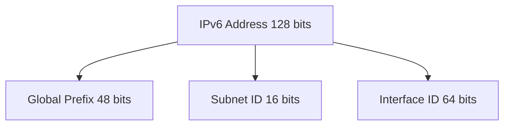

---

## 3. Routing Algorithms

### 3.1 Distance Vector (Bellman‑Ford)

Each router shares its entire routing table with **neighbors** periodically. Metrics like hop count are used.  
**Problem**: Slow convergence, count‑to‑infinity.

**Example**: Three routers A–B–C. Link B–C fails. A thinks it can reach C via B (cost 3), B thinks via A (cost 4) – loop until infinity (set to 16).

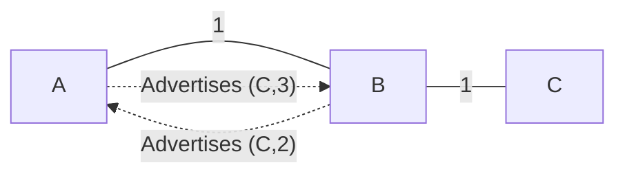

### 3.2 Link State (Dijkstra)

Every router learns the **full topology** and computes shortest paths using Dijkstra. Each router floods Link State Advertisements (LSAs) to all others.  
**Advantage**: Fast convergence, no loops.

**Example network**:

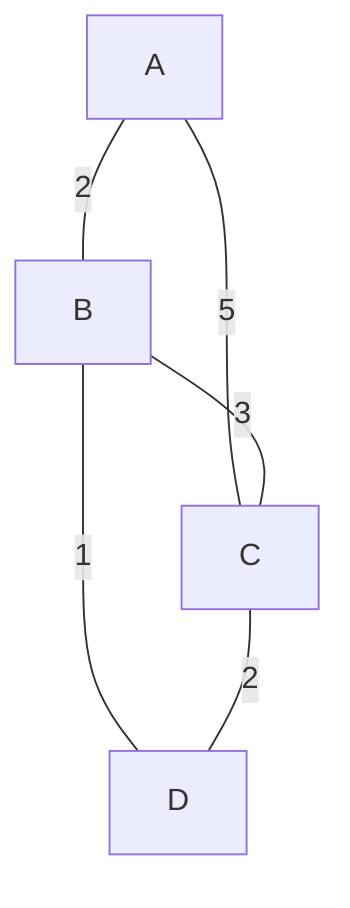

From A, shortest path to D is A–B–D (cost 3). Dijkstra builds a shortest path tree.

### 3.3 Flooding

A router forwards an incoming packet to **every interface except the one it arrived on**. Used in military, OSPF initial LSA propagation, or for robustness.  
**Control mechanisms**: hop count limit, sequence numbers.

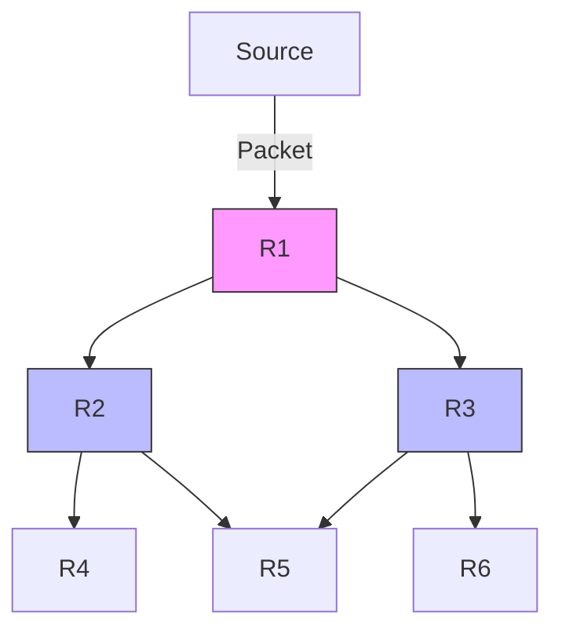

---

## 4. Routing Protocols

### 4.1 RIP (Routing Information Protocol)

- Distance‑vector, uses **hop count** as metric (max 15 hops).
- Updates every 30 seconds.  
- **Example**: RIP route entry: `192.168.5.0/24 via 10.0.0.2, metric 2`.

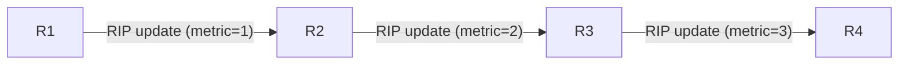

### 4.2 OSPF (Open Shortest Path First)

- Link‑state protocol, uses **cost** (based on bandwidth).
- Hierarchical design: **areas** connected to a backbone (Area 0).
- Faster convergence, supports VLSM/CIDR.

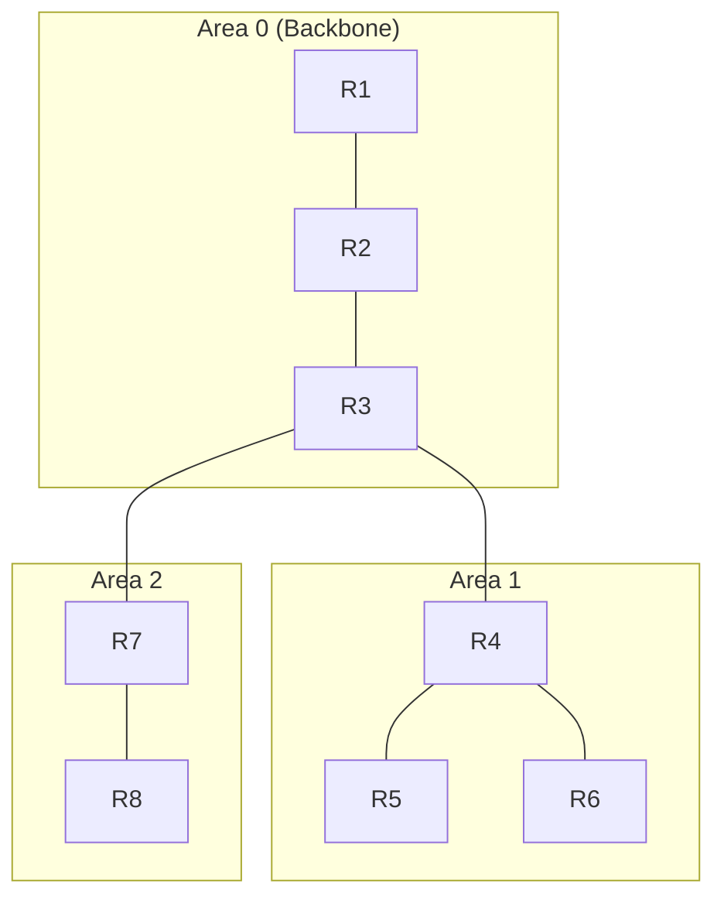

### 4.3 BGP (Border Gateway Protocol) – Basic Idea

- **Path‑vector** protocol used between Autonomous Systems (AS).
- Routes include **AS_PATH** attribute to prevent loops.
- Example: AS 100 advertises `200.1.0.0/16` with path `[100]`. AS 200 receives it, prepends its own AS: `[200, 100]`.

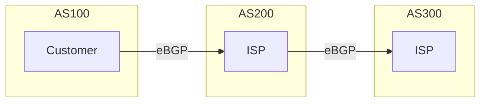

---

## 5. Additional Topics

### 5.1 Fragmentation

When a packet is larger than the MTU (Maximum Transmission Unit) of a link, the router fragments it. IPv4 fragments are reassembled at the **destination**; IPv6 does not allow in‑path fragmentation.

**Example**:  
MTU = 1500 bytes, original packet = 4000 bytes (20 header + 3980 data).  
Three fragments:
- Fragment 1: offset 0, length 1500 (20+1480 data)
- Fragment 2: offset 1480, length 1500 (20+1480 data)
- Fragment 3: offset 2960, length 1020 (20+1000 data)

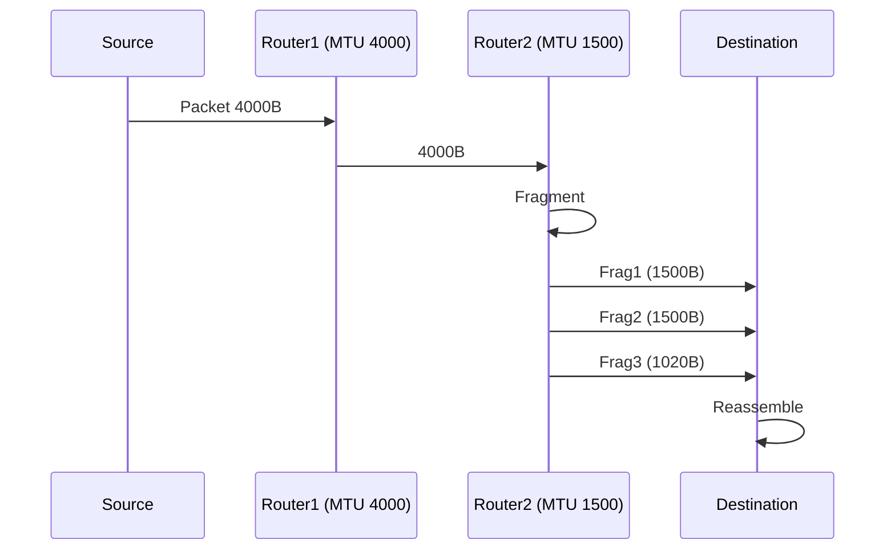

### 5.2 NAT (Network Address Translation)

NAT allows multiple private IP addresses (e.g., 192.168.1.x) to share a single public IP. Common types: **Source NAT** (SNAT) for outbound traffic, **Port Address Translation** (PAT).

**Example**:

| Private IP:Port | Public IP:Port |
|----------------|----------------|
| 192.168.1.10:12345 | 203.0.113.5:50001 |
| 192.168.1.11:80    | 203.0.113.5:50002 |

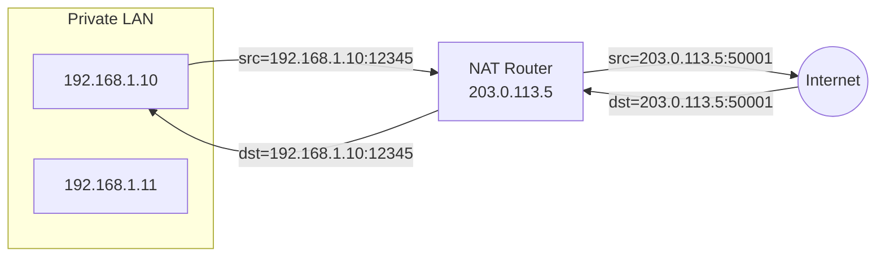

### 5.3 ICMP (Internet Control Message Protocol)

ICMP is used for error reporting and diagnostics. It is encapsulated inside IP.

**Common message types**:
- **Echo request / reply** (ping)
- **Destination unreachable** (e.g., port unreachable, network unreachable)
- **Time exceeded** (used by traceroute)
- **Redirect** (informs host of better gateway)

**Example**: `ping 8.8.8.8` sends an ICMP Echo Request; Google’s server replies with Echo Reply.

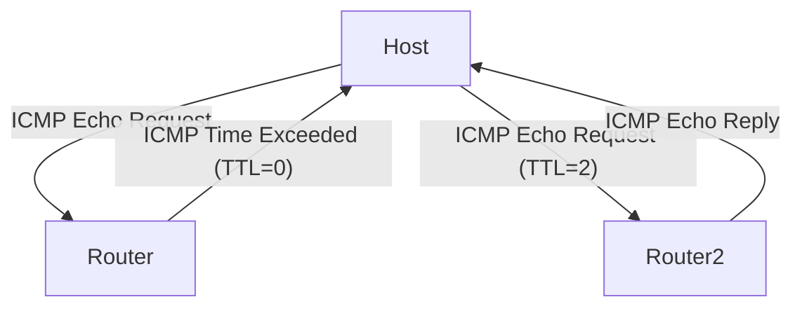

---

## Summary Table

| Topic            | Key Characteristic                     | Example / Use                         |
|------------------|----------------------------------------|---------------------------------------|
| Subnetting       | Borrow host bits for network           | 192.168.1.0/26 → 4 subnets of 62 hosts|
| CIDR             | Aggregate prefixes                     | 192.168.0.0/22 for four /24s          |
| Distance Vector  | Bellman‑Ford, periodic updates         | RIP                                   |
| Link State       | Dijkstra, full topology                | OSPF                                  |
| Flooding         | Send out all ports except incoming     | LSA distribution                      |
| NAT              | Map private ↔ public IPs               | Home router shares one public IP      |
| ICMP             | Error reporting & diagnostics          | ping, traceroute                      |
