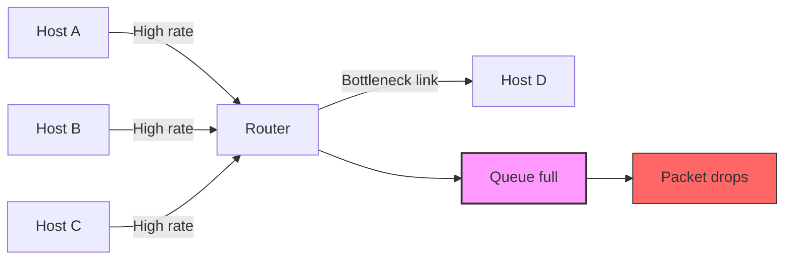
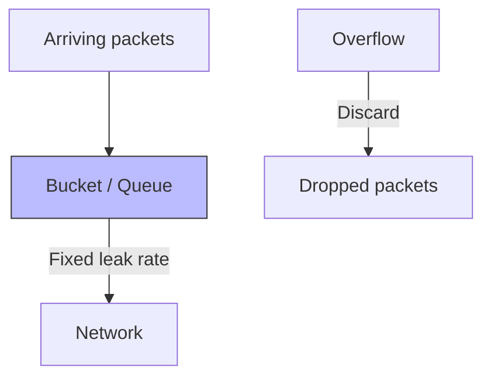
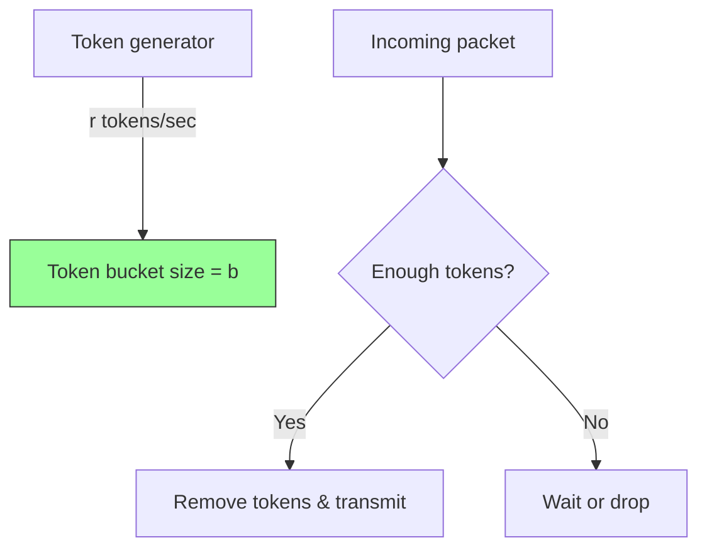
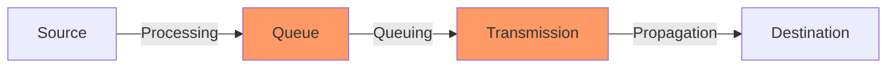
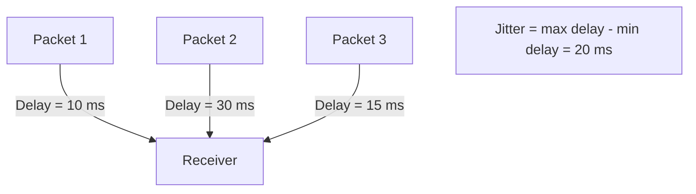
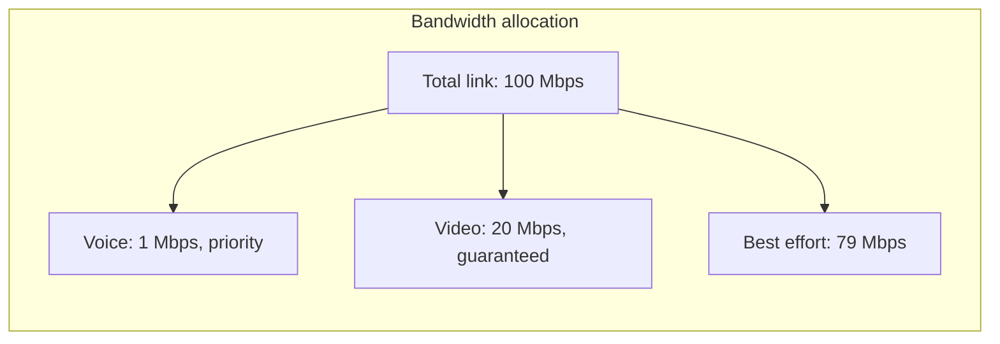

# Chapter 9: Congestion Control and Quality of Service (QoS)

This document provides an overview of congestion control mechanisms, traffic shaping algorithms, and key Quality of Service (QoS) parameters. It includes Mermaid diagrams and practical examples to illustrate these networking concepts.

## Causes of Congestion

Congestion occurs when the demand on network resources exceeds the available capacity. Common causes include:

- **High traffic bursts** – Sudden spikes in data from multiple sources.
- **Insufficient link bandwidth** – Slow links become bottlenecks.
- **Buffer overflow at routers** – Packets are dropped when queues fill up.
- **Slow receiver processing** – Receiver cannot keep up with incoming data.
- **Retransmissions** – Lost packets trigger more traffic, worsening the condition.

### Congestion Scenario

## Traffic Shaping

Traffic shaping controls the rate and burstiness of data transmission to avoid congestion.

### Leaky Bucket

The **Leaky Bucket** algorithm enforces a constant output rate regardless of input bursts. It works like a bucket with a small hole at the bottom.

- Packets arrive at arbitrary rates.
- They are placed into a bucket (queue).
- The bucket leaks (transmits) packets at a fixed rate.
- If the bucket overflows, packets are discarded.

**Example**  
A router is configured with a leaky bucket of size 5 packets and a leak rate of 1 packet/sec. If 10 packets arrive simultaneously, 5 are queued and transmitted one per second, while the other 5 are dropped.

### Token Bucket

The **Token Bucket** allows bursts up to a certain limit while still shaping the average rate. Tokens are added to the bucket at a constant rate. A packet can be transmitted only if enough tokens are available.

- Bucket holds up to `b` tokens (burst size).
- Tokens arrive at rate `r` tokens/sec.
- Each packet consumes `t` tokens (usually 1 token per byte or per packet).
- If bucket is full, new tokens are discarded.

**Example**  
A token bucket with rate `r = 1 Mbps` and bucket size `b = 1 MB`. A file transfer can send up to 1 MB instantly (using saved tokens), then continues at 1 Mbps. This allows bursts for interactive traffic while smoothing long‑term flow.

### Leaky Bucket vs. Token Bucket

| Feature               | Leaky Bucket                     | Token Bucket                     |
|-----------------------|----------------------------------|----------------------------------|
| Output rate           | Strictly constant                | Varies, up to peak burst rate    |
| Burst handling        | No bursts allowed                | Allows bursts (up to bucket size)|
| Long‑term average rate| Fixed leak rate                  | Token generation rate            |
| Packet discard        | On bucket overflow               | No discard (packet waits or is dropped) |

## Quality of Service (QoS)

QoS refers to the ability to provide different priority levels to different traffic types, ensuring predictable performance.

### Delay (Latency)

Delay is the time a packet takes to travel from source to destination. Components include:

- **Processing delay** – Time to check bit errors and header.
- **Queuing delay** – Time waiting in output buffer.
- **Transmission delay** – Time to push bits onto the link.
- **Propagation delay** – Time for signal to travel the medium.

**Example**  
In online gaming, a round‑trip delay (ping) above 100 ms becomes noticeable; above 200 ms the game feels unresponsive.

### Jitter

Jitter is the variation in packet arrival times. High jitter causes problems for real‑time applications (VoIP, video conferencing) because packets are played out at uneven intervals.

**Example**  
A VoIP call with jitter of 50 ms may require a jitter buffer (adds delay) to smooth out playback; otherwise, audio becomes choppy.

### Bandwidth

Bandwidth is the maximum data rate (throughput) of a network path. It is usually measured in bits per second (bps). Different applications have different bandwidth requirements.

| Application       | Required Bandwidth | Sensitivity          |
|-------------------|--------------------|----------------------|
| Email / Web       | < 1 Mbps           | Low (delay tolerant) |
| Video streaming   | 3–25 Mbps          | Medium (needs stable throughput) |
| 4K Video call     | 15–30 Mbps         | High (jitter sensitive) |
| Large file download | 100+ Mbps        | Low (only speed matters) |

## Summary

- **Congestion** arises from oversubscription of resources; shaping and QoS help mitigate it.
- **Leaky bucket** enforces a constant output rate, **token bucket** allows controlled bursts.
- **QoS** parameters (delay, jitter, bandwidth) define performance expectations. Real‑time apps are especially sensitive to jitter and delay.

These mechanisms are implemented in modern networks (e.g., DiffServ, traffic policing, queue management like RED) to ensure fair and predictable communication.