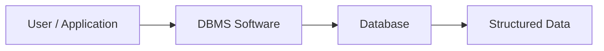
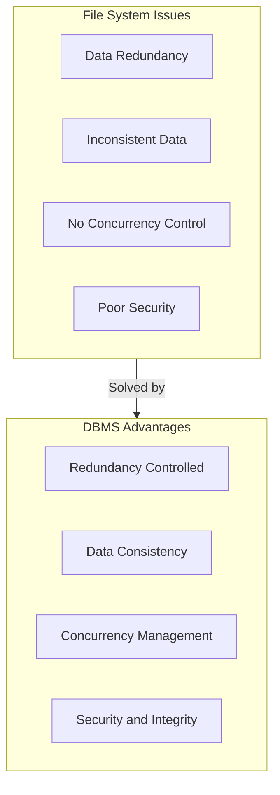
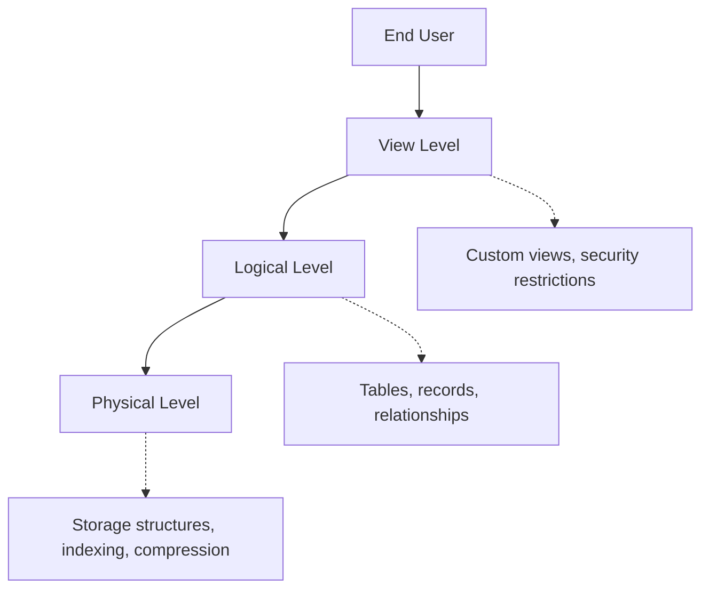
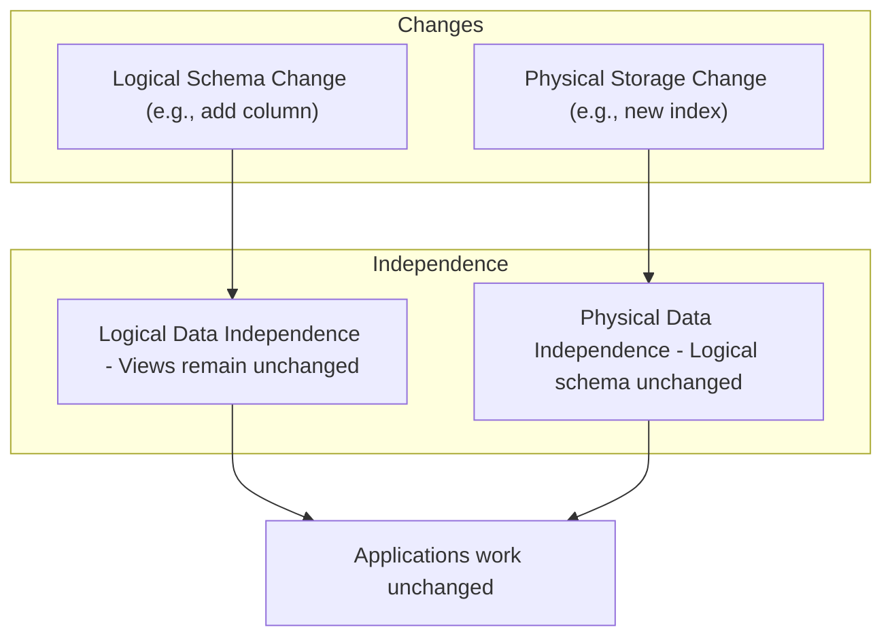
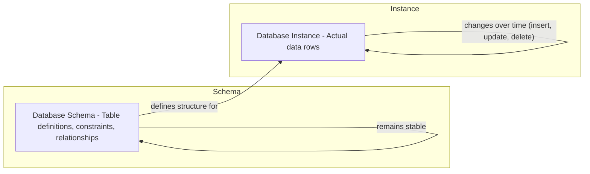
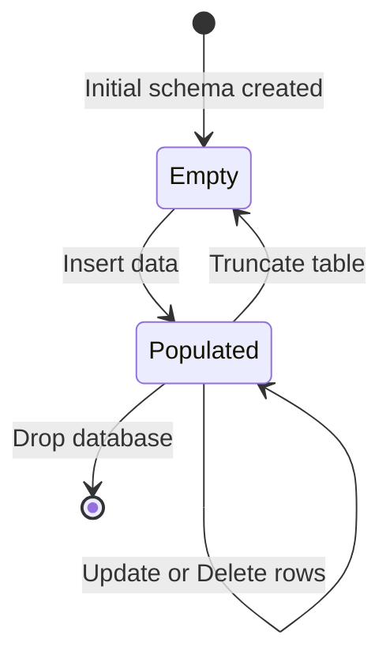

# Chapter 1: Database Fundamentals

## 1. What is DBMS?

A **Database Management System (DBMS)** is software that enables users to define, create, maintain, and control access to databases. It acts as an intermediary between the user/application and the physical data storage.

**Examples**: MySQL, PostgreSQL, Oracle, MongoDB, SQLite.



**Key functions of a DBMS**:
- Data definition (creating tables, constraints)
- Data manipulation (insert, update, delete, query)
- Data security and integrity enforcement
- Concurrent access control
- Backup and recovery

---

## 2. Advantages of DBMS over File System

| Feature | File System | DBMS |
|---------|-------------|------|
| Data redundancy | High (data duplicated) | Controlled, minimal |
| Data inconsistency | Common | Avoided via constraints |
| Data access | Requires custom programs | Standard query language (SQL) |
| Concurrent access | No control, may corrupt | Built‑in concurrency control |
| Security | Limited | User authentication, privileges |
| Backup & recovery | Manual | Automated, consistent |
| Data integrity | Application‑dependent | Enforced by DBMS |



**Detailed explanation**:

- **Redundancy & Inconsistency**: In file systems, the same data may be stored in multiple files (redundancy). Updates in one file may not reflect in others (inconsistency). DBMS normalizes data and uses constraints to eliminate redundancy.
- **Concurrent access**: File systems allow multiple users to read/write same file – leads to lost updates or corrupted data. DBMS uses locking and transactions.
- **Security**: DBMS provides granular access control (user, role, table, column level).
- **Backup & Recovery**: DBMS automatically logs changes and can restore to a consistent state after a crash.

---

## 3. Data Abstraction

Data abstraction hides complex storage details and provides users with a simplified view. It has **three levels**:

| Level | Description | Perspective |
|-------|-------------|-------------|
| **Physical** | How data is actually stored (bits, blocks, indexes, compression) | Low‑level, DBA |
| **Logical** | What data is stored and the relationships (tables, records, data types) | Database designer |
| **View** | Customised data presentation for specific users (subsets, derived columns) | End users / applications |



**Example**: A bank database
- **Physical**: Data stored on disk blocks with B‑tree indexes on account numbers.
- **Logical**: Tables `Customer(custID, name)`, `Account(accNo, custID, balance)`.
- **View**: A teller sees only account balances; a manager sees all customer details.

---

## 4. Data Independence

**Data independence** means changes at one level do not require changes at higher levels.

### 4.1 Logical Data Independence
- **Change**: Logical schema (adding a column, changing data type, merging tables).
- **Unaffected**: External views and application programs.

### 4.2 Physical Data Independence
- **Change**: Physical storage (switching from sequential to indexed file organisation, using different compression, adding indexes).
- **Unaffected**: Logical schema and views.



**Why it matters**:
- Without logical independence, adding a single field would break every application.
- Without physical independence, optimising storage (e.g., adding an index) would require rewriting all queries.

---

## 5. Schema vs Instance

| Term | Definition | Analogy | Change Frequency |
|------|------------|---------|------------------|
| **Schema** | The overall design / blueprint of the database (tables, columns, constraints) | Class definition in OOP | Very rarely (months/years) |
| **Instance** | The actual data stored in the database at a particular moment | Objects of the class | Every insert/update/delete |

**Example** – A `Student` table schema:

```
Student(rollNo: int, name: varchar(20), age: int)
```

An instance (snapshot of data at one moment):

| rollNo | name  | age |
|--------|-------|-----|
| 101    | Alice | 20  |
| 102    | Bob   | 22  |



**State diagram** for instance changes over time:



**Important**:
- A database may have many instances over its lifetime, but only one schema (unless altered).
- Schema evolution (using `ALTER TABLE`) changes the blueprint but preserves existing data as much as possible.

---

## Summary Table

| Concept | Key Point |
|---------|-----------|
| **DBMS** | Software for managing structured data with security, concurrency, and recovery |
| **Advantages over file system** | No redundancy, consistency, concurrency, security, integrity |
| **Data abstraction levels** | Physical (storage), Logical (tables), View (user‑specific) |
| **Data independence** | Logical (schema changes hide from views) & Physical (storage changes hide from schema) |
| **Schema vs Instance** | Schema = blueprint (stable); Instance = actual data (dynamic) |

---