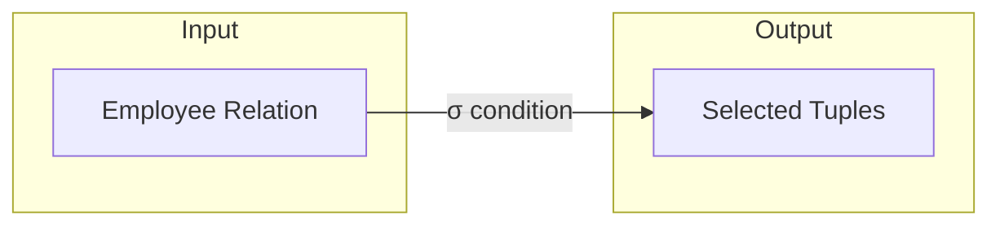
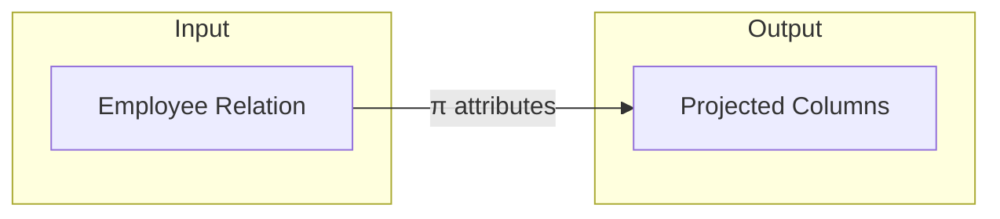
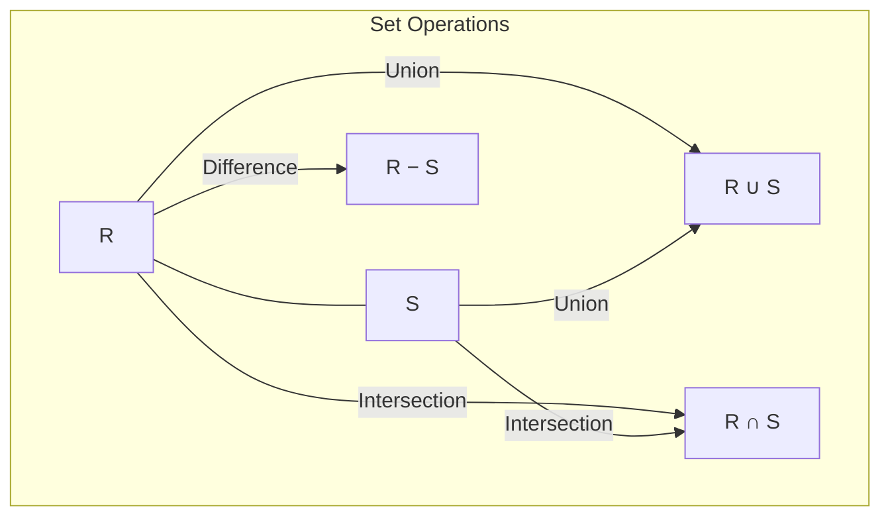
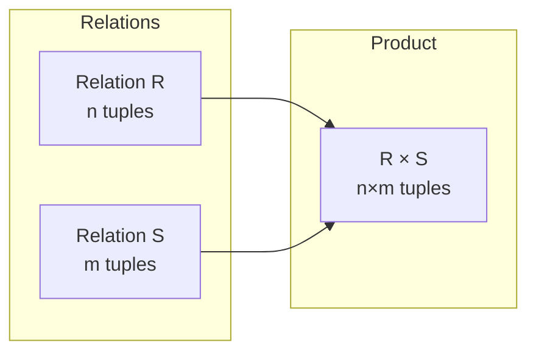
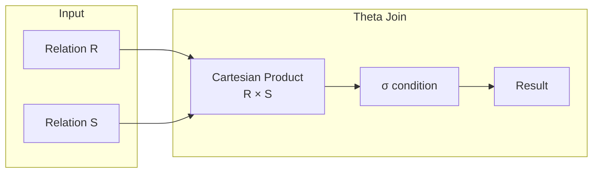
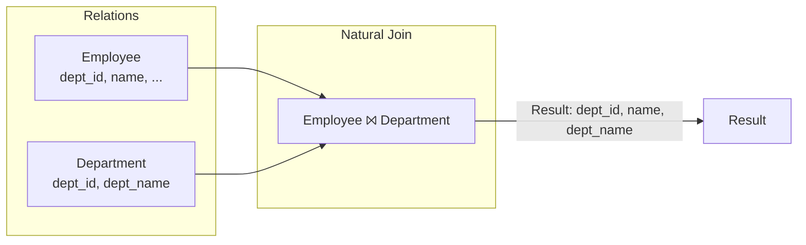
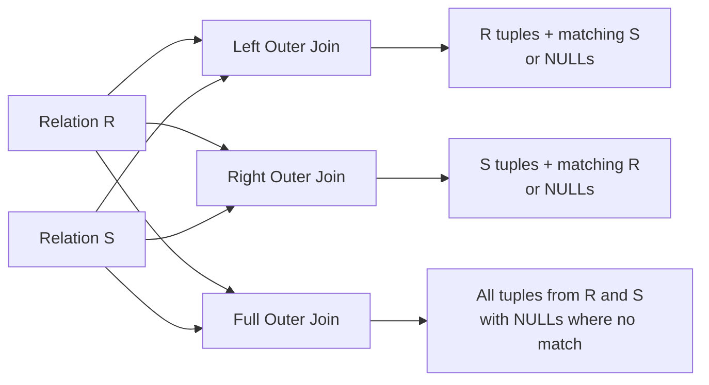
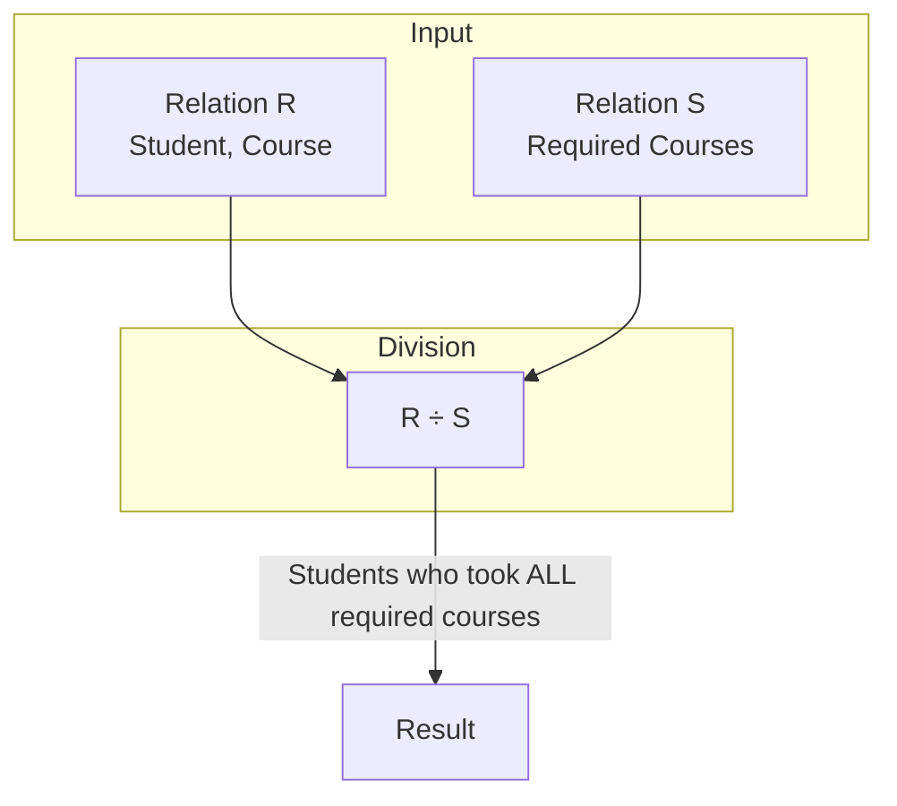

# Chapter 3: Relational Algebra

Relational algebra is a formal query language for the relational data model. It provides a set of operators that take one or two relations as input and produce a new relation as output. The operations are closed under the relational model, meaning the result is always a relation. Relational algebra forms the theoretical foundation for SQL and other relational query languages.

## 3.1 Selection (σ)

The selection operator extracts tuples that satisfy a given predicate from a relation. It is a unary operation denoted by σcondition(R), where R is a relation and condition is a logical expression composed of attributes, constants, comparison operators (=, ≠, <, ≤, >, ≥), and logical connectives (∧, ∨, ¬).

**Example**: σsalary > 50000 ∧ department = 'Sales'(Employee) returns all employees whose salary exceeds 50,000 and who work in the Sales department.

**Diagram**:

**Sample data**:

| emp_id | name    | department | salary |
|--------|---------|------------|--------|
| 101    | Alice   | Sales      | 60000  |
| 102    | Bob     | Sales      | 45000  |
| 103    | Carol   | IT         | 70000  |

σsalary > 50000 ∧ department = 'Sales'(Employee) →  

| emp_id | name    | department | salary |
|--------|---------|------------|--------|
| 101    | Alice   | Sales      | 60000  |

## 3.2 Projection (π)

The projection operator selects a specified subset of attributes from a relation, eliminating duplicate tuples from the result. It is denoted by πA1, A2, …, Ak(R).

**Example**: πname, salary(Employee) returns only name and salary columns.

**Diagram**:

**Sample**:

| name    | salary |
|---------|--------|
| Alice   | 60000  |
| Bob     | 45000  |
| Carol   | 70000  |

## 3.3 Union (∪), Intersection (∩), Difference (−)

These binary set operations require union-compatible relations (same arity and corresponding domains).

- **Union (R ∪ S)**: Tuples in R or S.
- **Intersection (R ∩ S)**: Tuples in both R and S.
- **Difference (R − S)**: Tuples in R but not in S.

**Diagram**:

**Example**: Let R = Sales employees, S = employees with bonus > 5000.

| emp_id | name    | dept    |
|--------|---------|---------|
| 101    | Alice   | Sales   |
| 102    | Bob     | Sales   |
| 104    | David   | Sales   |

| emp_id | name    | bonus   |
|--------|---------|---------|
| 101    | Alice   | 6000    |
| 103    | Carol   | 7000    |

After projecting onto common attributes (emp_id, name):

R ∪ S → Alice, Bob, David, Carol  
R ∩ S → Alice  
R − S → Bob, David

## 3.4 Cartesian Product (×)

R × S combines every tuple of R with every tuple of S. Arity = arity(R) + arity(S), cardinality = |R| × |S|.

**Diagram**:

**Example**: Employee (2 tuples) × Department (2 tuples) yields 4 tuples.

## 3.5 Joins

### 3.5.1 Theta Join (⨝θ)

R ⨝θ S = σθ(R × S). The condition θ may involve any comparison operators.

**Diagram**:

### 3.5.2 Natural Join (⨝)

Natural join equates all attributes with the same name and removes duplicate columns. It is a special case of theta join with equality on common attributes.

**Diagram**:

### 3.5.3 Outer Join

Outer joins preserve non‑matching tuples by padding with NULLs.

- **Left Outer Join (R ⟕ S)**: All tuples from R.
- **Right Outer Join (R ⟖ S)**: All tuples from S.
- **Full Outer Join (R ⟗ S)**: All tuples from both.

**Diagram**:

**Example** (Left Outer Join):

Employee (dept_id may be NULL) ⟕ Department:

| emp_id | name    | dept_id | dept_name |
|--------|---------|---------|------------|
| 101    | Alice   | D1      | Sales      |
| 102    | Bob     | NULL    | NULL       |
| 103    | Carol   | D2      | IT         |

## 3.6 Division Operator (÷)

R ÷ S returns tuples from R (excluding the attributes of S) that are associated with **every** tuple in S. It answers “for all” queries.

**Formal definition**: Given R(A, B) and S(B),  
R ÷ S = { a ∈ πA(R) | ∀ s ∈ S, (a, s) ∈ R }

**Diagram**:

**Example**:  

R (Student, Course):  

| Student | Course    |
|---------|-----------|
| Alice   | Math      |
| Alice   | Physics   |
| Bob     | Math      |
| Carol   | Math      |
| Carol   | Physics   |
| Carol   | Chemistry |

S (Course):  

| Course    |
|-----------|
| Math      |
| Physics   |

R ÷ S → Students who took both Math and Physics:  

| Student |
|---------|
| Alice   |
| Carol   |

## 3.7 Summary

Relational algebra provides a minimal, complete set of operations for manipulating relations. The fundamental operations are selection, projection, Cartesian product, union, and difference. Intersection, joins, and division can be derived from these primitives but are included for convenience. Understanding relational algebra is essential for query optimization and for formally reasoning about database queries.

---