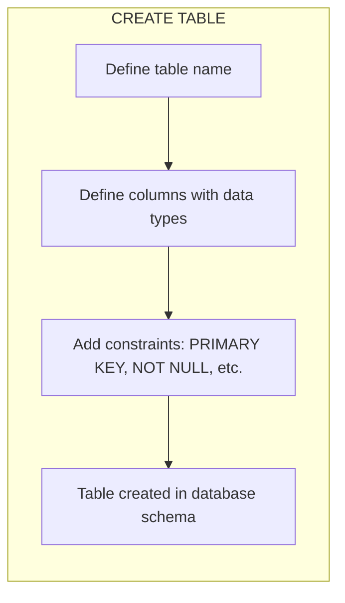
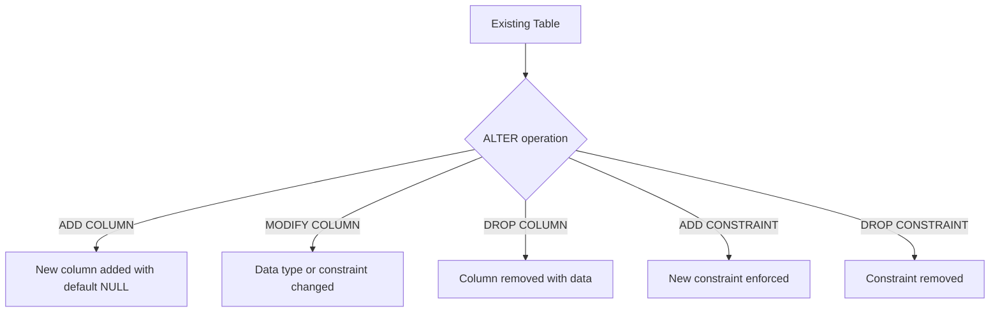
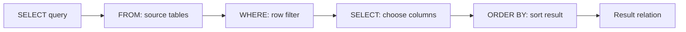
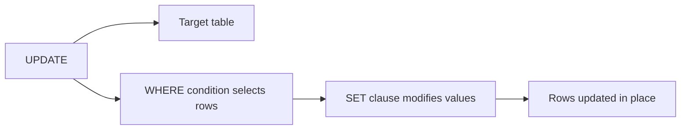
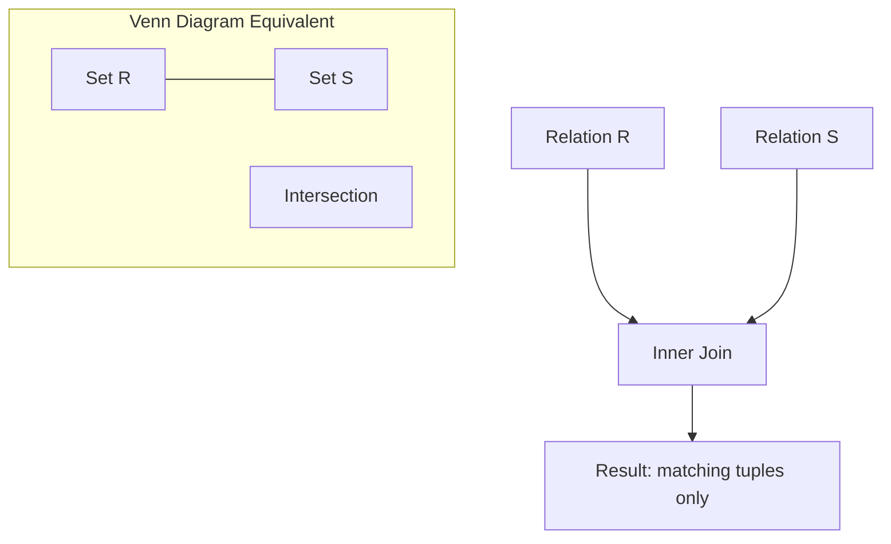
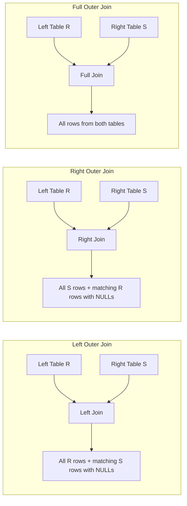
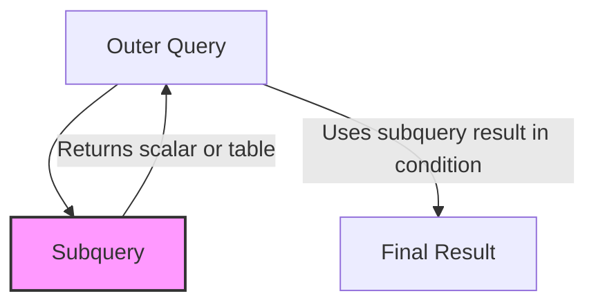
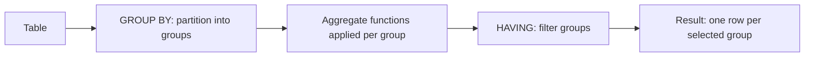
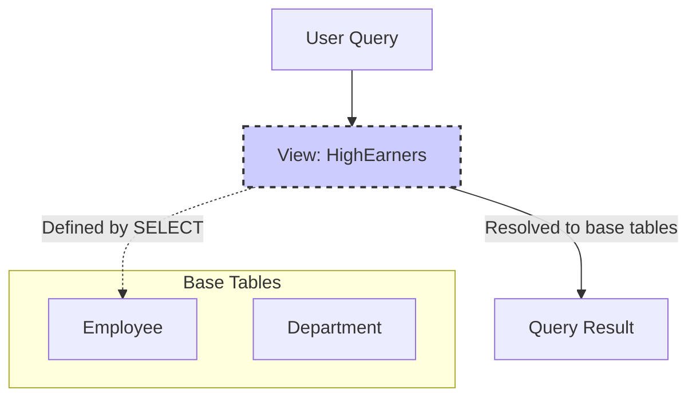
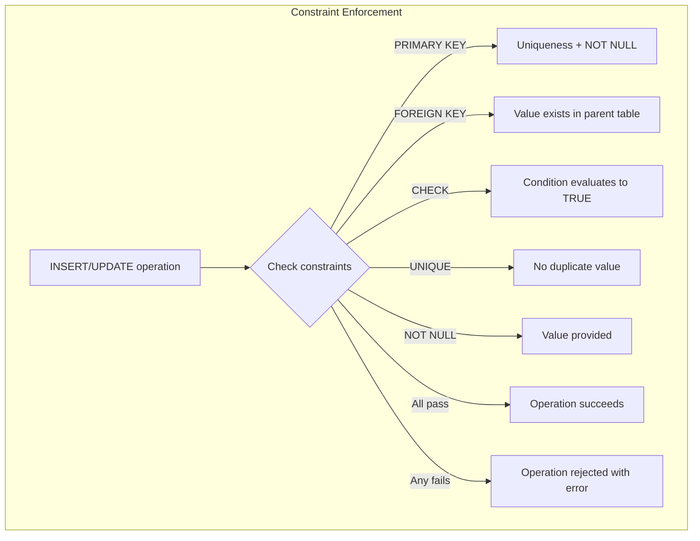

# Chapter 4: Structured Query Language (SQL)

SQL is the standard language for defining, manipulating, and querying relational databases. It comprises several sublanguages: Data Definition Language (DDL) for schema management, Data Manipulation Language (DML) for data operations, and Data Control Language (DCL) for access control. This chapter focuses on DDL and DML, along with advanced query features.

## 4.1 Data Definition Language (DDL)

DDL statements define and modify the database schema. The primary DDL commands are CREATE, ALTER, and DROP.

### 4.1.1 CREATE

The CREATE statement creates databases, tables, indexes, and other objects.

**Syntax for a table**:

```sql
CREATE TABLE table_name (
    column1 datatype constraint,
    column2 datatype constraint,
    ...
    table_constraint
);
```

**Example**:

```sql
CREATE TABLE Employee (
    emp_id INTEGER PRIMARY KEY,
    name VARCHAR(100) NOT NULL,
    department_id INTEGER,
    salary DECIMAL(10,2),
    hire_date DATE
);
```

**Diagram**:



### 4.1.2 ALTER

ALTER modifies an existing table structure: add, drop, or modify columns; add or drop constraints.

**Examples**:

```sql
-- Add a new column
ALTER TABLE Employee ADD email VARCHAR(100);

-- Modify a column data type
ALTER TABLE Employee MODIFY COLUMN salary NUMERIC(12,2);

-- Drop a column
ALTER TABLE Employee DROP COLUMN hire_date;

-- Add a foreign key constraint
ALTER TABLE Employee ADD CONSTRAINT fk_dept 
    FOREIGN KEY (department_id) REFERENCES Department(dept_id);
```

**Diagram**:



### 4.1.3 DROP

DROP removes tables, databases, or other objects entirely.

**Example**:

```sql
DROP TABLE Employee;  -- Removes table and all data
```

**Caution**: DROP is irreversible unless a backup exists. Use TRUNCATE to remove data only while retaining the table structure.

## 4.2 Data Manipulation Language (DML)

DML commands handle data within tables: SELECT (query), INSERT (add), UPDATE (modify), DELETE (remove).

### 4.2.1 SELECT

SELECT retrieves data from one or more tables. Basic form:

```sql
SELECT column1, column2, ...
FROM table_name
WHERE condition
ORDER BY column;
```

**Example**:

```sql
SELECT name, salary
FROM Employee
WHERE department_id = 101
ORDER BY salary DESC;
```

**Diagram**:



### 4.2.2 INSERT

INSERT adds new rows to a table.

**Full row insert**:

```sql
INSERT INTO Employee (emp_id, name, department_id, salary)
VALUES (201, 'John Doe', 101, 55000);
```

**Insert from a query**:

```sql
INSERT INTO HighEarners (emp_id, name, salary)
SELECT emp_id, name, salary FROM Employee WHERE salary > 70000;
```

### 4.2.3 UPDATE

UPDATE modifies existing rows based on a condition.

**Example**:

```sql
UPDATE Employee
SET salary = salary * 1.10
WHERE department_id = 101;
```

**Diagram**:



### 4.2.4 DELETE

DELETE removes rows that satisfy a condition. Without a WHERE clause, all rows are deleted.

**Example**:

```sql
DELETE FROM Employee
WHERE hire_date < '2020-01-01';
```

## 4.3 Joins

Joins combine rows from two or more tables based on a related column. SQL supports inner joins and outer joins (left, right, full).

### 4.3.1 Inner Join

Returns only rows where the join condition matches in both tables.

**Syntax**:

```sql
SELECT columns
FROM table1
INNER JOIN table2 ON table1.key = table2.key;
```

**Example**:

```sql
SELECT Employee.name, Department.dept_name
FROM Employee
INNER JOIN Department ON Employee.dept_id = Department.dept_id;
```

**Diagram**:



### 4.3.2 Outer Joins

- **Left Outer Join**: All rows from the left table; unmatched rows from the right table contain NULLs.
- **Right Outer Join**: All rows from the right table; unmatched rows from the left table contain NULLs.
- **Full Outer Join**: All rows from both tables; NULLs where no match exists.

**Left Outer Join Example**:

```sql
SELECT Employee.name, Department.dept_name
FROM Employee
LEFT OUTER JOIN Department ON Employee.dept_id = Department.dept_id;
```

**Diagram**:



## 4.4 Nested Queries (Subqueries)

A subquery is a query nested inside another SQL statement. Subqueries can appear in SELECT, FROM, WHERE, or HAVING clauses. They may be correlated (reference outer query) or non‑correlated.

**Example: Subquery in WHERE clause**:

```sql
SELECT name, salary
FROM Employee
WHERE salary > (SELECT AVG(salary) FROM Employee);
```

**Example: Correlated subquery** (finds employees earning above average in their own department):

```sql
SELECT e1.name, e1.salary, e1.department_id
FROM Employee e1
WHERE e1.salary > (SELECT AVG(e2.salary)
                   FROM Employee e2
                   WHERE e2.department_id = e1.department_id);
```

**Diagram**:



## 4.5 Aggregation

Aggregate functions (COUNT, SUM, AVG, MIN, MAX) compute summary values. GROUP BY groups rows that share attribute values, and HAVING filters groups.

### 4.5.1 GROUP BY

Groups rows by one or more columns. Aggregate functions apply per group.

**Example**:

```sql
SELECT department_id, COUNT(*) AS num_employees, AVG(salary) AS avg_salary
FROM Employee
GROUP BY department_id;
```

### 4.5.2 HAVING

HAVING filters groups after aggregation, similar to WHERE for rows before grouping.

**Example**:

```sql
SELECT department_id, AVG(salary) AS avg_salary
FROM Employee
GROUP BY department_id
HAVING AVG(salary) > 60000;
```

**Diagram**:



## 4.6 Views

A view is a virtual table defined by a stored query. It does not store data physically but presents a customized perspective of the underlying tables.

**Create a view**:

```sql
CREATE VIEW HighEarners AS
SELECT emp_id, name, salary
FROM Employee
WHERE salary > 70000;
```

**Using a view**:

```sql
SELECT * FROM HighEarners WHERE department_id = 101;
```

**Updateable views**: Some views are updateable (e.g., simple views on a single table without aggregation). Others are read‑only.

**Drop a view**:

```sql
DROP VIEW HighEarners;
```

**Diagram**:



## 4.7 Constraints

Constraints enforce data integrity rules at the table or column level. They are part of DDL but can also be added via ALTER.

| Constraint      | Description |
|----------------|-------------|
| PRIMARY KEY    | Uniquely identifies each row; automatically NOT NULL and unique. |
| FOREIGN KEY    | Enforces referential integrity; values must match a primary key in another table. |
| UNIQUE         | Ensures all values in a column (or combination) are distinct. |
| NOT NULL       | Prevents NULL values. |
| CHECK          | Validates that values satisfy a Boolean expression. |
| DEFAULT        | Provides a default value when none is supplied. |

**Example with multiple constraints**:

```sql
CREATE TABLE Orders (
    order_id INTEGER PRIMARY KEY,
    customer_id INTEGER NOT NULL,
    order_date DATE DEFAULT CURRENT_DATE,
    amount DECIMAL(10,2) CHECK (amount > 0),
    status VARCHAR(20) CHECK (status IN ('Pending', 'Shipped', 'Delivered')),
    FOREIGN KEY (customer_id) REFERENCES Customers(cust_id)
);
```

**Adding a constraint via ALTER**:

```sql
ALTER TABLE Employee ADD CONSTRAINT unique_email UNIQUE (email);
```

**Diagram**:



## 4.8 Summary

SQL provides comprehensive capabilities for defining schema (DDL) and manipulating data (DML). Key constructs include:

- **DDL**: CREATE, ALTER, DROP for tables and constraints.
- **DML**: SELECT, INSERT, UPDATE, DELETE for data.
- **Joins**: Inner, left outer, right outer, full outer.
- **Nested queries**: Subqueries in WHERE, FROM, SELECT clauses.
- **Aggregation**: GROUP BY with HAVING for grouped filtering.
- **Views**: Virtual tables for security and abstraction.
- **Constraints**: Enforce integrity (PRIMARY KEY, FOREIGN KEY, CHECK, UNIQUE, NOT NULL, DEFAULT).

