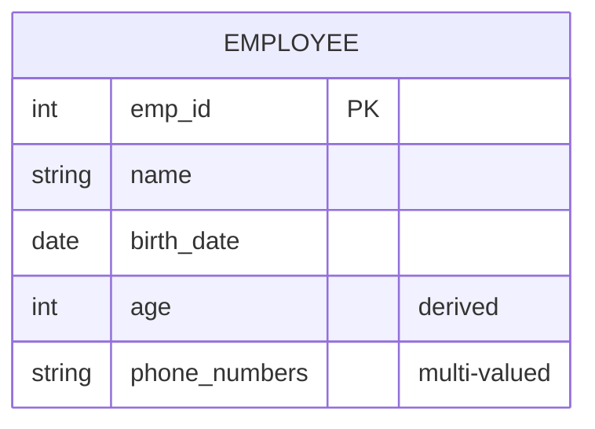
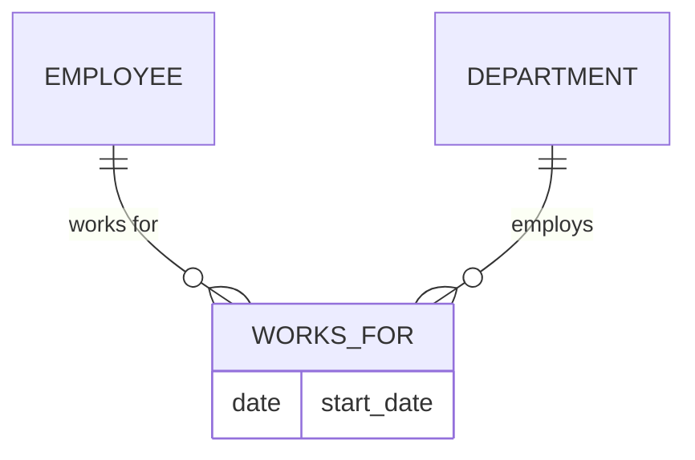
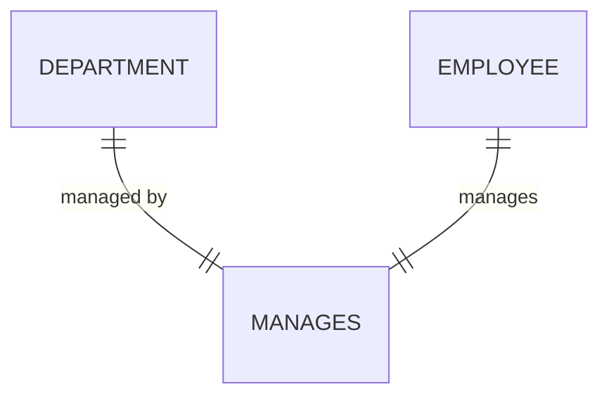
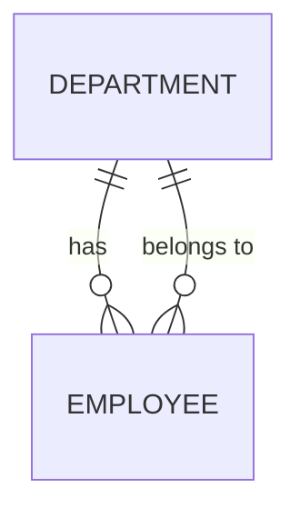
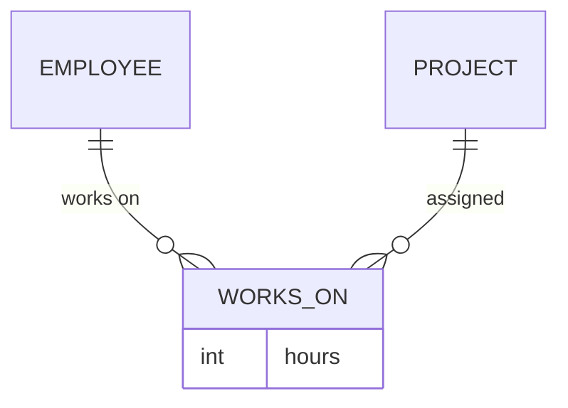
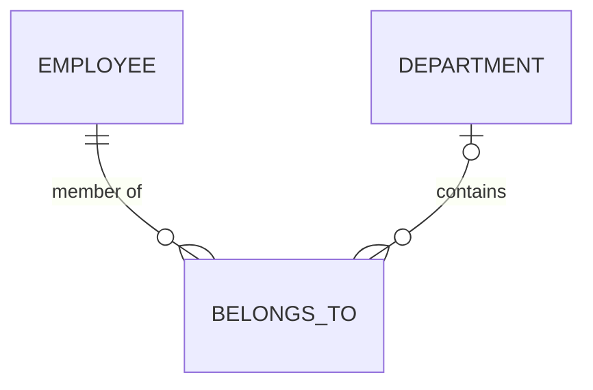
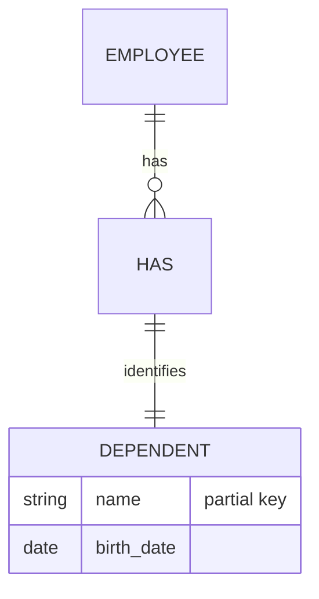
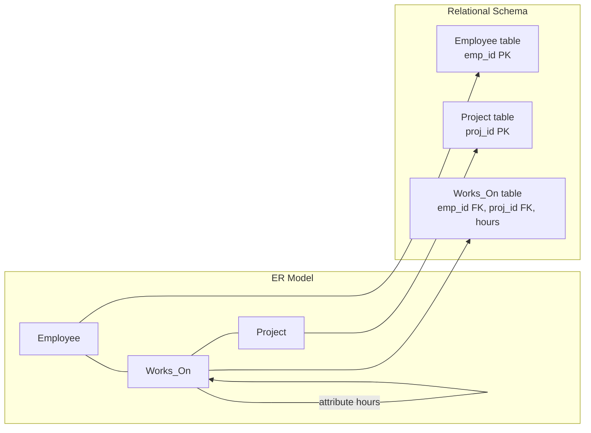

# Chapter 5: Entity-Relationship (ER) Model

The Entity-Relationship model is a high-level conceptual data model used to describe the structure of a database. It provides a graphical notation for representing entities, attributes, and relationships, facilitating communication between database designers and stakeholders. The ER model serves as a blueprint for implementing a relational database.

## 5.1 Entity and Attribute

### 5.1.1 Entity

An entity is a real-world object or concept that is distinguishable from other objects. Entities are represented as rectangles in ER diagrams. A set of entities of the same type is called an entity set.

**Example**: Employee, Department, Project.

### 5.1.2 Attribute

Attributes describe properties of entities. They are represented as ovals connected to their entity. Common attribute types:

- **Simple attribute**: Indivisible (e.g., age, salary).
- **Composite attribute**: Can be subdivided (e.g., address into street, city, zip).
- **Derived attribute**: Computed from other attributes (e.g., age from birth_date).
- **Multi-valued attribute**: May have multiple values (e.g., phone_numbers).

**Diagram**:



**Explanation of notation**:

- **PK** indicates primary key (underlined in traditional ER, here shown as comment).
- Derived attributes are often shown with dashed ovals; multi-valued with double ovals.

## 5.2 Relationship

A relationship is an association among two or more entities. It is represented as a diamond in ER diagrams. The degree of a relationship is the number of participating entity sets (binary, ternary, etc.).

**Example**: Employee **works_for** Department.

**Diagram**:



This shows a binary relationship with an attribute `start_date` on the relationship.

## 5.3 Cardinality

Cardinality specifies the number of instances of one entity that can associate with instances of another entity through a relationship. Common cardinalities: 1:1, 1:N, M:N.

### 5.3.1 One-to-One (1:1)

Each entity in set A is associated with at most one entity in set B, and vice versa.

**Example**: Each department has one manager, and each manager manages exactly one department (assuming managers manage only one department).



### 5.3.2 One-to-Many (1:N)

An entity in A can be associated with many entities in B, but an entity in B is associated with at most one entity in A.

**Example**: A department has many employees, but each employee works for exactly one department.



### 5.3.3 Many-to-Many (M:N)

Entities in A can be associated with many entities in B, and vice versa.

**Example**: Employees work on many projects, and projects have many employees.



**Cardinality notation summary** (using Mermaid's crow's foot notation):

| Symbol | Meaning               |
|--------|-----------------------|
| \|     | exactly one           |
| o      | zero or one           |
| }      | one or more           |
| o{     | zero or more          |

## 5.4 Participation Constraints

Participation constraints specify whether every entity in a set must participate in a relationship.

- **Total participation (mandatory)**: Every entity in the set appears in at least one relationship instance. Represented by a double line.
- **Partial participation (optional)**: Some entities may not participate. Represented by a single line.

**Example**: Every employee must belong to a department (total participation of Employee in `belongs_to`). A department may have no employees (partial participation of Department).



Here, the double line (`||`) next to EMPLOYEE indicates total participation; the single line (`|o`) next to DEPARTMENT indicates partial participation.

## 5.5 Weak Entity

A weak entity is an entity that cannot be uniquely identified by its own attributes alone; it depends on a **identifying relationship** with a **strong entity** (owner). Weak entities are represented as double rectangles. The identifying relationship is shown as a double diamond. The weak entity’s partial key (discriminator) is underlined with a dashed line.

**Example**: A `Dependent` cannot exist without an `Employee`. The combination of employee’s primary key and dependent’s name identifies the dependent.



In traditional ER notation, the weak entity and identifying relationship are drawn with double borders. Mermaid does not directly support double borders, but the concept is explained.

## 5.6 Mapping ER to Relational Schema

The process of converting an ER diagram into a set of relational tables (relations) involves rules for each component.

### 5.6.1 Mapping Strong Entities

Create a relation for each strong entity set. Include all simple attributes as columns. Choose a primary key from the entity’s key attributes.

**Example**: `Employee(emp_id, name, birth_date)` – emp_id as primary key.

### 5.6.2 Mapping Weak Entities

Create a relation for the weak entity. Include its partial key attributes and the primary key of the owner entity as a foreign key. The composite primary key is the combination of the owner’s primary key and the weak entity’s partial key.

**Example**: `Dependent(emp_id, dependent_name, birth_date)` where (emp_id, dependent_name) is the primary key, and emp_id references Employee(emp_id).

### 5.6.3 Mapping Relationships

The mapping depends on cardinality and participation.

**Binary 1:1 Relationship**:
- Choose one entity’s relation and add the other entity’s primary key as a foreign key. Include any relationship attributes.
- Alternatively, create a separate relation for the relationship.

**Binary 1:N Relationship**:
- Add the primary key of the entity on the “1” side as a foreign key in the relation of the entity on the “N” side. Include any relationship attributes.

**Binary M:N Relationship**:
- Create a new relation representing the relationship. Include the primary keys of both participating entities as foreign keys. Their combination forms the primary key. Include any relationship attributes.

**Example**:

ER: Employee (emp_id) – Works_On (hours) – Project (proj_id). Mapping:

```
Employee(emp_id, name, ...)
Project(proj_id, title, ...)
Works_On(emp_id, proj_id, hours)
```

**Diagram of mapping process**:



### 5.6.4 Mapping Multi-valued Attributes

Create a separate relation for each multi-valued attribute. Include the primary key of the owner entity as a foreign key. The primary key is the combination of the owner key and the attribute value.

**Example**: Employee has multi-valued attribute `phone_numbers`. Map to:

```
Employee_Phone(emp_id, phone_number)
```

### 5.6.5 Mapping Composite Attributes

Flatten composite attributes into their constituent simple attributes within the owner’s relation. No separate table is needed.

**Example**: `Address(street, city, zip)` becomes columns `street`, `city`, `zip` in the entity’s table.

### 5.6.6 Mapping Derived Attributes

Derived attributes are not stored in the relational schema. They are computed when needed via queries or views.

### 5.6.7 Complete Mapping Example

**ER Diagram** (conceptual):

Entities: Employee(emp_id, name, birth_date), Department(dept_id, dept_name, budget). Relationship: Employee works_for Department (1:N, total participation of Employee). Multi-valued: Employee has phone_numbers.

**Mapping result**:

```sql
CREATE TABLE Employee (
    emp_id INTEGER PRIMARY KEY,
    name VARCHAR(100),
    birth_date DATE,
    dept_id INTEGER NOT NULL,
    FOREIGN KEY (dept_id) REFERENCES Department(dept_id)
);

CREATE TABLE Department (
    dept_id INTEGER PRIMARY KEY,
    dept_name VARCHAR(100),
    budget DECIMAL(12,2)
);

CREATE TABLE Employee_Phone (
    emp_id INTEGER,
    phone_number VARCHAR(20),
    PRIMARY KEY (emp_id, phone_number),
    FOREIGN KEY (emp_id) REFERENCES Employee(emp_id)
);
```

## 5.7 Summary

The ER model provides a clear, visual way to design databases before implementation. Key concepts:

- **Entities** (strong and weak) and **attributes** (simple, composite, derived, multi-valued).
- **Relationships** with cardinality (1:1, 1:N, M:N) and participation (total/partial).
- **Mapping rules** convert ER diagrams into relational schemas: tables for strong entities, separate tables for M:N relationships and multi-valued attributes, foreign keys for 1:N and 1:1 relationships, and composite primary keys for weak entities.
