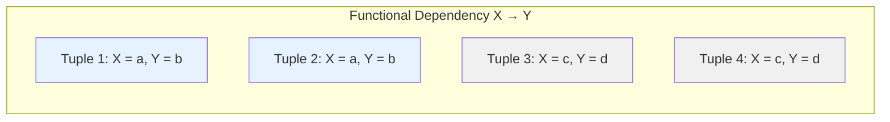
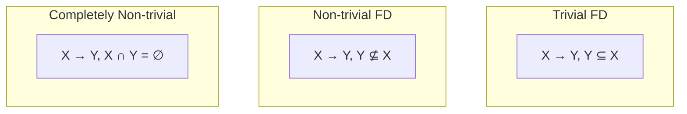
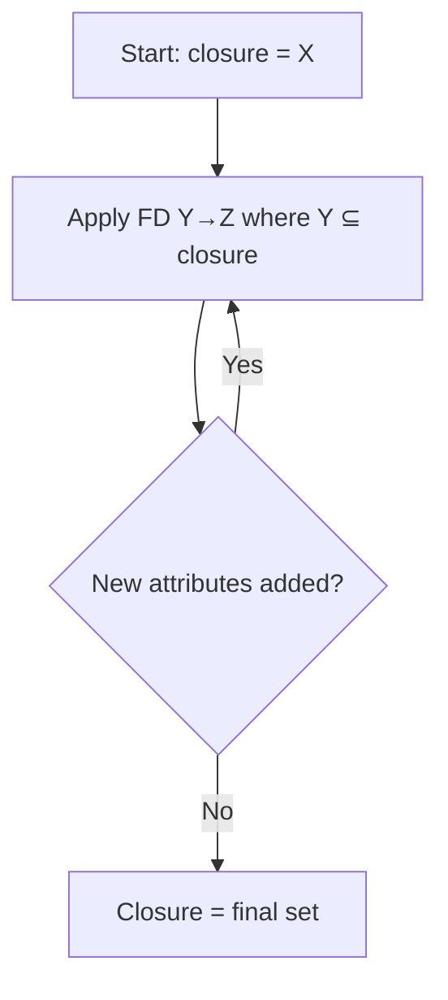
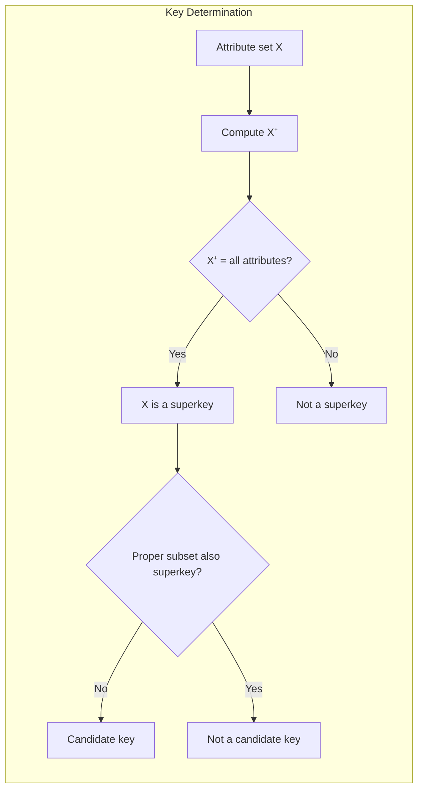
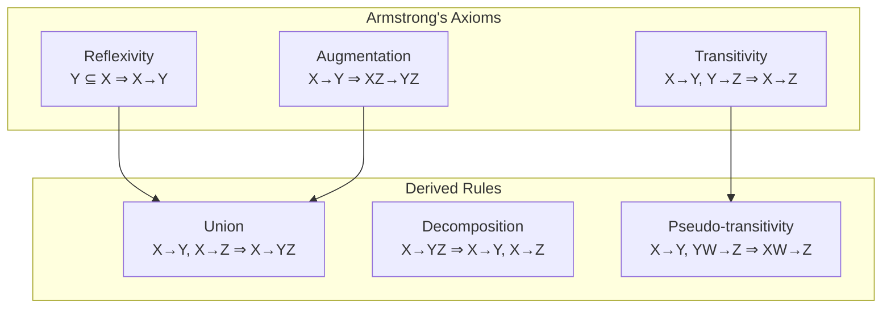

# Chapter 6: Functional Dependencies

Functional dependencies are a fundamental concept in relational database design. They describe constraints between attributes and form the basis for normalization. Understanding functional dependencies helps identify candidate keys, detect redundancy, and guide schema decomposition.

## 6.1 Functional Dependency (FD)

A functional dependency is a constraint between two sets of attributes in a relation. Given a relation R with attribute sets X and Y (subsets of the schema of R), we say that **X functionally determines Y**, denoted **X → Y**, if for every valid instance of R, whenever two tuples agree on all attributes in X, they must also agree on all attributes in Y.

In other words, the value of X uniquely determines the value of Y.

**Example**: In a relation `Employee(emp_id, name, department, salary)`, the dependency `emp_id → name` holds because each employee ID corresponds to exactly one name. Similarly, `emp_id → department` and `emp_id → salary` hold. However, `department → salary` may not hold because multiple employees in the same department can have different salaries.

**Diagram**:

The diagram illustrates that for a given X value, all tuples have the same Y value.

## 6.2 Trivial and Non‑trivial Functional Dependencies

### 6.2.1 Trivial FD

A functional dependency X → Y is **trivial** if Y ⊆ X. It holds for any relation because if two tuples agree on all attributes in X, they automatically agree on any subset of X.

**Examples**:
- `{emp_id, name} → emp_id` (trivial)
- `{emp_id} → emp_id` (trivial)
- `{emp_id, name} → name` (trivial)

Trivial FDs provide no useful information for database design.

### 6.2.2 Non‑trivial FD

An FD X → Y is **non‑trivial** if Y ⊈ X (i.e., at least one attribute in Y is not in X). It is **completely non‑trivial** if X ∩ Y = ∅.

**Examples**:
- `emp_id → name` (non‑trivial, and completely non‑trivial if emp_id and name are disjoint)
- `emp_id, department → salary` (non‑trivial if salary is not part of the left side)

**Diagram**:

## 6.3 Closure of Attributes

The **closure** of a set of attributes X under a set of functional dependencies F, denoted **X⁺**, is the set of all attributes that are functionally determined by X, i.e., all attributes A such that X → A can be derived from F using inference rules.

The closure algorithm:

1. Initialize closure = X.
2. Repeat:
   - For each FD Y → Z in F, if Y ⊆ closure, then add Z to closure.
3. Continue until no more attributes can be added.

**Example**: Let R(A, B, C, D, E, F) and F = {A → B, B → C, AD → E, C → D}. Compute `(A)⁺`.

- Start: closure = {A}
- A → B adds B → closure = {A, B}
- B → C adds C → closure = {A, B, C}
- C → D adds D → closure = {A, B, C, D}
- AD → E: A and D are in closure, so add E → closure = {A, B, C, D, E}
- No more FDs apply. Result: (A)⁺ = {A, B, C, D, E}

**Diagram**:

## 6.4 Finding Keys Using Attribute Closure

A **candidate key** is a minimal set of attributes that functionally determines all attributes of the relation. To determine if a set X is a superkey, compute X⁺. If X⁺ contains all attributes of the relation, then X is a superkey. X is a candidate key if it is a superkey and no proper subset of X is a superkey.

**Algorithm to find all candidate keys** (for small schemas):

1. Start with all single attributes; compute their closures.
2. If a single attribute’s closure contains all attributes, it is a candidate key.
3. Otherwise, consider pairs of attributes, then triples, etc., but only those not containing a previously found candidate key (minimality).
4. Stop when no larger set can be a candidate key (since any superset of a candidate key is a superkey but not minimal).

**Example**: R(A, B, C, D) with F = {A → B, B → C, C → D}. Compute closures:

- (A)⁺ = {A, B, C, D} → A is a candidate key.
- (B)⁺ = {B, C, D} (missing A) → not a superkey.
- (C)⁺ = {C, D} → no.
- (D)⁺ = {D} → no.
- (B, C)⁺ = {B, C, D} → no.
- Since A is already a key, no need to consider sets containing A (they are superkeys but not minimal). Thus only candidate key is A.

**Diagram**:

## 6.5 Armstrong’s Axioms

Armstrong’s axioms are a set of inference rules used to derive all functional dependencies implied by a given set F. They are sound (generate only implied FDs) and complete (can derive all implied FDs).

### 6.5.1 Primary Axioms

1. **Reflexivity**: If Y ⊆ X, then X → Y. (Trivial dependencies)
2. **Augmentation**: If X → Y, then XZ → YZ for any Z. (Adding attributes to both sides preserves dependency)
3. **Transitivity**: If X → Y and Y → Z, then X → Z.

### 6.5.2 Additional Derived Rules

From the primary axioms, we can derive:

- **Union**: If X → Y and X → Z, then X → YZ.
- **Decomposition**: If X → YZ, then X → Y and X → Z.
- **Pseudo‑transitivity**: If X → Y and YW → Z, then XW → Z.

### 6.5.3 Example Proof Using Armstrong’s Axioms

Given F = {A → B, B → C}. Prove A → AC.

1. A → B (given)
2. Augment (1) with A: AA → AB → A → AB (since AA = A)
3. Decompose A → AB to A → A (trivial) and A → B (already have)
4. From A → B and B → C, transitivity gives A → C.
5. Union A → A (trivial) and A → C gives A → AC.

### 6.5.4 Closure of Functional Dependencies (F⁺)

The closure of a set F (denoted F⁺) is the set of all FDs that can be derived from F using Armstrong’s axioms. Computing F⁺ is exponential, but for practical purposes we compute attribute closures to test membership (e.g., whether X → Y ∈ F⁺: check if Y ⊆ X⁺ under F).

**Diagram**:

## 6.6 Summary

Functional dependencies are essential for relational database design and normalization. Key points:

- An FD **X → Y** means that the value of X uniquely determines Y.
- **Trivial FDs** have Y ⊆ X; **non‑trivial FDs** provide useful constraints.
- **Attribute closure (X⁺)** is the set of all attributes determined by X under a given FD set.
- **Keys** are found by checking closures: a candidate key is a minimal superkey.
- **Armstrong’s axioms** (reflexivity, augmentation, transitivity) allow systematic derivation of all implied FDs.
