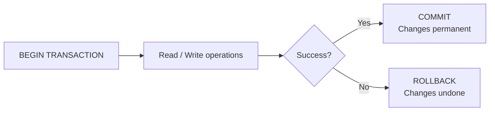
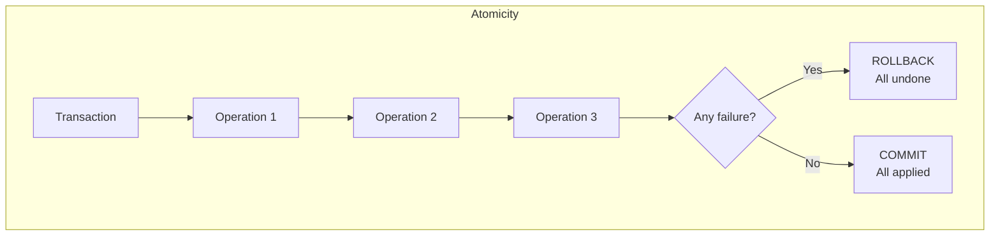
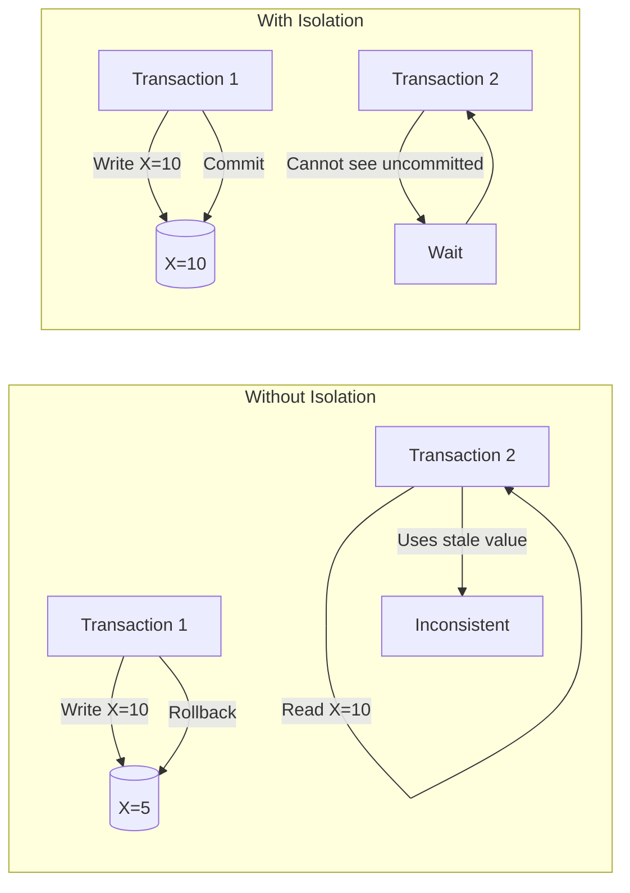
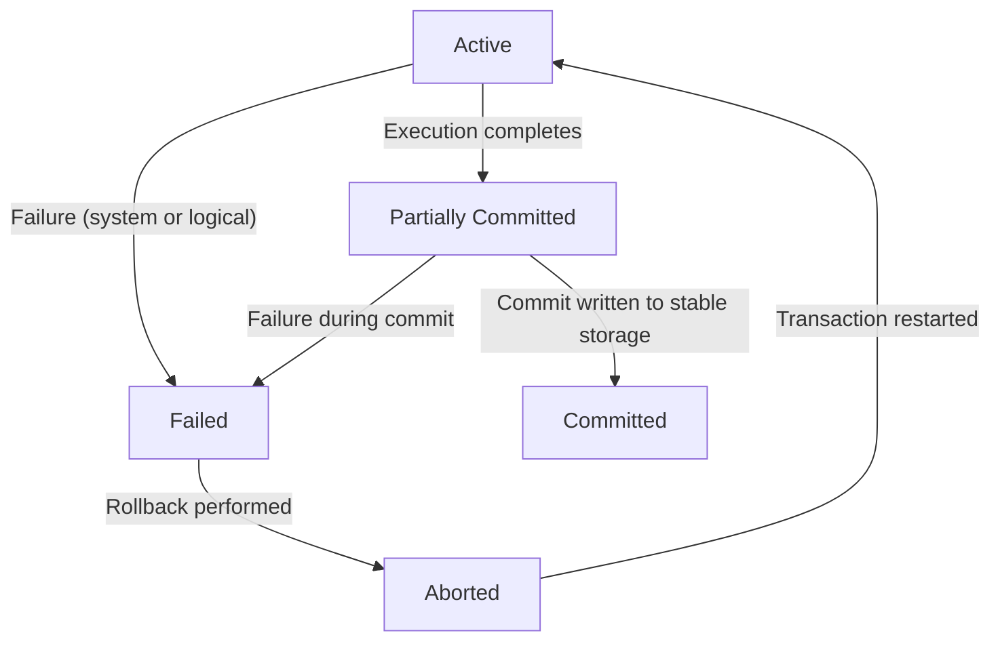

# Chapter 8: Transactions

A transaction is a logical unit of work that consists of one or more database operations (reads, writes, inserts, updates, deletes). Transactions ensure that the database remains in a consistent state even in the presence of concurrent accesses or system failures. This chapter introduces the fundamental concepts of transactions, the ACID properties that guarantee reliability, and the various states a transaction can pass through during its execution.

## 8.1 Transaction Concept

### Definition
A **transaction** is a sequence of operations performed as a single logical unit of work. A transaction must be executed in its entirety or not at all. Typical operations within a transaction include reading data from the database (read) and writing data to the database (write).

### Example
Consider a bank transfer of $100 from account A to account B. This operation consists of two steps:
1. Read balance of A, subtract $100, write new balance to A.
2. Read balance of B, add $100, write new balance to B.

Both steps together form a transaction. If only step 1 executes and then a failure occurs, the database would be inconsistent. Transactions prevent such partial updates.

### Transaction Boundaries
In SQL, transactions are defined using:
- `BEGIN TRANSACTION` (or `START TRANSACTION`) – marks the start.
- `COMMIT` – makes all changes permanent.
- `ROLLBACK` – undoes all changes made since the last commit.

**Diagram**:

## 8.2 ACID Properties

ACID is an acronym for Atomicity, Consistency, Isolation, Durability. These properties guarantee that database transactions are processed reliably.

### 8.2.1 Atomicity

**Definition**: A transaction is an atomic unit of work. Either all of its operations are executed successfully, or none of them are applied. Partial execution is not allowed.

**Mechanism**: The database maintains a log (or write‑ahead log) that records all changes. In case of failure before commit, the log is used to undo (roll back) partial changes.

**Example**: In the bank transfer, if the system crashes after debiting A but before crediting B, atomicity ensures that the debit is also undone.

**Diagram**:

### 8.2.2 Consistency

**Definition**: A transaction transforms the database from one consistent state to another consistent state. Consistency constraints (e.g., foreign keys, unique constraints, check constraints, application‑specific invariants) must be preserved before and after the transaction.

**Example**: In the bank transfer, a consistency constraint might be that the sum of all account balances remains constant. After the transfer, this invariant still holds (total = old total). Also, no account balance becomes negative if sufficient funds exist.

**Note**: Consistency is partly enforced by the database (integrity constraints) and partly by the application logic.

### 8.2.3 Isolation

**Definition**: Transactions executing concurrently appear to be executed serially (one after another). Intermediate states of a transaction are not visible to other transactions. This prevents issues such as dirty reads, non‑repeatable reads, and phantom reads.

**Levels of Isolation** (from weakest to strongest):
- Read Uncommitted
- Read Committed
- Repeatable Read
- Serializable

**Example**: If two concurrent transfers try to update the same account, isolation ensures that the final result is as if one transfer happened after the other, not an interleaved mixture that could lose updates.

**Diagram**:

### 8.2.4 Durability

**Definition**: Once a transaction has been committed, its changes persist permanently, even in the event of a system failure (power loss, crash, etc.). The database ensures that committed updates are stored on non‑volatile storage (e.g., disk).

**Mechanism**: Write‑ahead logging ensures that before a transaction is committed, all its log records are flushed to disk. On recovery, the log is replayed to redo committed transactions.

**Example**: After the bank transfer commits, even if the database crashes immediately, the new balances are preserved.

### Summary Table of ACID

| Property  | Guarantee                                          | Enforced by                          |
|-----------|----------------------------------------------------|--------------------------------------|
| Atomicity | All or nothing execution                           | Transaction log + recovery manager   |
| Consistency | Preserves database invariants                     | Application + DB constraints         |
| Isolation | Concurrent transactions appear serial              | Concurrency control (locking, MVCC)  |
| Durability | Committed changes survive failures                | Logging + checkpointing              |

## 8.3 Transaction States

A transaction passes through several states during its lifetime. The state diagram captures the possible transitions.

### State Definitions

1. **Active**: The initial state. The transaction is executing its read/write operations. It remains active until the last operation is reached.
2. **Partially Committed**: After the final operation is executed, but before the commit decision is made permanent. The transaction has completed its work, but changes may still be in memory buffers.
3. **Committed**: After successful commit and all changes have been permanently written to disk. The transaction is complete.
4. **Failed**: If the transaction cannot complete normally (e.g., due to a system error, constraint violation, or user rollback), it enters the failed state.
5. **Aborted**: After the failed state, the transaction is rolled back (undo operations). The database is restored to the state before the transaction began. The aborted transaction may be restarted later.

### State Transition Diagram

### Explanation of Transitions

- **Active → Partially Committed**: Occurs when the transaction executes its last operation.
- **Active → Failed**: Occurs if the transaction cannot continue due to hardware failure, software bug, deadlock, or constraint violation.
- **Partially Committed → Committed**: After all log records are forced to disk and the commit record is written.
- **Partially Committed → Failed**: If the system crashes while writing the commit record.
- **Failed → Aborted**: The recovery manager performs a rollback, undoing all changes made by the transaction.
- **Aborted → Active**: The transaction can be restarted (e.g., by the application) after the cause of failure is resolved.

### Example Timeline

Consider a transaction that updates two accounts:

1. **Active**: Begin; read A, write A; read B, write B (last operation).
2. **Partially Committed**: Last operation done, but changes not yet forced to disk.
3. **Committed**: Log buffer flushed; commit record written. Transaction ends.

If a power failure occurs before the commit record is written, the transaction goes to Failed and then Aborted after recovery.

### System Log and State Recovery

The log contains records: `<START T>`, `<WRITE T, X, old_value, new_value>`, `<COMMIT T>`, `<ABORT T>`. On restart:
- Transactions with `<START>` but no `<COMMIT>` are undone (aborted).
- Transactions with `<COMMIT>` are redone (if necessary) for durability.

## 8.4 Summary

Transactions are fundamental to reliable database systems. The key concepts are:

- **Transaction**: A logical unit of work with atomic execution.
- **ACID properties**:
  - Atomicity: All or nothing.
  - Consistency: Preserves database invariants.
  - Isolation: Concurrent execution appears serial.
  - Durability: Committed changes survive failures.
- **Transaction states**: Active → Partially Committed → Committed (normal path), or Active → Failed → Aborted (failure path), with possible restart.

