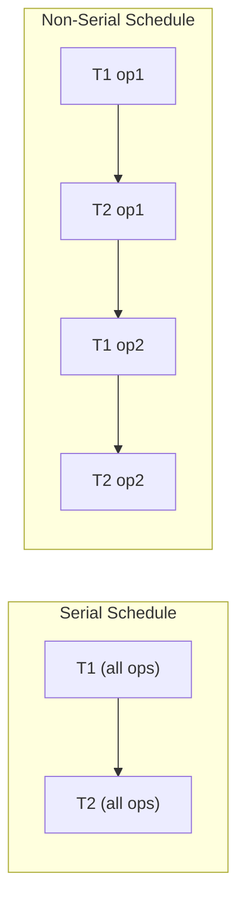
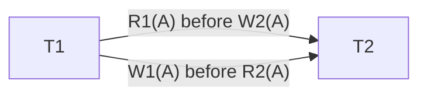
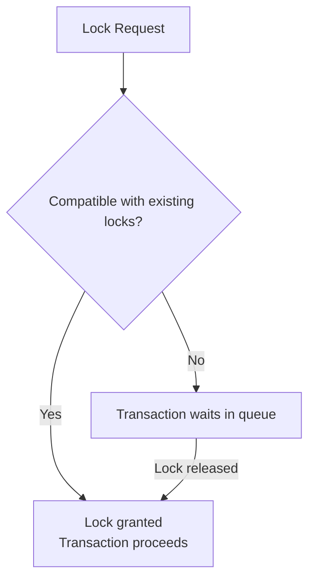
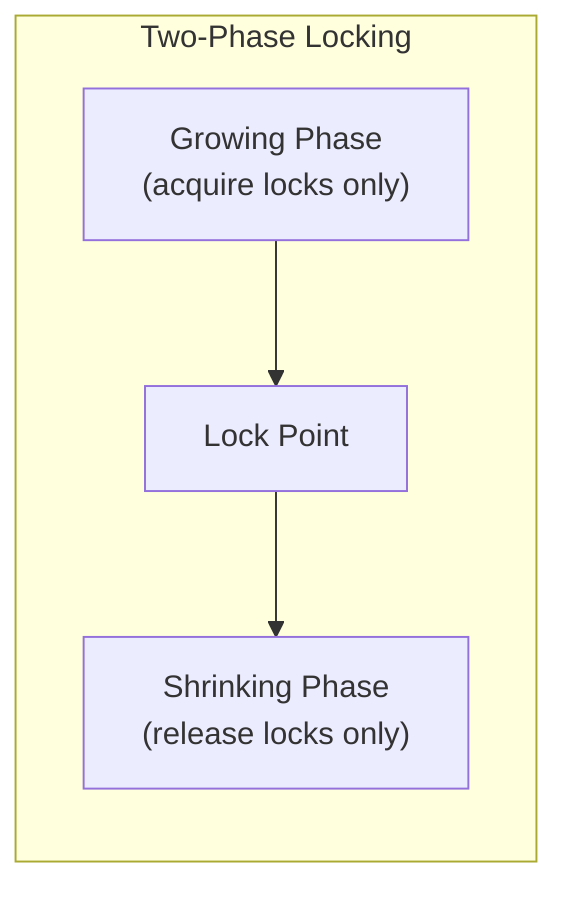
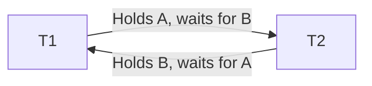
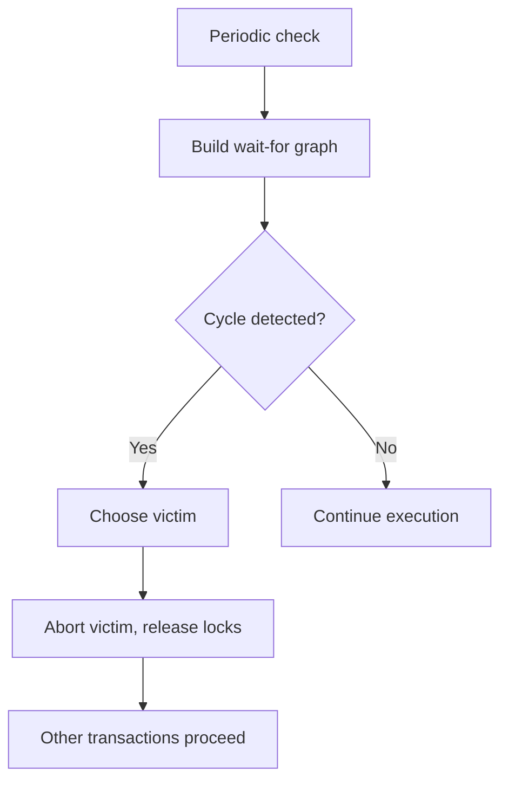

# Chapter 9: Concurrency Control

Concurrency control manages simultaneous execution of transactions to ensure database consistency and isolation. Without proper concurrency control, interleaved operations can lead to anomalies such as lost updates, dirty reads, and inconsistent retrievals. This chapter introduces schedules, serializability, locking protocols, two‑phase locking, and deadlock handling.

## 9.1 Schedules

A **schedule** is the order in which operations of multiple transactions are executed. Operations include read (R), write (W), commit (C), and abort (A).

### 9.1.1 Serial Schedule

A schedule is **serial** if the operations of one transaction are executed consecutively without interleaving with operations of other transactions. Serial schedules always maintain consistency, but they limit concurrency.

**Example**: Transactions T1 and T2.

Serial schedule S1: T1 then T2

| Time | T1      | T2      |
|------|---------|---------|
| 1    | R(A)    |         |
| 2    | W(A)    |         |
| 3    | R(B)    |         |
| 4    | W(B)    |         |
| 5    | Commit  |         |
| 6    |         | R(A)    |
| 7    |         | W(A)    |
| 8    |         | Commit  |

### 9.1.2 Non‑Serial Schedule

A **non‑serial** schedule interleaves operations from multiple transactions. Such schedules may be correct (if they are equivalent to some serial schedule) or incorrect (if they lead to anomalies).

**Example**: Interleaved schedule

| Time | T1      | T2      |
|------|---------|---------|
| 1    | R(A)    |         |
| 2    |         | R(A)    |
| 3    | W(A)    |         |
| 4    |         | W(A)    |
| 5    | Commit  |         |
| 6    |         | Commit  |

This schedule may produce a lost update.

**Diagram**:

## 9.2 Serializability

A schedule is **serializable** if its effect on the database is equivalent to some serial schedule. Serializability is the standard correctness criterion for concurrent transactions. Two main types: conflict serializability and view serializability.

### 9.2.1 Conflict Serializability

Two operations **conflict** if they belong to different transactions, access the same data item, and at least one of them is a write. Conflict pairs: R‑W, W‑R, W‑W.

A schedule is **conflict serializable** if it can be transformed into a serial schedule by swapping adjacent non‑conflicting operations (i.e., operations that do not conflict). The **precedence graph** is used to test conflict serializability:
- Nodes: transactions.
- Edge Ti → Tj if an operation of Ti conflicts with and precedes an operation of Tj.
- If the graph is acyclic, the schedule is conflict serializable. The topological order gives a serial schedule.

**Example**: Schedule with T1: R(A), W(A); T2: R(A), W(A). Conflicts: R1(A) before W2(A) gives edge T1→T2; W1(A) before R2(A) gives T1→T2; etc. Acyclic → conflict serializable.

**Precedence Graph Diagram**:

### 9.2.2 View Serializability

View serializability is less restrictive than conflict serializability. A schedule is **view serializable** if it is view‑equivalent to a serial schedule. Two schedules are view‑equivalent if:
1. For each data item X, the initial read operations read from the same initial database state.
2. For each data item X, the write‑read dependencies (i.e., which transaction writes X that is later read) are the same.
3. The final write operations on X are performed by the same transaction.

Every conflict‑serializable schedule is view‑serializable, but not vice versa. Testing view serializability is NP‑complete, so practical concurrency control (e.g., 2PL) uses conflict serializability.

**Example of view serializable but not conflict serializable**:
T1: R(A), W(A); T2: W(A); T3: W(A). A schedule with no conflicts but same initial/final writes.

## 9.3 Lock‑Based Protocols

Locks are the most common mechanism for enforcing serializability. A transaction must acquire a lock before accessing a data item and release it afterward.

### Lock Types
- **Shared lock (S)**: For read operations. Multiple transactions can hold shared locks on the same item simultaneously.
- **Exclusive lock (X)**: For write operations. Only one transaction can hold an exclusive lock; no other lock (shared or exclusive) can coexist.

### Lock Compatibility Matrix

|         | Shared (S) | Exclusive (X) |
|---------|------------|----------------|
| Shared (S)  | Yes        | No             |
| Exclusive (X) | No        | No             |

### Lock Manager
The lock manager grants or denies lock requests. If a lock cannot be granted, the requesting transaction is blocked until the lock becomes available (waiting queue).

**Diagram**:

### Basic Locking Protocol
A transaction must:
- Acquire a shared lock before reading an item.
- Acquire an exclusive lock before writing an item.
- Release locks after use.

However, basic locking does not guarantee serializability because lock release can occur early, leading to cascading aborts or non‑serializable schedules.

## 9.4 Two‑Phase Locking (2PL)

Two‑phase locking is a concurrency control protocol that guarantees conflict serializability. It defines two phases:

1. **Growing phase**: Transaction acquires locks but cannot release any lock.
2. **Shrinking phase**: Transaction releases locks but cannot acquire any new lock.

The point where a transaction transitions from growing to shrinking is called the **lock point**.

### Strict 2PL
A stricter variant: exclusive locks are held until commit (or abort). This prevents cascading aborts and ensures recoverability. Most DBMS implement strict 2PL.

**Diagram**:

### Example
Transaction T1: Lock‑X(A), read(A), write(A), Lock‑S(B), read(B), unlock(A), unlock(B). This violates 2PL because it releases A before acquiring B (releasing in growing phase). Correct: acquire all locks before any release.

### Properties of 2PL
- **Guarantees conflict serializability**.
- May cause deadlocks.
- Does not guarantee freedom from cascading aborts unless strict 2PL is used.
- Prevents unrepeatable reads and dirty writes.

## 9.5 Deadlocks

A **deadlock** occurs when two or more transactions are each waiting for a lock held by another, resulting in indefinite waiting.

**Example**:
- T1 holds lock on A, requests lock on B.
- T2 holds lock on B, requests lock on A.

Neither can proceed.

**Diagram**:

### 9.5.1 Deadlock Detection

Deadlocks are detected by constructing a **wait‑for graph** (WFG):
- Nodes: transactions.
- Edge Ti → Tj if Ti is waiting for a lock held by Tj.
- A cycle indicates a deadlock.

The system periodically checks the WFG. When a deadlock is detected, one transaction (victim) is aborted (rolled back) to break the cycle.

**Algorithm**:
1. Build WFG.
2. If cycle exists, select victim (e.g., youngest, least work done, lowest priority).
3. Abort victim, release its locks, restart it later.

**Diagram**:

### 9.5.2 Deadlock Prevention

Prevention ensures that deadlocks never occur by imposing rules on lock acquisition. Common prevention schemes:

- **Lock ordering (partial order)**: All transactions acquire locks in a global order (e.g., by data item address). If a transaction needs a lock on a later item, it must release all earlier locks and restart. This is conservative but deadlock‑free.

- **Wait‑die (non‑preemptive)**: Each transaction is assigned a timestamp (older = smaller). If T1 requests a lock held by T2:
  - If T1 is older (smaller timestamp) than T2, T1 waits.
  - If T1 is younger, T1 dies (aborts and restarts with same timestamp).

- **Wound‑wait (preemptive)**: 
  - If T1 is older than T2, T1 wounds T2 (T2 aborts and restarts).
  - If T1 is younger, T1 waits.

**Comparison table**:

| Scheme    | Older request lock held by younger | Younger request lock held by older |
|-----------|-------------------------------------|-------------------------------------|
| Wait‑die  | Wait                                | Die (abort)                         |
| Wound‑wait| Wound (abort younger)               | Wait                                |

### Timeout‑Based Prevention
A transaction waits only for a specified time. If timeout expires, the transaction aborts and restarts. Simple but may cause unnecessary restarts.

## 9.6 Summary

Concurrency control ensures serializable execution of concurrent transactions. Key concepts:

- **Schedules**: Serial (no interleaving) and non‑serial (interleaved).
- **Serializability**: Conflict serializability (tested via precedence graph) and view serializability (more general but harder).
- **Lock‑based protocols**: Shared/exclusive locks; compatibility matrix.
- **Two‑phase locking (2PL)**: Growing and shrinking phases; guarantees conflict serializability; strict 2PL prevents cascading aborts.
- **Deadlocks**:
  - Detection via wait‑for graph; victim selection and abort.
  - Prevention via lock ordering, wait‑die, wound‑wait, or timeouts.

These mechanisms are implemented in all major database systems to support concurrent transaction processing while maintaining data integrity.
