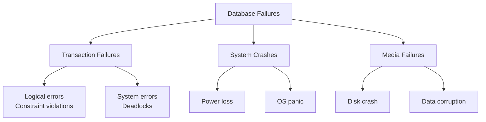
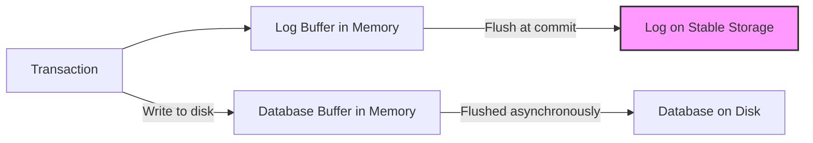
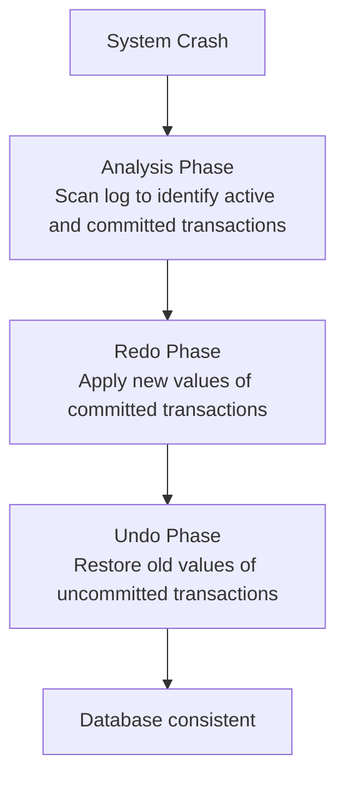
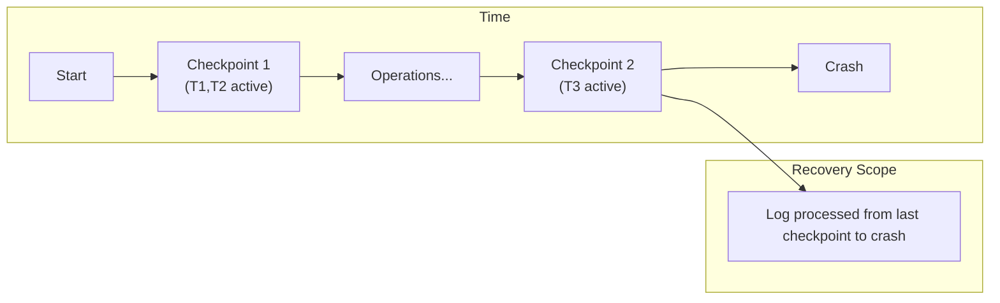
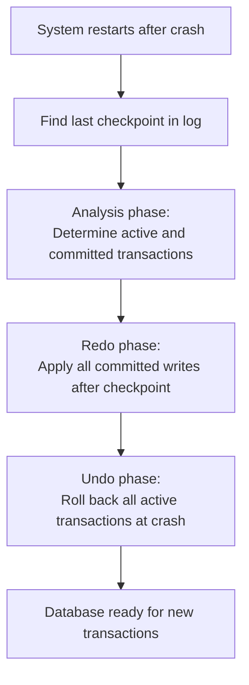

# Chapter 10: Recovery System

Recovery management ensures that the database remains consistent and durable despite various types of failures, including transaction failures, system crashes, and media failures. This chapter describes failure classifications, the write‑ahead logging protocol, undo and redo operations, and the use of checkpoints to improve recovery efficiency.

## 10.1 Types of Failures

Database systems can experience several categories of failures. Recovery mechanisms are designed to handle each type appropriately.

### 10.1.1 Transaction Failures

A transaction may fail due to logical errors (e.g., division by zero, constraint violation) or system errors (e.g., deadlock detection leading to abort). When a transaction fails, it must be rolled back (undone) to preserve atomicity.

**Causes**:
- Application logic errors.
- Integrity constraint violations (e.g., foreign key, check constraint).
- Deadlock victim selection.
- User‑issued ROLLBACK.

### 10.1.2 System Crashes (Soft Failures)

A system crash occurs when the database system stops unexpectedly due to power failure, operating system panic, or hardware fault. Main memory contents are lost, but stable storage (disk) is preserved. The recovery system must restore the database to a consistent state by undoing incomplete transactions and redoing committed transactions whose updates may not have reached disk.

**Causes**:
- Power outage.
- Operating system crash.
- Database software bug.

### 10.1.3 Media Failures (Hard Failures)

A media failure involves permanent damage to stable storage, such as a head crash on a disk or corruption of a disk block. Recovery from media failures requires archived backups and transaction logs to restore lost data.

**Causes**:
- Disk head crash.
- Bad sectors.
- Accidental file deletion.

### 10.1.4 Failure Classification Diagram

## 10.2 Log‑Based Recovery

Log‑based recovery uses a persistent log (also called journal) stored on stable storage. The log records every update operation performed by transactions. In the event of a failure, the log is used to undo incomplete transactions and redo committed ones.

### 10.2.1 Log Structure

Each log record typically contains:
- **Transaction identifier (TID)**
- **Data item identifier (X)**
- **Old value (before image)**
- **New value (after image)**
- **Operation type (START, UPDATE, COMMIT, ABORT)**

Common log record types:
- `<START T>` – transaction T has begun.
- `<WRITE T, X, old_value, new_value>` – T wrote new_value to X; old_value was the previous value.
- `<COMMIT T>` – T has committed successfully.
- `<ABORT T>` – T has been aborted.

### 10.2.2 Write‑Ahead Logging (WAL) Protocol

WAL is a fundamental rule that ensures recoverability:
1. **Log before write**: Before a transaction writes a data item to disk, the corresponding `<WRITE>` log record must be flushed to stable storage.
2. **Commit log before commit**: Before a transaction’s `<COMMIT>` record is acknowledged, all log records of that transaction must be flushed to stable storage.

WAL guarantees that if a crash occurs, the log contains enough information to recover the database.

### 10.2.3 Log Buffer and Forcing

The log is typically written to a memory buffer and flushed to disk at commit time or when the buffer fills. For performance, group commit can be used: multiple transactions’ logs are flushed together.

**Diagram**:

## 10.3 Undo and Redo

Recovery after a system crash involves two basic operations: undo and redo. These operations use the log to restore the database to a consistent state.

### 10.3.1 Undo Operation

Undo reverts the effects of a transaction that did not commit (i.e., transactions that were active at the time of crash or aborted). For each write operation of the transaction, the old value (before image) is written back to the data item. Undo operations must be **idempotent** (applying the same undo multiple times has the same effect as once).

**Undo procedure** (for a transaction T):
- Read the log backward from the end.
- For each `<WRITE T, X, old, new>` encountered, write `old` to X (restore before image).
- Stop at `<START T>`.
- Finally, write an `<ABORT T>` record.

### 10.3.2 Redo Operation

Redo reapplies the effects of a committed transaction whose updates may not have been written to disk before the crash. For each write operation, the new value (after image) is written to the data item. Redo must also be idempotent.

**Redo procedure** (for a transaction T):
- Read the log forward from the beginning.
- For each `<WRITE T, X, old, new>` encountered, write `new` to X (apply after image).
- Redo is typically performed only after ensuring that the transaction’s `<COMMIT>` appears in the log.

### 10.3.3 Recovery Algorithm (ARIES‑like)

After a system crash, the recovery manager typically performs three phases:
1. **Analysis**: Determine which transactions were active at crash and which committed.
2. **Redo**: Redo all updates from committed transactions to ensure durability.
3. **Undo**: Undo all updates from transactions that did not commit.

**Diagram**:

### 10.3.4 Example Scenario

Consider three transactions at crash time:
- T1: committed, but some writes not on disk.
- T2: committed, all writes on disk.
- T3: active (no commit).

Recovery actions:
- Redo T1’s writes (ensure durability).
- No redo needed for T2.
- Undo T3’s writes (rollback).

## 10.4 Checkpoints

A checkpoint is a point in time when the database system synchronizes all dirty buffers (modified pages in memory) to disk and records this fact in the log. Checkpoints reduce recovery time by limiting the portion of the log that must be processed.

### 10.4.1 Why Checkpoints?

Without checkpoints, after a crash the recovery system would need to scan the entire log since the beginning of time, which is impractical for large databases. Checkpoints establish a safe point: transactions that committed before the checkpoint are guaranteed to have all their updates on disk, so they need not be redone.

### 10.4.2 Checkpoint Procedure (Simple Version)

1. Write a `<CHECKPOINT>` log record.
2. Flush all log records up to this point to stable storage.
3. Flush all dirty database buffers to disk.
4. Write a `<CHECKPOINT_END>` record (or mark the checkpoint as complete).

After a crash, recovery only needs to process log records after the most recent successful checkpoint. Any transaction that committed before the checkpoint is already durable.

### 10.4.3 Fuzzy Checkpoints (Advanced)

Modern databases use fuzzy checkpoints, where the system does not stop all transactions during checkpointing. Instead, it records the current active transaction list and proceeds while writes continue. Recovery then uses the log to determine which transactions need redo/undo from the checkpoint onward.

### 10.4.4 Checkpoint Diagram

### 10.4.5 Recovery with Checkpoints

Recovery after a crash with checkpoints:
1. Locate the most recent `<CHECKPOINT>` record in the log.
2. From that point forward, scan the log to build lists of active and committed transactions.
3. Perform redo for all transactions that committed after the checkpoint (or that were active but had commits recorded in the log after the checkpoint).
4. Perform undo for all transactions that were active at crash time.

This greatly reduces the amount of log that must be scanned compared to scanning from the beginning.

## 10.5 Summary of Recovery Techniques

| Failure Type         | Recovery Mechanism                                      |
|----------------------|---------------------------------------------------------|
| Transaction failure  | Rollback using undo (from log, using before images)     |
| System crash         | Restart with analysis + redo + undo (ARIES)             |
| Media failure        | Restore from archive + apply redo from log since backup |

### Key Concepts Recap
- **Log**: Persistent record of all updates (write‑ahead logging).
- **Undo**: Restore old values for uncommitted transactions.
- **Redo**: Apply new values for committed transactions (durability).
- **Checkpoint**: Reduces recovery time by bounding the log scan.

**Final Recovery Algorithm Flowchart**:

