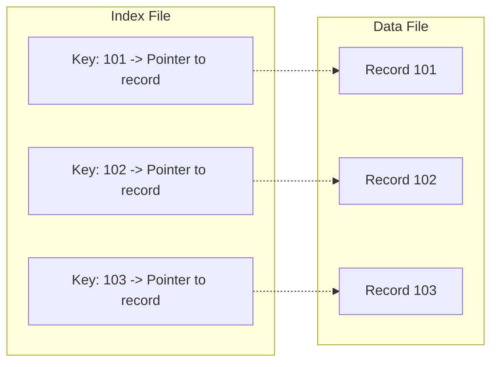
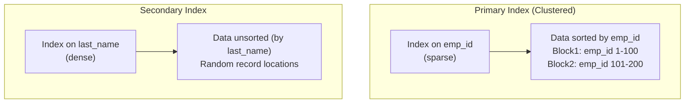
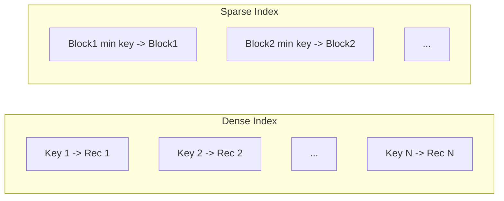
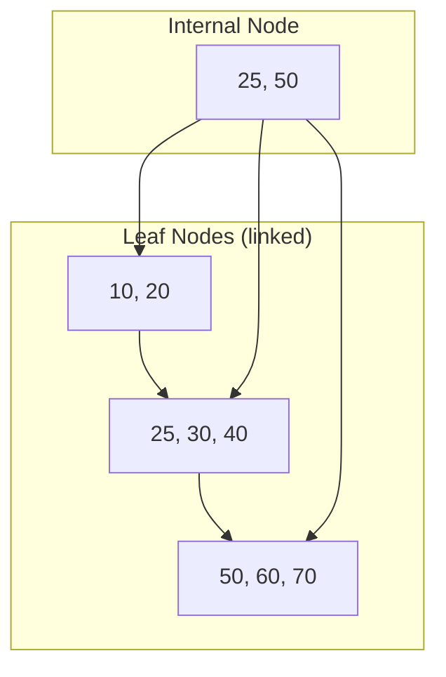
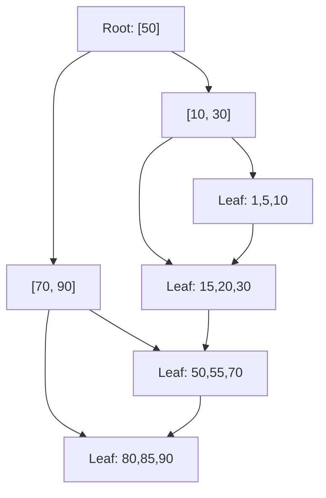

# Chapter 11: Indexing

Indexing is a data structure technique used to accelerate data retrieval operations in a database. Without indexes, a DBMS must perform a full table scan to locate rows satisfying a query condition. Indexes provide fast random access and efficient range scans by organizing key values in a searchable structure. This chapter introduces fundamental indexing concepts, classification of indexes, and the widely used B‑tree and B+‑tree structures.

## 11.1 Indexing Basics

An **index** is a auxiliary structure associated with a table that supports rapid lookup of rows based on the values of one or more columns (the **search key**). An index consists of **index entries** (key‑pointer pairs) and is stored separately from the actual data.

### 11.1.1 Why Indexing?
- **Speed**: Reduces the number of disk I/O operations from O(n) (full scan) to O(log n) or O(1) for certain structures.
- **Constraints**: Enforces uniqueness (primary key, unique constraint).
- **Sorting**: Can provide ordered access without sorting the entire table.

### 11.1.2 Index Structure Components
- **Search key**: The attribute(s) on which the index is built.
- **Pointer**: Reference to the data record (e.g., row ID, block ID, or primary key value).
- **Ordering**: Index entries are typically stored in sorted order to support efficient searching.

### 11.1.3 Basic Diagram

## 11.2 Primary and Secondary Index

Indexes are classified based on the relationship between the index key and the physical ordering of data records.

### 11.2.1 Primary Index (Clustering Index)

A **primary index** is defined on an ordered file where the data records are physically sorted by the same key as the index. The key is usually the primary key of the table. There is at most one primary index per table because data can be sorted in only one order.

- **Characteristics**:
  - Data file is sorted by the primary key.
  - Index file contains entries for each block (sparse) or each record (dense).
  - Provides very fast lookup for equality and range queries on the primary key.
- **Example**: A table of employees sorted by `emp_id`; primary index on `emp_id`.

### 11.2.2 Secondary Index (Non‑Clustering Index)

A **secondary index** is defined on a non‑ordering attribute. The data file is not sorted by the secondary key. There can be many secondary indexes per table. Secondary indexes usually contain pointers to the actual data records (row IDs).

- **Characteristics**:
  - Index entries are sorted by the secondary key, but data is not.
  - Each index entry points to a data record (or a bucket of pointers if duplicate keys exist).
  - Useful for accelerating queries on non‑primary columns.
- **Example**: An index on `last_name` when the table is ordered by `emp_id`.

### 11.2.3 Comparison Table

| Feature                | Primary Index                     | Secondary Index                   |
|------------------------|-----------------------------------|-----------------------------------|
| Number per table       | At most one                       | Many                              |
| Data ordering          | Same as index key                 | Independent of index key          |
| Storage overhead       | Lower (can be sparse)             | Higher (usually dense)            |
| Range query efficiency | Very high (sequential data access)| Moderate (random pointer access)  |
| Typical use            | Primary key lookups               | Non‑key column searches           |

### 11.2.4 Diagram

## 11.3 Dense and Sparse Index

Indexes can also be classified by the number of index entries relative to the data records.

### 11.3.1 Dense Index

A **dense index** contains one index entry for every search key value (and thus for every data record). The index entry directly points to the data record or to the block containing it.

- **Advantages**: Direct lookup; no need to search within a block for the exact record (if index entry points to record).
- **Disadvantages**: Larger storage footprint; requires more updates on insert/delete.
- **Common in**: Secondary indexes, primary indexes on non‑block boundaries.

### 11.3.2 Sparse Index

A **sparse index** contains one index entry for each block (or for a range of key values). The index points to the first record in each block. To locate a record, the index is searched to find the appropriate block, then a sequential scan inside the block is performed.

- **Advantages**: Smaller index size; less maintenance overhead.
- **Disadvantages**: Slightly slower for point queries (need to scan within block).
- **Common in**: Primary indexes on ordered files (clustered indexes).

### 11.3.3 Example Comparison

Assume a table with 10,000 records, 100 records per block → 100 blocks.

- **Dense index**: 10,000 index entries.
- **Sparse index**: 100 index entries (one per block).

### 11.3.4 Diagram

## 11.4 B‑tree and B+‑tree

B‑trees and B+‑trees are balanced search trees designed for storage systems where disk I/O dominates performance. They maintain a high fanout (many children per node) to keep the tree height low (typically 2‑4 levels for millions of records).

### 11.4.1 B‑tree

A **B‑tree** of order m (where m is the maximum number of children per node) has the following properties:
- All leaves are at the same depth (balanced).
- Each internal node (except root) has between ⌈m/2⌉ and m children.
- Each node contains keys and pointers to children and/or data records.
- In a B‑tree, data records can be stored in both internal nodes and leaves.

**Characteristics**:
- Searching: traverse from root to leaf, possibly finding a record in an internal node.
- Insert/delete: maintain balance through node splits and merges.
- Less common in modern DBMS because storing data in internal nodes complicates range queries.

### 11.4.2 B+‑tree

The **B+‑tree** is a variation that stores all data records (or pointers to data) in the leaf nodes only. Internal nodes store only key values to guide the search.

**Properties**:
- Internal nodes: keys + child pointers; no data pointers.
- Leaf nodes: keys + data pointers (or actual data). Leaves are linked together in a sequential linked list.
- All leaves at same depth; the leaf level contains all key values in sorted order.

**Advantages over B‑tree**:
- Efficient range queries: traverse to leftmost leaf then follow leaf‑level pointers.
- Higher fanout in internal nodes (since no data pointers), leading to shorter tree height.
- More predictable I/O: data access always reaches leaf level.

**Diagram of B+‑tree (order 4)**:

### 11.4.3 B+‑tree Operations

**Search**:
1. Start at root; compare search key with keys in the node.
2. Follow the appropriate child pointer until a leaf is reached.
3. Scan leaf to find exact key or range.

**Insert**:
1. Locate the leaf where the key belongs.
2. Insert the key into the leaf (maintain sorted order).
3. If leaf overflows (exceeds m‑1 keys), split into two leaves (each half). Promote the middle key to the parent.
4. If parent overflows, split recursively. If root splits, new root created and height increases.

**Delete**:
1. Locate and remove the key from leaf.
2. If leaf becomes too empty (less than ⌈m/2⌉ keys), try to redistribute from a sibling (borrow).
3. If redistribution impossible, merge with a sibling and delete the separator key from parent.
4. If parent becomes too empty, recurse upward.

### 11.4.4 Comparison of B‑tree and B+‑tree

| Feature               | B‑tree                          | B+‑tree                           |
|-----------------------|---------------------------------|-----------------------------------|
| Data storage          | Internal nodes + leaves         | Only leaves                       |
| Leaf linked list      | No (or optional)                | Yes (sequential scan)             |
| Internal node size    | Larger (stores data pointers)   | Smaller (only keys + child ptrs)  |
| Height for same data  | Slightly taller                 | Shorter (higher fanout)           |
| Range query efficiency | Poor (must traverse up/down)    | Excellent (leaf chain)            |
| Common usage          | Legacy systems, some file systems | Almost all relational DBMS (MySQL, PostgreSQL, Oracle) |

### 11.4.5 Why B+‑tree for Databases?
- **Balanced**: Guarantees O(log n) I/O per operation.
- **High fanout**: Typically 100‑500 children per node → tree height of 3‑4 for billions of rows.
- **Range scans**: The leaf‑level linked list allows efficient `BETWEEN`, `>` , `<` queries.
- **Concurrency**: Leaf‑level locking is possible; B+‑trees support high concurrency.

**B+‑tree Structure Diagram (detailed)**:

## 11.5 Summary

Indexing is critical for database performance. Key takeaways:

- **Indexing basics**: Indexes provide fast lookups at the cost of storage and update overhead.
- **Primary vs secondary**: Primary (clustered) indexes order the data; secondary (non‑clustered) indexes provide alternative access paths.
- **Dense vs sparse**: Dense indexes have one entry per record; sparse indexes have one per block (smaller, but slower point lookups).
- **B‑tree and B+‑tree**:
  - B‑trees store data in internal nodes; B+‑trees store all data in leaves with leaf‑level links.
  - B+‑tree is the preferred index structure in modern DBMS due to efficient range queries, higher fanout, and predictable I/O.

Understanding these concepts allows database administrators and developers to choose appropriate indexes and optimize query performance.

