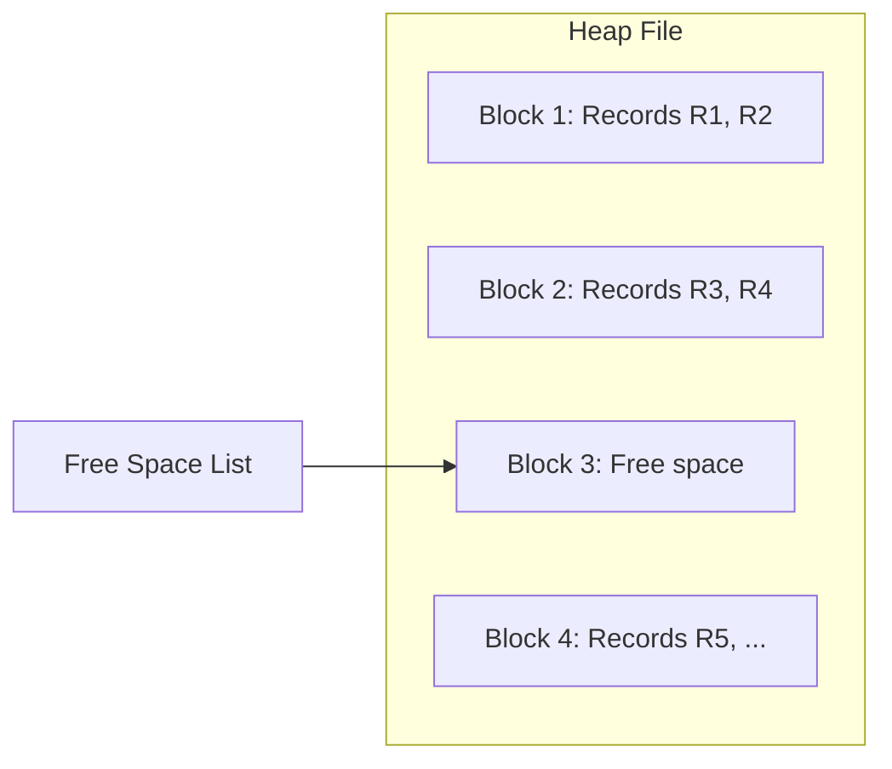
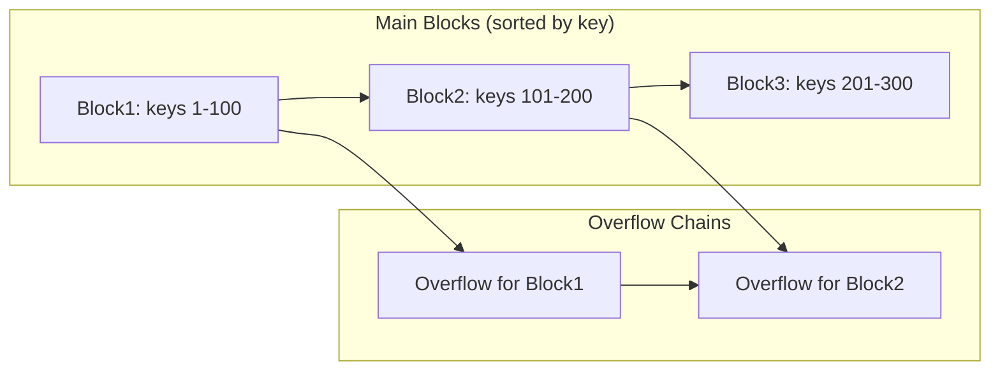
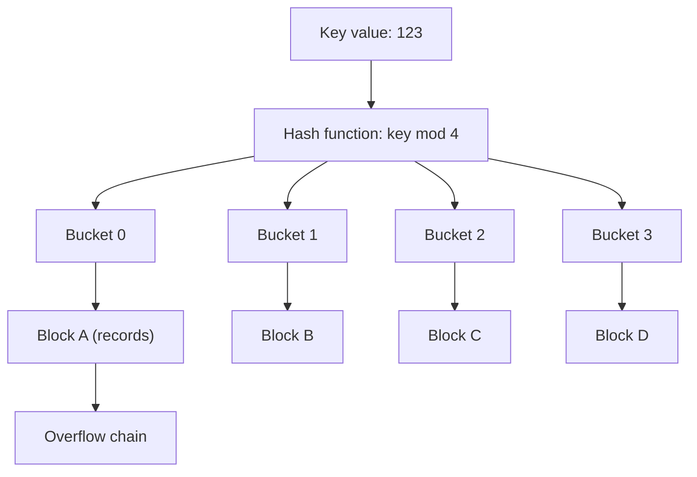
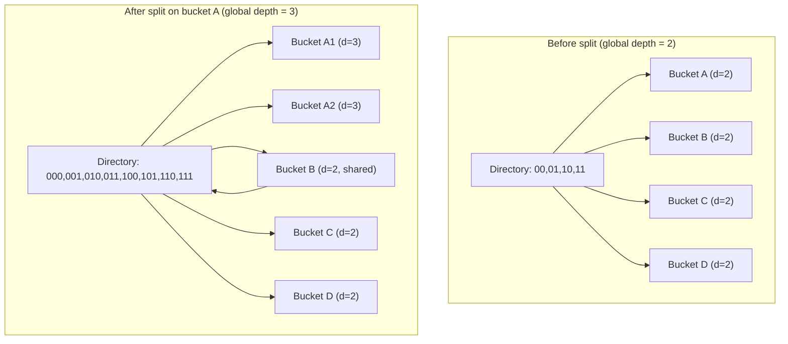

# Chapter 12: File Organization and Hashing

File organization refers to the way data records are physically arranged on storage media (e.g., disk). The choice of file organization affects the efficiency of database operations such as insert, delete, update, and search. Hashing is a technique that maps keys directly to storage addresses, providing very fast equality searches. This chapter explains heap and sequential file organizations, as well as static and dynamic hashing schemes.

## 12.1 File Organization Basics

A database file is a collection of fixed‑length or variable‑length records. The file organization determines:
- How records are placed in blocks (pages) on disk.
- How records are located given a search key.
- Performance of sequential scans, point queries, and range queries.

Three fundamental operations are optimized differently by each organization:
- **Insert**: Add a new record.
- **Search (equality)**: Find record with a given key.
- **Range search**: Find all records with keys in a range.
- **Delete/Update**: Modify or remove a record.

## 12.2 Heap File Organization

A **heap file** (also called unordered file) stores records in no particular order. New records are appended at the end of the file or inserted into a free space list. There is no sorting or ordering.

### 12.2.1 Characteristics
- **Insertion**: Very fast – just append or use a free slot.
- **Search (equality)**: Slow – full file scan required (O(n) disk I/O).
- **Range search**: Same as full scan.
- **Delete**: Mark record as deleted (or compact later); can maintain a free list.
- **Update**: In‑place if record size fixed; otherwise complicated.

### 12.2.2 Use Cases
- Temporary tables, log tables, or tables with very few queries.
- Bulk insert environments where retrieval is rare.

### 12.2.3 Heap File Structure with Free Space List

## 12.3 Sequential File Organization

A **sequential file** stores records in sorted order by a designated key (the ordering key). Records are physically arranged in ascending or descending key order. Insertion and deletion are costly because the order must be maintained.

### 12.3.1 Characteristics
- **Insertion**: Requires finding correct position; may need to shift records or use overflow blocks.
- **Search (equality)**: Fast using binary search on the file (O(log n) block accesses).
- **Range search**: Very fast after locating start key; sequential read of subsequent blocks.
- **Delete**: Mark as deleted or compact; similar to insertion overhead.

### 12.3.2 Overflow Handling
When inserting a new record, if the target block is full, an **overflow block** is linked. Overflow chains degrade performance over time; periodic reorganization is needed.

### 12.3.3 Sequential File Structure

### 12.3.4 Comparison Table

| Operation        | Heap File        | Sequential File          |
|------------------|------------------|--------------------------|
| Insert           | Fast (append)    | Slow (maintain order)    |
| Equality search  | Slow (scan)      | Fast (binary search)     |
| Range search     | Slow (scan)      | Very fast (sequential)   |
| Delete           | Moderate (mark)  | Moderate (mark + compact)|
| Storage utilization | High (few wasted slots) | Lower (overflow blocks) |

## 12.4 Hashing

Hashing maps a search key directly to a disk block address using a **hash function** `h(key)`. Hashing is ideal for equality queries (`WHERE key = value`) but inefficient for range queries.

### 12.4.1 Basic Hashing Concepts

- **Hash function**: `h(key) → bucket number` (bucket = one or more disk blocks).
- **Buckets**: Logical storage units; each bucket can hold multiple records (typically one block).
- **Collision**: Two different keys map to the same bucket. Handled by overflow chaining or open addressing.

### 12.4.2 Static Hashing

In **static hashing**, the number of buckets is fixed and does not change over time. The hash function distributes keys among these buckets.

**Characteristics**:
- **Simple**: Fixed bucket count `N`. Hash function: `h(key) = key mod N`.
- **Insert**: Compute bucket, insert; if bucket full, add overflow block.
- **Search**: Compute bucket, then search within bucket (and overflow chain).
- **Problems**: 
  - If database grows, buckets become overloaded → long overflow chains → performance degrades.
  - If database shrinks, many empty buckets waste space.
- **Use cases**: Small, stable tables or applications with predictable size.

**Static Hashing Diagram**:

### 12.4.3 Dynamic Hashing

Dynamic hashing (also called **extendible hashing**) allows the number of buckets to grow and shrink as the database size changes. It uses a directory of pointers to buckets and a hash function that produces a long sequence of bits (e.g., 32‑bit hash). Only the first `i` bits are used, where `i` grows when a bucket overflows.

**Extendible Hashing Algorithm**:
- **Directory**: Array of size `2^i` (i is the global depth). Each directory entry points to a bucket.
- **Bucket**: Has local depth `d ≤ i`. A bucket holds up to `B` records.
- **Insert**:
  1. Hash key to get binary hash value.
  2. Use first `i` bits to index directory.
  3. Follow pointer to bucket.
  4. If bucket not full, insert.
  5. If bucket full:
     - If local depth `d` equals global depth `i`, double the directory (i ← i+1).
     - Create a new bucket; redistribute records between old and new buckets using `d+1` bits.
     - Increment local depth of affected buckets.
     - Adjust directory pointers.
- **Search**: Same as insertion but no redistribution.
- **Delete**: May merge buckets and shrink directory if possible.

**Characteristics**:
- **Dynamic growth**: No overflow chains; bucket splits maintain performance.
- **Directory overhead**: Directory can double in size; but for many databases, directory fits in memory.
- **Good for**: Growing databases, unpredictable size, hash‑based indexes (e.g., in some NoSQL systems).

**Extendible Hashing Diagram (before and after split)**:

### 12.4.4 Comparison of Static vs Dynamic Hashing

| Feature               | Static Hashing                     | Dynamic (Extendible) Hashing       |
|-----------------------|-------------------------------------|-------------------------------------|
| Bucket count          | Fixed                              | Grows/shrinks                       |
| Overflow handling     | Overflow chains (performance decay) | Bucket split (no chains)            |
| Directory             | None (direct bucket access)        | Directory of pointers (size 2^i)    |
| Space utilization     | Can become poor (empty buckets)    | Good (splits on overflow)           |
| Performance over time | Degrades with growth               | Stable (logical splits)             |
| Implementation complexity | Simple                         | More complex (directory management) |
| Use case              | Small, static tables               | Large, dynamic databases            |

### 12.4.5 Hashing vs B+‑tree

| Aspect               | Hash Index                        | B+‑tree Index                     |
|----------------------|-----------------------------------|-----------------------------------|
| Equality query       | O(1) (ideal)                      | O(log n)                          |
| Range query          | Not supported (needs full scan)   | Very efficient (leaf chain)       |
| Ordering             | No (keys scattered)               | Yes (sorted)                      |
| Update overhead      | Low (if no overflow)              | Moderate (node splits/merges)     |
| Typical use          | Hash join, equality lookups       | General purpose (most indexes)    |

## 12.5 Summary

File organization and hashing determine how data is physically stored and accessed. Key points:

- **Heap file**: Unordered; fastest inserts; slow searches; suitable for logs and temporary tables.
- **Sequential file**: Sorted by key; efficient range scans; costly updates; requires overflow handling.
- **Static hashing**: Fixed number of buckets; simple but suffers from performance degradation as database grows (overflow chains).
- **Dynamic hashing (extendible hashing)**: Grows gracefully by splitting buckets; uses a directory; no overflow chains; ideal for unpredictable database size.

Choosing the right organization depends on workload: heap for insert‑heavy, sequential for range queries, hashing for exact match lookups, and B+‑trees for balanced mixed workloads.
