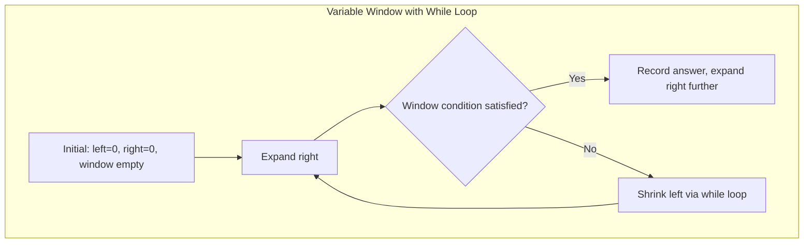
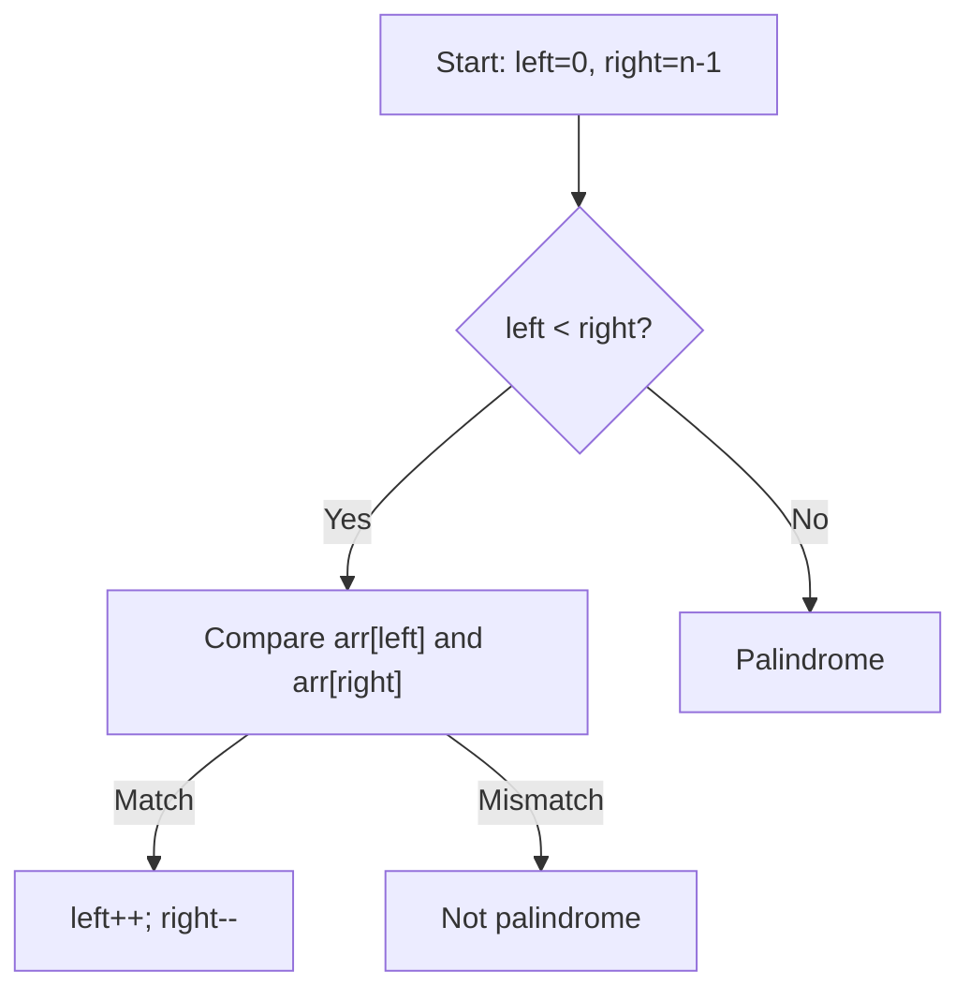

# Chapter 3: Arrays and Strings

This chapter covers fundamental linear data structures: arrays and strings. It introduces essential techniques such as sliding window, two pointers, prefix sums, difference arrays, and pattern matching algorithms, followed by classic problems that demonstrate these concepts.

## 1. Arrays

An array is a contiguous block of memory storing elements of the same type, accessible by index in O(1) time.

### 1.1 One‑Dimensional and Multi‑Dimensional Arrays

**What**: A linear collection of elements (1D) or a grid of elements (2D, 3D, etc.).

**When to use**:
- **1D arrays**: Storing sequential data (scores, temperatures, etc.)
- **2D arrays**: Matrices, game boards, pixel grids, DP tables.

**Static vs Dynamic**:
- **Static array**: Fixed size known at compile time (C++ `int arr[100];`).
- **Dynamic array**: Grows automatically (`std::vector<T>`).

**C++ example for 2D array using vector**:
```cpp
#include <vector>
using namespace std;
vector<vector<int>> matrix(rows, vector<int>(cols, 0));
```

### 1.2 Dynamic Arrays (std::vector)

**What**: A resizable array container that manages memory automatically.

**When to use**: When the number of elements is unknown at compile time or changes frequently.

**Key properties**:
- Amortized O(1) for `push_back` (occasional reallocation)
- O(1) random access
- O(n) insertion/deletion at arbitrary positions

```cpp
vector<int> v;
v.push_back(10);  // amortized O(1)
v.pop_back();     // O(1)
```

### 1.3 Common Operations

| Operation | C++ Code | Time Complexity |
|-----------|----------|----------------|
| Traversal | `for (int x : arr) {}` | O(n) |
| Access by index | `arr[i]` | O(1) |
| Insert at end | `arr.push_back(x)` | Amortized O(1) |
| Insert at position | `arr.insert(arr.begin()+i, val)` | O(n) |
| Delete at position | `arr.erase(arr.begin()+i)` | O(n) |
| Linear search | `find(arr.begin(), arr.end(), val)` | O(n) |
| Binary search (sorted) | `binary_search(arr.begin(), arr.end(), val)` | O(log n) |

### 1.4 Prefix Sum Array

**What**: An auxiliary array where `prefix[i] = sum of arr[0..i-1]` (or up to i).

**When to use**: Answering multiple range sum queries (`sum(l..r)`) efficiently.

**Construction**:
```cpp
vector<int> prefix(n+1, 0);
for (int i = 0; i < n; ++i)
    prefix[i+1] = prefix[i] + arr[i];
// Sum from l to r inclusive: prefix[r+1] - prefix[l]
```

**Real-life analogy**: A running total on a cash register. When you need the sum of sales between two hours, you subtract the total before the first hour from total after the second hour.

### 1.5 Difference Array

**What**: An array `diff` where `diff[i] = arr[i] - arr[i-1]` (with `diff[0] = arr[0]`). It allows O(1) range updates.

**When to use**: Many range increment/decrement operations followed by a single read of the final array.

**Operation**: To add `k` to `arr[l..r]`, do `diff[l] += k; diff[r+1] -= k;` (if `r+1 < n`). After all updates, reconstruct `arr` via prefix sum over `diff`.

```cpp
vector<int> diff(n, 0);
// range update: add k from l to r
diff[l] += k;
if (r+1 < n) diff[r+1] -= k;

// final array
vector<int> result(n);
result[0] = diff[0];
for (int i = 1; i < n; ++i)
    result[i] = result[i-1] + diff[i];
```

## 2. Sliding Window Technique

**What**: Maintaining a subset (window) of array elements that expands or contracts while processing the array linearly. Each element enters and leaves the window at most once.

**When to use**: Subarray or substring problems where you need to compute something for all contiguous subarrays of fixed or variable length.

**Why a while loop is natural**: For variable‑size windows, the left pointer may shrink multiple steps while a condition holds. A `while` loop makes this shrinking explicit and easier to read.

### 2.1 Fixed‑Size Window

**Problem**: Find the maximum sum of any subarray of size `k`.

```cpp
int maxSumFixed(vector<int>& arr, int k) {
    int sum = 0;
    for (int i = 0; i < k; ++i) sum += arr[i];
    int maxSum = sum;
    for (int i = k; i < arr.size(); ++i) {
        sum += arr[i] - arr[i - k];
        maxSum = max(maxSum, sum);
    }
    return maxSum;
}
```

**Time**: O(n). **Space**: O(1).

### 2.2 Variable‑Size Window (with while loop)

**Problem**: Longest substring without repeating characters.

**Idea**: Expand right pointer and use a hash set or array to track seen characters. When a duplicate is found, shrink from the left until the duplicate is removed.

```cpp
int longestUniqueSubstr(string s) {
    vector<int> lastIndex(256, -1);   // last occurrence of each char
    int left = 0, maxLen = 0;
    for (int right = 0; right < s.size(); ++right) {
        // If current char already inside window, move left past its last occurrence
        if (lastIndex[s[right]] >= left) {
            left = lastIndex[s[right]] + 1;
        }
        lastIndex[s[right]] = right;
        maxLen = max(maxLen, right - left + 1);
    }
    return maxLen;
}
```

**Alternative while‑loop version (explicit shrinking)**:

```cpp
int longestUniqueSubstr(string s) {
    vector<int> freq(256, 0);   // frequency inside window
    int left = 0, right = 0, maxLen = 0;
    while (right < s.size()) {
        char c = s[right];
        freq[c]++;
        // shrink window until c is unique
        while (freq[c] > 1) {
            freq[s[left]]--;
            left++;
        }
        maxLen = max(maxLen, right - left + 1);
        right++;
    }
    return maxLen;
}
```

**Time**: O(n) because each character enters and leaves the window at most once.

**Real-life analogy**: A conveyor belt inspection window. You slide a fixed‑size frame (fixed window) or adjust the frame size to keep all items inside without duplicates (variable window).

**Visualisation of sliding window**:



## 3. Two Pointers Technique

**What**: Using two indices (pointers) that traverse the array, either moving in opposite directions or in the same direction at different speeds.

**When to use**:
- Opposite direction: Sorted two‑sum, palindrome checking, trapping rainwater.
- Same direction: Merging sorted arrays, removing duplicates, partition.

### 3.1 Opposite Direction

**Example**: Check if a string is a palindrome.

```cpp
bool isPalindrome(string s) {
    int left = 0, right = s.size() - 1;
    while (left < right) {
        if (s[left] != s[right]) return false;
        left++; right--;
    }
    return true;
}
```

### 3.2 Same Direction (Fast & Slow)

**Example**: Remove duplicates from sorted array in‑place.

```cpp
int removeDuplicates(vector<int>& nums) {
    if (nums.empty()) return 0;
    int slow = 0;
    for (int fast = 1; fast < nums.size(); ++fast) {
        if (nums[fast] != nums[slow])
            nums[++slow] = nums[fast];
    }
    return slow + 1;
}
```



## 4. Strings

A string is a sequence of characters. In C++, `std::string` is mutable, but operations like concatenation may allocate new memory.

### 4.1 String Immutability and Builders

**What**: In some languages strings are immutable, but C++ strings are mutable. However, repeated concatenation using `+` or `+=` can still cause reallocations.

**When to use**: Use `std::string` for most operations; if many concatenations are needed, use `reserve()` to pre‑allocate or `std::stringstream`.

```cpp
string buildString(int n) {
    string result;
    result.reserve(n * 2);   // avoid reallocations
    for (int i = 0; i < n; ++i)
        result += "ab";
    return result;
}
```

### 4.2 Pattern Matching Algorithms

#### Naive Search

**What**: Slide the pattern over the text and compare character by character.

**Time**: O(n * m) in worst case.

```cpp
int naiveSearch(string text, string pattern) {
    int n = text.size(), m = pattern.size();
    for (int i = 0; i <= n - m; ++i) {
        int j;
        for (j = 0; j < m; ++j)
            if (text[i+j] != pattern[j]) break;
        if (j == m) return i;
    }
    return -1;
}
```

#### KMP (Knuth‑Morris‑Pratt)

**What**: Preprocesses the pattern to build a longest proper prefix‑suffix (LPS) array. Uses it to avoid re‑scanning matched characters.

**Time**: O(n + m). **Space**: O(m).

**When to use**: Searching in large texts, especially when the pattern has repetitive structure.

**LPS construction**:
```cpp
vector<int> buildLPS(string pat) {
    int m = pat.size();
    vector<int> lps(m, 0);
    int len = 0, i = 1;
    while (i < m) {
        if (pat[i] == pat[len]) lps[i++] = ++len;
        else if (len) len = lps[len-1];
        else lps[i++] = 0;
    }
    return lps;
}
```

**Real-life analogy**: When you look for a word in a book and you already matched a prefix, you don't start from the beginning of the word after a mismatch – you use the knowledge of the matched part.

#### Rabin‑Karp (Rolling Hash)

**What**: Uses a hash function (e.g., polynomial rolling hash) to compare pattern and text substrings in O(1) on average. When hash matches, verify character‑by‑character.

**Time**: Average O(n + m), worst O(n*m) (hash collisions). **Space**: O(1).

**When to use**: Multiple pattern matching, plagiarism detection, avoiding high constant factor of KMP.

```cpp
#define MOD 1000000007
#define BASE 256

int rabinKarp(string text, string pattern) {
    int n = text.size(), m = pattern.size();
    if (m > n) return -1;
    long long pHash = 0, tHash = 0, pow = 1;
    for (int i = 0; i < m; ++i) {
        pHash = (pHash * BASE + pattern[i]) % MOD;
        tHash = (tHash * BASE + text[i]) % MOD;
        pow = (pow * BASE) % MOD;
    }
    for (int i = 0; i <= n - m; ++i) {
        if (pHash == tHash) {
            bool match = true;
            for (int j = 0; j < m; ++j)
                if (text[i+j] != pattern[j]) { match = false; break; }
            if (match) return i;
        }
        if (i < n - m) {
            tHash = (tHash * BASE - text[i] * pow + text[i+m]) % MOD;
            if (tHash < 0) tHash += MOD;
        }
    }
    return -1;
}
```

### 4.3 Anagram and Palindrome Problems

**Anagram**: Two strings with same character frequencies.

**Approach 1**: Sort both strings – O(n log n).  
**Approach 2**: Frequency array of size 256 – O(n).

```cpp
bool isAnagram(string s1, string s2) {
    if (s1.length() != s2.length()) return false;
    vector<int> count(256, 0);
    for (char c : s1) count[c]++;
    for (char c : s2) if (--count[c] < 0) return false;
    return true;
}
```

**Palindrome**: A string that reads the same forwards and backwards.

**Check** using two pointers (see section 3.1). For finding longest palindromic substring, use expand around center (O(n²)).

## 5. Important Problems

### 5.1 Kadane’s Algorithm (Maximum Subarray Sum)

**What**: Dynamic programming that keeps the maximum sum ending at each position.

**When to use**: Finding contiguous subarray with largest sum (can include negative numbers).

```cpp
int maxSubarraySum(vector<int>& arr) {
    int maxSoFar = arr[0], maxEndingHere = arr[0];
    for (int i = 1; i < arr.size(); ++i) {
        maxEndingHere = max(arr[i], maxEndingHere + arr[i]);
        maxSoFar = max(maxSoFar, maxEndingHere);
    }
    return maxSoFar;
}
```

**Time**: O(n). **Space**: O(1).

**Real-life analogy**: Finding the most profitable period to hold a stock, where you can buy and sell once.

### 5.2 Dutch National Flag Problem (Sort 0,1,2)

**What**: Sort an array containing only 0, 1, and 2 in one pass (three‑way partition).

**When to use**: When we need to partition three distinct values without extra memory.

```cpp
void sortColors(vector<int>& nums) {
    int low = 0, mid = 0, high = nums.size() - 1;
    while (mid <= high) {
        if (nums[mid] == 0) swap(nums[low++], nums[mid++]);
        else if (nums[mid] == 1) mid++;
        else swap(nums[mid], nums[high--]);
    }
}
```

**Time**: O(n). **Space**: O(1).

### 5.3 Trapping Rainwater

**What**: Given elevation map (bar heights), compute how much water can be trapped after rain.

**Approach 1** (prefix max): `leftMax[i] = max left height up to i`, `rightMax[i]` similarly, water at i = `min(leftMax[i], rightMax[i]) - height[i]`. **Time & Space**: O(n).  
**Approach 2** (two pointers): O(1) space.

```cpp
int trap(vector<int>& height) {
    int left = 0, right = height.size() - 1;
    int leftMax = 0, rightMax = 0, water = 0;
    while (left < right) {
        if (height[left] < height[right]) {
            leftMax = max(leftMax, height[left]);
            water += leftMax - height[left];
            left++;
        } else {
            rightMax = max(rightMax, height[right]);
            water += rightMax - height[right];
            right--;
        }
    }
    return water;
}
```

**Real-life analogy**: Water collects between buildings of varying heights; the amount at a point is limited by the shorter of the tallest building to its left and right.

### 5.4 Container with Most Water

**What**: Given vertical lines at positions i with height `height[i]`, find two lines that together with the x‑axis form a container holding the most water.

**When to use**: Two‑pointer greedy approach.

```cpp
int maxArea(vector<int>& height) {
    int left = 0, right = height.size() - 1, maxWater = 0;
    while (left < right) {
        int w = right - left;
        int h = min(height[left], height[right]);
        maxWater = max(maxWater, w * h);
        if (height[left] < height[right]) left++;
        else right--;
    }
    return maxWater;
}
```

**Time**: O(n). **Space**: O(1).

## Summary Table

| Concept | What (brief) | When to use | Time Complexity |
|---------|--------------|-------------|----------------|
| Prefix sum | Pre‑computed cumulative sums | Range sum queries | O(n) pre, O(1) per query |
| Difference array | Range updates via diffs | Batch range increments | O(1) per update, O(n) finalize |
| Sliding window (while loop) | Maintain subarray range | Subarray/substring optimal | O(n) |
| Two pointers | Two indices moving | Sorted arrays, palindrome | O(n) |
| KMP | Pattern matching with LPS | Large text, repetitive pattern | O(n+m) |
| Rabin‑Karp | Hashing for pattern match | Multiple patterns, rolling hash | O(n+m) avg |
| Kadane | Maximum subarray sum | Single subarray max sum | O(n) |
| Dutch National Flag | Three‑way partition | Sort 0,1,2 in‑place | O(n) |
| Trapping rainwater | Water volume between bars | Heightmap water trapping | O(n) |
| Container with most water | Max area (2 lines) | Maximum area problem | O(n) |

The next chapter will cover linked lists (singly, doubly, circular) and their operations, including cycle detection and merging.
