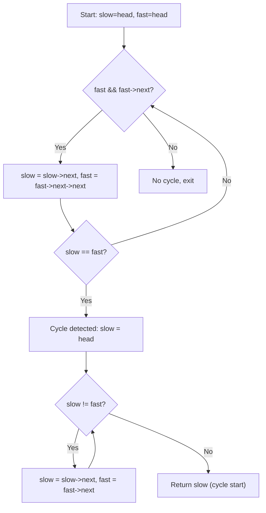

# Chapter 4: Linked Lists

This chapter covers linked list data structures: singly, doubly, and circular linked lists. It details basic operations, two‑pointer techniques, reversal algorithms, merging, intersection problems, and advanced copying.

## 1. Singly Linked List

**What**: A linear data structure where each node contains data and a pointer (`next`) to the next node. The last node points to `nullptr`.

**When to use**:
- Dynamic memory allocation (no fixed size)
- Frequent insertions/deletions at arbitrary positions (O(1) if you have a reference to the node)
- When contiguous memory is not required or wasteful

**Node structure (C++)**:
```cpp
struct Node {
    int data;
    Node* next;
    Node(int val) : data(val), next(nullptr) {}
};
```

## 2. Doubly Linked List

**What**: Each node has pointers to both the next and previous nodes.

**When to use**:
- Need efficient backward traversal
- Deletion of a given node (no need to find previous)
- Implementing LRU cache, undo/redo functionality

**Node structure**:
```cpp
struct DNode {
    int data;
    DNode* prev;
    DNode* next;
    DNode(int val) : data(val), prev(nullptr), next(nullptr) {}
};
```

## 3. Circular Linked List

**What**: The last node points back to the first node (singly or doubly circular). No node points to `nullptr`.

**When to use**:
- Round‑robin scheduling
- Games where players take turns cyclically
- Implementing a circular buffer

## 4. Basic Operations

| Operation | Singly | Doubly | Time Complexity |
|-----------|--------|--------|-----------------|
| Traversal | O(n) | O(n) | O(n) |
| Search by value | O(n) | O(n) | O(n) |
| Insert at head | O(1) | O(1) | O(1) |
| Insert at tail (without tail ptr) | O(n) | O(1) if tail known | O(1) / O(n) |
| Insert after given node | O(1) | O(1) | O(1) |
| Delete head | O(1) | O(1) | O(1) |
| Delete given node (without prev) | O(n) | O(1) | O(n)/O(1) |

**Example: Insert at head of singly linked list**:
```cpp
void insertAtHead(Node*& head, int val) {
    Node* newNode = new Node(val);
    newNode->next = head;
    head = newNode;
}
```

## 5. Two‑Pointer Techniques

**What**: Using two pointers moving at different speeds (fast/slow) or different start positions to solve problems in O(n) time and O(1) space.

**When to use**: Cycle detection, finding middle, finding nth node from end, detecting intersection.

### 5.1 Finding Middle of List

**Slow pointer moves one step, fast pointer moves two steps**. When fast reaches end, slow is at the middle.

```cpp
Node* findMiddle(Node* head) {
    Node* slow = head;
    Node* fast = head;
    while (fast && fast->next) {
        slow = slow->next;
        fast = fast->next->next;
    }
    return slow;
}
```

### 5.2 Cycle Detection (Floyd’s Cycle Detection)

**What**: Detect if a linked list has a cycle using slow (1 step) and fast (2 steps). If they meet, a cycle exists.

**When to use**: Verify infinite loops, corrupted linked structures, detecting loops in reference chains.

```cpp
bool hasCycle(Node* head) {
    Node* slow = head;
    Node* fast = head;
    while (fast && fast->next) {
        slow = slow->next;
        fast = fast->next->next;
        if (slow == fast) return true;
    }
    return false;
}
```

### 5.3 Finding Start of Cycle

**What**: After slow and fast meet, reset one pointer to head, move both one step at a time. Their meeting point is the cycle start.

```cpp
Node* detectCycleStart(Node* head) {
    Node* slow = head;
    Node* fast = head;
    bool hasCycle = false;
    while (fast && fast->next) {
        slow = slow->next;
        fast = fast->next->next;
        if (slow == fast) { hasCycle = true; break; }
    }
    if (!hasCycle) return nullptr;
    slow = head;
    while (slow != fast) {
        slow = slow->next;
        fast = fast->next;
    }
    return slow;
}
```

**Real-life analogy**: Two runners on a circular track, one twice as fast. They meet; then starting one from the start point and moving both at same speed brings them together at the cycle entry.



## 6. Reversal

### 6.1 Iterative Reversal

**What**: Reverse the links using three pointers (prev, curr, next).

```cpp
Node* reverseIterative(Node* head) {
    Node* prev = nullptr;
    Node* curr = head;
    Node* next = nullptr;
    while (curr) {
        next = curr->next;
        curr->next = prev;
        prev = curr;
        curr = next;
    }
    return prev;
}
```

### 6.2 Recursive Reversal

**What**: Reverse the rest of the list, then adjust the current node’s next.

```cpp
Node* reverseRecursive(Node* head) {
    if (!head || !head->next) return head;
    Node* newHead = reverseRecursive(head->next);
    head->next->next = head;
    head->next = nullptr;
    return newHead;
}
```

### 6.3 Reverse in Groups of k

**What**: Reverse every contiguous block of k nodes. If the last group has fewer than k nodes, leave it as is.

```cpp
Node* reverseKGroup(Node* head, int k) {
    Node* curr = head;
    int count = 0;
    while (curr && count < k) { curr = curr->next; count++; }
    if (count == k) {
        Node* reversedHead = reverseKGroup(curr, k);
        // reverse current group of k
        Node* prev = nullptr;
        Node* curr2 = head;
        for (int i = 0; i < k; ++i) {
            Node* next = curr2->next;
            curr2->next = prev;
            prev = curr2;
            curr2 = next;
        }
        head->next = reversedHead;
        return prev;
    }
    return head;
}
```

## 7. Merge and Intersection Problems

### 7.1 Merge Two Sorted Lists

**What**: Combine two sorted linked lists into one sorted list.

```cpp
Node* mergeTwoSorted(Node* l1, Node* l2) {
    Node dummy(0);
    Node* tail = &dummy;
    while (l1 && l2) {
        if (l1->data < l2->data) {
            tail->next = l1;
            l1 = l1->next;
        } else {
            tail->next = l2;
            l2 = l2->next;
        }
        tail = tail->next;
    }
    tail->next = l1 ? l1 : l2;
    return dummy.next;
}
```

### 7.2 Find Intersection Point of Two Lists

**What**: Two singly linked lists merge at a common node. Find that node.

**Approach**: 
1. Compute lengths of both lists.
2. Advance the longer list’s pointer by the difference.
3. Move both pointers until they meet.

```cpp
Node* getIntersectionNode(Node* headA, Node* headB) {
    int lenA = 0, lenB = 0;
    Node* temp = headA;
    while (temp) { lenA++; temp = temp->next; }
    temp = headB;
    while (temp) { lenB++; temp = temp->next; }
    Node* ptrA = headA;
    Node* ptrB = headB;
    if (lenA > lenB) {
        for (int i = 0; i < lenA - lenB; ++i) ptrA = ptrA->next;
    } else {
        for (int i = 0; i < lenB - lenA; ++i) ptrB = ptrB->next;
    }
    while (ptrA != ptrB) {
        ptrA = ptrA->next;
        ptrB = ptrB->next;
    }
    return ptrA;
}
```

## 8. Copy List with Random Pointer

**Problem**: Each node has an extra `random` pointer that can point to any node in the list or `nullptr`. Create a deep copy.

**Approach**: Interleave copy nodes, assign random pointers, then separate.

```cpp
struct RNode {
    int val;
    RNode* next;
    RNode* random;
    RNode(int v) : val(v), next(nullptr), random(nullptr) {}
};

RNode* copyRandomList(RNode* head) {
    if (!head) return nullptr;
    // Step 1: create copy nodes interleaved
    RNode* curr = head;
    while (curr) {
        RNode* copy = new RNode(curr->val);
        copy->next = curr->next;
        curr->next = copy;
        curr = copy->next;
    }
    // Step 2: assign random pointers
    curr = head;
    while (curr) {
        if (curr->random)
            curr->next->random = curr->random->next;
        curr = curr->next->next;
    }
    // Step 3: separate lists
    RNode dummy(0);
    RNode* newTail = &dummy;
    curr = head;
    while (curr) {
        newTail->next = curr->next;
        newTail = newTail->next;
        curr->next = curr->next->next;
        curr = curr->next;
    }
    return dummy.next;
}
```

**Time**: O(n), **Space**: O(1) extra (excluding output).

**Real-life analogy**: Cloning a reference‑heavy document where some pages refer to other pages in the original. The interleaving trick ensures you know the new copy of the target when assigning the random pointer.

## Summary Table

| Concept | Technique | Time | Space |
|---------|-----------|------|-------|
| Find middle | Fast & slow pointers | O(n) | O(1) |
| Cycle detection | Floyd’s algorithm | O(n) | O(1) |
| Find cycle start | Floyd + reset | O(n) | O(1) |
| Reverse list | Iterative / recursive | O(n) | O(1) / O(n) stack |
| Reverse in groups of k | Recursive with grouping | O(n) | O(n/k) stack |
| Merge sorted lists | Two‑pointer traversal | O(m+n) | O(1) |
| Intersection point | Length difference | O(m+n) | O(1) |
| Copy with random | Interleaving | O(n) | O(1) |

The next chapter will cover stacks and queues (implementations, applications, and problems like next greater element, valid parentheses, sliding window maximum).
