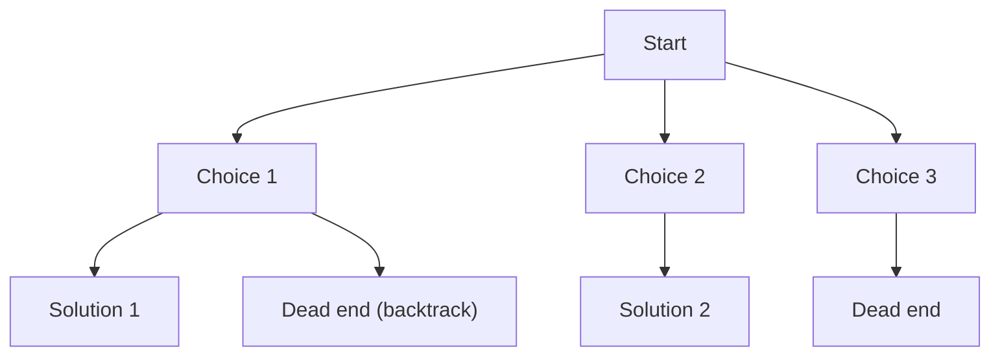

# Chapter 6: Recursion and Backtracking

This chapter covers recursion fundamentals, compares recursion with iteration, and explores backtracking as a systematic search technique. Classic problems (N‑Queens, Sudoku, subsets, permutations, combination sum) illustrate practical applications.

## 1. Recursion Fundamentals

**What**: A function that calls itself to solve smaller instances of the same problem.

### 1.1 Components

- **Base case**: The simplest input that can be solved directly, terminating the recursion.
- **Recurrence relation**: Expresses the problem in terms of smaller instances of itself.
- **Call stack**: Automatically managed stack storing each active function call.

### 1.2 Recurrence Relation Example (Factorial)

```
factorial(0) = 1                    // base case
factorial(n) = n * factorial(n-1)   // recurrence
```

```cpp
int factorial(int n) {
    if (n <= 1) return 1;           // base case
    return n * factorial(n - 1);    // recurrence
}
```

### 1.3 Tail Recursion vs Non‑Tail Recursion

**Tail recursion**: The recursive call is the last operation performed by the function. The result of the recursive call is returned directly, with no additional computation after it.

```cpp
// Tail‑recursive factorial using an accumulator
int factorialTail(int n, int acc = 1) {
    if (n <= 1) return acc;
    return factorialTail(n - 1, n * acc);   // recursive call is last
}
```

**Non‑tail recursion**: Additional work (e.g., multiplication) happens after the recursive call returns.

```cpp
int factorialNonTail(int n) {
    if (n <= 1) return 1;
    return n * factorialNonTail(n - 1);   // multiplication after call
}
```

**Why tail recursion matters**: Some compilers can optimise tail recursion into iteration (tail call elimination), saving stack space and preventing stack overflow. Without optimisation, both have the same O(n) space.

### 1.4 Recursion vs Iteration

| Aspect | Recursion | Iteration |
|--------|-----------|-----------|
| Code clarity | Often shorter and more intuitive for divide‑and‑conquer, trees, graphs | More verbose for naturally recursive problems |
| Performance | Function call overhead | No call overhead |
| Space complexity | May use O(n) stack space (for depth n) | Usually O(1) extra space |
| Risk | Stack overflow for deep recursion | No stack overflow |
| Typical use | Tree traversal, backtracking, divide‑and‑conquer | Simple loops, when depth is large |

**When to use recursion**:
- Problem has a natural recursive structure (trees, graphs, divide‑and‑conquer)
- Depth is moderate (logarithmic or small constant factor)
- Clarity is more important than maximum performance

**When to use iteration**:
- Deep recursion (n > 10^5) is required
- Constant space is mandatory
- Performance is critical

## 2. Backtracking

**What**: A systematic trial‑and‑error method that incrementally builds candidates and abandons (backtracks) those that cannot lead to valid solutions.

**When to use**:
- Combinatorial search: subsets, permutations, combinations
- Constraint satisfaction: N‑Queens, Sudoku, crossword puzzles
- Pathfinding with constraints (Rat in a maze)

### 2.1 State Space Tree

Every recursive call represents a node in the state space tree. The root is the initial state. Each branch corresponds to a choice. Leaves are complete solutions or dead ends.



### 2.2 Pruning Techniques

**Pruning** means skipping entire branches of the state space tree when they cannot yield a valid solution or cannot beat the best known solution.

Unlike plain brute force, backtracking uses constraints to prune early.

**Common pruning strategies**:
- **Constraint‑based**: If partial assignment violates a constraint, stop exploring this branch.
- **Optimisation‑based**: In branch‑and‑bound, if current cost already exceeds best found, prune.
- **Symmetry / duplicate avoidance**: E.g., generating subsets with increasing indices to avoid repeats.

### 2.3 General Backtracking Pattern

```
void backtrack(state, choices):
    if is_goal(state):
        record(solution)
        return
    for each choice in choices:
        if is_valid(state + choice):
            make_choice(choice)
            backtrack(state + choice, next_choices)
            undo_choice(choice)
```

## 3. Classic Backtracking Problems

### 3.1 Generate All Subsets (Powerset)

**Problem**: Given a set of distinct integers, return all possible subsets (including empty set).

**Approach**: At each index, either include or exclude the element.

```cpp
void subsets(vector<int>& nums, int index, vector<int>& current, vector<vector<int>>& result) {
    result.push_back(current);                         // include current subset (empty first)
    for (int i = index; i < nums.size(); ++i) {
        current.push_back(nums[i]);                    // choose
        subsets(nums, i + 1, current, result);         // explore
        current.pop_back();                            // backtrack
    }
}

vector<vector<int>> generateSubsets(vector<int>& nums) {
    vector<vector<int>> result;
    vector<int> current;
    subsets(nums, 0, current, result);
    return result;
}
```

**Time**: O(2^n), **Space**: O(n) stack + O(2^n) output.

### 3.2 Generate Permutations

**Problem**: Return all possible permutations of a distinct array.

**Approach**: Swap elements to generate arrangements.

```cpp
void permute(vector<int>& nums, int start, vector<vector<int>>& result) {
    if (start == nums.size()) {
        result.push_back(nums);
        return;
    }
    for (int i = start; i < nums.size(); ++i) {
        swap(nums[start], nums[i]);          // choose
        permute(nums, start + 1, result);    // explore
        swap(nums[start], nums[i]);          // backtrack
    }
}

vector<vector<int>> generatePermutations(vector<int>& nums) {
    vector<vector<int>> result;
    permute(nums, 0, result);
    return result;
}
```

**Time**: O(n * n!), **Space**: O(n) stack + O(n * n!) output.

### 3.3 Combination Sum

**Problem**: Find all unique combinations of candidates (can be used unlimited times) that sum to target.

**Approach**: Sort candidates to avoid duplicates. At each step, either include the current candidate (stay at same index) or move to the next.

```cpp
void combinationSum(vector<int>& candidates, int target, int start, vector<int>& current, vector<vector<int>>& result) {
    if (target == 0) {
        result.push_back(current);
        return;
    }
    for (int i = start; i < candidates.size() && candidates[i] <= target; ++i) {
        current.push_back(candidates[i]);
        combinationSum(candidates, target - candidates[i], i, current, result);  // i, not i+1 → unlimited use
        current.pop_back();
    }
}

vector<vector<int>> combSum(vector<int>& candidates, int target) {
    sort(candidates.begin(), candidates.end());
    vector<vector<int>> result;
    vector<int> current;
    combinationSum(candidates, target, 0, current, result);
    return result;
}
```

**Time**: O(2^n) worst case (but pruned by target). **Space**: O(n) stack.

### 3.4 N‑Queens

**Problem**: Place N queens on an N×N chessboard so that no two attack each other (same row, column, diagonal).

**Approach**: Place queens row by row. Track columns and diagonals using sets or boolean arrays.

```cpp
void solveNQueens(int n, int row, vector<int>& cols, vector<bool>& diag1, vector<bool>& diag2, vector<vector<string>>& result) {
    if (row == n) {
        vector<string> board(n, string(n, '.'));
        for (int i = 0; i < n; ++i)
            board[i][cols[i]] = 'Q';
        result.push_back(board);
        return;
    }
    for (int col = 0; col < n; ++col) {
        int d1 = row - col + n - 1;  // diagonal 1 index
        int d2 = row + col;          // diagonal 2 index
        if (cols[col] || diag1[d1] || diag2[d2]) continue;
        cols[col] = true;
        diag1[d1] = true;
        diag2[d2] = true;
        solveNQueens(n, row + 1, cols, diag1, diag2, result);
        cols[col] = false;
        diag1[d1] = false;
        diag2[d2] = false;
    }
}

vector<vector<string>> nQueens(int n) {
    vector<vector<string>> result;
    vector<int> cols(n, false);
    vector<bool> diag1(2*n - 1, false);
    vector<bool> diag2(2*n - 1, false);
    solveNQueens(n, 0, cols, diag1, diag2, result);
    return result;
}
```

**Time**: O(n!) with pruning (exact count). **Space**: O(n) stack.

### 3.5 Sudoku Solver

**Problem**: Fill a 9×9 Sudoku grid satisfying row, column, and 3×3 subgrid constraints.

**Approach**: Find empty cell, try digits 1‑9, check validity, recurse, backtrack.

```cpp
bool isValid(vector<vector<char>>& board, int row, int col, char ch) {
    for (int i = 0; i < 9; ++i) {
        if (board[row][i] == ch) return false;
        if (board[i][col] == ch) return false;
        if (board[3*(row/3) + i/3][3*(col/3) + i%3] == ch) return false;
    }
    return true;
}

bool solveSudokuHelper(vector<vector<char>>& board) {
    for (int i = 0; i < 9; ++i) {
        for (int j = 0; j < 9; ++j) {
            if (board[i][j] == '.') {
                for (char ch = '1'; ch <= '9'; ++ch) {
                    if (isValid(board, i, j, ch)) {
                        board[i][j] = ch;
                        if (solveSudokuHelper(board)) return true;
                        board[i][j] = '.';
                    }
                }
                return false;
            }
        }
    }
    return true;
}

void solveSudoku(vector<vector<char>>& board) {
    solveSudokuHelper(board);
}
```

**Time**: Constraint‑dependent; worst‑case very high but pruned heavily.

### 3.6 Rat in a Maze

**Problem**: Find a path from top‑left to bottom‑right in a grid where some cells are blocked.

**Approach**: DFS with backtracking and visited marking.

```cpp
bool ratInMaze(vector<vector<int>>& maze, int x, int y, vector<vector<int>>& solution) {
    int n = maze.size();
    if (x == n-1 && y == n-1 && maze[x][y] == 1) {
        solution[x][y] = 1;
        return true;
    }
    if (x >= 0 && x < n && y >= 0 && y < n && maze[x][y] == 1 && solution[x][y] == 0) {
        solution[x][y] = 1;
        if (ratInMaze(maze, x+1, y, solution)) return true;
        if (ratInMaze(maze, x, y+1, solution)) return true;
        if (ratInMaze(maze, x-1, y, solution)) return true;
        if (ratInMaze(maze, x, y-1, solution)) return true;
        solution[x][y] = 0;  // backtrack
        return false;
    }
    return false;
}
```

**Time**: O(4^(n²)) worst case, but pruned by obstacles.

## 4. Summary

| Concept | Key Points |
|---------|-------------|
| Recursion | Base case, recurrence, call stack, tail vs non‑tail |
| Recursion vs iteration | Trade‑off: clarity vs stack usage |
| Backtracking | Search with pruning; state space tree |
| Subsets | Include/Exclude pattern; O(2^n) |
| Permutations | Swap pattern; O(n * n!) |
| Combination sum | Unlimited usage; sorted input |
| N‑Queens | Row‑by‑row placement; diagonal tracking |
| Sudoku | Fill empty cells; constraint checking |
| Rat in a maze | DFS with visited marking |

The next chapter will cover sorting algorithms (bubble, insertion, selection, merge, quick, heap, counting, radix, bucket) with complexity analysis and stability.
