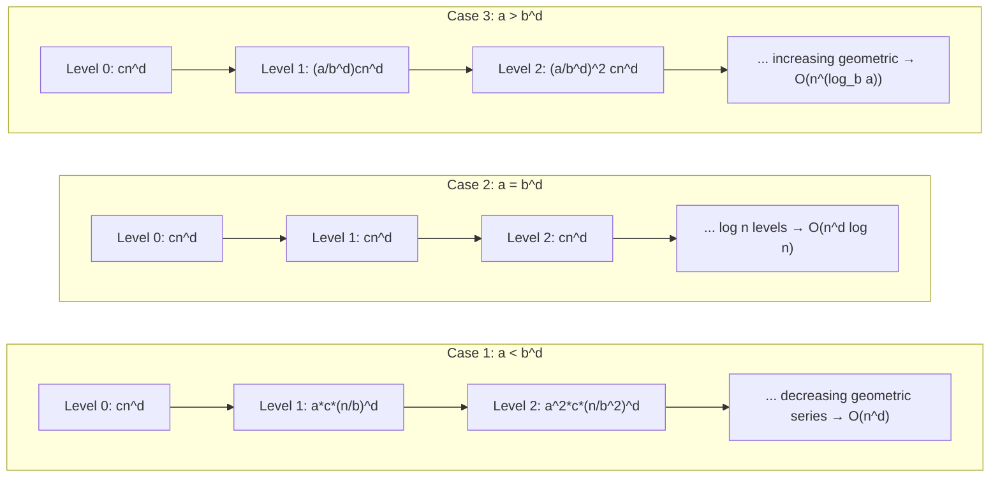
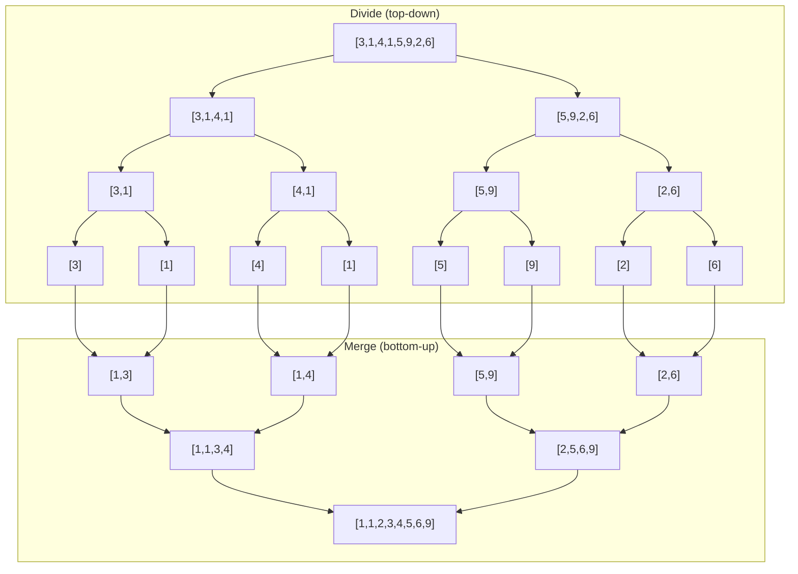
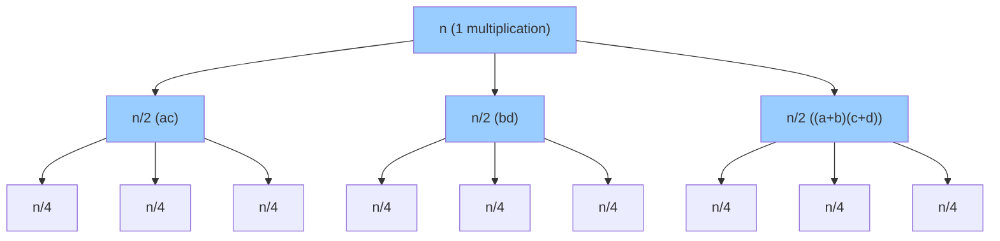

# Chapter 7: Divide and Conquer

Divide and Conquer is a powerful algorithmic paradigm that solves a problem by breaking it into smaller subproblems, solving each subproblem recursively, and then combining the solutions. This chapter covers the fundamental three‑step pattern, recurrence analysis, classic algorithms, when to avoid D&C, important interview problems, and comparisons with dynamic programming and greedy algorithms.

## 1. The Divide and Conquer Paradigm

### 1.1 Three Steps

1. **Divide**: Split the problem into smaller subproblems of the same type.
2. **Conquer**: Solve each subproblem recursively. If a subproblem is small enough, solve it directly (base case).
3. **Combine**: Merge the solutions of the subproblems into a solution for the original problem.

**Real‑life analogy**: Organising a large tournament.  
- **Divide**: Split all players into two equal halves.  
- **Conquer**: Recursively find the champion of each half.  
- **Combine**: Have the two champions play the final match.

### 1.2 Recurrence Relation

For a D&C algorithm that divides the problem into `a` subproblems of size `n/b` and takes `O(nᵈ)` time for division and combination, the recurrence is:

```
T(n) = a * T(n/b) + O(nᵈ)
```

The solution (Master Theorem) depends on the relationship between `a`, `b`, and `d`:

- If `a < bᵈ`, then `T(n) = O(nᵈ)` (work dominated by the combine step).
- If `a = bᵈ`, then `T(n) = O(nᵈ log n)`.
- If `a > bᵈ`, then `T(n) = O(n^(log_b a))` (work dominated by the recursion tree).

**Visualising the three cases** (work at each level as a geometric series):

### 1.3 Relation to Recursion

Recursion is the *mechanism* (a function calling itself). Divide and Conquer is a *strategy* that uses recursion to implement the “conquer” step. Not all recursive algorithms are D&C (e.g., DFS on a graph is recursive but not divide‑and‑conquer because it does not divide the problem into independent subproblems).

## 2. Classic Divide and Conquer Algorithms

### 2.1 Binary Search

**Problem**: Find a target value in a sorted array.

**Divide**: Compare target with the middle element.  
**Conquer**: Recursively search the left half (if target < mid) or the right half (if target > mid).  
**Combine**: No explicit combine step – just return the result.

**Recurrence**: `T(n) = T(n/2) + O(1)` → `T(n) = O(log n)`.

```cpp
int binarySearch(vector<int>& arr, int left, int right, int target) {
    if (left > right) return -1;
    int mid = left + (right - left) / 2;
    if (arr[mid] == target) return mid;
    if (arr[mid] < target) return binarySearch(arr, mid+1, right, target);
    return binarySearch(arr, left, mid-1, target);
}
```

**Real‑life analogy**: Looking up a name in a thick phone book – you open it in the middle, then decide whether to search the left or right half, repeating until you find the name.

### 2.2 Merge Sort

**Problem**: Sort an array.

**Divide**: Split the array into two halves (roughly equal size).  
**Conquer**: Recursively sort each half.  
**Combine**: Merge the two sorted halves into a single sorted array.

**Recurrence**: `T(n) = 2T(n/2) + O(n)` → `T(n) = O(n log n)`.

```cpp
void merge(vector<int>& arr, int left, int mid, int right) {
    vector<int> temp(right - left + 1);
    int i = left, j = mid+1, k = 0;
    while (i <= mid && j <= right)
        temp[k++] = (arr[i] <= arr[j]) ? arr[i++] : arr[j++];
    while (i <= mid) temp[k++] = arr[i++];
    while (j <= right) temp[k++] = arr[j++];
    for (int p = 0; p < temp.size(); ++p) arr[left + p] = temp[p];
}

void mergeSort(vector<int>& arr, int left, int right) {
    if (left >= right) return;
    int mid = left + (right - left) / 2;
    mergeSort(arr, left, mid);
    mergeSort(arr, mid+1, right);
    merge(arr, left, mid, right);
}
```

**Real‑life analogy**: Sorting a large pile of exam papers by student ID – split the pile into two halves, sort each half recursively, then merge the sorted piles by repeatedly taking the smallest top paper.

### 2.3 Quick Sort (Conceptual)

**Problem**: Sort an array.

**Divide**: Choose a pivot element, partition the array so that elements less than the pivot come before it and elements greater come after.  
**Conquer**: Recursively sort the left partition and the right partition.  
**Combine**: No explicit combine step – the array is sorted in place.

**Recurrence** (average case): `T(n) = 2T(n/2) + O(n)` → `O(n log n)`.  
**Worst case** (pivot always smallest/largest): `T(n) = T(n-1) + O(n)` → `O(n²)`.

```cpp
int partition(vector<int>& arr, int low, int high) {
    int pivot = arr[high];
    int i = low - 1;
    for (int j = low; j < high; ++j)
        if (arr[j] < pivot) swap(arr[++i], arr[j]);
    swap(arr[i+1], arr[high]);
    return i+1;
}

void quickSort(vector<int>& arr, int low, int high) {
    if (low < high) {
        int pi = partition(arr, low, high);
        quickSort(arr, low, pi-1);
        quickSort(arr, pi+1, high);
    }
}
```

**Real‑life analogy**: Sorting a dictionary by randomly picking a word (pivot) and arranging all words before/after it, then sorting the two groups independently.

### 2.4 Maximum Subarray Sum (Divide & Conquer Version)

**Problem**: Find the contiguous subarray with the largest sum.

**Divide**: Split array into left and right halves.  
**Conquer**: Recursively compute the maximum subarray sum in the left half and in the right half.  
**Combine**: The maximum subarray may cross the middle – compute the maximum sum that starts in the left and ends in the right, then take `max(leftBest, rightBest, crossBest)`.

**Recurrence**: `T(n) = 2T(n/2) + O(n)` → `O(n log n)` (Kadane’s algorithm is O(n), but this D&C version illustrates the paradigm).

```cpp
int crossSum(vector<int>& arr, int left, int mid, int right) {
    int leftSum = INT_MIN, sum = 0;
    for (int i = mid; i >= left; --i) {
        sum += arr[i];
        leftSum = max(leftSum, sum);
    }
    int rightSum = INT_MIN;
    sum = 0;
    for (int i = mid+1; i <= right; ++i) {
        sum += arr[i];
        rightSum = max(rightSum, sum);
    }
    return leftSum + rightSum;
}

int maxSubarrayDAC(vector<int>& arr, int left, int right) {
    if (left == right) return arr[left];
    int mid = left + (right - left) / 2;
    int leftMax = maxSubarrayDAC(arr, left, mid);
    int rightMax = maxSubarrayDAC(arr, mid+1, right);
    int crossMax = crossSum(arr, left, mid, right);
    return max({leftMax, rightMax, crossMax});
}
```

### 2.5 Counting Inversions

**Problem**: Count the number of pairs `(i, j)` with `i < j` and `arr[i] > arr[j]` (inversions measure how far an array is from sorted).

**Approach**: Modify merge sort. When merging two sorted halves, if an element from the right half is smaller than an element from the left half, it forms inversions with all remaining elements in the left half.

**Recurrence**: Same as merge sort: `T(n) = 2T(n/2) + O(n)` → `O(n log n)`.

```cpp
long long mergeAndCount(vector<int>& arr, int left, int mid, int right) {
    vector<int> temp;
    int i = left, j = mid+1;
    long long invCount = 0;
    while (i <= mid && j <= right) {
        if (arr[i] <= arr[j]) temp.push_back(arr[i++]);
        else {
            temp.push_back(arr[j++]);
            invCount += (mid - i + 1); // all remaining left elements > arr[j]
        }
    }
    while (i <= mid) temp.push_back(arr[i++]);
    while (j <= right) temp.push_back(arr[j++]);
    for (int k = 0; k < temp.size(); ++k) arr[left + k] = temp[k];
    return invCount;
}

long long countInversions(vector<int>& arr, int left, int right) {
    if (left >= right) return 0;
    int mid = left + (right - left) / 2;
    long long inv = countInversions(arr, left, mid);
    inv += countInversions(arr, mid+1, right);
    inv += mergeAndCount(arr, left, mid, right);
    return inv;
}
```

**Real‑life analogy**: In a crowd of people arranged by height, counting how many pairs are out of order (taller person standing before a shorter person). The divide‑and‑conquer approach counts inversions in each half and across the halves during merge.

### 2.6 Karatsuba Algorithm for Fast Multiplication

**Problem**: Multiply two large integers (or polynomials) faster than the standard O(n²) algorithm.

**Key insight**: For two n‑digit numbers `x` and `y`, write:
```
x = a * 10^(n/2) + b
y = c * 10^(n/2) + d
```
Standard multiplication: `x*y = ac*10^n + (ad+bc)*10^(n/2) + bd` → 4 multiplications (ac, ad, bc, bd) → O(n²).

Karatsuba observation: compute:
```
ac = multiply(a, c)
bd = multiply(b, d)
(ad+bc) = multiply(a+b, c+d) - ac - bd
```
This requires only 3 multiplications → recurrence `T(n) = 3T(n/2) + O(n)` → `O(n^(log₂3)) ≈ O(n^1.585)`.

```cpp
// Simplified for integers (base 10)
long long karatsuba(long long x, long long y) {
    if (x < 10 || y < 10) return x * y;
    int n = max(to_string(x).size(), to_string(y).size());
    int m = n / 2;
    long long power = pow(10, m);
    long long a = x / power, b = x % power;
    long long c = y / power, d = y % power;
    long long ac = karatsuba(a, c);
    long long bd = karatsuba(b, d);
    long long sum = karatsuba(a+b, c+d) - ac - bd;
    return ac * pow(10, 2*m) + sum * pow(10, m) + bd;
}
```

**Real‑life analogy**: Multiplying two large numbers by splitting them into halves – fewer large multiplications, more additions, which are cheaper.



### 2.7 Closest Pair of Points (2D, Conceptual)

**Problem**: Given n points in the plane, find the pair with the smallest Euclidean distance.

**Divide**: Sort points by x‑coordinate. Split into left and right halves by the median x.  
**Conquer**: Recursively find the minimum distance `δ` in the left half and in the right half.  
**Combine**: The closest pair may cross the dividing line – consider only points within `δ` of the midline; sort these by y and check each against the next few (constant number) points.

**Recurrence**: `T(n) = 2T(n/2) + O(n log n)` (for sorting by y) → can be optimised to `T(n) = 2T(n/2) + O(n)` → `O(n log n)`.

**Real‑life analogy**: Finding the two closest friends in a large party by first separating into left and right halves, finding closest pairs in each half, then checking pairs near the dividing line.

### 2.8 Fast Exponentiation (Power of a Number)

**Problem**: Compute `a^b` efficiently.

**Divide**: If `b` is even, `a^b = (a^(b/2))^2`. If odd, `a^b = a * a^(b-1)`.

**Conquer**: Recursively compute `a^(b/2)`.

**Combine**: Square the result (or multiply by `a` for odd case).

**Recurrence**: `T(n) = T(n/2) + O(1)` → `O(log b)`.

```cpp
long long fastPow(long long a, long long b) {
    if (b == 0) return 1;
    long long half = fastPow(a, b / 2);
    if (b % 2 == 0) return half * half;
    return half * half * a;
}
```

**Real‑life analogy**: Raising a number to a large power by repeatedly squaring – much faster than multiplying `a` by itself `b` times.

## 3. Divide and Conquer vs Other Paradigms

### 3.1 Divide and Conquer vs Dynamic Programming

| Aspect | Divide and Conquer | Dynamic Programming |
|--------|--------------------|---------------------|
| Subproblem nature | Independent (no overlap) | Overlapping subproblems |
| Solves | Many distinct subproblems (e.g., merge sort, quick sort) | Problems with repeated subproblems (e.g., Fibonacci, LCS) |
| Storage | Typically no memoisation | Uses memoisation or tabulation |
| Classic examples | Binary search, merge sort, closest pair | Knapsack, LCS, shortest paths |

**Key distinction**: In D&C, subproblems are *disjoint* (they do not share smaller subproblems). In DP, subproblems *overlap* (same subproblem appears multiple times).

### 3.2 Divide and Conquer vs Greedy

| Aspect | Divide and Conquer | Greedy |
|--------|--------------------|--------|
| Decision making | Solves all subproblems, then combines | Makes one locally optimal choice per step, never revisits |
| Correctness | Always correct if recursion works | Requires proof of greedy choice property |
| Examples | Merge sort, Karatsuba | Activity selection, fractional knapsack |

**Key distinction**: Greedy algorithms do not divide the problem into independent subproblems – they build a solution incrementally.

## 4. Summary Table

| Algorithm | Divide Step | Combine Step | Recurrence | Time Complexity |
|-----------|-------------|--------------|------------|-----------------|
| Binary Search | Compare with middle | None | T(n)=T(n/2)+O(1) | O(log n) |
| Merge Sort | Split into halves | Merge two sorted halves | T(n)=2T(n/2)+O(n) | O(n log n) |
| Quick Sort | Partition around pivot | None (in‑place) | Avg: 2T(n/2)+O(n) | Avg O(n log n), worst O(n²) |
| Max Subarray D&C | Split into halves | Compute cross sum | T(n)=2T(n/2)+O(n) | O(n log n) |
| Counting Inversions | Split into halves | Count cross inversions during merge | T(n)=2T(n/2)+O(n) | O(n log n) |
| Karatsuba | Split numbers into halves | Combine using 3 multiplications | T(n)=3T(n/2)+O(n) | O(n^1.585) |
| Closest Pair | Split by x‑coordinate | Check strip of width 2δ | T(n)=2T(n/2)+O(n) | O(n log n) |
| Fast Exponentiation | Reduce exponent by half | Square/multiply | T(n)=T(n/2)+O(1) | O(log n) |

## 5. When NOT to Use Divide and Conquer

Despite its elegance, D&C is not always the best choice. Recognising when to avoid it is as important as knowing when to apply it.

### 5.1 Overlapping Subproblems → Use Dynamic Programming

If subproblems are not independent but overlap significantly, D&C will recompute the same subproblems many times, leading to exponential time. DP avoids this by storing results.

**Example**: Fibonacci numbers. D&C recursion `fib(n) = fib(n-1) + fib(n-2)` recomputes the same values exponentially (O(2ⁿ)). DP solves it in O(n).

**Key question**: Does the same subproblem appear repeatedly? If yes, consider DP.

### 5.2 Too Expensive Combine Step

Even if the divide and conquer steps are efficient, a costly combine operation can dominate the runtime.

**Example**: Simple recursive matrix multiplication (divide into 4 submatrices, 8 multiplications) has combine step O(n²) but still yields O(n³) – the same as naive. Strassen’s algorithm reduces multiplications to 7, making the combine step worthwhile only for large n. If the combine step cannot be made sub‑linear or linear, D&C may not improve over brute force.

### 5.3 Problem Size Does Not Reduce Significantly

If the problem cannot be divided into substantially smaller subproblems (e.g., each subproblem is only one or two elements smaller), the recursion depth becomes O(n) and the total complexity may degrade to O(n²) or worse.

**Example**: Quick sort with poor pivot choice degrades to O(n²). In such cases, iterative algorithms or different paradigms (like heap sort) are better.

### 5.4 Recursion Overhead Is Too High

For very small input sizes, the overhead of function calls and stack management can outweigh the benefits of divide and conquer. In practice, many D&C algorithms switch to a simple iterative sort (e.g., insertion sort) for small subarrays – this is called **hybrid approach**.

### 5.5 The Problem Is Already Solved More Simply

Sometimes a greedy or direct mathematical formula exists.

**Example**: Finding the maximum subarray sum – D&C gives O(n log n), but Kadane’s algorithm solves it in O(n) with O(1) space. Similarly, median of two sorted arrays can be solved with binary search (D&C) but can also be approached with two‑pointer merging (though less efficient).

### Decision Flowchart

```
Is there overlapping subproblems? → YES → Use DP
NO → Does the combine step take > O(n log n)? → YES → Consider alternative
NO → Does the problem size reduce significantly? → YES → D&C may work
```

## 6. Important Interview Problems (Divide & Conquer Edition)

The following problems frequently appear in coding interviews and have elegant D&C solutions.

### 6.1 Majority Element (D&C Version)

**Problem**: Find the element that appears more than ⌊n/2⌋ times in an array (assume such an element exists).

**D&C approach**: Divide the array into two halves. Find the majority candidate in the left half and in the right half. If they are the same, that is the global majority. If different, count their frequencies in the whole array – the one with the higher count is the answer.

**Recurrence**: `T(n) = 2T(n/2) + O(n)` → O(n log n) (Moore’s voting algorithm is O(n), but D&C version is instructive).

```cpp
int countFreq(vector<int>& nums, int target, int left, int right) {
    int cnt = 0;
    for (int i = left; i <= right; ++i)
        if (nums[i] == target) cnt++;
    return cnt;
}

int majorityElementDC(vector<int>& nums, int left, int right) {
    if (left == right) return nums[left];
    int mid = left + (right - left) / 2;
    int leftMaj = majorityElementDC(nums, left, mid);
    int rightMaj = majorityElementDC(nums, mid+1, right);
    if (leftMaj == rightMaj) return leftMaj;
    int leftCount = countFreq(nums, leftMaj, left, right);
    int rightCount = countFreq(nums, rightMaj, left, right);
    return leftCount > rightCount ? leftMaj : rightMaj;
}
```

### 6.2 The Skyline Problem

**Problem**: Given a list of buildings (left, right, height), return the skyline (list of key points where the height changes).

**D&C approach**:
- Divide the list of buildings into two halves.
- Recursively compute the skyline for each half.
- Merge the two skylines by sweeping from left to right, always keeping the taller height.

**Time**: O(n log n). **Space**: O(n).

*(Full implementation is lengthy; the key insight is that merging skylines is similar to merging two sequences of horizontal segments.)*

### 6.3 Search in Rotated Sorted Array

**Problem**: A sorted array is rotated at an unknown pivot. Search for a target in O(log n).

**D&C / Binary Search approach**: Find which half is sorted and decide where to search.

```cpp
int searchRotated(vector<int>& nums, int target) {
    int left = 0, right = nums.size() - 1;
    while (left <= right) {
        int mid = left + (right - left) / 2;
        if (nums[mid] == target) return mid;
        if (nums[left] <= nums[mid]) { // left half sorted
            if (target >= nums[left] && target < nums[mid])
                right = mid - 1;
            else
                left = mid + 1;
        } else { // right half sorted
            if (target > nums[mid] && target <= nums[right])
                left = mid + 1;
            else
                right = mid - 1;
        }
    }
    return -1;
}
```

**Time**: O(log n). This is essentially binary search with an extra condition – a pure D&C example.

### 6.4 Median of Two Sorted Arrays

**Problem**: Find the median of two sorted arrays of sizes m and n in O(log(m+n)) time.

**D&C / Binary Search approach**: Partition both arrays such that the left part contains (m+n+1)/2 elements and the maximum of the left part is less than or equal to the minimum of the right part.

```cpp
double findMedianSortedArrays(vector<int>& nums1, vector<int>& nums2) {
    if (nums1.size() > nums2.size())
        return findMedianSortedArrays(nums2, nums1);
    int m = nums1.size(), n = nums2.size();
    int low = 0, high = m;
    while (low <= high) {
        int partition1 = (low + high) / 2;
        int partition2 = (m + n + 1) / 2 - partition1;
        int maxLeft1 = (partition1 == 0) ? INT_MIN : nums1[partition1 - 1];
        int minRight1 = (partition1 == m) ? INT_MAX : nums1[partition1];
        int maxLeft2 = (partition2 == 0) ? INT_MIN : nums2[partition2 - 1];
        int minRight2 = (partition2 == n) ? INT_MAX : nums2[partition2];
        if (maxLeft1 <= minRight2 && maxLeft2 <= minRight1) {
            if ((m + n) % 2 == 0)
                return (max(maxLeft1, maxLeft2) + min(minRight1, minRight2)) / 2.0;
            else
                return max(maxLeft1, maxLeft2);
        } else if (maxLeft1 > minRight2) {
            high = partition1 - 1;
        } else {
            low = partition1 + 1;
        }
    }
    return 0.0;
}
```

**Time**: O(log(min(m, n))). This is a classic divide‑and‑conquer (binary search) on the smaller array.

## 7. When to Apply D&C – Quick Reference

| Condition | Recommendation |
|-----------|----------------|
| Problem can be split into independent subproblems | ✅ Consider D&C |
| Subproblems overlap significantly | ❌ Use DP |
| Combine step is O(n) or O(n log n) and problem size halves | ✅ D&C likely works |
| Combine step is O(n²) or higher | ❌ Look for alternative |
| Problem is naturally recursive (trees, divide‑and‑conquer patterns) | ✅ D&C is natural |

The next chapter will cover dynamic programming in depth (overlapping subproblems, tabulation vs memoization, and classic DP problems).
