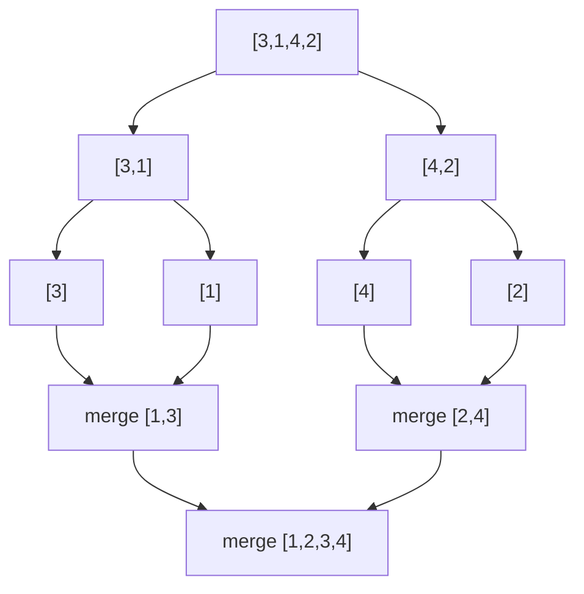

# Chapter 8: Sorting and Searching

This chapter covers essential sorting algorithms (comparison‑based and non‑comparison) and searching techniques, including binary search variations. Each algorithm includes asymptotic analysis, stability, in‑place property, and C++ implementation.

## 1. Sorting Algorithms Overview

Sorting arranges elements in a specific order (ascending/descending). Choice of algorithm depends on input size, data characteristics, and space constraints.

### 1.1 Comparison Matrix

| Algorithm     | Best Case | Average Case | Worst Case | Space | Stable | In‑place |
|---------------|-----------|--------------|------------|-------|--------|----------|
| Bubble Sort   | O(n)      | O(n²)        | O(n²)      | O(1)  | Yes    | Yes      |
| Selection Sort| O(n²)     | O(n²)        | O(n²)      | O(1)  | No     | Yes      |
| Insertion Sort| O(n)      | O(n²)        | O(n²)      | O(1)  | Yes    | Yes      |
| Merge Sort    | O(n log n)| O(n log n)   | O(n log n) | O(n)  | Yes    | No       |
| Quick Sort    | O(n log n)| O(n log n)   | O(n²)      | O(log n)| No   | Yes      |
| Heap Sort     | O(n log n)| O(n log n)   | O(n log n) | O(1)  | No     | Yes      |
| Counting Sort | O(n+k)    | O(n+k)       | O(n+k)     | O(k)  | Yes    | No       |
| Radix Sort    | O(nk)     | O(nk)        | O(nk)      | O(n+k)| Yes    | No       |

### 1.2 Key Concepts

- **Comparison‑based sort**: Uses element comparisons (e.g., `<`, `>`). Lower bound Ω(n log n) for worst case.
- **Non‑comparison sort**: Uses digit or value properties. Can achieve O(n) under constraints.
- **In‑place**: Requires O(1) extra memory (excluding input).
- **Stable**: Preserves relative order of equal elements.
- **Adaptive**: Takes advantage of existing order (e.g., Insertion, Bubble).

## 2. Comparison‑Based Sorts

### 2.1 Bubble Sort

**What**: Repeatedly swaps adjacent elements if out of order, pushing the largest element to the end each pass.

**When to use**: Educational purposes, nearly sorted small arrays.

```cpp
void bubbleSort(vector<int>& arr) {
    int n = arr.size();
    for (int i = 0; i < n - 1; ++i) {
        bool swapped = false;
        for (int j = 0; j < n - i - 1; ++j) {
            if (arr[j] > arr[j + 1]) {
                swap(arr[j], arr[j + 1]);
                swapped = true;
            }
        }
        if (!swapped) break; // adaptive
    }
}
```

**Real-life analogy**: Bubbles rising in a glass of soda – larger bubbles (elements) move up faster.

### 2.2 Selection Sort

**What**: Repeatedly selects the minimum element from the unsorted part and swaps it with the first unsorted element.

```cpp
void selectionSort(vector<int>& arr) {
    int n = arr.size();
    for (int i = 0; i < n - 1; ++i) {
        int minIdx = i;
        for (int j = i + 1; j < n; ++j)
            if (arr[j] < arr[minIdx]) minIdx = j;
        swap(arr[i], arr[minIdx]);
    }
}
```

**When to use**: When memory writes are expensive (minimal swaps: O(n)).

### 2.3 Insertion Sort

**What**: Builds the sorted array one element at a time by inserting each element into its correct position.

```cpp
void insertionSort(vector<int>& arr) {
    int n = arr.size();
    for (int i = 1; i < n; ++i) {
        int key = arr[i];
        int j = i - 1;
        while (j >= 0 && arr[j] > key) {
            arr[j + 1] = arr[j];
            j--;
        }
        arr[j + 1] = key;
    }
}
```

**When to use**: Small arrays (n ≤ 20), partially sorted data, online sorting (receiving stream).

**Real-life analogy**: Sorting a hand of playing cards – take one card and insert it into the correct position.

### 2.4 Merge Sort

**What**: Divide‑and‑conquer: split array in half, sort each half recursively, merge sorted halves.

```cpp
void merge(vector<int>& arr, int left, int mid, int right) {
    vector<int> temp(right - left + 1);
    int i = left, j = mid + 1, k = 0;
    while (i <= mid && j <= right)
        temp[k++] = (arr[i] <= arr[j]) ? arr[i++] : arr[j++];
    while (i <= mid) temp[k++] = arr[i++];
    while (j <= right) temp[k++] = arr[j++];
    for (int p = 0; p < temp.size(); ++p) arr[left + p] = temp[p];
}

void mergeSort(vector<int>& arr, int left, int right) {
    if (left >= right) return;
    int mid = left + (right - left) / 2;
    mergeSort(arr, left, mid);
    mergeSort(arr, mid + 1, right);
    merge(arr, left, mid, right);
}
```

**When to use**: Large datasets, stable sorting required, linked lists (no extra array needed for LL).

**Time**: O(n log n) always. **Space**: O(n) for array.



### 2.5 Quick Sort

**What**: Picks a pivot, partitions array into elements < pivot and > pivot, recursively sorts partitions.

```cpp
int partition(vector<int>& arr, int low, int high) {
    int pivot = arr[high];
    int i = low - 1;
    for (int j = low; j < high; ++j) {
        if (arr[j] < pivot) swap(arr[++i], arr[j]);
    }
    swap(arr[i + 1], arr[high]);
    return i + 1;
}

void quickSort(vector<int>& arr, int low, int high) {
    if (low < high) {
        int pi = partition(arr, low, high);
        quickSort(arr, low, pi - 1);
        quickSort(arr, pi + 1, high);
    }
}
```

**When to use**: General purpose, fastest on average, in‑place. Avoid on already sorted data (use random pivot).

**Tail recursion optimisation** can reduce stack space.

### 2.6 Heap Sort

**What**: Build a max‑heap, repeatedly extract root to end, heapify remaining.

```cpp
void heapify(vector<int>& arr, int n, int i) {
    int largest = i;
    int left = 2 * i + 1, right = 2 * i + 2;
    if (left < n && arr[left] > arr[largest]) largest = left;
    if (right < n && arr[right] > arr[largest]) largest = right;
    if (largest != i) {
        swap(arr[i], arr[largest]);
        heapify(arr, n, largest);
    }
}

void heapSort(vector<int>& arr) {
    int n = arr.size();
    for (int i = n/2 - 1; i >= 0; --i) heapify(arr, n, i);
    for (int i = n - 1; i > 0; --i) {
        swap(arr[0], arr[i]);
        heapify(arr, i, 0);
    }
}
```

**When to use**: Guaranteed O(n log n), O(1) extra space, but unstable and slower than Quick Sort in practice.

## 3. Non‑Comparison Sorts

### 3.1 Counting Sort

**What**: Count occurrences of each value (assuming small range [0, k‑1]), then compute prefix sums to place elements in output.

```cpp
void countingSort(vector<int>& arr) {
    if (arr.empty()) return;
    int maxVal = *max_element(arr.begin(), arr.end());
    int minVal = *min_element(arr.begin(), arr.end());
    int range = maxVal - minVal + 1;
    vector<int> count(range, 0), output(arr.size());
    for (int x : arr) count[x - minVal]++;
    for (int i = 1; i < range; ++i) count[i] += count[i-1];
    for (int i = arr.size() - 1; i >= 0; --i) {
        output[count[arr[i] - minVal] - 1] = arr[i];
        count[arr[i] - minVal]--;
    }
    arr = output;
}
```

**When to use**: When range k is not too larger than n (k = O(n)). Stable version available.

### 3.2 Radix Sort

**What**: Sort digits from least significant to most significant using a stable sort (e.g., counting sort per digit).

```cpp
void countingSortByDigit(vector<int>& arr, int exp) {
    vector<int> output(arr.size());
    int count[10] = {0};
    for (int x : arr) count[(x / exp) % 10]++;
    for (int i = 1; i < 10; ++i) count[i] += count[i-1];
    for (int i = arr.size() - 1; i >= 0; --i) {
        int digit = (arr[i] / exp) % 10;
        output[count[digit] - 1] = arr[i];
        count[digit]--;
    }
    arr = output;
}

void radixSort(vector<int>& arr) {
    int maxVal = *max_element(arr.begin(), arr.end());
    for (int exp = 1; maxVal / exp > 0; exp *= 10)
        countingSortByDigit(arr, exp);
}
```

**When to use**: Fixed‑length integer keys, when range is large but digit count small.

## 4. Searching

### 4.1 Linear Search

**What**: Traverse the array sequentially until target is found.

```cpp
int linearSearch(vector<int>& arr, int target) {
    for (int i = 0; i < arr.size(); ++i)
        if (arr[i] == target) return i;
    return -1;
}
```

**When to use**: Unsorted data, small arrays, or when data is not random‑access (e.g., linked list).

### 4.2 Binary Search (Iterative & Recursive)

**What**: Repeatedly divide sorted array in half, discarding the half that cannot contain the target.

```cpp
int binarySearchIterative(vector<int>& arr, int target) {
    int left = 0, right = arr.size() - 1;
    while (left <= right) {
        int mid = left + (right - left) / 2;
        if (arr[mid] == target) return mid;
        else if (arr[mid] < target) left = mid + 1;
        else right = mid - 1;
    }
    return -1;
}

// Recursive version
int binarySearchRecursive(vector<int>& arr, int left, int right, int target) {
    if (left > right) return -1;
    int mid = left + (right - left) / 2;
    if (arr[mid] == target) return mid;
    if (arr[mid] < target) return binarySearchRecursive(arr, mid + 1, right, target);
    return binarySearchRecursive(arr, left, mid - 1, target);
}
```

**Time**: O(log n). **Space**: O(1) iterative, O(log n) recursive (stack).

### 4.3 Binary Search Variations

#### First Occurrence

Return the smallest index where target appears.

```cpp
int firstOccurrence(vector<int>& arr, int target) {
    int left = 0, right = arr.size() - 1, result = -1;
    while (left <= right) {
        int mid = left + (right - left) / 2;
        if (arr[mid] == target) {
            result = mid;
            right = mid - 1;  // continue left
        } else if (arr[mid] < target) left = mid + 1;
        else right = mid - 1;
    }
    return result;
}
```

#### Last Occurrence

Similarly, move `left` to `mid + 1` on match.

#### Search in Rotated Sorted Array

**Problem**: Find target in a sorted array that has been rotated (e.g., [4,5,6,7,0,1,2]).

**Approach**: Determine which half is sorted and check if target lies in it.

```cpp
int searchRotated(vector<int>& arr, int target) {
    int left = 0, right = arr.size() - 1;
    while (left <= right) {
        int mid = left + (right - left) / 2;
        if (arr[mid] == target) return mid;
        // left half sorted
        if (arr[left] <= arr[mid]) {
            if (target >= arr[left] && target < arr[mid]) right = mid - 1;
            else left = mid + 1;
        }
        // right half sorted
        else {
            if (target > arr[mid] && target <= arr[right]) left = mid + 1;
            else right = mid - 1;
        }
    }
    return -1;
}
```

#### Find Peak Element

**Problem**: Find any peak element (arr[i] > neighbours). Assume arr[-1] = arr[n] = -∞.

```cpp
int findPeak(vector<int>& arr) {
    int left = 0, right = arr.size() - 1;
    while (left < right) {
        int mid = left + (right - left) / 2;
        if (arr[mid] > arr[mid + 1]) right = mid;
        else left = mid + 1;
    }
    return left;
}
```

### 4.4 Ternary Search

**What**: Split array into three parts instead of two. Compare target with two midpoints.

```cpp
int ternarySearch(vector<int>& arr, int left, int right, int target) {
    if (left > right) return -1;
    int mid1 = left + (right - left) / 3;
    int mid2 = right - (right - left) / 3;
    if (arr[mid1] == target) return mid1;
    if (arr[mid2] == target) return mid2;
    if (target < arr[mid1]) return ternarySearch(arr, left, mid1 - 1, target);
    else if (target > arr[mid2]) return ternarySearch(arr, mid2 + 1, right, target);
    else return ternarySearch(arr, mid1 + 1, mid2 - 1, target);
}
```

**Complexity**: O(log₃ n) ≈ O(log n) but with higher constant. Rarely used in practice.

## 5. Summary

| Sort | Best for | Avoid when |
|------|----------|------------|
| Insertion | Small or nearly sorted | Large random data |
| Merge | Stable sort, large data | Tight memory constraints |
| Quick | General purpose, in‑place | Already sorted (worst case) |
| Heap | Guaranteed O(n log n), O(1) space | Stability needed |
| Counting/Radix | Integer keys with limited range | Wide value range or custom objects |

**Searching**:
- Linear: unsorted or small arrays
- Binary: sorted arrays, O(log n)
- Rotated search: requires adapted binary search

The next chapter will cover tree data structures (binary trees, BST, AVL, etc.).