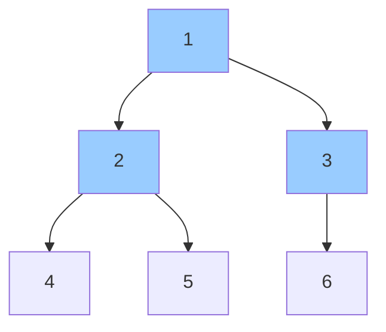

# Chapter 10: Trees

Trees are hierarchical data structures where each node has zero or more children. This chapter covers binary trees, binary search trees, balanced BSTs, heaps, and advanced trees (Trie, Segment Tree, Fenwick Tree, Disjoint Set Union). Each section includes definitions, operations, complexity, C++ code, and real‑life analogies.

## 1. Binary Trees

A binary tree is a tree where each node has at most two children: left and right.

### 1.1 Terminology

- **Root**: Topmost node (no parent).
- **Parent / Child**: Direct connection upward / downward.
- **Leaf**: Node with no children.
- **Height**: Number of edges on the longest path from node to a leaf (root height = tree height).
- **Depth**: Number of edges from root to the node.

```
      1 (root, depth=0)
     / \
    2   3
   / \   \
  4   5   6 (leaf)
```

**Height of node 1** = 2 (path 1‑2‑5 or 1‑3‑6).  
**Depth of node 5** = 2.

**Real‑life analogy**: A family genealogy tree – root is the earliest ancestor, children are descendants, leaves are people with no known descendants.

### 1.2 Tree Traversals

Traversal = visiting every node exactly once.

#### Depth‑First Search (DFS) variants

| Traversal | Order | Use Case |
|-----------|-------|----------|
| Preorder | root → left → right | Copying tree, prefix expression |
| Inorder | left → root → right | BST gives sorted order |
| Postorder | left → right → root | Deleting tree, postfix expression |

**Recursive implementations**:

```cpp
struct TreeNode {
    int val;
    TreeNode *left, *right;
    TreeNode(int x) : val(x), left(nullptr), right(nullptr) {}
};

void preorder(TreeNode* root) {
    if (!root) return;
    cout << root->val << " ";
    preorder(root->left);
    preorder(root->right);
}

void inorder(TreeNode* root) {
    if (!root) return;
    inorder(root->left);
    cout << root->val << " ";
    inorder(root->right);
}

void postorder(TreeNode* root) {
    if (!root) return;
    postorder(root->left);
    postorder(root->right);
    cout << root->val << " ";
}
```

**Iterative inorder (using stack)**:

```cpp
void inorderIterative(TreeNode* root) {
    stack<TreeNode*> st;
    TreeNode* curr = root;
    while (curr || !st.empty()) {
        while (curr) {
            st.push(curr);
            curr = curr->left;
        }
        curr = st.top(); st.pop();
        cout << curr->val << " ";
        curr = curr->right;
    }
}
```

#### Breadth‑First Search (Level Order)

Visits level by level. Uses a queue.

```cpp
void levelOrder(TreeNode* root) {
    if (!root) return;
    queue<TreeNode*> q;
    q.push(root);
    while (!q.empty()) {
        TreeNode* node = q.front(); q.pop();
        cout << node->val << " ";
        if (node->left) q.push(node->left);
        if (node->right) q.push(node->right);
    }
}
```



- Preorder: 1,2,4,5,3,6  
- Inorder: 4,2,5,1,3,6  
- Postorder: 4,5,2,6,3,1  
- Level order: 1,2,3,4,5,6

### 1.3 Construction of Tree from Traversals

**From inorder and preorder**: First element of preorder is root. Find it in inorder – left part is left subtree, right part is right subtree. Recurse.

```cpp
TreeNode* buildTree(vector<int>& preorder, vector<int>& inorder, int preStart, int inStart, int inEnd, unordered_map<int,int>& inMap) {
    if (preStart >= preorder.size() || inStart > inEnd) return nullptr;
    TreeNode* root = new TreeNode(preorder[preStart]);
    int rootIdx = inMap[root->val];
    int leftSize = rootIdx - inStart;
    root->left = buildTree(preorder, inorder, preStart+1, inStart, rootIdx-1, inMap);
    root->right = buildTree(preorder, inorder, preStart+leftSize+1, rootIdx+1, inEnd, inMap);
    return root;
}
```

### 1.4 Diameter of Binary Tree

**Definition**: The longest path (in edges) between any two nodes. It may or may not pass through the root.

**Approach**: For each node, compute height of left and right subtrees, update diameter as `leftHeight + rightHeight`. Return height.

```cpp
int diameter(TreeNode* root, int& res) {
    if (!root) return 0;
    int left = diameter(root->left, res);
    int right = diameter(root->right, res);
    res = max(res, left + right);
    return 1 + max(left, right);
}
int diameterOfBinaryTree(TreeNode* root) {
    int res = 0;
    diameter(root, res);
    return res;
}
```

### 1.5 Lowest Common Ancestor (LCA)

**Definition**: The deepest node that is an ancestor of both given nodes p and q.

**Approach**: Recursively search. If root matches p or q, return root. Otherwise, recurse left and right. If both sides return non‑null, LCA is root; else return the non‑null side.

```cpp
TreeNode* lowestCommonAncestor(TreeNode* root, TreeNode* p, TreeNode* q) {
    if (!root || root == p || root == q) return root;
    TreeNode* left = lowestCommonAncestor(root->left, p, q);
    TreeNode* right = lowestCommonAncestor(root->right, p, q);
    if (left && right) return root;
    return left ? left : right;
}
```

**Real‑life analogy**: Finding the common manager of two employees in an organisational hierarchy.

### 1.6 Maximum Path Sum

**Problem**: Find the maximum sum path between any two nodes (values can be negative).

**Approach**: For each node, compute the maximum gain from its left and right children (negative gains are ignored). Update global maximum as `root->val + leftGain + rightGain`. Return `root->val + max(leftGain, rightGain)` to parent.

```cpp
int maxPathSum(TreeNode* root, int& ans) {
    if (!root) return 0;
    int left = max(0, maxPathSum(root->left, ans));
    int right = max(0, maxPathSum(root->right, ans));
    ans = max(ans, root->val + left + right);
    return root->val + max(left, right);
}
int maxPathSum(TreeNode* root) {
    int ans = INT_MIN;
    maxPathSum(root, ans);
    return ans;
}
```

## 2. Binary Search Trees (BST)

**Property**: For every node, all nodes in left subtree have value < node value, and all nodes in right subtree have value > node value. No duplicates.

### 2.1 Search, Insert, Delete

**Search**: O(log n) average, O(n) worst (skewed).

```cpp
TreeNode* searchBST(TreeNode* root, int val) {
    while (root && root->val != val) {
        if (val < root->val) root = root->left;
        else root = root->right;
    }
    return root;
}
```

**Insert**: O(log n) average.

```cpp
TreeNode* insertIntoBST(TreeNode* root, int val) {
    if (!root) return new TreeNode(val);
    if (val < root->val) root->left = insertIntoBST(root->left, val);
    else if (val > root->val) root->right = insertIntoBST(root->right, val);
    return root;
}
```

**Delete**: Three cases: leaf, one child, two children. For two children, replace with inorder successor (smallest in right subtree) or predecessor (largest in left).

```cpp
TreeNode* findMin(TreeNode* root) {
    while (root->left) root = root->left;
    return root;
}
TreeNode* deleteNode(TreeNode* root, int key) {
    if (!root) return nullptr;
    if (key < root->val) root->left = deleteNode(root->left, key);
    else if (key > root->val) root->right = deleteNode(root->right, key);
    else {
        if (!root->left) return root->right;
        if (!root->right) return root->left;
        TreeNode* succ = findMin(root->right);
        root->val = succ->val;
        root->right = deleteNode(root->right, succ->val);
    }
    return root;
}
```

### 2.2 Validate BST

Check that every node respects the BST property with a valid range.

```cpp
bool isValidBST(TreeNode* root, long long minVal = LLONG_MIN, long long maxVal = LLONG_MAX) {
    if (!root) return true;
    if (root->val <= minVal || root->val >= maxVal) return false;
    return isValidBST(root->left, minVal, root->val) &&
           isValidBST(root->right, root->val, maxVal);
}
```

### 2.3 Kth Smallest / Largest Element

**Kth smallest**: Inorder traversal yields sorted order. Count while traversing.

```cpp
int kthSmallest(TreeNode* root, int k) {
    stack<TreeNode*> st;
    TreeNode* curr = root;
    while (curr || !st.empty()) {
        while (curr) { st.push(curr); curr = curr->left; }
        curr = st.top(); st.pop();
        if (--k == 0) return curr->val;
        curr = curr->right;
    }
    return -1;
}
```

**Kth largest**: Reverse inorder (right‑root‑left) or `n - k + 1`th smallest.

### 2.4 Range Sum Queries

Sum of all node values between L and R (inclusive). Recursive.

```cpp
int rangeSumBST(TreeNode* root, int L, int R) {
    if (!root) return 0;
    if (root->val < L) return rangeSumBST(root->right, L, R);
    if (root->val > R) return rangeSumBST(root->left, L, R);
    return root->val + rangeSumBST(root->left, L, R) + rangeSumBST(root->right, L, R);
}
```

## 3. Balanced BSTs (Conceptual)

Balanced BSTs maintain O(log n) height after insertions/deletions.

### 3.1 AVL Trees

**Balance factor** = height(left) – height(right). Allowed values: -1, 0, 1.

**Rotations**: Left, Right, Left‑Right, Right‑Left to restore balance after insertion/deletion.

**Use case**: When worst‑case O(log n) is required (e.g., database indexes).

### 3.2 Red‑Black Trees

**Rules** (simplified):
1. Root is black.
2. Red nodes have black children.
3. Every path from root to leaf has the same number of black nodes.

**Why used**: C++ `std::map` and `std::set` are typically implemented as Red‑Black trees. Fewer rotations than AVL, good performance.

## 4. Heap (Binary Heap)

A complete binary tree (all levels filled except possibly last, which fills left‑to‑right). Stored as an array: parent at index i, children at 2i+1 and 2i+2.

**Min‑heap**: parent ≤ children (smallest at root).  
**Max‑heap**: parent ≥ children (largest at root).

### 4.1 Array Representation

```
Indices:  0    1    2    3    4    5
Values:   10   15   20   25   30   35
```

Parent of i = (i-1)/2. Left child = 2i+1. Right child = 2i+2.

### 4.2 Heap Operations

| Operation | Time |
|-----------|------|
| `insert` | O(log n) – bubble up |
| `extractMin` (or max) | O(log n) – swap root with last, heapify down |
| `getMin` | O(1) |
| `heapify` (build from array) | O(n) |

```cpp
class MinHeap {
    vector<int> heap;
    void heapifyUp(int i) {
        while (i > 0 && heap[i] < heap[(i-1)/2]) {
            swap(heap[i], heap[(i-1)/2]);
            i = (i-1)/2;
        }
    }
    void heapifyDown(int i) {
        int n = heap.size();
        while (true) {
            int left = 2*i+1, right = 2*i+2, smallest = i;
            if (left < n && heap[left] < heap[smallest]) smallest = left;
            if (right < n && heap[right] < heap[smallest]) smallest = right;
            if (smallest == i) break;
            swap(heap[i], heap[smallest]);
            i = smallest;
        }
    }
public:
    void push(int val) {
        heap.push_back(val);
        heapifyUp(heap.size()-1);
    }
    int pop() {
        if (heap.empty()) throw;
        int root = heap[0];
        heap[0] = heap.back();
        heap.pop_back();
        if (!heap.empty()) heapifyDown(0);
        return root;
    }
    int top() const { return heap[0]; }
};
```

### 4.3 Heap Sort

Build max‑heap, repeatedly swap root with last element and heapify reduced heap.

```cpp
void heapSort(vector<int>& arr) {
    int n = arr.size();
    // build heap using heapify
    for (int i = n/2-1; i >= 0; --i) heapify(arr, n, i);
    for (int i = n-1; i > 0; --i) {
        swap(arr[0], arr[i]);
        heapify(arr, i, 0);
    }
}
```

### 4.4 Priority Queue in C++

`priority_queue<int>` (max‑heap), `priority_queue<int, vector<int>, greater<int>>` (min‑heap).

## 5. Advanced Trees

### 5.1 Trie (Prefix Tree)

**What**: A tree where each node represents a character. Used for fast prefix‑based searches (auto‑complete, spell checking).

**Node structure**:

```cpp
struct TrieNode {
    bool isEnd;
    TrieNode* children[26];
    TrieNode() : isEnd(false) { fill(begin(children), end(children), nullptr); }
};
```

**Operations**:

- `insert(word)`: traverse, create nodes as needed, mark last as end.
- `search(word)`: traverse; last node must have isEnd=true.
- `startsWith(prefix)`: returns true if prefix exists.

```cpp
class Trie {
    TrieNode* root;
public:
    Trie() : root(new TrieNode()) {}
    
    void insert(string word) {
        TrieNode* node = root;
        for (char c : word) {
            int idx = c - 'a';
            if (!node->children[idx]) node->children[idx] = new TrieNode();
            node = node->children[idx];
        }
        node->isEnd = true;
    }
    
    bool search(string word) {
        TrieNode* node = root;
        for (char c : word) {
            int idx = c - 'a';
            if (!node->children[idx]) return false;
            node = node->children[idx];
        }
        return node->isEnd;
    }
    
    bool startsWith(string prefix) {
        TrieNode* node = root;
        for (char c : prefix) {
            int idx = c - 'a';
            if (!node->children[idx]) return false;
            node = node->children[idx];
        }
        return true;
    }
};
```

**Time**: O(len) per operation. **Space**: O(total characters across words).

**Real‑life analogy**: A dictionary organised by prefixes – from "A" to "Z", each level refines the search.

### 5.2 Segment Tree

**What**: A binary tree used for answering range queries (e.g., sum, min, max) and point updates in O(log n).

**Construction**: Leaf nodes store array values; internal nodes store aggregated value of children.

**Range query**: Recursively traverse, combining results from relevant segments.

```cpp
class SegmentTree {
    vector<int> tree;
    int n;
    void build(vector<int>& arr, int node, int l, int r) {
        if (l == r) tree[node] = arr[l];
        else {
            int mid = (l + r) / 2;
            build(arr, 2*node+1, l, mid);
            build(arr, 2*node+2, mid+1, r);
            tree[node] = tree[2*node+1] + tree[2*node+2];
        }
    }
    void update(int idx, int val, int node, int l, int r) {
        if (l == r) tree[node] = val;
        else {
            int mid = (l + r) / 2;
            if (idx <= mid) update(idx, val, 2*node+1, l, mid);
            else update(idx, val, 2*node+2, mid+1, r);
            tree[node] = tree[2*node+1] + tree[2*node+2];
        }
    }
    int query(int ql, int qr, int node, int l, int r) {
        if (qr < l || ql > r) return 0;
        if (ql <= l && r <= qr) return tree[node];
        int mid = (l + r) / 2;
        return query(ql, qr, 2*node+1, l, mid) + query(ql, qr, 2*node+2, mid+1, r);
    }
public:
    SegmentTree(vector<int>& arr) {
        n = arr.size();
        tree.resize(4 * n);
        build(arr, 0, 0, n-1);
    }
    void update(int idx, int val) { update(idx, val, 0, 0, n-1); }
    int query(int l, int r) { return query(l, r, 0, 0, n-1); }
};
```

**Lazy propagation**: Delays updates to range intervals (e.g., adding a constant to a range) – stores pending updates in nodes.

### 5.3 Fenwick Tree (Binary Indexed Tree)

**What**: Simpler than segment tree for prefix sums and point updates. Uses O(n) space, O(log n) operations.

**Idea**: Each index i stores sum of a range `(i - LSB(i) + 1) .. i`.

```cpp
class FenwickTree {
    vector<int> bit;
    int n;
public:
    FenwickTree(int size) : n(size), bit(size+1, 0) {}
    void update(int idx, int delta) {  // 1‑based index
        while (idx <= n) {
            bit[idx] += delta;
            idx += idx & -idx;
        }
    }
    int query(int idx) { // prefix sum [1..idx]
        int sum = 0;
        while (idx > 0) {
            sum += bit[idx];
            idx -= idx & -idx;
        }
        return sum;
    }
    int rangeSum(int l, int r) { return query(r) - query(l-1); }
};
```

**Use cases**: Counting inversions, frequency arrays, prefix sums.

### 5.4 Disjoint Set Union (Union‑Find)

**What**: Data structure for tracking a partition of elements into disjoint sets. Supports `find` (which set does element belong to?) and `union` (merge two sets).

**Optimisations**: Path compression + union by rank / size.

```cpp
class DSU {
    vector<int> parent, rank;
public:
    DSU(int n) {
        parent.resize(n);
        rank.resize(n, 0);
        for (int i = 0; i < n; ++i) parent[i] = i;
    }
    int find(int x) {
        if (parent[x] != x) parent[x] = find(parent[x]); // path compression
        return parent[x];
    }
    void unite(int x, int y) {
        int rx = find(x), ry = find(y);
        if (rx == ry) return;
        if (rank[rx] < rank[ry]) parent[rx] = ry;
        else if (rank[rx] > rank[ry]) parent[ry] = rx;
        else { parent[ry] = rx; rank[rx]++; }
    }
    bool connected(int x, int y) { return find(x) == find(y); }
};
```

**Time**: Almost O(1) (inverse Ackermann).

**Applications**:
- Kruskal's algorithm (minimum spanning tree)
- Cycle detection in undirected graphs
- Dynamic connectivity

**Real‑life analogy**: Social network – each person has a representative. When two people become friends, their groups merge.

## 6. Summary Table

| Tree Type | Key Operation | Time (avg) | Use Case |
|-----------|---------------|------------|-----------|
| Binary Tree | Traversal | O(n) | Expression parsing, DFS |
| BST | Search, Insert, Delete | O(log n) | Ordered data, dictionaries |
| AVL / Red‑Black | Balanced ops | O(log n) | Maps, sets (worst‑case guarantee) |
| Heap | GetMin/ExtractMin | O(1)/O(log n) | Priority queue, heapsort |
| Trie | Prefix search | O(len) | Auto‑complete, dictionary |
| Segment Tree | Range query, point update | O(log n) | RMQ, range sums |
| Fenwick Tree | Prefix sum, point update | O(log n) | Frequency accumulations |
| Disjoint Set | Union, Find | α(n) | Connectivity, cycle detection |

The next chapter will cover graphs (representations, traversals, shortest paths, and minimum spanning trees).
