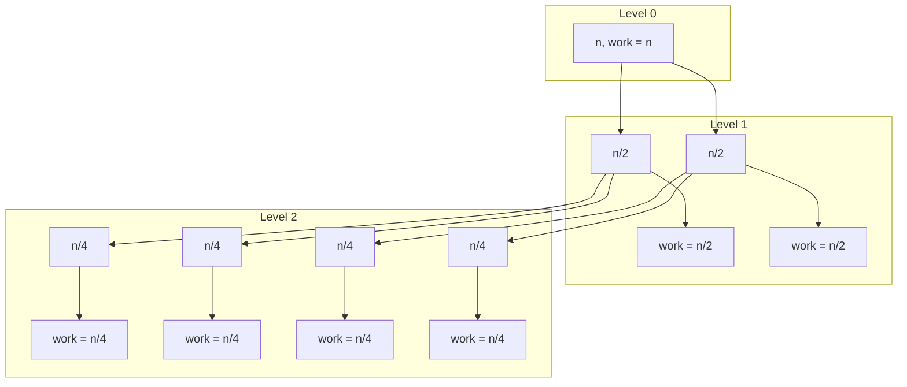
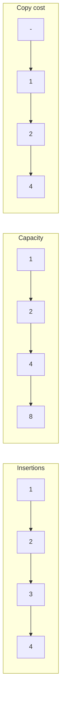
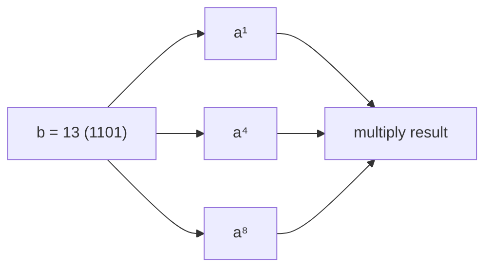

# Chapter 15: Complexity Analysis & Numerical Problems

This chapter covers advanced complexity analysis techniques (recurrence relations, Master Theorem, amortized analysis, space‑time trade‑offs) and fundamental numerical algorithms (fast exponentiation, Sieve of Eratosthenes, GCD, modular exponentiation, large factorial handling, Catalan numbers). Each topic includes real‑life analogies and visual diagrams.

## 1. Recurrence Relations and the Master Theorem

**What**: A recurrence relation defines a function in terms of its values on smaller inputs. It is used to describe the time complexity of divide‑and‑conquer algorithms.

**General form**:
```
T(n) = a * T(n/b) + f(n)
```
where:
- `a` = number of subproblems
- `n/b` = size of each subproblem
- `f(n)` = cost of dividing and combining (outside the recursion)

### 1.1 Solving Recurrences – The Master Theorem

For recurrences of the form `T(n) = a T(n/b) + O(nᵈ)` (where `d ≥ 0`), the solution is:

| Condition | Time Complexity |
|-----------|-----------------|
| `a < bᵈ` | `T(n) = O(nᵈ)` |
| `a = bᵈ` | `T(n) = O(nᵈ log n)` |
| `a > bᵈ` | `T(n) = O(n^(log_b a))` |

**Recursion tree visualisation** (for `a = 2, b = 2, d = 1` – merge sort):



Each level does total work `O(n)`. There are `log₂ n` levels → `O(n log n)`.

**Real‑life analogy**: Sorting a large file by repeatedly splitting it into halves, sorting each half, and merging – the number of splits is logarithmic, and each merge step touches every element.

### 1.2 Common Recurrences

| Algorithm | Recurrence | Solution |
|-----------|------------|----------|
| Binary search | T(n) = T(n/2) + O(1) | O(log n) |
| Merge sort | T(n) = 2T(n/2) + O(n) | O(n log n) |
| Karatsuba | T(n) = 3T(n/2) + O(n) | O(n^1.585) |
| Naive multiplication | T(n) = 4T(n/2) + O(n) | O(n²) |
| Fibonacci (naive) | T(n) = T(n-1) + T(n-2) + O(1) | O(2ⁿ) |

## 2. Amortized Analysis

**What**: Amortized analysis averages the cost of operations over a sequence, giving a tighter bound than worst‑case per operation. It shows that even if some operations are expensive, the average cost remains low.

### 2.1 Dynamic Array (e.g., `std::vector`)

When a dynamic array runs out of capacity, it doubles its size (reallocates and copies). The cost of reallocation is O(n) but occurs only every `2^k` insertions.

**Amortized cost per insertion**: O(1).  
**Total cost for n insertions**: O(n).

**Visualisation** (capacity doubling):



**Real‑life analogy**: Moving to a larger apartment when the current one is full. The move is expensive, but you do it rarely – the average cost per month includes the occasional moving expense.

### 2.2 Binary Counter (Increment)

Incrementing a binary counter flips bits. The total number of bit flips over n increments is O(n) (each bit flips every 2ᵏ increments). Amortized cost per increment = O(1).

### 2.3 Methods of Amortized Analysis

- **Aggregate method**: Sum total cost over sequence, divide by number of operations.
- **Accounting method**: Assign “credits” to cheap operations to pay for expensive ones.
- **Potential method**: Define a potential function that measures “energy” of data structure.

## 3. Space‑Time Trade‑offs

**What**: Often you can reduce time by using more memory, or reduce memory by accepting slower time. Choosing the right balance depends on constraints.

| Scenario | Trade‑off |
|----------|-----------|
| Precomputation (prefix sums, DP table) | O(n) extra space, O(1) per query vs O(n) per query without precomputation. |
| Hashing | O(n) space, O(1) average lookup vs O(log n) with tree or O(n) linear search. |
| Memoisation (DP) | Store computed results (extra memory) to avoid recomputation. |
| In‑place algorithms | O(1) space but may modify input; slower than out‑of‑place. |

**Real‑life analogy**: Keeping a personal cookbook (memory) vs looking up recipes online each time (time). The cookbook takes space but saves time.

## 4. Numerical Problems

### 4.1 Power of a Number – Fast Exponentiation (Binary Exponentiation)

**Problem**: Compute `a^b` efficiently.  
**Idea**: Use binary representation of exponent.  
**Time**: O(log b).

```cpp
long long fastPow(long long a, long long b) {
    long long result = 1;
    while (b > 0) {
        if (b & 1) result *= a;
        a *= a;
        b >>= 1;
    }
    return result;
}
```

**Visual** (`a^13` = `a^(1101₂)` = `a⁸ * a⁴ * a¹`):



**Real‑life analogy**: Instead of adding a number to itself 13 times, you double it repeatedly (1,2,4,8) and add those that match the binary digits of 13.

### 4.2 Sieve of Eratosthenes

**Problem**: Generate all prime numbers up to `n`.  
**Approach**: Mark multiples of each prime starting from 2.

```cpp
vector<bool> sieve(int n) {
    vector<bool> isPrime(n+1, true);
    isPrime[0] = isPrime[1] = false;
    for (int p = 2; p * p <= n; ++p) {
        if (isPrime[p]) {
            for (int multiple = p * p; multiple <= n; multiple += p)
                isPrime[multiple] = false;
        }
    }
    return isPrime;
}
```

**Time**: O(n log log n). **Space**: O(n).

**Visual** (n=30):

```
Initial: 2 3 4 5 6 7 8 9 10 11 12 13 14 15 16 17 18 19 20 21 22 23 24 25 26 27 28 29 30
2 marks:   4   6   8   10   12   14   16   18   20   22   24   26   28   30
3 marks:       6   9      12      15      18      21      24      27      30
5 marks:              10      15      20      25      30
Remaining (primes): 2 3 5 7 11 13 17 19 23 29
```

**Real‑life analogy**: In a classroom, you ask all students in even positions to sit down (leave only odd), then those in positions multiple of 3, etc. The ones still standing are at prime positions.

### 4.3 Greatest Common Divisor – Euclidean Algorithm

**What**: Find the largest integer dividing both numbers.  
**Approach**: `gcd(a, b) = gcd(b, a % b)`.

```cpp
int gcd(int a, int b) {
    while (b) {
        int t = b;
        b = a % b;
        a = t;
    }
    return a;
}
```

**Time**: O(log min(a, b)).  
**Proof**: Each step reduces the numbers at least by half.

**Real‑life analogy**: Finding the largest square tile that can exactly cover a rectangular floor of size `a × b`. You repeatedly cut squares of size `b × b` from the `a × b` rectangle; the remainder becomes the new problem.

### 4.4 Modular Exponentiation

**Problem**: Compute `(a^b) % m` efficiently without overflow.  
**Approach**: Combine fast exponentiation with modulo at each multiplication.

```cpp
long long modPow(long long a, long long b, long long m) {
    long long result = 1;
    a %= m;
    while (b > 0) {
        if (b & 1) result = (result * a) % m;
        a = (a * a) % m;
        b >>= 1;
    }
    return result;
}
```

**Time**: O(log b). **Use cases**: Cryptography (RSA), hashing, avoiding overflow in large powers.

### 4.5 Factorial of Large Numbers (Handling Overflow)

For large `n`, `n!` exceeds standard integer ranges. Two common approaches:

1. **Compute modulo** (typical in competitive programming):  
   `fact[i] = (fact[i-1] * i) % MOD`.

2. **Compute exact value** using arbitrary‑precision (big integers) – C++ `__int128` or external libraries.

```cpp
// Modulo factorial
long long factMod(int n, long long mod) {
    long long res = 1;
    for (int i = 2; i <= n; ++i) res = (res * i) % mod;
    return res;
}
```

**Real‑life analogy**: Counting permutations of a large deck of cards. The exact number is astronomically large; often we only need the remainder modulo some number (e.g., for hashing).

### 4.6 Catalan Numbers

**Definition**: Count of many combinatorial structures:  
- Number of valid bracket sequences with `n` pairs.
- Number of binary search trees with `n` nodes.
- Number of ways to triangulate a convex `(n+2)`-gon.

**Recurrence**:
```
C₀ = 1
Cₙ₊₁ = Σ_{i=0 to n} Cᵢ * Cₙ₋ᵢ   (for n ≥ 0)
```
Closed form: `Cₙ = (1/(n+1)) * binom(2n, n)`.

**First few Catalan numbers**: 1, 1, 2, 5, 14, 42, 132, 429, ...

**Implementation** (using DP):

```cpp
long long catalan(int n) {
    vector<long long> C(n+1, 0);
    C[0] = 1;
    for (int i = 1; i <= n; ++i)
        for (int j = 0; j < i; ++j)
            C[i] += C[j] * C[i-1-j];
    return C[n];
}
```

**Time**: O(n²). For large n, use closed form with modular arithmetic.

**Real‑life analogy**: Number of ways to parenthesise a mathematical expression (e.g., `a+b+c+d`). For 4 numbers, the 5 possible binary tree structures correspond to the 5th Catalan number.

## 5. Summary Table

| Concept | Key Formula / Method | Time Complexity | Space Complexity |
|---------|----------------------|----------------|------------------|
| Master Theorem | T(n) = aT(n/b) + O(nᵈ) | Case dependent | - |
| Amortized analysis | Dynamic array doubling | O(1) amortised | O(n) |
| Fast exponentiation | Binary exponentiation | O(log b) | O(1) |
| Sieve of Eratosthenes | Mark multiples | O(n log log n) | O(n) |
| Euclidean GCD | while(b) { b, a%b } | O(log min(a,b)) | O(1) |
| Modular exponentiation | modPow with exponentiation | O(log b) | O(1) |
| Catalan numbers (DP) | C₀=1, Cₙ₊₁ = ΣCᵢCₙ₋ᵢ | O(n²) | O(n) |

The next chapter will cover system design fundamentals for coding interviews (scalability, caching, load balancing, database indexing, etc.).
