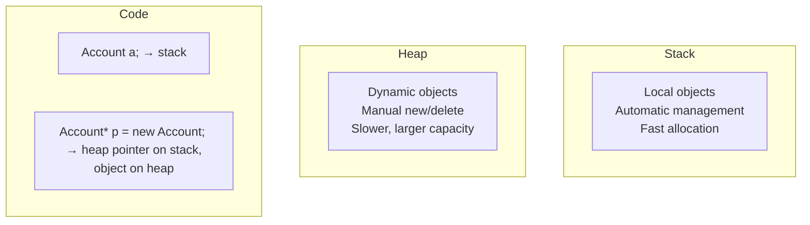
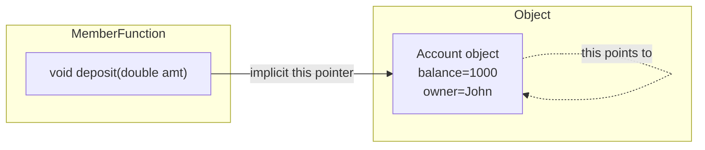
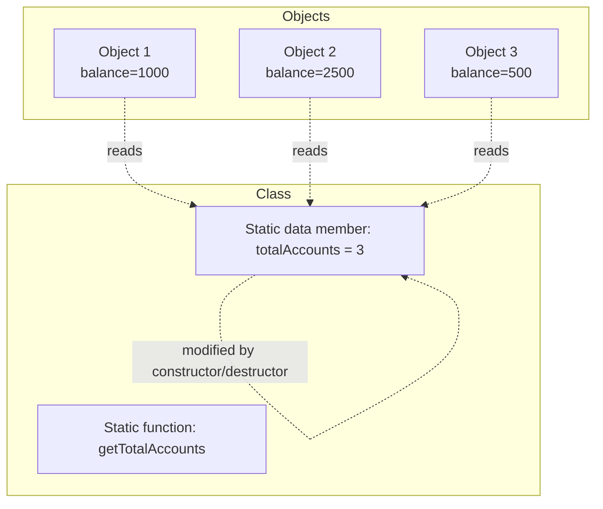
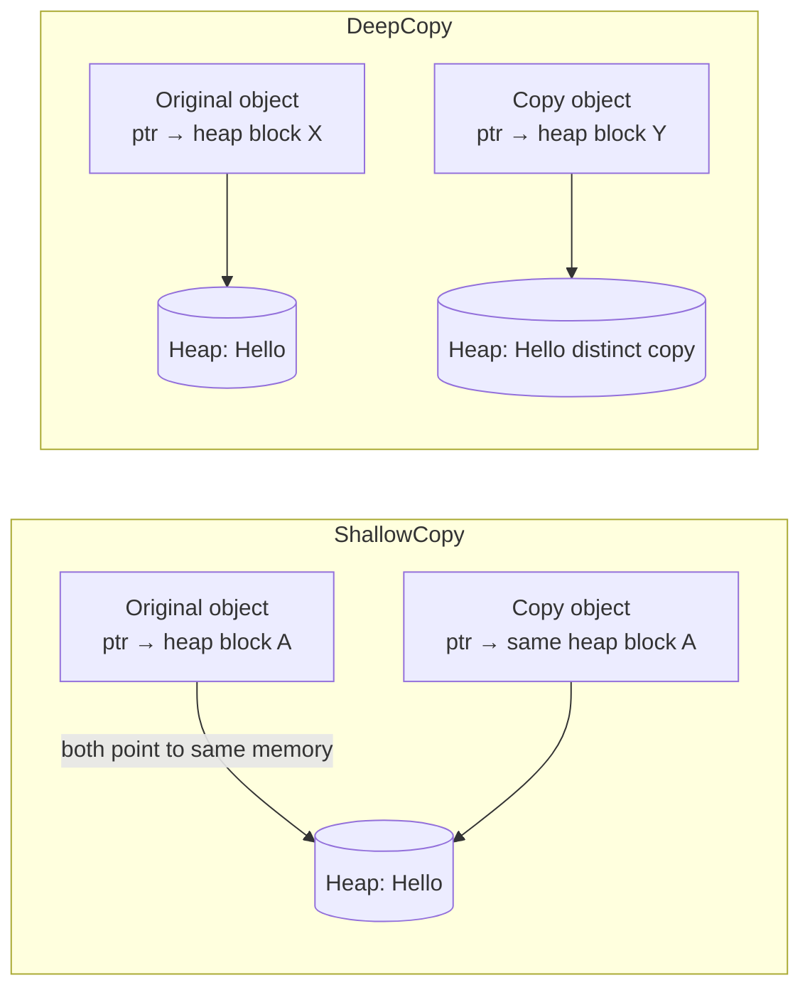
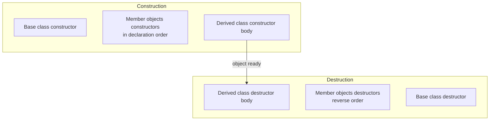

# Chapter 2: Classes and Objects

This chapter covers the fundamental concepts of object-oriented programming in C++ focusing on classes and objects. Topics include access control, object lifecycle management, the `this` pointer, static members, constructors, destructor, and best practices for initialization.

## 1. Defining a Class

A class is a user-defined data type that encapsulates data members (variables) and member functions (methods). Access specifiers control the visibility of class members.

### Access Specifiers

| Specifier | Access |
|-----------|--------|
| `public` | Accessible from anywhere |
| `private` | Accessible only within the same class (default for class members) |
| `protected` | Accessible within the same class and derived classes |

```cpp
class Account {
public:
    // Public interface
    void deposit(double amount);
    double getBalance() const;
    
private:
    // Private data
    double balance = 0.0;
    std::string accountNumber;
    
protected:
    // For inheritance
    int accountType;
};
```

## 2. Creating Objects

Objects can be allocated on the stack (automatic storage) or on the heap (dynamic storage).

### Stack Allocation

```cpp
Account acc;                    // Default constructor
Account user("John", 1000);     // Parameterized constructor
// Automatically destroyed when out of scope
```

### Heap Allocation

```cpp
Account* accPtr = new Account("John", 1000);
delete accPtr;  // Manual deallocation required
```

### Memory Comparison



## 3. Accessing Members

Use the dot (`.`) operator for objects and references, and the arrow (`->`) operator for pointers.

```cpp
Account acc;                    // Object on stack
acc.deposit(500);               // Dot operator

Account* pAcc = new Account();  // Pointer to object
pAcc->deposit(500);             // Arrow operator
(*pAcc).deposit(500);           // Equivalent dereference + dot

delete pAcc;
```

## 4. The `this` Pointer

Every non-static member function has an implicit parameter `this` that points to the current object. It is useful for:

- Resolving name conflicts between parameters and data members
- Chaining member function calls
- Returning a reference to the current object

```cpp
class Counter {
    int value;
public:
    Counter& setValue(int value) {
        this->value = value;   // this->value resolves ambiguity
        return *this;          // Return reference to current object
    }
    
    Counter& increment() {
        value++;
        return *this;
    }
};

// Usage: chaining
Counter c;
c.setValue(5).increment().increment();
```

### Visual Representation



## 5. Static Members

Static members belong to the class itself rather than individual objects. They are shared across all instances.

### Static Data Members

- Must be defined outside the class (in one translation unit)
- Are initialized before any object creation
- Count objects, share configuration, implement singletons

```cpp
class BankAccount {
    static int totalAccounts;      // Declaration
    static constexpr double taxRate = 0.15;  // inline initialization (C++17)
    
public:
    BankAccount() { totalAccounts++; }
    ~BankAccount() { totalAccounts--; }
    
    static int getTotalAccounts() { return totalAccounts; }
};

// Definition in .cpp file
int BankAccount::totalAccounts = 0;
```

### Static Member Functions

- Can only access static data members and other static functions
- Can be called without an object (using class name)

```cpp
int count = BankAccount::getTotalAccounts();
```

### Shared Static Data Diagram



## 6. Constructors

Constructors initialize objects. They have the same name as the class and no return type.

### Default Constructor

Takes no arguments. The compiler generates one if no constructor is defined.

```cpp
class Point {
    int x, y;
public:
    Point() : x(0), y(0) {}                       // User-defined default
    Point(int xVal = 0, int yVal = 0) : x(xVal), y(yVal) {}  // Also a default
};
```

### Parameterized Constructor

Accepts arguments to initialize object state.

```cpp
class Student {
    std::string name;
    int id;
public:
    Student(const std::string& n, int i) : name(n), id(i) {}
};
```

### Constructor Overloading

Multiple constructors with different parameter lists.

```cpp
class Rectangle {
    double width, height;
public:
    Rectangle() : width(1), height(1) {}
    Rectangle(double side) : width(side), height(side) {}
    Rectangle(double w, double h) : width(w), height(h) {}
};
```

### Constructors with Default Arguments

Reduce code duplication and provide flexible initialization.

```cpp
class Timer {
    int hours, minutes;
public:
    Timer(int h = 0, int m = 0) : hours(h), minutes(m) {}
};

Timer t1;       // 0:00
Timer t2(10);   // 10:00
Timer t3(10, 30); // 10:30
```

### Copy Constructor

Creates a new object as a copy of an existing object. Called during:

- Pass by value
- Return by value
- Direct initialization: `Class obj2 = obj1;`
- Copy initialization: `Class obj2(obj1);`

```cpp
class String {
    char* data;
public:
    // Shallow copy (default)
    // String(const String& other) = default;
    
    // Deep copy implementation
    String(const String& other) {
        if (other.data) {
            data = new char[strlen(other.data) + 1];
            strcpy(data, other.data);
        } else {
            data = nullptr;
        }
    }
    
    ~String() { delete[] data; }
};
```

#### Shallow vs Deep Copy



**Rule of Three:** If a class requires a user-defined destructor, copy constructor, or copy assignment operator, it likely requires all three.

### Member Initializer List

Initializer lists are required for:

- `const` data members
- Reference data members
- Base class constructors with parameters
- Data members without default constructors

They are also more efficient (direct initialization vs assignment).

```cpp
class FixedArray {
    const int size;            // const member
    int& refToExternal;        // reference member
    std::vector<int> data;     // expensive to default construct
    
public:
    // Correct: initializer list
    FixedArray(int s, int& ext) : size(s), refToExternal(ext), data(s) {
        // constructor body
    }
    
    // Wrong: assignment in body - const and ref cannot be assigned
    /*
    FixedArray(int s, int& ext) {
        size = s;          // Error: const
        refToExternal = ext; // Error: reference
        data = std::vector<int>(s); // Works but less efficient
    }
    */
};
```

**Initialization order** follows the order of declaration in the class, not the order in the initializer list.

## 7. Destructor

The destructor cleans up resources when an object is destroyed. It has the same name as the class with a tilde (`~`) prefix and no parameters.

```cpp
class FileHandler {
    FILE* file;
public:
    FileHandler(const char* filename) {
        file = fopen(filename, "r");
    }
    
    ~FileHandler() {
        if (file) fclose(file);  // Release resource
    }
};
```

### Construction and Destruction Order



## 8. `explicit` Keyword

Prevents implicit conversions and copy-initialization that could lead to unintended behavior.

```cpp
class Complex {
    double real, imag;
public:
    explicit Complex(double r = 0, double i = 0) : real(r), imag(i) {}
    
    Complex operator+(const Complex& other) const {
        return Complex(real + other.real, imag + other.imag);
    }
};

Complex c1(3.0, 4.0);
// Complex c2 = 5.0;   // Error: constructor is explicit
Complex c3{5.0};       // OK: direct initialization

// Without explicit, this would compile:
// Complex c2 = 5.0;   // Implicitly calls Complex(5.0)
// c1 = c1 + 10;       // Implicit conversion from int to Complex
```

Use `explicit` for constructors that take one argument (or multi-argument where only first has no default) unless implicit conversion is intentionally desired.

## Summary Table

| Concept | Purpose | Best Practice |
|---------|---------|----------------|
| `private` members | Encapsulation | Default to private, expose only necessary interface |
| `this` pointer | Self-reference | Use for chaining or disambiguation |
| Static members | Class-level data/behavior | Initialize static data in .cpp file |
| Member initializer list | Efficient initialization | Always prefer over assignment in constructor body |
| Copy constructor | Deep copying when needed | Follow Rule of Three/Five |
| `explicit` | Prevent implicit conversions | Use for single-argument constructors |

This foundation enables robust object-oriented designs with proper resource management and predictable object behavior.