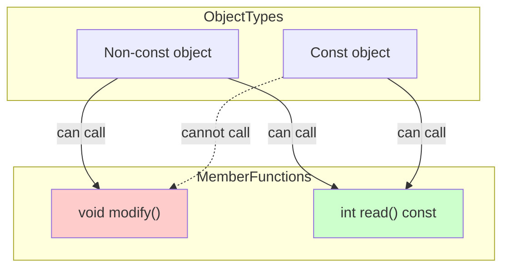
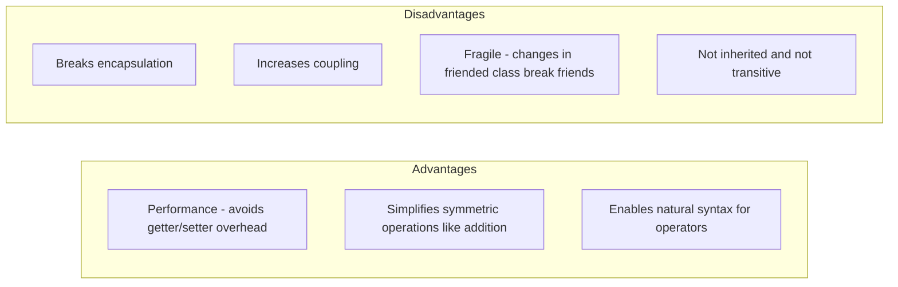

# Chapter 3: Encapsulation and Data Hiding

Encapsulation is a fundamental principle of object-oriented programming that bundles data and the methods that operate on that data within a single unit (a class) while restricting direct external access to the internal state. Data hiding refers specifically to making data members `private` or `protected` to prevent accidental or malicious interference.

## 1. Why Encapsulation Matters

Encapsulation provides several critical benefits:

- **Protection of invariants** – The class can enforce valid state transitions.
- **Reduced coupling** – External code depends only on the public interface, not internal implementation.
- **Flexibility to change** – Internal representation can be modified without breaking client code.
- **Controlled access** – Validation, logging, or lazy loading can be added to getters/setters.

```cpp
class BankAccount {
private:
    double balance;  // Internal state hidden
    
public:
    void deposit(double amount) {
        if (amount > 0) {        // Invariant: amount must be positive
            balance += amount;
        }
    }
    
    double getBalance() const {  // Read-only access
        return balance;
    }
};
```

Without encapsulation, client code could directly set a negative balance, breaking business rules.

## 2. Getters and Setters (Accessors and Mutators)

Getters and setters provide controlled access to private data.

```cpp
class Temperature {
private:
    double celsius;
    
public:
    // Getter - read access
    double getCelsius() const {
        return celsius;
    }
    
    double getFahrenheit() const {
        return celsius * 9.0 / 5.0 + 32;
    }
    
    // Setter - write access with validation
    void setCelsius(double value) {
        if (value >= -273.15) {  // Absolute zero validation
            celsius = value;
        }
    }
    
    void setFahrenheit(double value) {
        setCelsius((value - 32) * 5.0 / 9.0);
    }
};
```

**When to use getters/setters:**
- When validation or transformation is needed.
- For maintaining encapsulation even for simple members (future-proofing).
- For read-only or write-only properties.

**When to avoid:**
- Trivial getters/setters that expose every private member defeat encapsulation; consider if the member should be public instead.

## 3. Const Correctness

Const correctness ensures that objects and functions that should not modify state are explicitly marked as `const`, enabling compiler-enforced safety.

### Const Objects and Const Member Functions

A `const` object can only call member functions that are declared `const` (i.e., functions that do not modify the object).

```cpp
class Rectangle {
private:
    double width, height;
    
public:
    Rectangle(double w, double h) : width(w), height(h) {}
    
    // Const member function - cannot modify data members
    double area() const {
        return width * height;
    }
    
    // Non-const member function - can modify
    void scale(double factor) {
        width *= factor;
        height *= factor;
    }
    
    // Mutable allows modification even in const (see section 5)
    mutable int accessCount = 0;
    void logAccess() const {
        accessCount++;  // OK: mutable
    }
};

void process(const Rectangle& rect) {
    double a = rect.area();     // OK: area() is const
    // rect.scale(2.0);        // Error: scale() is not const
}
```

### Const Member Variables

Const data members must be initialized using the member initializer list and cannot be modified after construction.

```cpp
class Point {
private:
    const int id;        // Constant member
    double x, y;
    
public:
    Point(int idVal, double xVal, double yVal) : id(idVal), x(xVal), y(yVal) {}
    // id cannot be changed later
};
```

### Const Correctness Diagram



## 4. Friend Functions and Friend Classes

The `friend` keyword allows a function or another class to access private and protected members of a class. This breaks encapsulation but can be necessary for certain designs (e.g., operator overloading, tightly coupled helpers).

### Friend Functions

A non-member function declared as a friend can access private members.

```cpp
class Vector2D {
private:
    double x, y;
    
public:
    Vector2D(double xVal, double yVal) : x(xVal), y(yVal) {}
    
    // Friend function declaration
    friend Vector2D operator+(const Vector2D& lhs, const Vector2D& rhs);
};

// Definition - can access private x, y
Vector2D operator+(const Vector2D& lhs, const Vector2D& rhs) {
    return Vector2D(lhs.x + rhs.x, lhs.y + rhs.y);
}
```

### Friend Classes

All member functions of a friend class can access private members of the granting class.

```cpp
class Engine {
private:
    int horsepower;
    
public:
    Engine(int hp) : horsepower(hp) {}
    
    // Grant Car full access to Engine's private members
    friend class Car;
};

class Car {
public:
    void diagnose(const Engine& e) {
        // Accessing private member of Engine
        std::cout << "Horsepower: " << e.horsepower << std::endl;
    }
    
    void tune(Engine& e, int newHp) {
        e.horsepower = newHp;  // Direct modification
    }
};
```

### When to Use Friend

| Use Case | Example |
|----------|---------|
| Operator overloading (especially `<<` and `>>`) | `friend std::ostream& operator<<(...)` |
| Unit testing (test fixtures need access) | `friend class Test_ClassName;` |
| Closely related classes (e.g., a builder and its product) | `friend class ProductBuilder;` |
| Container and iterator pairs | `friend class iterator;` |

### Trade-offs of Friend



**Best Practice:** Use `friend` sparingly. Prefer public interfaces unless performance or syntactic convenience strongly justifies breaking encapsulation. Document why a friend is necessary.

## 5. Mutable Keyword

The `mutable` keyword allows a data member to be modified even within a `const` member function. It is typically used for:

- Caching computed results
- Reference counting / weak pointers
- Logging and debugging counters
- Mutex locks for thread-safe const methods

```cpp
class StringCache {
private:
    std::string data;
    mutable size_t hashCache = 0;
    mutable bool cacheValid = false;
    
public:
    StringCache(const std::string& str) : data(str) {}
    
    // Const member function - but modifies cache
    size_t getHash() const {
        if (!cacheValid) {
            hashCache = std::hash<std::string>{}(data);
            cacheValid = true;   // OK: mutable allows modification
        }
        return hashCache;
    }
    
    void setData(const std::string& newData) {
        data = newData;
        cacheValid = false;      // Non-const, normal modification
    }
};
```

**Important:** `mutable` should not be used to cheat const-correctness for logical state. Use it only for implementation details that do not affect the observable state of the object.

## Summary Table

| Concept | Purpose | Best Practice |
|---------|---------|----------------|
| Encapsulation | Hide internal state, expose safe interface | Keep data private, provide minimal public interface |
| Getters/Setters | Controlled access | Use only when validation or transformation is needed |
| Const member functions | Promise not to modify object | Always mark member functions that don't modify state as `const` |
| Const objects | Immutable views | Pass by `const&` to avoid unintended modification |
| Friend | Break encapsulation for specific use cases | Use only for operators or tightly coupled classes; document |
| Mutable | Allow modification in const methods | Use for caches, logs, mutexes; never for logical state |


Encapsulation combined with const correctness creates robust, maintainable code by preventing accidental misuse and clearly communicating intent through the type system.