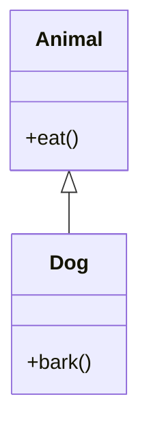
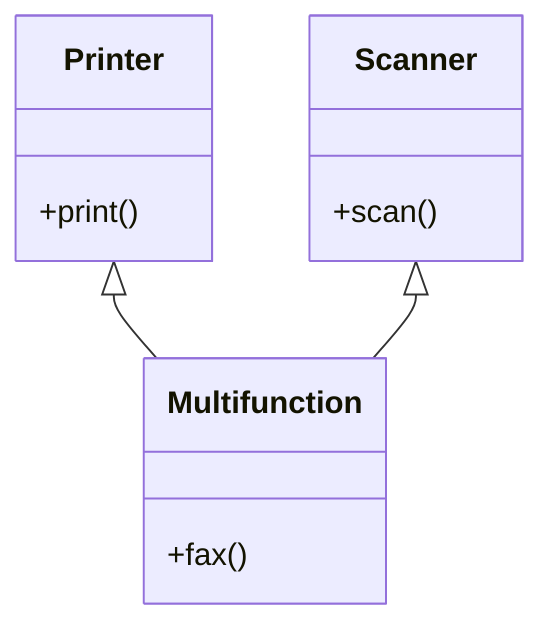
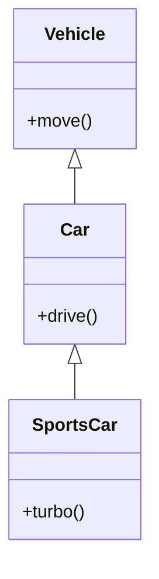
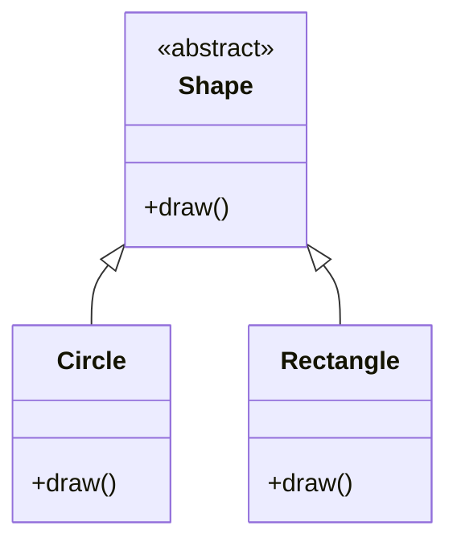
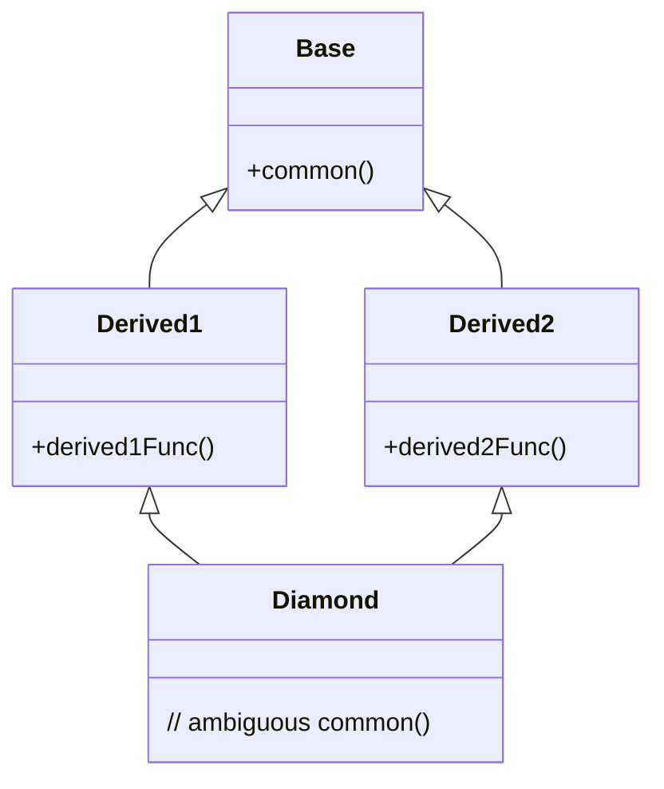
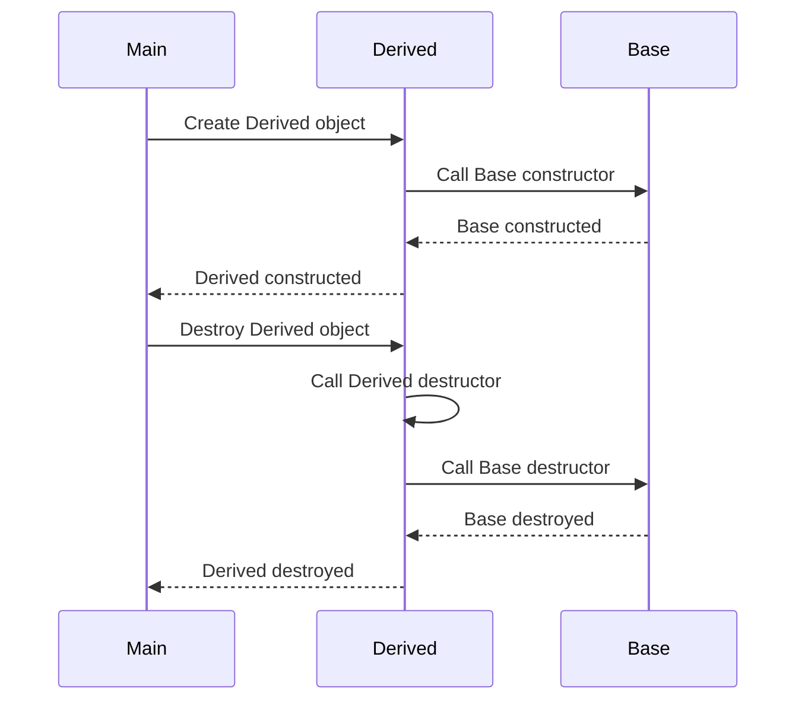
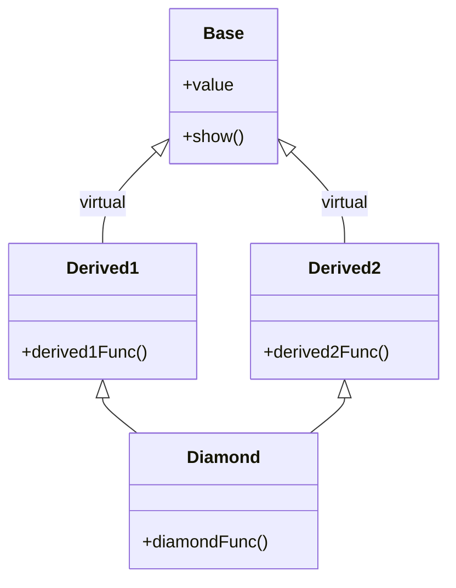

# Chapter 4: Inheritance in C++

Inheritance is a fundamental concept of object-oriented programming (OOP) that allows a class to derive properties and behaviors from another class. It promotes code reusability, establishes hierarchical relationships, and enables polymorphism.

## 1. Base Class and Derived Class Syntax

In C++, a derived class is created by specifying a base class after a colon followed by an access specifier.

```cpp
// Base class (also called parent class or superclass)
class Base {
public:
    void baseMethod() {
        // ...
    }
};

// Derived class (also called child class or subclass)
class Derived : public Base {
public:
    void derivedMethod() {
        // ...
    }
};
```

The general syntax is:

```cpp
class DerivedClass : access-specifier BaseClass {
    // class members
};
```

## 2. Access Specifiers in Inheritance

Access specifiers control how members of the base class are inherited by the derived class. The three access specifiers are `public`, `protected`, and `private`.

### 2.1 Effect on Member Accessibility in Derived Classes

The following table summarizes the accessibility of base class members in a derived class:

| Base Member Access | Inheritance Type | Access in Derived Class (inside) | Access via Derived Object (outside) |
|--------------------|------------------|-----------------------------------|--------------------------------------|
| `public`           | `public`         | `public`                          | accessible                           |
| `public`           | `protected`      | `protected`                       | not accessible                       |
| `public`           | `private`        | `private`                         | not accessible                       |
| `protected`        | `public`         | `protected`                       | not accessible                       |
| `protected`        | `protected`      | `protected`                       | not accessible                       |
| `protected`        | `private`        | `private`                         | not accessible                       |
| `private`          | any              | not accessible directly           | not accessible                       |

- `public` inheritance: Preserves the original access levels. Most commonly used.
- `protected` inheritance: `public` and `protected` base members become `protected` in the derived class.
- `private` inheritance: `public` and `protected` base members become `private` in the derived class.

```cpp
class Base {
public:
    int pub;
protected:
    int prot;
private:
    int priv;
};

// Public inheritance
class PubDerived : public Base {
    void func() {
        pub = 1;   // OK: public remains public
        prot = 2;  // OK: protected remains protected
        // priv = 3; // Error: private member not accessible
    }
};

// Protected inheritance
class ProtDerived : protected Base {
    void func() {
        pub = 1;   // OK: becomes protected
        prot = 2;  // OK: remains protected
        // priv inaccessible
    }
};
```

## 3. Types of Inheritance

### 3.1 Single Inheritance

A derived class inherits from exactly one base class.

```cpp
class Animal {
public:
    void eat() { /* ... */ }
};

class Dog : public Animal {
public:
    void bark() { /* ... */ }
};
```



### 3.2 Multiple Inheritance

A derived class inherits from two or more base classes.

```cpp
class Printer {
public:
    void print() { /* ... */ }
};

class Scanner {
public:
    void scan() { /* ... */ }
};

class Multifunction : public Printer, public Scanner {
public:
    void fax() { /* ... */ }
};
```



### 3.3 Multilevel Inheritance

A class is derived from a class which is itself derived from another class.

```cpp
class Vehicle {
public:
    void move() { /* ... */ }
};

class Car : public Vehicle {
public:
    void drive() { /* ... */ }
};

class SportsCar : public Car {
public:
    void turbo() { /* ... */ }
};
```



### 3.4 Hierarchical Inheritance

Multiple derived classes inherit from a single base class.

```cpp
class Shape {
public:
    virtual void draw() = 0;
};

class Circle : public Shape {
public:
    void draw() override { /* ... */ }
};

class Rectangle : public Shape {
public:
    void draw() override { /* ... */ }
};
```



### 3.5 Hybrid Inheritance (Diamond Problem)

Hybrid inheritance combines multiple and multilevel inheritance. The "diamond problem" occurs when a class inherits from two classes that share a common base class.

```cpp
class Base {
public:
    void common() { /* ... */ }
};

class Derived1 : public Base {
public:
    void derived1Func() { /* ... */ }
};

class Derived2 : public Base {
public:
    void derived2Func() { /* ... */ }
};

// Diamond shape: Both paths lead to Base
class Diamond : public Derived1, public Derived2 {
    // Ambiguity: which Base::common() is inherited?
};
```



Without virtual inheritance, `Diamond` inherits two copies of `Base` members, leading to ambiguity when accessing `Base::common()`.

## 4. Order of Constructor and Destructor Calls

When an object of a derived class is created, constructors are called in the following order:

1. Base class constructor(s) (in the order of inheritance)
2. Derived class constructor

Destructors are called in the reverse order:

1. Derived class destructor
2. Base class destructor(s)

### 4.1 Example

```cpp
#include <iostream>

class Base {
public:
    Base() { std::cout << "Base constructor\n"; }
    ~Base() { std::cout << "Base destructor\n"; }
};

class Derived : public Base {
public:
    Derived() { std::cout << "Derived constructor\n"; }
    ~Derived() { std::cout << "Derived destructor\n"; }
};

int main() {
    Derived d;
    return 0;
}
```

Output:

```
Base constructor
Derived constructor
Derived destructor
Base destructor
```

### 4.2 Passing Arguments to Base Class Constructor

The derived class constructor can explicitly call the base class constructor using the member initializer list.

```cpp
#include <iostream>
#include <string>

class Person {
private:
    std::string name;
public:
    Person(const std::string& n) : name(n) {
        std::cout << "Person constructed: " << name << "\n";
    }
    ~Person() { std::cout << "Person destroyed: " << name << "\n"; }
};

class Employee : public Person {
private:
    int id;
public:
    Employee(const std::string& n, int i) : Person(n), id(i) {
        std::cout << "Employee constructed: " << id << "\n";
    }
    ~Employee() { std::cout << "Employee destroyed: " << id << "\n"; }
};

int main() {
    Employee e("Alice", 1001);
    return 0;
}
```

Output:

```
Person constructed: Alice
Employee constructed: 1001
Employee destroyed: 1001
Person destroyed: Alice
```

### 4.3 Constructor/Destructor Call Flow Diagram



## 5. Diamond Problem and Virtual Inheritance

Virtual inheritance solves the diamond problem by ensuring that only one copy of the common base class is shared among all paths in the inheritance hierarchy.

### 5.1 Virtual Base Classes

Use the `virtual` keyword when deriving from the common base class.

```cpp
#include <iostream>

class Base {
public:
    int value;
    Base() : value(0) {}
    void show() { std::cout << "Base::show() value = " << value << std::endl; }
};

class Derived1 : virtual public Base {
public:
    Derived1() { value = 10; }
};

class Derived2 : virtual public Base {
public:
    Derived2() { value = 20; }
};

class Diamond : public Derived1, public Derived2 {
public:
    Diamond() : Base(), Derived1(), Derived2() {
        // Only one copy of Base exists
        value = 30; // unambiguous
    }
};

int main() {
    Diamond d;
    d.show();  // Output: Base::show() value = 30
    return 0;
}
```

Without virtual inheritance, `d.show()` would be ambiguous because two copies of `Base::show()` exist. With virtual inheritance, only one shared instance is present.

### 5.2 How Virtual Inheritance Resolves Ambiguity

- The compiler ensures that a virtual base class is constructed only once, even if it appears multiple times in the inheritance graph.
- The most derived class is responsible for initializing the virtual base class directly.
- All intermediate classes (like `Derived1` and `Derived2`) inherit virtually and do not independently construct the base class.

### 5.3 Memory Layout Considerations

Virtual inheritance introduces additional overhead:

- A pointer (or offset) is stored in each derived class object to locate the shared virtual base subobject.
- This indirection can impact performance and memory footprint.
- The exact layout is compiler-dependent, but typically involves a virtual base table (vbtable) or similar mechanism.



In virtual inheritance, the `Base` subobject is located at a fixed offset computed at runtime, allowing multiple derived classes to share it.

## 6. `using` Declaration in Derived Classes

The `using` declaration in a derived class can restore access to inherited members that are otherwise inaccessible due to access specifiers or name hiding.

### 6.1 Restoring Access to Base Class Members

When a derived class inherits privately or protectedly, base class members become inaccessible from outside. A `using` declaration can bring specific members back to `public` or `protected` scope.

```cpp
#include <iostream>

class Base {
public:
    void publicFunc() { std::cout << "Base::publicFunc\n"; }
    void commonFunc() { std::cout << "Base::commonFunc\n"; }
};

class Derived : private Base {
public:
    // Restore publicFunc to public access
    using Base::publicFunc;
    
    // Overload hidden function - restore using declaration also works
    void commonFunc(int x) { 
        std::cout << "Derived::commonFunc(int): " << x << "\n";
    }
    // To access Base::commonFunc without qualification, we can bring it in
    using Base::commonFunc;  // Now both versions are accessible
};

int main() {
    Derived d;
    d.publicFunc();      // OK: restored to public
    d.commonFunc();      // OK: calls Base::commonFunc
    d.commonFunc(42);    // OK: calls Derived::commonFunc(int)
    // d.publicFunc() would be inaccessible without using declaration
    return 0;
}
```

### 6.2 Resolving Name Hiding

A derived class member with the same name as a base class member hides the base member. The `using` declaration can bring the hidden base member into the derived class scope, enabling overloading.

```cpp
class A {
public:
    void f(int) {}
};

class B : public A {
public:
    void f(double) {}  // hides A::f(int)
};

class C : public A {
public:
    using A::f;        // brings A::f(int) into scope
    void f(double) {}  // overloads with A::f(int)
};

int main() {
    B b;
    // b.f(10);   // Error: A::f(int) is hidden, double conversion occurs
    b.f(10.0);   // OK: calls B::f(double)
    
    C c;
    c.f(10);     // OK: calls A::f(int)
    c.f(10.0);   // OK: calls C::f(double)
}
```

### 6.3 Important Notes

- A `using` declaration cannot change the access of `private` base members.
- It cannot be used to introduce constructors or destructors (though `using Base::Base` can inherit constructors in C++11 and later).
- Multiple `using` declarations can be used to bring in several base class members.

## Summary

| Concept                     | Key Points                                                                 |
|-----------------------------|----------------------------------------------------------------------------|
| Inheritance Types           | Single, Multiple, Multilevel, Hierarchical, Hybrid                         |
| Access Specifiers           | `public`, `protected`, `private` determine member accessibility           |
| Constructor/Destructor Order| Base → Derived, Destruction: Derived → Base                                |
| Virtual Inheritance         | Solves diamond problem by sharing a single base class copy                 |
| `using` Declaration         | Restores access and resolves name hiding                                   |

Inheritance, when used appropriately, enhances code structure and reusability. Virtual inheritance should be applied judiciously due to its runtime overhead. The `using` declaration provides fine-grained control over member visibility in derived classes.