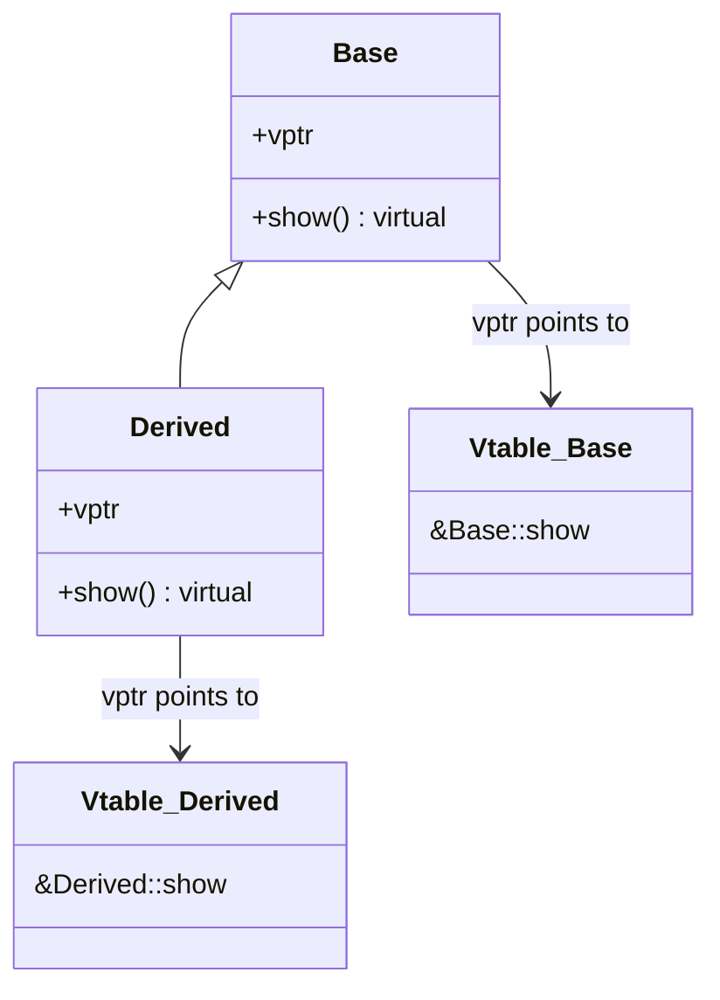
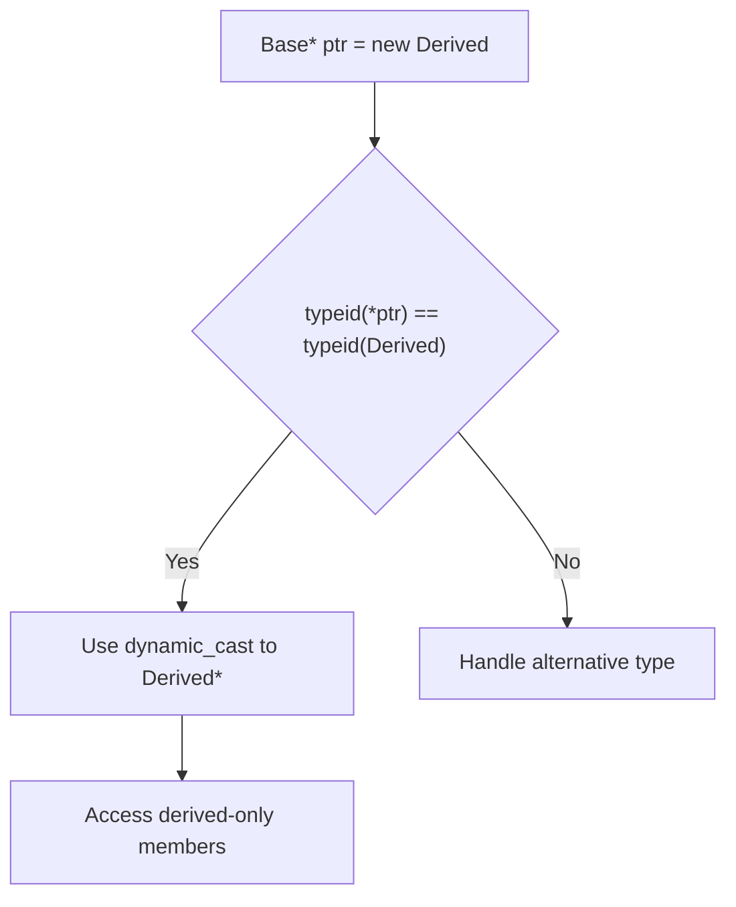

# Chapter 5: Polymorphism in C++

Polymorphism enables objects of different types to be treated uniformly through a common interface. C++ supports both compile‑time (static) and run‑time (dynamic) polymorphism, each serving distinct design purposes.

## Compile‑Time Polymorphism (Static)

The actual function to be executed is determined at compile time. This results in efficient code without runtime overhead.

### Function Overloading

Multiple functions can share the same name as long as their parameter lists differ (by number, type, or order of parameters). The return type alone cannot distinguish overloads.

```cpp
#include <iostream>

class Printer {
public:
    void print(int i) {
        std::cout << "Integer: " << i << std::endl;
    }
    
    void print(double d) {
        std::cout << "Double: " << d << std::endl;
    }
    
    void print(const std::string& s) {
        std::cout << "String: " << s << std::endl;
    }
};

int main() {
    Printer p;
    p.print(42);        // print(int)
    p.print(3.14);      // print(double)
    p.print("Hello");   // print(const std::string&)
}
```

### Operator Overloading

Operators can be redefined for user‑defined types. This topic is covered in detail in Chapter 6.

## Run‑Time Polymorphism (Dynamic)

The actual function implementation is resolved at run time based on the dynamic type of the object. This is achieved through virtual functions and inheritance.

### Virtual Functions and the Virtual Table (vtable)

When a class declares a virtual function, the compiler generates a virtual table (vtable) for that class. The vtable is an array of pointers to the virtual functions of the class. Each object of that class contains a hidden pointer (vptr) to its class’s vtable.

```cpp
#include <iostream>

class Base {
public:
    virtual void show() {
        std::cout << "Base::show()" << std::endl;
    }
};

class Derived : public Base {
public:
    void show() override {
        std::cout << "Derived::show()" << std::endl;
    }
};

int main() {
    Base* ptr = new Derived();
    ptr->show();   // Output: Derived::show() – resolved at runtime
    delete ptr;
}
```

The following diagram illustrates the vtable mechanism for the `Base` and `Derived` classes.



### Overriding vs Hiding

- **Overriding**: A derived class provides its own implementation of a virtual function from the base class. The function signature must match exactly.
- **Hiding**: If a derived class declares a non‑virtual function with the same name as a base class function (even with a different parameter list), it hides the base class version for objects of the derived type.

```cpp
class Base {
public:
    virtual void f() { std::cout << "Base::f()\n"; }
    void g(int) { std::cout << "Base::g(int)\n"; }
};

class Derived : public Base {
public:
    void f() override { std::cout << "Derived::f()\n"; }   // overrides
    void g() { std::cout << "Derived::g()\n"; }            // hides Base::g(int)
};

int main() {
    Derived d;
    d.g();      // OK, calls Derived::g()
    // d.g(42); // Error: Base::g(int) is hidden
}
```

### `override` Specifier (C++11)

The `override` keyword explicitly states that a virtual function intends to override a base class virtual function. It helps catch errors such as mismatched signatures or misspelled function names.

```cpp
class Base {
public:
    virtual void process(int) {}
};

class Derived : public Base {
public:
    void process(double) override;  // Error: does not override (wrong parameter type)
    void process(int) override;     // OK
};
```

### `final` Specifier

The `final` keyword prevents further overriding of a virtual function or prevents a class from being inherited.

```cpp
class Base {
public:
    virtual void foo() final { }   // no further overriding allowed
};

class Derived : public Base {
public:
    void foo() override { }        // Error: foo is final
};

class FinalClass final {           // this class cannot be inherited
};

// class Bad : public FinalClass { }; // Error
```

## Abstract Classes and Interfaces

An abstract class serves as a blueprint for other classes. It cannot be instantiated.

### Pure Virtual Functions (`= 0`)

A pure virtual function is declared by assigning `0` in its declaration. It provides no implementation in the abstract class (though a definition can optionally be supplied).

```cpp
class Shape {
public:
    virtual double area() const = 0;   // pure virtual
    virtual ~Shape() = default;
};

class Circle : public Shape {
    double radius_;
public:
    Circle(double r) : radius_(r) {}
    double area() const override { return 3.14159 * radius_ * radius_; }
};

// Shape s; // Error: cannot instantiate abstract class
Circle c(5.0); // OK
```

### Interface Emulation in C++

C++ does not have a separate `interface` keyword. An interface is typically emulated as a class containing only pure virtual functions (and optionally a virtual destructor).

```cpp
class Drawable {
public:
    virtual void draw() const = 0;
    virtual ~Drawable() = default;
};

class Renderable {
public:
    virtual void render() = 0;
    virtual ~Renderable() = default;
};

class Shape : public Drawable, public Renderable {
public:
    void draw() const override { /* ... */ }
    void render() override { /* ... */ }
};
```

## Virtual Destructors

Deleting a derived object through a base class pointer without a virtual destructor leads to undefined behaviour – only the base class destructor runs, causing resource leaks.

```cpp
class Base {
public:
    ~Base() { std::cout << "Base destructor\n"; }
};

class Derived : public Base {
    int* data;
public:
    Derived() : data(new int[100]) {}
    ~Derived() { delete[] data; std::cout << "Derived destructor\n"; }
};

int main() {
    Base* p = new Derived();
    delete p;   // Undefined behaviour: only Base::~Base() is called, data leaks
}
```

**Correct solution**: make the base destructor virtual.

```cpp
class Base {
public:
    virtual ~Base() { std::cout << "Base destructor\n"; }
};

// Now deleting through base pointer invokes both destructors in reverse order.
```

The rule: If a class has any virtual function, it should have a virtual destructor. Conversely, if a class is designed to be inherited from polymorphically, declare its destructor virtual.

## Run‑Time Type Information (RTTI)

RTTI allows querying the dynamic type of an object at runtime. Use it sparingly – often indicating a design flaw that could be resolved by virtual functions.

### `typeid` Operator and `type_info` Class

`typeid` returns a reference to a `std::type_info` object representing the dynamic type of its argument.

```cpp
#include <typeinfo>
#include <iostream>

class Base { virtual void dummy() {} };
class Derived : public Base {};

int main() {
    Base* b = new Derived();
    std::cout << typeid(*b).name() << std::endl;   // prints "Derived"
    delete b;
}
```

### `dynamic_cast` for Safe Downcasting

`dynamic_cast` safely converts a pointer or reference of a polymorphic base class to a derived class type. On failure, it returns a null pointer (for pointers) or throws `std::bad_cast` (for references).

```cpp
Base* b = new Derived();
Derived* d = dynamic_cast<Derived*>(b);
if (d) {
    // use d safely
}

// Reference version
try {
    Derived& dr = dynamic_cast<Derived&>(*b);
    // use dr
} catch (const std::bad_cast& e) {
    // handle error
}
```

### When RTTI Is Necessary – and When to Avoid It

**Necessary cases** (rare):
- Implementing a visitor pattern without double dispatch built into the language.
- Working with legacy frameworks that lack proper virtual interfaces.
- Certain serialisation mechanisms that need concrete type information.

**Avoid RTTI when**:
- A virtual function can achieve the same behaviour – prefer polymorphism over type switching.
- Performance is critical (RTTI adds overhead and may inhibit compiler optimisations).
- The design leads to `switch` on type strings or `typeid` chains – this indicates violation of the Open/Closed Principle.

### RTTI Diagram



## Summary Checklist

| Concept                     | Key Takeaway                                                                 |
|-----------------------------|------------------------------------------------------------------------------|
| Function overloading        | Same name, different parameters – resolved at compile time.                  |
| Virtual functions           | Enable runtime polymorphism via vtable.                                      |
| Override                    | Use `override` to catch errors.                                              |
| Final                       | Use `final` to stop overriding or inheritance.                               |
| Pure virtual functions      | Create abstract classes; `= 0`.                                              |
| Virtual destructor          | Mandatory for polymorphic base classes.                                      |
| RTTI (`typeid`, `dynamic_cast`) | Use only when unavoidable; prefer virtual functions.                         |

This chapter provides the foundation for writing extensible and maintainable object‑oriented code in C++. Mastery of polymorphism is essential for frameworks, libraries, and large‑scale applications.