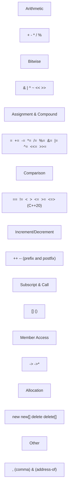

# Chapter 6: Operator Overloading

Operator overloading allows user‑defined types (classes and structures) to use C++ operators in a natural way. When applied appropriately, it makes custom types behave like built‑in types, improving code readability and maintainability.


## Rules and Limitations of Operator Overloading

### Which Operators Can Be Overloaded?

The following table categorises overloadable operators.



### Operators That Cannot Be Overloaded

| Operator | Name | Reason |
|----------|------|--------|
| `::` | Scope resolution | Operates on types/namespaces, not values |
| `.` | Direct member access | Would break access control |
| `.*` | Pointer-to-member access | Special syntax, cannot be redefined |
| `?:` | Ternary conditional | Cannot be overloaded safely |
| `sizeof` | Size of type | Built‑in compile‑time operation |
| `typeid` | RTTI operator | Compile‑time / runtime type info |
| `alignof` | Alignment requirement | Compile‑time operator |

### Fundamental Rules

1. **Preserve natural semantics**  
   `operator+` should perform addition, not subtraction. Violating expectations leads to subtle bugs.

2. **Precedence and associativity cannot be changed**  
   Overloaded operators retain the precedence and associativity of the built‑in version.

3. **Arity cannot be changed**  
   Unary operators remain unary, binary operators remain binary. The `?:` operator is ternary and cannot be overloaded.

4. **At least one operand must be a user‑defined type**  
   You cannot redefine how operators work for built‑in types only.

5. **Cannot create new operators**  
   For example, you cannot define `**` for exponentiation.

6. **Short‑circuit logic is lost for `&&` and `||`**  
   Overloaded `&&` and `||` evaluate both operands (no short‑circuit). Avoid overloading these.

7. **The comma operator `,` can be overloaded, but doing so is strongly discouraged** – it breaks the left‑to‑right evaluation guarantee.

## Overloading as Member Function vs Non‑Member (Friend)

There are two ways to overload an operator:

| Aspect | Member function | Non‑member function (often friend) |
|--------|----------------|-----------------------------------|
| Left operand | `*this` | First parameter |
| Can be called with implicit conversion on left operand? | No, left operand must be object of the class | Yes, if the first parameter type allows conversion |
| Required for `=`, `()`, `[]`, `->` | Yes | No |
| Typical for symmetric binary operators | Less common (breaks symmetry) | Preferred (e.g., `a + b` with `a` and `b` of same type) |
| Typical for stream operators `<<`, `>>` | Not possible (left operand is `ostream&`) | Always non‑member |

**Guideline**:  
- Overload `=` , `()`, `[]`, `->` as member functions.  
- Overload unary operators as member functions (by convention).  
- Overload binary operators that modify the left operand (`+=`, `-=`, etc.) as member functions.  
- Overload symmetric binary operators (`+`, `-`, `==`, etc.) as non‑member functions to allow implicit conversions on either side.

**Example – member vs non‑member**:

```cpp
class Rational {
    int num, den;
public:
    Rational(int n = 0, int d = 1) : num(n), den(d) {}

    // Member: left operand is *this
    Rational& operator+=(const Rational& other) {
        num = num * other.den + other.num * den;
        den = den * other.den;
        return *this;
    }

    // Non-member friend for symmetric addition
    friend Rational operator+(const Rational& a, const Rational& b) {
        return Rational(a.num * b.den + b.num * a.den,
                        a.den * b.den);
    }
};
```

## Unary Operators

Unary operators operate on a single operand. They are typically implemented as member functions (no parameter) or as non‑member functions (one parameter).

### Increment and Decrement (`++`, `--`)

Both prefix and postfix versions exist. The postfix version takes an unused `int` parameter to distinguish it.

```cpp
class Counter {
    int value;
public:
    Counter(int v = 0) : value(v) {}

    // Prefix: ++c
    Counter& operator++() {
        ++value;
        return *this;
    }

    // Postfix: c++
    Counter operator++(int) {
        Counter temp = *this;   // save old value
        ++(*this);              // reuse prefix
        return temp;            // return old value
    }

    // Similarly for --
    Counter& operator--() {
        --value;
        return *this;
    }

    Counter operator--(int) {
        Counter temp = *this;
        --(*this);
        return temp;
    }

    int get() const { return value; }
};
```

**Key points**:  
- Prefix returns a reference to `*this` (efficient).  
- Postfix returns a copy of the old value (less efficient). Prefer prefix when the returned value is not needed.

### Logical Not (`!`), Bitwise Not (`~`), Unary Minus (`-`)

These are unary operators that typically return a new object by value.

```cpp
class Vector3D {
    double x, y, z;
public:
    Vector3D(double x = 0, double y = 0, double z = 0) : x(x), y(y), z(z) {}

    Vector3D operator-() const {          // unary minus
        return Vector3D(-x, -y, -z);
    }

    bool operator!() const {              // logical not
        return (x == 0 && y == 0 && z == 0);
    }

    Vector3D operator~() const {          // bitwise not – often used for complement
        return Vector3D(~(long long)x, ~(long long)y, ~(long long)z);
    }
};
```

## Binary Operators

### Arithmetic Operators (`+`, `-`, `*`, `/`, `%`)

Arithmetic operators usually return a new object (by value) and should not modify the operands. Implement them as non‑member functions for symmetry, often in terms of compound assignment.

```cpp
class Rational {
    // ... data members and compound assignment already defined
public:
    Rational& operator+=(const Rational& other) { /* ... */ return *this; }
    Rational& operator-=(const Rational& other) { /* ... */ return *this; }
    // etc.
};

// Implement + in terms of +=
Rational operator+(Rational a, const Rational& b) {
    a += b;
    return a;
}

Rational operator-(Rational a, const Rational& b) {
    a -= b;
    return a;
}
```

### Relational Operators (`==`, `!=`, `<`, `>`, `<=`, `>=`)

Return `bool`. C++20 can automatically generate `!=` from `==` and the other comparisons from `<=>` (three‑way comparison). For pre‑C++20, provide all needed operators consistently.

```cpp
class Point {
    int x, y;
public:
    Point(int x = 0, int y = 0) : x(x), y(y) {}

    bool operator==(const Point& other) const {
        return x == other.x && y == other.y;
    }

    bool operator<(const Point& other) const {
        return x < other.x || (x == other.x && y < other.y);
    }

    // C++17 and earlier
    bool operator!=(const Point& other) const { return !(*this == other); }
    bool operator>(const Point& other) const  { return other < *this; }
    bool operator<=(const Point& other) const { return !(other < *this); }
    bool operator>=(const Point& other) const { return !(*this < other); }
};
```

### Assignment Operator `=` (Copy‑and‑Swap Idiom)

The copy assignment operator is automatically generated, but when you manage resources (raw pointers, file handles, etc.), you must implement it manually. The **copy‑and‑swap** idiom provides strong exception safety.

```cpp
#include <utility> // for std::swap

class String {
    char* data;
public:
    String(const char* str = "") {
        data = new char[strlen(str) + 1];
        strcpy(data, str);
    }

    // Copy constructor
    String(const String& other) {
        data = new char[strlen(other.data) + 1];
        strcpy(data, other.data);
    }

    // Destructor
    ~String() { delete[] data; }

    // Swap function (non-throwing)
    void swap(String& other) noexcept {
        std::swap(data, other.data);
    }

    // Copy assignment using copy-and-swap
    String& operator=(String other) {   // pass by value (copy) – covers both copy and move
        swap(other);                    // non-throwing swap
        return *this;
    }
};
```

**Why copy‑and‑swap works**:  
- The parameter `other` is a copy of the right‑hand side (copy constructor invoked).  
- Swapping with `*this` exchanges the internal data.  
- When `other` goes out of scope, it destroys the old data of `*this`.  
- Provides strong exception guarantee: if copying throws, the left operand remains unchanged.

### Compound Assignment Operators (`+=`, `-=`, `*=`, etc.)

These operators modify the left operand. Implement them as member functions, returning a reference to `*this` to allow chaining.

```cpp
class Matrix {
    double data[3][3];
public:
    Matrix& operator+=(const Matrix& other) {
        for (int i = 0; i < 3; ++i)
            for (int j = 0; j < 3; ++j)
                data[i][j] += other.data[i][j];
        return *this;
    }
};

// Usage
Matrix a, b;
(a += b) += b;   // adds b twice, returns reference to a
```

### Subscript Operator `[]`

Used to provide array‑like access. Provide two overloads: one for const objects and one for non‑const objects.

```cpp
class IntVector {
    int* arr;
    size_t size;
public:
    IntVector(size_t n) : size(n), arr(new int[n]) {}
    ~IntVector() { delete[] arr; }

    // Non-const version – allows assignment
    int& operator[](size_t index) {
        return arr[index];
    }

    // Const version – read-only
    const int& operator[](size_t index) const {
        return arr[index];
    }
};
```

### Function Call Operator `()` – Functors

An object that overloads `operator()` behaves like a function. Such objects are called *functors* or *function objects*. They are widely used with STL algorithms and can maintain state.

```cpp
class MultiplyBy {
    double factor;
public:
    MultiplyBy(double f) : factor(f) {}

    double operator()(double x) const {
        return x * factor;
    }
};

// Usage
MultiplyBy timesTwo(2.0);
double result = timesTwo(5.0);   // result = 10.0

// With STL algorithm
#include <vector>
#include <algorithm>
std::vector<double> v = {1, 2, 3};
std::transform(v.begin(), v.end(), v.begin(), MultiplyBy(2.5));
```

### Stream Insertion (`<<`) and Extraction (`>>`)

These must be non‑member functions because the left operand is `std::ostream&` or `std::istream&`, not an object of your class. They are typically declared as friends to access private members.

```cpp
#include <iostream>

class Complex {
    double re, im;
public:
    Complex(double r = 0, double i = 0) : re(r), im(i) {}

    friend std::ostream& operator<<(std::ostream& os, const Complex& c);
    friend std::istream& operator>>(std::istream& is, Complex& c);
};

std::ostream& operator<<(std::ostream& os, const Complex& c) {
    os << c.re << (c.im >= 0 ? "+" : "") << c.im << "i";
    return os;
}

std::istream& operator>>(std::istream& is, Complex& c) {
    is >> c.re >> c.im;
    return is;
}
```

**Return by reference** allows chaining: `std::cout << a << b << std::endl;`.

## Overloading `new` and `delete`

You can overload `operator new` and `operator delete` for a class to provide custom memory management. This is useful for:

- Pool allocation / memory arenas
- Tracking allocations for debugging
- Aligning memory for specific hardware requirements

### Syntax and Example

```cpp
#include <cstdlib>
#include <iostream>

class Widget {
    static constexpr size_t POOL_SIZE = 1024;
    static char pool[POOL_SIZE];
    static size_t offset;

public:
    // Regular new/delete (called by new Widget)
    void* operator new(size_t size) {
        if (size > POOL_SIZE - offset) throw std::bad_alloc();
        void* ptr = pool + offset;
        offset += size;
        std::cout << "Custom new: allocated " << size << " bytes\n";
        return ptr;
    }

    void operator delete(void* ptr) noexcept {
        // No-op for this simple pool – actual release requires more logic
        std::cout << "Custom delete called\n";
    }

    // Array versions (optional)
    void* operator new[](size_t size) {
        return ::operator new(size);   // fallback to global
    }

    void operator delete[](void* ptr) noexcept {
        ::operator delete(ptr);
    }
};

char Widget::pool[Widget::POOL_SIZE];
size_t Widget::offset = 0;

// Usage
Widget* w = new Widget();   // calls custom operator new
delete w;                   // calls custom operator delete
```

### Important Notes

- Overloaded `new` and `delete` are **static** by implication – they have no `this` pointer.
- The `delete` operator must match the `new` operator (same signature).
- You can add extra parameters to `new` (e.g., `new(arena) Widget`) – this is the *placement new* syntax. Overloading `new` with additional parameters is common for custom allocators.
- If you overload `operator new`, you should also overload the corresponding `operator delete` to avoid undefined behaviour.
- The `noexcept` specifier is recommended for `operator delete`.

### Placement New Example

```cpp
class Widget {
public:
    void* operator new(size_t size, void* ptr) noexcept {
        return ptr;   // placement new: just return the provided pointer
    }
    // Corresponding delete – does nothing for placement new
    void operator delete(void*, void*) noexcept {}
};
```

## Summary of Best Practices

| Operator category | Recommended form | Return type | Notes |
|-------------------|------------------|-------------|-------|
| `=` `[]` `()` `->` | Member | Reference for `=`, `->`; reference or proxy for `[]`; any for `()` | Required by language |
| `++` `--` (prefix) | Member | `T&` | Returns `*this` |
| `++` `--` (postfix) | Member | `T` | Returns old value (copy) |
| Unary `!` `-` `~` | Member or non‑member | `T` (or `bool` for `!`) | Often member for simplicity |
| Arithmetic `+ - * / %` | Non‑member | `T` | Implement in terms of compound assignment |
| Compound assignment `+= -=` etc. | Member | `T&` | Return `*this` |
| Relational `== != < > <= >=` | Non‑member | `bool` | Provide symmetric conversions |
| `<< >>` (stream) | Non‑member | `std::ostream&` / `std::istream&` | Must be non‑member |
| `new` / `delete` | Static member | `void*` / `void` | Custom memory management |

## Common Pitfalls to Avoid

1. **Overloading `&&` or `||`** – breaks short‑circuit evaluation.
2. **Overloading the comma operator** – breaks left‑to‑right evaluation.
3. **Returning a reference to a local variable** from an arithmetic operator (e.g., returning `T&` from `operator+`). Always return by value.
4. **Forgetting to handle self‑assignment** in `operator=`. The copy‑and‑swap idiom handles it automatically.
5. **Making stream operators members** – they will not work because the left operand is `ostream&`, not your class.
6. **Overloading `operator&` (address‑of)** – can break generic code that assumes `&obj` gives the true address.

Operator overloading, when used judiciously, makes C++ code elegant and expressive. Always ask whether an overload clarifies or obscures the meaning of your type.