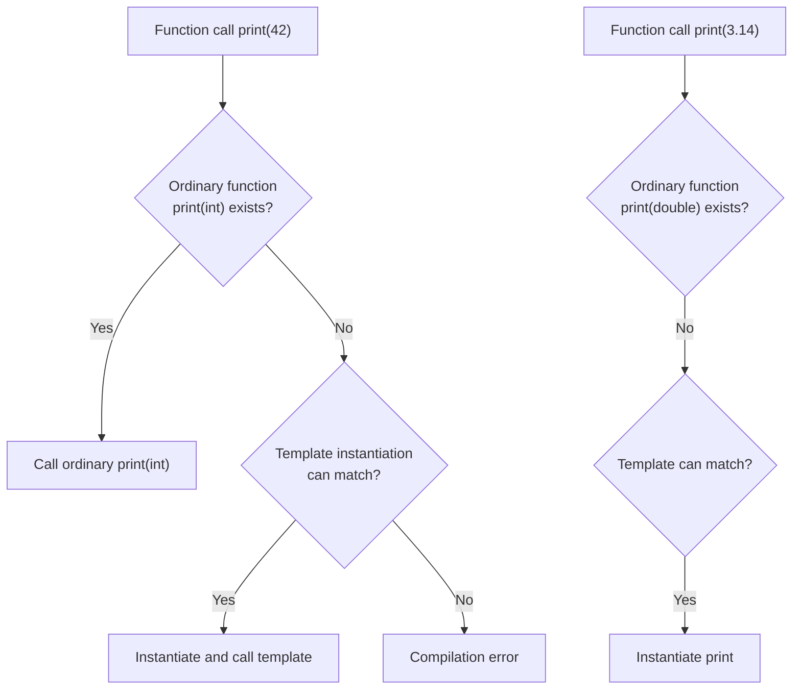
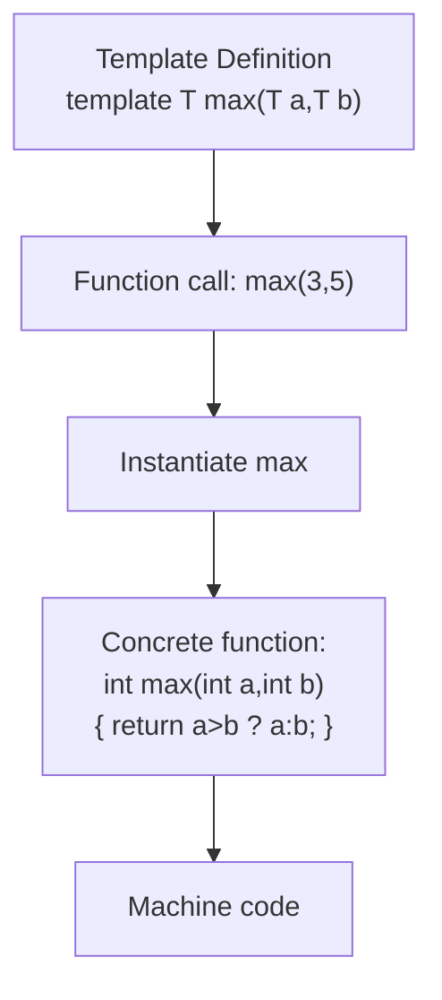

# Chapter 8: Templates (Generic Programming)

Templates enable generic programming by allowing functions and classes to operate with different data types without being rewritten for each type. The compiler generates type‑specific code from a template definition, making templates a form of compile‑time polymorphism.

## Function Templates

A function template defines a family of functions that differ only by the types of their parameters or return value.

### Syntax and Type Deduction

```cpp
template <typename T>
T max(T a, T b) {
    return (a > b) ? a : b;
}
```

- `typename T` declares a template parameter. You can also use `class T` (no difference).
- The compiler deduces `T` from the function arguments.

```cpp
int i = max(10, 20);      // T deduced as int
double d = max(3.14, 2.7); // T deduced as double
// max(10, 3.14); // error: ambiguous, T could be int or double
```

You can also specify the type explicitly:

```cpp
double d = max<double>(10, 3.14); // OK, T forced to double
```

### Template Instantiation

The process of generating concrete code from a template is called instantiation. It happens implicitly when the template is used.

```cpp
template <typename T>
T square(T x) { return x * x; }

int main() {
    int a = square(5);      // instantiates square<int>(int)
    double b = square(4.2); // instantiates square<double>(double)
}
```

Each distinct set of template arguments produces a separate function overload in the compiled binary.

### Overloading Function Templates

Function templates can be overloaded with other templates or with ordinary functions. When both are viable, the compiler prefers the ordinary function if it matches exactly; otherwise, it chooses the most specialised template.

```cpp
template <typename T>
void print(T value) {
    std::cout << "Template: " << value << '\n';
}

void print(int value) {
    std::cout << "Ordinary: " << value << '\n';
}

int main() {
    print(42);      // calls ordinary version (exact match)
    print(3.14);    // calls template (no ordinary function for double)
    print<int>(42); // forces template even if ordinary exists
}
```

The following diagram illustrates the overload resolution process.



## Class Templates

Class templates define families of classes. They are commonly used for generic containers.

### Defining a Generic Class – `Stack<T>`

```cpp
template <typename T>
class Stack {
private:
    std::vector<T> data;
public:
    void push(const T& value) { data.push_back(value); }
    void pop() { if (!empty()) data.pop_back(); }
    T& top() { return data.back(); }
    const T& top() const { return data.back(); }
    bool empty() const { return data.empty(); }
    size_t size() const { return data.size(); }
};

// Usage
Stack<int> intStack;
intStack.push(10);
Stack<std::string> stringStack;
stringStack.push("hello");
```

### Member Functions Defined Outside the Class Template

Member function definitions must be placed in the same header file and use the same template syntax.

```cpp
template <typename T>
class Stack {
public:
    void push(const T& value);
};

template <typename T>
void Stack<T>::push(const T& value) {
    // implementation
}
```

The compiler needs the full definition when instantiating, so header‑only implementation is standard.

### Template Specialisation (Full and Partial)

Sometimes a generic implementation does not work for a specific type, or a specialised version can be more efficient.

**Full specialisation** – provide a complete implementation for one concrete type.

```cpp
template <>
class Stack<bool> {
private:
    std::vector<char> bits;
public:
    void push(bool value) {
        bits.push_back(value ? 1 : 0);
    }
    bool top() const { return bits.back() != 0; }
    // ...
};
```

**Partial specialisation** – specialise for a subset of template parameters (only available for class templates, not function templates).

```cpp
template <typename T>
class Stack<T*> {          // Specialisation for pointer types
private:
    std::vector<T*> data;
public:
    void push(T* ptr) { data.push_back(ptr); }
    T* top() const { return data.back(); }
};
```

When a class has multiple template parameters, you can specialise some of them.

```cpp
template <typename Key, typename Value>
class Dictionary { /* generic */ };

// Partial specialisation: Key is int, Value remains free
template <typename Value>
class Dictionary<int, Value> {
    // specialised for int keys
};
```

### Non‑Type Template Parameters

Non‑type parameters accept values (not types) at compile time. They are often used for fixed‑size containers.

```cpp
template <typename T, size_t N>
class Array {
    T data[N];
public:
    size_t size() const { return N; }
    T& operator[](size_t index) { return data[index]; }
    const T& operator[](size_t index) const { return data[index]; }
};

// Usage
Array<int, 5> arr;   // N = 5
arr[0] = 42;
```

Non‑type parameters can be integers, pointers, references, or `std::nullptr_t` (C++11). Floating‑point numbers and class types are not allowed.

```cpp
template <int* Ptr> class Buffer {};   // pointer parameter
int global;
Buffer<&global> buf;                   // OK
```

## Variadic Templates (C++11)

Variadic templates accept an arbitrary number of template arguments. They are essential for type‑safe `printf`‑like functions, `std::tuple`, and factory functions.

### `sizeof...` Operator

`sizeof...` returns the number of arguments in a parameter pack at compile time.

```cpp
template <typename... Args>
void countArguments(Args... args) {
    std::cout << "Number of arguments: " << sizeof...(args) << '\n';
}

// Usage
countArguments(1, 2.5, "hello"); // prints 3
```

### Recursive Expansion (C++11/14)

Parallel to the variadic parameter pack. The typical pattern is a base case plus a recursive case.

```cpp
// Base case: no arguments
void print() {}

// Recursive case: print one argument then the rest
template <typename T, typename... Rest>
void print(T first, Rest... rest) {
    std::cout << first;
    if constexpr (sizeof...(rest) > 0) {
        std::cout << ", ";
    }
    print(rest...);
}

// Usage
print(10, 3.14, "hello"); // prints "10, 3.14, hello"
```

### Fold Expressions (C++17)

Fold expressions dramatically simplify variadic template code. They apply a binary operator to all arguments in a pack.

```cpp
// Unary right fold over +
template <typename... Args>
auto sum(Args... args) {
    return (args + ...);   // expands to arg1 + (arg2 + (arg3 + ...))
}

// Unary left fold over -
template <typename... Args>
auto subtract(Args... args) {
    return (... - args);   // expands to ((arg1 - arg2) - arg3) - ...
}

// Binary fold with initial value
template <typename... Args>
auto product(Args... args) {
    return (1 * ... * args); // initial value 1, then * args...
}

int main() {
    int s = sum(1, 2, 3, 4);     // 1 + 2 + 3 + 4 = 10
    int d = subtract(10, 3, 2);  // (10 - 3) - 2 = 5
    int p = product(2, 3, 4);    // 1 * 2 * 3 * 4 = 24
}
```

The following table summarises fold expression syntax.

| Syntax | Description | Example expansion (pack = 1,2,3) |
|--------|-------------|-----------------------------------|
| `( ... op pack )` | Unary left fold | `((1 op 2) op 3)` |
| `( pack op ... )` | Unary right fold | `(1 op (2 op 3))` |
| `( init op ... op pack )` | Binary left fold | `((init op 1) op 2) op 3` |
| `( pack op ... op init )` | Binary right fold | `1 op (2 op (3 op init))` |

## Template Metaprogramming (Basic Concepts)

Template metaprogramming (TMP) shifts computation from runtime to compile time, enabling optimisations, type constraints, and static polymorphism.

### Compile‑Time Computations

Templates are Turing‑complete. You can compute values at compile time using template recursion.

```cpp
// Compile-time factorial
template <unsigned N>
struct Factorial {
    static constexpr unsigned value = N * Factorial<N-1>::value;
};

template <>
struct Factorial<0> {
    static constexpr unsigned value = 1;
};

int main() {
    constexpr unsigned result = Factorial<5>::value; // 120, computed at compile time
}
```

In C++14 and later, `constexpr` functions are often clearer, but TMP remains useful for type manipulation.

```cpp
// Compile-time min using template
template <int A, int B>
struct Min {
    static constexpr int value = (A < B) ? A : B;
};

// Usage
static_assert(Min<10, 20>::value == 10, "min is 10");
```

### `static_assert` for Compile‑Time Checks

`static_assert` evaluates a constant expression at compile time and produces a compilation error if it fails.

```cpp
template <typename T>
void process(T value) {
    static_assert(std::is_integral<T>::value, "T must be integral type");
    // safe to use integral operations
}
```

Common type traits from `<type_traits>`:

| Trait | Purpose |
|-------|---------|
| `std::is_integral<T>` | T is integral (int, char, etc.) |
| `std::is_floating_point<T>` | T is float, double |
| `std::is_pointer<T>` | T is a pointer |
| `std::is_same<T, U>` | T and U are the same type |
| `std::enable_if<condition, T>` | Alias to T if condition true, else substitution failure (SFINAE) |

**Example – enable_if with function templates**:

```cpp
#include <type_traits>

template <typename T>
typename std::enable_if<std::is_integral<T>::value, T>::type
half(T value) {
    return value / 2;
}

template <typename T>
typename std::enable_if<!std::is_integral<T>::value, T>::type
half(T value) {
    return value / 2.0;
}
```

## Summary Diagram – Template Instantiation



## Best Practices for Templates

1. **Place template definitions in headers** – The compiler needs the full definition to instantiate.
2. **Use `typename` instead of `class`** – It is clearer that the parameter may be any type.
3. **Use `const T&` for parameters** – Avoids unnecessary copies, especially for large types.
4. **Use `std::forward` for perfect forwarding** – When writing generic wrapper functions.
5. **Prefer fold expressions over recursion** – For variadic templates (C++17 and later).
6. **Use `static_assert` with type traits** – To produce clear error messages for unsupported types.
7. **Avoid unnecessary template specialisations** – Use SFINAE or `if constexpr` (C++17) where possible.

Templates are one of the most powerful features of C++. They enable generic libraries like the Standard Template Library (Chapter 9) and advanced compile‑time techniques, without sacrificing performance.