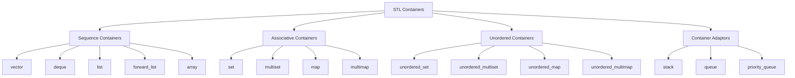
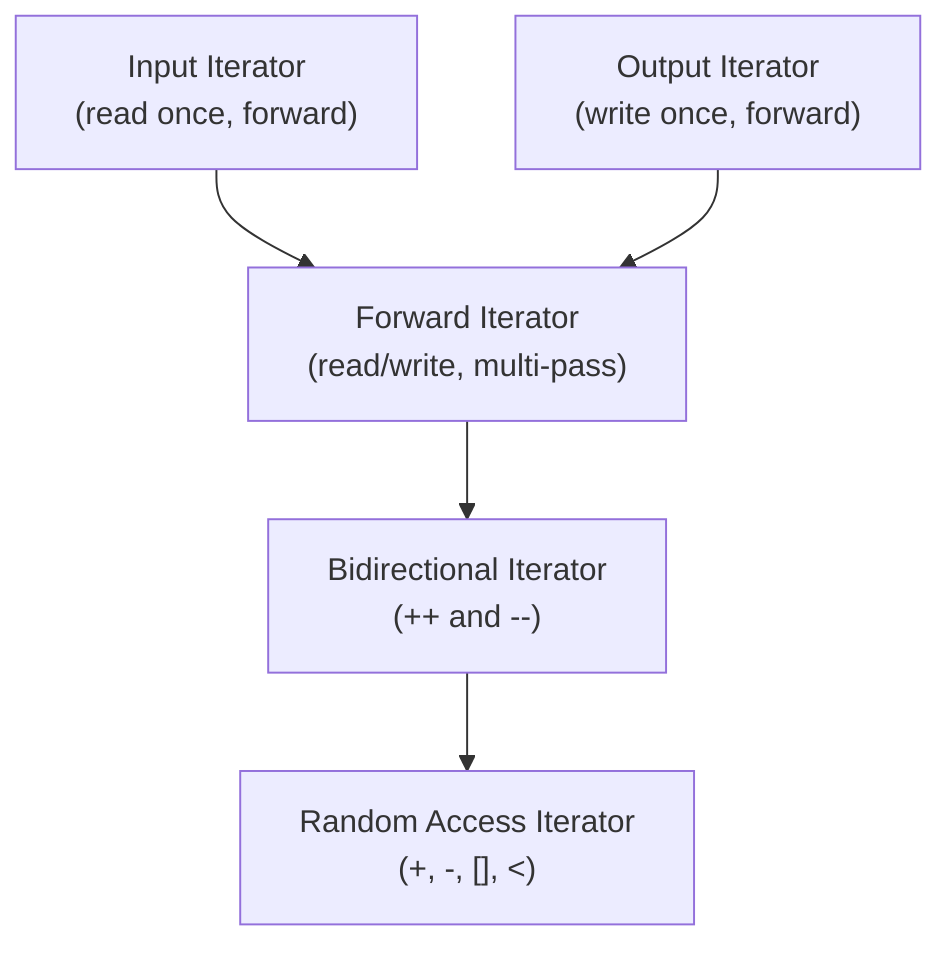
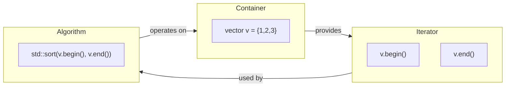

# Chapter 9: Standard Template Library (STL)

The Standard Template Library (STL) is a powerful set of C++ template classes and functions that provide generic containers, iterators, algorithms, and function objects. It enables code reuse, efficiency, and clarity.

## Overview

The STL is built upon four fundamental components:

- **Containers** – data structures that store collections of objects.
- **Iterators** – objects that traverse elements in containers.
- **Algorithms** – functions that perform operations on ranges of elements.
- **Functors (Function Objects)** – objects that behave like functions, used with algorithms.
- **Allocators** – memory management policies (rarely used directly).

### Complexity Guarantees

Each STL operation comes with a complexity guarantee, expressed in Big O notation. For example:

| Container | Access | Insertion (middle) | Insertion (end) | Search |
|-----------|--------|--------------------|-----------------|--------|
| `vector` | O(1) | O(n) | O(1)* | O(n) |
| `list` | O(n) | O(1) | O(1) | O(n) |
| `set` (balanced tree) | O(log n) | O(log n) | O(log n) | O(log n) |
| `unordered_set` (hash) | O(1) avg | O(1) avg | O(1) avg | O(1) avg |

*Amortised constant time (reallocation may occur occasionally).

## Containers

STL containers are divided into several categories.

### Sequence Containers

Store elements in a linear order.

| Container | Description |
|-----------|-------------|
| `vector` | Dynamic array. Fast random access and end insertion. |
| `deque` | Double‑ended queue. Fast insertion/deletion at both ends. |
| `list` | Doubly‑linked list. Fast insertion anywhere. |
| `forward_list` | Singly‑linked list. Lower overhead than `list`. |
| `array` (C++11) | Fixed‑size array with STL interface. |

### Associative Containers

Store elements in sorted order (typically red‑black trees).

| Container | Description |
|-----------|-------------|
| `set` | Unique sorted keys. |
| `multiset` | Sorted keys with duplicates. |
| `map` | Unique key‑value pairs sorted by key. |
| `multimap` | Key‑value pairs with duplicate keys. |

### Unordered Containers (C++11)

Store elements in hash tables. Average constant‑time operations.

| Container | Description |
|-----------|-------------|
| `unordered_set` | Unique keys, hashed. |
| `unordered_multiset` | Hashed, duplicates allowed. |
| `unordered_map` | Key‑value pairs, hashed. |
| `unordered_multimap` | Hashed with duplicate keys. |

### Container Adaptors

Provide restricted interfaces built on underlying containers.

| Adaptor | Underlying container | Operations |
|---------|----------------------|------------|
| `stack` | `deque` (default) | LIFO: `push`, `pop`, `top` |
| `queue` | `deque` | FIFO: `push`, `pop`, `front`, `back` |
| `priority_queue` | `vector` (default) | Max‑heap: `push`, `pop`, `top` |

The following diagram shows the container hierarchy.



### Example – Using `vector` and `map`

```cpp
#include <iostream>
#include <vector>
#include <map>
#include <string>

int main() {
    // sequence container
    std::vector<int> numbers = {5, 2, 8, 1, 9};
    numbers.push_back(3);  // add to end
    std::sort(numbers.begin(), numbers.end()); // 1,2,3,5,8,9
    
    // associative container
    std::map<std::string, int> ages;
    ages["Alice"] = 30;
    ages["Bob"] = 25;
    
    for (const auto& entry : ages) {
        std::cout << entry.first << ": " << entry.second << '\n';
    }
}
```

## Iterators

Iterators are the glue between containers and algorithms. They provide a uniform way to traverse elements.

### Iterator Categories

Each iterator category supports a specific set of operations.



| Category | Operations | Example Container |
|----------|------------|--------------------|
| Input | `++`, `*` (read), `==`, `!=` | `istream_iterator` |
| Output | `++`, `*` (write) | `ostream_iterator` |
| Forward | All input + multi‑pass | `forward_list` |
| Bidirectional | Forward + `--` | `list`, `set`, `map` |
| Random Access | Bidirectional + `+`, `-`, `[]`, `<` | `vector`, `deque`, `array` |

### Iterator Invalidation

Some operations invalidate existing iterators. This is especially important for `vector`.

| Container | Operation | Invalidation |
|-----------|-----------|---------------|
| `vector` | `push_back` | All iterators if reallocation occurs; else only `end()` |
| `vector` | `insert` / `erase` at middle | All iterators after the insertion/erasure point |
| `list` | `insert` / `erase` | Only iterators to erased elements |
| `set` / `map` | `insert` / `erase` | Only iterators to erased elements (no rehashing) |
| `unordered_set` | `insert` / `erase` | If rehash occurs, all iterators invalidated |

**Example – Avoiding `vector` iterator invalidation**:

```cpp
std::vector<int> v = {1, 2, 3, 4, 5};
for (auto it = v.begin(); it != v.end(); ) {
    if (*it % 2 == 0)
        it = v.erase(it);   // erase returns next valid iterator
    else
        ++it;
}
```

### Reverse Iterators

Reverse iterators traverse a container backwards using `rbegin()` and `rend()`.

```cpp
std::vector<int> v = {1, 2, 3, 4, 5};
for (auto it = v.rbegin(); it != v.rend(); ++it) {
    std::cout << *it << ' '; // prints 5 4 3 2 1
}
```

The `base()` member converts a reverse iterator to the corresponding forward iterator.

## Common Algorithms (`<algorithm>`)

The `<algorithm>` header provides over 100 algorithms that work on iterator ranges.

### Sorting and Searching

```cpp
#include <algorithm>
#include <vector>

std::vector<int> v = {3, 1, 4, 1, 5, 9, 2};
std::sort(v.begin(), v.end());                    // ascending
std::sort(v.begin(), v.end(), std::greater<int>()); // descending

bool exists = std::binary_search(v.begin(), v.end(), 5); // requires sorted range
auto it = std::lower_bound(v.begin(), v.end(), 4);       // first >= 4
auto it2 = std::upper_bound(v.begin(), v.end(), 4);      // first > 4
```

### Partitioning

```cpp
auto pivot = std::partition(v.begin(), v.end(), 
                            [](int x) { return x % 2 == 0; });
// even elements first, pivot points to first odd
```

### Heap Operations

```cpp
std::make_heap(v.begin(), v.end());
std::push_heap(v.begin(), v.end(), 7);
std::pop_heap(v.begin(), v.end()); // moves max to end
v.pop_back();
```

### Min/Max and Permutations

```cpp
int a = 5, b = 3;
int min_val = std::min(a, b);
int max_val = std::max(a, b);
auto [min_it, max_it] = std::minmax_element(v.begin(), v.end());

std::next_permutation(v.begin(), v.end()); // next lexicographic permutation
```

### Numeric Algorithms (`<numeric>`)

```cpp
#include <numeric>
std::vector<int> v = {1, 2, 3, 4};
int sum = std::accumulate(v.begin(), v.end(), 0);        // 10
int product = std::accumulate(v.begin(), v.end(), 1, std::multiplies<int>());
std::partial_sum(v.begin(), v.end(), v.begin());        // 1,3,6,10
```

## Functors (Function Objects)

A functor is an object of a class that overloads `operator()`. They can be used with algorithms in place of function pointers, and they can maintain state.

### Predefined Functors

The `<functional>` header provides many common functors.

| Functor | Operation |
|---------|-----------|
| `std::plus<T>` | `a + b` |
| `std::minus<T>` | `a - b` |
| `std::multiplies<T>` | `a * b` |
| `std::divides<T>` | `a / b` |
| `std::greater<T>` | `a > b` |
| `std::less<T>` | `a < b` |
| `std::logical_and<T>` | `a && b` |

**Example**:

```cpp
std::vector<int> v = {3, 1, 4, 1, 5};
std::sort(v.begin(), v.end(), std::greater<int>()); // descending
```

### Lambda Expressions (C++11)

Lambdas provide a concise way to create anonymous function objects.

**Syntax**: `[capture](parameters) -> return_type { body }`

- `capture` – how to capture variables from the surrounding scope.
- `parameters` – function parameters.
- `return_type` – optional, deduced if omitted.
- `body` – function implementation.

**Capture modes**:

| Capture clause | Effect |
|----------------|--------|
| `[]` | Capture nothing |
| `[=]` | Capture all by value |
| `[&]` | Capture all by reference |
| `[x, &y]` | Capture `x` by value, `y` by reference |
| `[this]` | Capture `this` pointer (by value) |

```cpp
std::vector<int> v = {1, 2, 3, 4, 5};
int factor = 3;
std::transform(v.begin(), v.end(), v.begin(),
               [factor](int x) { return x * factor; });
```

**Mutable lambda** – allows modification of captured values (works on copies).

```cpp
int counter = 0;
auto inc = [counter]() mutable { return ++counter; };
inc(); // 1
inc(); // 2
// counter unchanged
```

**Generic lambda** (C++14): `auto` parameters.

```cpp
auto add = [](auto a, auto b) { return a + b; };
int i = add(3, 4);
double d = add(2.5, 1.5);
```

### `std::function` – Type Erasure for Callables

`std::function` can store any callable (function pointer, functor, lambda) with a given signature.

```cpp
#include <functional>

void printInt(int x) { std::cout << x << '\n'; }

int main() {
    std::function<void(int)> f;
    
    f = printInt;           // function pointer
    f(42);
    
    f = [](int x) { std::cout << x * 2 << '\n'; }; // lambda
    f(10); // prints 20
}
```

`std::function` has some overhead (type erasure). For performance‑critical code, prefer templates or lambdas directly.

## Smart Pointers (C++11)

Smart pointers manage dynamically allocated memory automatically, following RAII principles.

### `std::unique_ptr`

Exclusive ownership. Cannot be copied, only moved.

```cpp
#include <memory>

std::unique_ptr<int> p1(new int(42));
std::unique_ptr<int> p2 = std::move(p1); // p1 now null

// Prefer make_unique (C++14)
auto p3 = std::make_unique<int>(100);
```

Used as a return type for factory functions and for polymorphic base classes.

```cpp
class Base { public: virtual ~Base() = default; };
class Derived : public Base {};

std::unique_ptr<Base> create() {
    return std::make_unique<Derived>();
}
```

### `std::shared_ptr`

Shared ownership with reference counting. The last `shared_ptr` deletes the object.

```cpp
std::shared_ptr<int> sp1 = std::make_shared<int>(200);
std::shared_ptr<int> sp2 = sp1;   // reference count = 2
sp1.reset();                      // count = 1
```

### `std::weak_ptr`

Non‑owning observer of a `shared_ptr`. Used to break circular references.

```cpp
struct Node {
    std::shared_ptr<Node> next;
    std::weak_ptr<Node> prev;  // breaks cycle
};

std::shared_ptr<Node> n1 = std::make_shared<Node>();
std::shared_ptr<Node> n2 = std::make_shared<Node>();
n1->next = n2;
n2->prev = n1; // no cycle
```

To use a `weak_ptr`, convert it to a `shared_ptr` using `lock()`:

```cpp
if (auto sp = weakPtr.lock()) {
    // use sp safely
} else {
    // object already deleted
}
```

### `std::make_unique` and `std::make_shared`

These functions create smart pointers safely and efficiently (single allocation for `make_shared`).

```cpp
auto uptr = std::make_unique<MyClass>(arg1, arg2);
auto sptr = std::make_shared<MyClass>(arg1, arg2);
```

## Container and Iterator Relationship Diagram



## Summary Table – STL Components

| Component | Purpose | Example |
|-----------|---------|---------|
| Container | Store data | `std::vector<int>` |
| Iterator | Access elements | `v.begin()` |
| Algorithm | Process ranges | `std::sort(v.begin(), v.end())` |
| Functor | Customise algorithm behaviour | `std::greater<int>()` |
| Lambda | Inline functor | `[](int x){ return x>0; }` |
| `std::function` | Type‑erased callable | store any callable |
| Smart pointer | Automatic memory management | `std::unique_ptr<Widget>` |
| Allocator | Low‑level memory allocation | default `std::allocator` |

The STL is the foundation of modern C++ programming. Mastering it allows you to write expressive, efficient, and correct code. For deeper understanding, consult the documentation of each container and algorithm, and always consider complexity guarantees when choosing data structures.