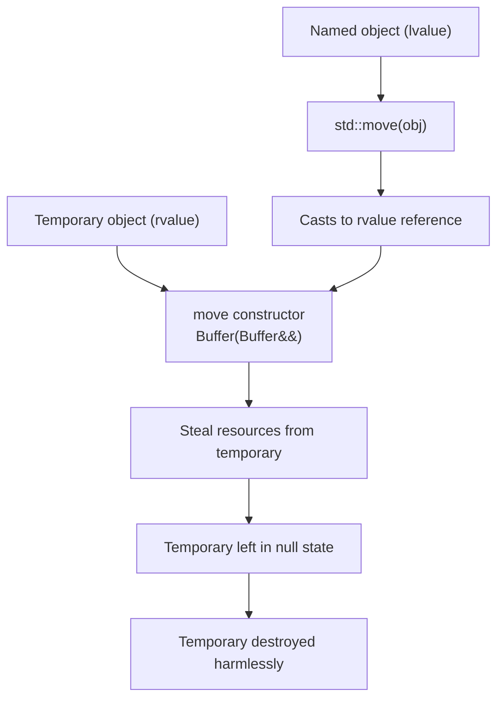
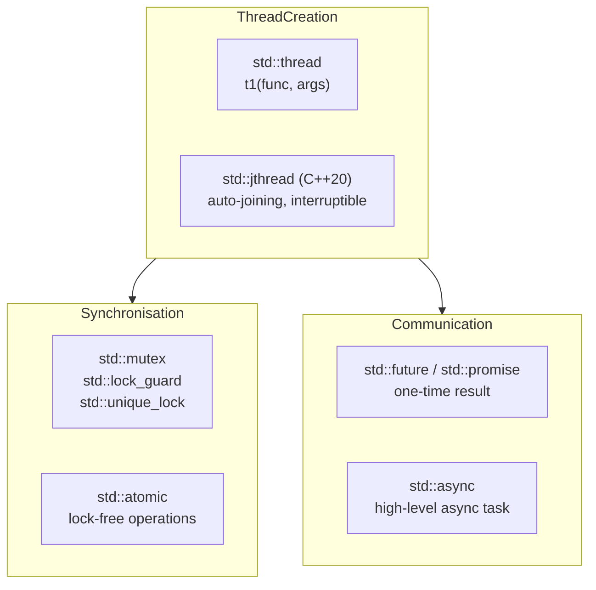

# Chapter 10: Advanced C++ Features

This chapter covers features introduced in C++11 and later that enable modern, efficient, and expressive C++ programming: move semantics, perfect forwarding, type traits, user‑defined literals, and basic concurrency.

## Move Semantics and Perfect Forwarding

Move semantics eliminate unnecessary copies by transferring ownership of resources from one object to another. This is particularly beneficial for types that manage heap memory, file handles, or other expensive‑to‑copy resources.

### Lvalue and Rvalue References (`&&`)

- **Lvalue** – an expression that has an identifiable memory address (e.g., a variable, `*ptr`, `a[0]`).
- **Rvalue** – a temporary expression without a persistent address (e.g., `42`, `a + b`, `std::move(x)`).
- **Lvalue reference (`&`)** – binds to lvalues.
- **Rvalue reference (`&&`)** – binds to rvalues (temporaries).

```cpp
int a = 5;          // a is an lvalue
int& ref = a;       // lvalue reference
int&& rref = 42;    // rvalue reference binds to temporary
```

A function overloaded with lvalue and rvalue references can distinguish between copy and move operations.

### Move Constructor and Move Assignment Operator

The move constructor and move assignment transfer resources instead of copying them. They typically leave the source object in a valid but unspecified state (often null).

```cpp
class Buffer {
    int* data;
    size_t size;
public:
    // Constructor
    Buffer(size_t sz) : size(sz), data(new int[sz]) {}
    
    // Destructor
    ~Buffer() { delete[] data; }
    
    // Copy constructor (deep copy)
    Buffer(const Buffer& other) : size(other.size), data(new int[other.size]) {
        std::copy(other.data, other.data + size, data);
    }
    
    // Move constructor
    Buffer(Buffer&& other) noexcept 
        : data(other.data), size(other.size) {
        other.data = nullptr;
        other.size = 0;
    }
    
    // Move assignment
    Buffer& operator=(Buffer&& other) noexcept {
        if (this != &other) {
            delete[] data;
            data = other.data;
            size = other.size;
            other.data = nullptr;
            other.size = 0;
        }
        return *this;
    }
};
```

The `noexcept` specifier enables optimisations (e.g., `std::vector` uses move if it is `noexcept`).

### Rule of Five

If a class manages a resource, you should provide five special member functions:

| Function | Purpose |
|----------|---------|
| Destructor | Release resources |
| Copy constructor | Duplicate resource |
| Copy assignment | Duplicate resource |
| Move constructor | Transfer resource |
| Move assignment | Transfer resource |

The Rule of Zero states that you should avoid writing any of these if possible – use RAII containers (`std::vector`, `std::string`, smart pointers) instead.

### `std::move` and `std::forward`

- `std::move` – unconditionally casts its argument to an rvalue reference, enabling move semantics.
- `std::forward` – conditionally forwards arguments preserving their value category (lvalue/rvalue).

```cpp
std::vector<int> v1 = {1, 2, 3};
std::vector<int> v2 = std::move(v1);  // v1 is now empty

template<typename T>
void wrapper(T&& arg) {
    // forwards arg as either lvalue or rvalue
    target(std::forward<T>(arg));
}
```

`std::move` does not move anything by itself – it is a cast. The actual move occurs in the constructor or assignment operator that takes an rvalue reference.

### Copy‑and‑Swap Idiom (Revisited)

Copy‑and‑swap provides strong exception safety for assignment operators and naturally supports move semantics when combined with pass‑by‑value.

```cpp
class String {
    char* data;
public:
    // ... constructors, destructor
    
    void swap(String& other) noexcept {
        std::swap(data, other.data);
    }
    
    // Unified assignment: copy and swap
    String& operator=(String other) { // pass by value (copy or move)
        swap(other);   // non‑throwing swap
        return *this;
    }
};
```

If the right operand is an lvalue, `other` is copy‑constructed. If it is an rvalue, `other` is move‑constructed.

The following diagram summarises move semantics flow.



## Type Traits and the `<type_traits>` Header

Type traits provide compile‑time information about types. They are used in template metaprogramming, SFINAE, and `static_assert`.

### Common Type Traits

| Trait | Description |
|-------|-------------|
| `std::is_integral<T>` | True if T is integral (int, char, etc.) |
| `std::is_floating_point<T>` | True if T is float, double |
| `std::is_class<T>` | True if T is a class or struct |
| `std::is_pointer<T>` | True if T is a pointer |
| `std::is_reference<T>` | True if T is a reference |
| `std::is_same<T, U>` | True if T and U are the same type |
| `std::enable_if<B, T>` | If B true, typedef T; otherwise substitution failure |

```cpp
#include <type_traits>

template<typename T>
void printInteger(T x) {
    static_assert(std::is_integral<T>::value, "T must be integral");
    std::cout << x << '\n';
}
```

### SFINAE (Substitution Failure Is Not An Error)

SFINAE is a principle where a template candidate is removed from the overload set if substituting template parameters results in invalid code. It is used to conditionally enable certain overloads.

**Example – using `enable_if`**:

```cpp
// Enable this only for integral types
template<typename T>
typename std::enable_if<std::is_integral<T>::value, T>::type
half(T value) {
    return value / 2;
}

// Enable this only for floating‑point types
template<typename T>
typename std::enable_if<std::is_floating_point<T>::value, T>::type
half(T value) {
    return value / 2.0;
}
```

C++17 introduced `if constexpr` as a simpler alternative for many use cases:

```cpp
template<typename T>
auto half(T value) {
    if constexpr (std::is_integral<T>::value) {
        return value / 2;
    } else {
        return value / 2.0;
    }
}
```

### `decltype` and `auto` Type Deduction

- `auto` – deduces the type of a variable from its initialiser.
- `decltype(expr)` – yields the type of an expression without evaluating it.

```cpp
int x = 5;
auto y = x;       // y is int
decltype(x) z = x; // z is int

// decltype preserves references and const
const int& cr = x;
auto a = cr;      // a is int (const and reference dropped)
decltype(cr) b = x; // b is const int&
```

**Trailing return type** (C++11) allows the return type to depend on parameters:

```cpp
template<typename T, typename U>
auto add(T t, U u) -> decltype(t + u) {
    return t + u;
}
```

In C++14, you can omit the trailing return type if the body returns a single expression:

```cpp
template<typename T, typename U>
auto add(T t, U u) {
    return t + u;   // return type deduced
}
```

## User‑Defined Literals

User‑defined literals (UDLs) allow custom suffixes for numeric and string literals. They are implemented by defining `operator"" X`.

### Syntax

```cpp
ReturnType operator"" _suffix(unsigned long long);
ReturnType operator"" _suffix(long double);
ReturnType operator"" _suffix(const char*, size_t); // for string literals
```

### Examples

```cpp
#include <chrono>
#include <string>

// Literal for std::chrono::seconds
std::chrono::seconds operator"" _s(unsigned long long val) {
    return std::chrono::seconds(val);
}

// Literal for std::string
std::string operator"" _s(const char* str, size_t len) {
    return std::string(str, len);
}

// Usage
auto duration = 10_s;   // std::chrono::seconds
std::string greeting = "Hello"_s;
```

**Note**: User‑defined literals must start with an underscore (`_`) to avoid naming conflicts with future standard literals.

## Concurrency Basics (C++11 and later)

C++ provides a memory model and thread support library for writing portable multithreaded code.

### `std::thread`

Creates and manages a thread of execution.

```cpp
#include <thread>
#include <iostream>

void worker(int id) {
    std::cout << "Thread " << id << " running\n";
}

int main() {
    std::thread t1(worker, 1);
    std::thread t2(worker, 2);
    
    t1.join(); // wait for thread to finish
    t2.join();
}
```

- `join()` – blocks until the thread completes.
- `detach()` – allows the thread to run independently (careful with lifetimes).

### `std::jthread` (C++20)

`std::jthread` is an improved version that automatically joins on destruction and supports cooperative interruption.

```cpp
#include <thread>
#include <chrono>

void sleeper(std::stop_token stoken) {
    while (!stoken.stop_requested()) {
        std::this_thread::sleep_for(std::chrono::milliseconds(100));
    }
}

int main() {
    std::jthread t(sleeper);  // automatically joins on destruction
    // ... t will be stopped and joined when out of scope
}
```

### Mutual Exclusion – `std::mutex`, `std::lock_guard`, `std::unique_lock`

Protect shared data from concurrent access.

```cpp
#include <mutex>
#include <thread>
#include <vector>

std::mutex mtx;
int counter = 0;

void increment() {
    for (int i = 0; i < 100000; ++i) {
        std::lock_guard<std::mutex> lock(mtx);
        ++counter;
    }
}

int main() {
    std::thread t1(increment), t2(increment);
    t1.join(); t2.join();
    // counter == 200000 (no data race)
}
```

- `std::lock_guard` – simple RAII lock, non‑copyable.
- `std::unique_lock` – more flexible (deferred locking, timed locking, unlocking).

### `std::async` and `std::future` / `std::promise`

`std::async` runs a function asynchronously and returns a `std::future` that will hold the result.

```cpp
#include <future>
#include <iostream>

int compute(int x) {
    return x * x;
}

int main() {
    std::future<int> result = std::async(std::launch::async, compute, 5);
    std::cout << result.get() << '\n'; // 25 (blocks until ready)
}
```

`std::promise` explicitly sets a value that can be retrieved via a `std::future`.

```cpp
std::promise<int> prom;
std::future<int> fut = prom.get_future();

std::thread t([&prom] {
    prom.set_value(42);
});

std::cout << fut.get() << '\n';
t.join();
```

### Atomic Types (`std::atomic`)

Atomic types provide lock‑free (or lock‑based) operations on shared variables.

```cpp
#include <atomic>

std::atomic<int> counter = 0;

void increment() {
    for (int i = 0; i < 100000; ++i) {
        ++counter; // atomic increment
    }
}
```

Common operations: `load()`, `store()`, `exchange()`, `compare_exchange_weak/strong`.

## Concurrency Overview Diagram



## Summary – Advanced Features

| Feature | Key Purpose | Best Practice |
|---------|-------------|---------------|
| Move semantics | Eliminate expensive copies | Declare move operations `noexcept` |
| Perfect forwarding | Preserve value category | Use `std::forward<T>` in templates |
| Type traits | Compile‑time type queries | Use `if constexpr` or `enable_if` |
| SFINAE | Conditionally enable templates | Prefer `if constexpr` (C++17) when possible |
| `decltype`/`auto` | Type deduction | Use `auto` for variables, `decltype` for expression types |
| User‑defined literals | Custom literal suffixes | Always start with underscore (`_s`) |
| `std::thread` | Low‑level threading | Use `std::jthread` (C++20) or RAII wrappers |
| `std::async` | Asynchronous tasks | Prefer for fire‑and‑forget or result‑returning tasks |
| `std::mutex` | Protect shared data | Use `std::lock_guard`/`std::unique_lock` |
| `std::atomic` | Lock‑free shared variables | Prefer for simple counters and flags |

These advanced features distinguish modern C++ from earlier dialects. Mastering move semantics and concurrency is essential for writing high‑performance, scalable applications.