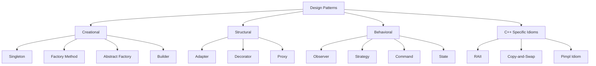

# Chapter 11: Design Patterns in C++ (Overview)

Design patterns are reusable solutions to commonly occurring problems in software design. They are not finished code but templates that can be adapted to specific situations. This chapter provides an overview of essential patterns with C++‑specific implementations.

## Creational Patterns

Creational patterns abstract the object instantiation process, making a system independent of how its objects are created.

### Singleton

The Singleton pattern ensures a class has only one instance and provides a global point of access to it.

**Thread‑safe Singleton (C++11 and later)** – C++11 guarantees that static local variables are initialised in a thread‑safe manner (magic statics).

```cpp
class Singleton {
private:
    Singleton() = default;  // private constructor
    ~Singleton() = default;
    
    // Delete copy and move
    Singleton(const Singleton&) = delete;
    Singleton& operator=(const Singleton&) = delete;
    Singleton(Singleton&&) = delete;
    Singleton& operator=(Singleton&&) = delete;

public:
    static Singleton& getInstance() {
        static Singleton instance;  // thread‑safe initialisation (C++11)
        return instance;
    }
    
    void doSomething() const {
        // ...
    }
};

// Usage
Singleton::getInstance().doSomething();
```

**Alternative (Meyers Singleton)** – the above is the Meyers Singleton. For lazy initialisation with explicit control, you can use `std::call_once`.

```cpp
#include <mutex>

class SingletonWithCallOnce {
    static std::unique_ptr<SingletonWithCallOnce> instance;
    static std::once_flag initFlag;
    
    SingletonWithCallOnce() = default;
    
public:
    static SingletonWithCallOnce& getInstance() {
        std::call_once(initFlag, []() {
            instance.reset(new SingletonWithCallOnce);
        });
        return *instance;
    }
};
```

### Factory Method

The Factory Method defines an interface for creating an object, but lets subclasses decide which class to instantiate.

```cpp
class Product {
public:
    virtual ~Product() = default;
    virtual std::string operation() const = 0;
};

class ConcreteProductA : public Product {
public:
    std::string operation() const override { return "Result of Product A"; }
};

class ConcreteProductB : public Product {
public:
    std::string operation() const override { return "Result of Product B"; }
};

class Creator {
public:
    virtual ~Creator() = default;
    virtual std::unique_ptr<Product> factoryMethod() const = 0;
};

class ConcreteCreatorA : public Creator {
public:
    std::unique_ptr<Product> factoryMethod() const override {
        return std::make_unique<ConcreteProductA>();
    }
};

class ConcreteCreatorB : public Creator {
public:
    std::unique_ptr<Product> factoryMethod() const override {
        return std::make_unique<ConcreteProductB>();
    }
};

// Usage
std::unique_ptr<Creator> creator = std::make_unique<ConcreteCreatorA>();
std::unique_ptr<Product> product = creator->factoryMethod();
```

### Abstract Factory

Abstract Factory provides an interface for creating families of related or dependent objects without specifying concrete classes.

```cpp
// Abstract products
class Button { public: virtual void paint() = 0; virtual ~Button() = default; };
class Checkbox { public: virtual void check() = 0; virtual ~Checkbox() = default; };

// Concrete products for Windows
class WinButton : public Button { public: void paint() override { /* Windows style */ } };
class WinCheckbox : public Checkbox { public: void check() override { /* Windows style */ } };

// Concrete products for Mac
class MacButton : public Button { public: void paint() override { /* Mac style */ } };
class MacCheckbox : public Checkbox { public: void check() override { /* Mac style */ } };

// Abstract factory
class GUIFactory {
public:
    virtual std::unique_ptr<Button> createButton() = 0;
    virtual std::unique_ptr<Checkbox> createCheckbox() = 0;
    virtual ~GUIFactory() = default;
};

class WinFactory : public GUIFactory {
public:
    std::unique_ptr<Button> createButton() override { return std::make_unique<WinButton>(); }
    std::unique_ptr<Checkbox> createCheckbox() override { return std::make_unique<WinCheckbox>(); }
};

class MacFactory : public GUIFactory {
public:
    std::unique_ptr<Button> createButton() override { return std::make_unique<MacButton>(); }
    std::unique_ptr<Checkbox> createCheckbox() override { return std::make_unique<MacCheckbox>(); }
};
```

### Builder

Builder separates the construction of a complex object from its representation, allowing the same construction process to create different representations.

```cpp
class Product {
public:
    void setPartA(const std::string& a) { partA = a; }
    void setPartB(const std::string& b) { partB = b; }
    void setPartC(const std::string& c) { partC = c; }
    void show() const { /* ... */ }
private:
    std::string partA, partB, partC;
};

class Builder {
public:
    virtual ~Builder() = default;
    virtual void buildPartA() = 0;
    virtual void buildPartB() = 0;
    virtual void buildPartC() = 0;
    virtual Product getResult() = 0;
};

class ConcreteBuilder : public Builder {
    Product product;
public:
    void buildPartA() override { product.setPartA("A"); }
    void buildPartB() override { product.setPartB("B"); }
    void buildPartC() override { product.setPartC("C"); }
    Product getResult() override { return std::move(product); }
};

class Director {
    Builder* builder;
public:
    void setBuilder(Builder* b) { builder = b; }
    Product construct() {
        builder->buildPartA();
        builder->buildPartB();
        builder->buildPartC();
        return builder->getResult();
    }
};
```

## Structural Patterns

Structural patterns deal with object composition and form larger structures from individual parts.

### Adapter (using Inheritance and Composition)

Adapter converts the interface of a class into another interface that clients expect.

**Class Adapter (using inheritance)** – inherits both the target interface and the adaptee.

```cpp
// Existing class with different interface
class LegacyRectangle {
public:
    void draw(int x1, int y1, int x2, int y2) const {
        // legacy drawing
    }
};

// Target interface
class Shape {
public:
    virtual void draw(int x, int y, int width, int height) const = 0;
    virtual ~Shape() = default;
};

// Adapter using multiple inheritance
class RectangleAdapter : public Shape, private LegacyRectangle {
public:
    void draw(int x, int y, int width, int height) const override {
        LegacyRectangle::draw(x, y, x + width, y + height);
    }
};
```

**Object Adapter (using composition)** – contains an instance of the adaptee.

```cpp
class RectangleAdapterObject : public Shape {
    LegacyRectangle adaptee;
public:
    void draw(int x, int y, int width, int height) const override {
        adaptee.draw(x, y, x + width, y + height);
    }
};
```

### Decorator

Decorator attaches additional responsibilities to an object dynamically. C++ implementation typically uses inheritance and composition.

```cpp
class Component {
public:
    virtual std::string operation() const = 0;
    virtual ~Component() = default;
};

class ConcreteComponent : public Component {
public:
    std::string operation() const override { return "ConcreteComponent"; }
};

class Decorator : public Component {
protected:
    std::unique_ptr<Component> component;
public:
    Decorator(std::unique_ptr<Component> comp) : component(std::move(comp)) {}
    std::string operation() const override { return component->operation(); }
};

class ConcreteDecoratorA : public Decorator {
public:
    ConcreteDecoratorA(std::unique_ptr<Component> comp) : Decorator(std::move(comp)) {}
    std::string operation() const override {
        return "DecoratorA(" + Decorator::operation() + ")";
    }
};

class ConcreteDecoratorB : public Decorator {
public:
    ConcreteDecoratorB(std::unique_ptr<Component> comp) : Decorator(std::move(comp)) {}
    std::string operation() const override {
        return "DecoratorB(" + Decorator::operation() + ")";
    }
};

// Usage
auto comp = std::make_unique<ConcreteComponent>();
auto decorated = std::make_unique<ConcreteDecoratorA>(std::make_unique<ConcreteDecoratorB>(std::move(comp)));
// decorated->operation() returns "DecoratorA(DecoratorB(ConcreteComponent))"
```

### Proxy

Proxy provides a surrogate or placeholder for another object to control access, lazy initialisation, logging, caching, etc.

```cpp
class Subject {
public:
    virtual void request() const = 0;
    virtual ~Subject() = default;
};

class RealSubject : public Subject {
public:
    void request() const override { /* expensive operation */ }
};

class Proxy : public Subject {
    mutable std::unique_ptr<RealSubject> realSubject;
public:
    void request() const override {
        if (!realSubject) {
            realSubject = std::make_unique<RealSubject>();
        }
        realSubject->request();
    }
};
```

## Behavioural Patterns

Behavioural patterns focus on algorithms and the assignment of responsibilities between objects.

### Observer (using `std::function` callbacks)

Observer defines a one‑to‑many dependency so that when one object changes state, all its dependents are notified automatically. The C++ implementation can use `std::function` to store arbitrary callbacks.

```cpp
#include <functional>
#include <vector>
#include <algorithm>

class Subject {
    std::vector<std::function<void(int)>> observers;
public:
    void attach(std::function<void(int)> observer) {
        observers.push_back(std::move(observer));
    }
    
    void notify(int value) {
        for (const auto& obs : observers) {
            obs(value);
        }
    }
};

// Usage
Subject subject;
subject.attach([](int x) { std::cout << "Observer A: " << x << '\n'; });
subject.attach([](int x) { std::cout << "Observer B: " << x * 2 << '\n'; });
subject.notify(42);
```

For more structured observers, you can use a classic interface.

```cpp
class IObserver {
public:
    virtual void update(int message) = 0;
    virtual ~IObserver() = default;
};

class SubjectClassic {
    std::vector<std::weak_ptr<IObserver>> observers;
public:
    void addObserver(std::shared_ptr<IObserver> obs) {
        observers.push_back(obs);
    }
    void notify(int msg) {
        observers.erase(std::remove_if(observers.begin(), observers.end(),
            [](const std::weak_ptr<IObserver>& wp) { return wp.expired(); }),
            observers.end());
        for (auto& wp : observers) {
            if (auto sp = wp.lock()) sp->update(msg);
        }
    }
};
```

### Strategy

Strategy defines a family of algorithms, encapsulates each one, and makes them interchangeable.

```cpp
class Strategy {
public:
    virtual int execute(int a, int b) const = 0;
    virtual ~Strategy() = default;
};

class AddStrategy : public Strategy {
public:
    int execute(int a, int b) const override { return a + b; }
};

class MultiplyStrategy : public Strategy {
public:
    int execute(int a, int b) const override { return a * b; }
};

class Context {
    std::unique_ptr<Strategy> strategy;
public:
    void setStrategy(std::unique_ptr<Strategy> s) { strategy = std::move(s); }
    int doOperation(int a, int b) const {
        if (!strategy) throw std::logic_error("no strategy set");
        return strategy->execute(a, b);
    }
};

// Usage
Context ctx;
ctx.setStrategy(std::make_unique<AddStrategy>());
int result = ctx.doOperation(3, 4); // 7
ctx.setStrategy(std::make_unique<MultiplyStrategy>());
result = ctx.doOperation(3, 4); // 12
```

### Command

Command encapsulates a request as an object, thereby allowing parameterisation of clients with queues, requests, and operations.

```cpp
class Command {
public:
    virtual ~Command() = default;
    virtual void execute() = 0;
};

class Light {
public:
    void on() const { std::cout << "Light on\n"; }
    void off() const { std::cout << "Light off\n"; }
};

class LightOnCommand : public Command {
    Light& light;
public:
    LightOnCommand(Light& l) : light(l) {}
    void execute() override { light.on(); }
};

class LightOffCommand : public Command {
    Light& light;
public:
    LightOffCommand(Light& l) : light(l) {}
    void execute() override { light.off(); }
};

class RemoteControl {
    std::vector<std::unique_ptr<Command>> history;
public:
    void setAndExecute(Command& cmd) {
        cmd.execute();
        // history.push_back(std::make_unique<Command>(cmd)); // requires cloning
    }
};
```

### State

State allows an object to alter its behaviour when its internal state changes. The object will appear to change its class.

```cpp
class State; // forward

class Context {
    std::unique_ptr<State> state;
public:
    Context();
    void setState(std::unique_ptr<State> s);
    void request();
};

class State {
protected:
    Context* context;
public:
    virtual ~State() = default;
    void setContext(Context* ctx) { context = ctx; }
    virtual void handle() = 0;
};

class ConcreteStateA : public State {
public:
    void handle() override {
        // behaviour for state A
        context->setState(std::make_unique<ConcreteStateB>());
    }
};

class ConcreteStateB : public State {
public:
    void handle() override {
        // behaviour for state B
        context->setState(std::make_unique<ConcreteStateA>());
    }
};

Context::Context() : state(std::make_unique<ConcreteStateA>()) { state->setContext(this); }
void Context::setState(std::unique_ptr<State> s) { state = std::move(s); state->setContext(this); }
void Context::request() { state->handle(); }
```

## RAII as a Pattern – Resource Management

RAII (Resource Acquisition Is Initialisation) is a fundamental C++ idiom that ties resource lifetime to object lifetime. It is not a classic GoF design pattern but is a cornerstone of resource‑safe C++.

In RAII:
- A resource (memory, file handle, mutex, network socket) is acquired in a constructor.
- The resource is released in the destructor.
- The resource is automatically cleaned up when the object goes out of scope, even if an exception is thrown.

### RAII Example with Custom Resource

```cpp
class FileHandle {
    FILE* file;
public:
    FileHandle(const char* filename, const char* mode) {
        file = fopen(filename, mode);
        if (!file) throw std::runtime_error("cannot open file");
    }
    ~FileHandle() {
        if (file) fclose(file);
    }
    // non‑copyable
    FileHandle(const FileHandle&) = delete;
    FileHandle& operator=(const FileHandle&) = delete;
    // movable
    FileHandle(FileHandle&& other) noexcept : file(other.file) {
        other.file = nullptr;
    }
    FileHandle& operator=(FileHandle&& other) noexcept {
        if (this != &other) {
            if (file) fclose(file);
            file = other.file;
            other.file = nullptr;
        }
        return *this;
    }
    FILE* get() const { return file; }
};
```

### STL RAII Wrappers

| Resource | RAII Wrapper |
|----------|--------------|
| Dynamic memory | `std::vector`, `std::string`, `std::unique_ptr`, `std::shared_ptr` |
| Mutex locking | `std::lock_guard`, `std::unique_lock` |
| File stream | `std::fstream` (closes on destruction) |
| Thread | `std::jthread` (C++20, auto‑joins) |

## Design Pattern Overview Diagram



## Summary – Patterns and Their C++ Implementation Notes

| Pattern | Category | Key C++ Features |
|---------|----------|------------------|
| Singleton | Creational | Static local variable (magic static), deleted copy/move |
| Factory Method | Creational | Virtual constructors, `std::unique_ptr` |
| Abstract Factory | Creational | Interface classes, families of objects |
| Builder | Creational | Fluent interface (optional), director |
| Adapter | Structural | Multiple inheritance or composition |
| Decorator | Structural | Composition, overridden methods |
| Proxy | Structural | Lazy initialisation, access control |
| Observer | Behavioural | `std::function`, weak_ptr to avoid cycles |
| Strategy | Behavioural | Polymorphism or `std::function` |
| Command | Behavioural | Encapsulated request, undo/redo support |
| State | Behavioural | State machine, context switching |
| RAII | Idiom | Constructor/destructor, exception safety |

Use these patterns judiciously – over‑engineering a problem with patterns can introduce unnecessary complexity. Always prefer the simplest solution that meets the requirements.