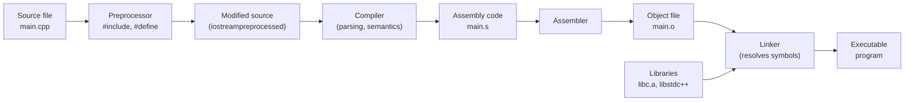
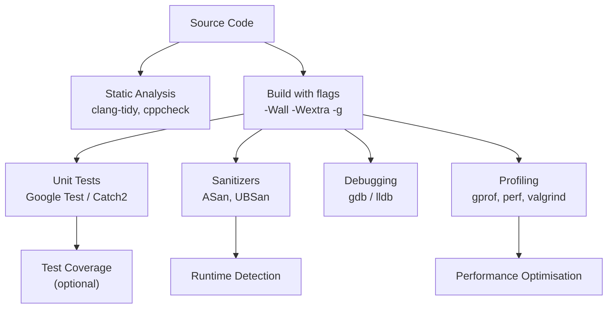

# Chapter 13: Debugging, Testing, and Tools

Professional C++ development requires more than writing code – it demands a disciplined approach to debugging, testing, and performance analysis. This chapter covers the essential tools and techniques that transform code into reliable, maintainable software.

## Compilation Process

Understanding the stages of compilation helps diagnose build issues and optimise build times.



**Stages explained**:

| Stage | Input | Output | Key operations |
|-------|-------|--------|----------------|
| Preprocessing | `.cpp`, `.h` | Preprocessed `.ii` or `.i` | Macro expansion, `#include` insertion, conditional compilation (`#ifdef`) |
| Compilation | Preprocessed source | Assembly `.s` | Lexical analysis, parsing, semantic analysis, optimisation, code generation |
| Assembly | Assembly `.s` | Object `.o` or `.obj` | Converts assembly to machine code (relocatable object file) |
| Linking | Object files, libraries | Executable `.exe` or `a.out` | Symbol resolution, address binding, static library integration |

## Common Compiler Flags

GCC and Clang share most flags. Essential flags for development:

### Warning Flags

| Flag | Meaning |
|------|---------|
| `-Wall` | Enable most common warnings (not all). |
| `-Wextra` | Enable additional warnings not covered by `-Wall`. |
| `-Werror` | Treat all warnings as errors (prevents ignoring warnings). |
| `-Wpedantic` | Issue warnings for non‑standard extensions. |
| `-Wshadow` | Warn when variable shadows another. |
| `-Wconversion` | Warn about implicit conversions that may change value. |

### Standard and Optimisation Flags

| Flag | Meaning |
|------|---------|
| `-std=c++17` | Use C++17 standard. |
| `-std=c++20` | Use C++20 standard. |
| `-O0` | No optimisation (default, fast compilation). |
| `-O1`, `-O2`, `-O3` | Increasing optimisation levels. |
| `-Os` | Optimise for size. |
| `-g` | Generate debug information (required for debuggers). |
| `-DNDEBUG` | Disable assertions (`assert` macros). |

**Example build command**:

```bash
g++ -std=c++17 -Wall -Wextra -Werror -O2 -g -o myprogram main.cpp
```

## Debugging with GDB (GNU Debugger) or LLDB

Debuggers allow inspecting program execution, setting breakpoints, examining variables, and tracing call stacks.

### Compiling for Debugging

```bash
g++ -g -O0 -o program main.cpp   # -O0 disables optimisations that confuse debugging
```

### Basic GDB Commands

| Command | Abbreviation | Purpose |
|---------|--------------|---------|
| `gdb ./program` | – | Start debugger |
| `break main` | `b main` | Set breakpoint at function |
| `break file.cpp:42` | `b file.cpp:42` | Set breakpoint at line |
| `run` | `r` | Start program |
| `next` | `n` | Step over (execute next line, skip function calls) |
| `step` | `s` | Step into (enter functions) |
| `continue` | `c` | Resume execution |
| `print expr` | `p expr` | Print value of expression |
| `display expr` | – | Automatically show expression each stop |
| `backtrace` | `bt` | Show call stack |
| `info locals` | `i locals` | Show local variables |
| `quit` | `q` | Exit debugger |

**Example GDB session**:

```cpp
// buggy.cpp
#include <iostream>

int divide(int a, int b) {
    return a / b;   // potential division by zero
}

int main() {
    int x = 10, y = 0;
    int result = divide(x, y);
    std::cout << result << '\n';
}
```

```bash
$ g++ -g -O0 -o buggy buggy.cpp
$ gdb ./buggy
(gdb) break main
(gdb) run
(gdb) next
(gdb) next
(gdb) step         # enters divide
(gdb) print b      # shows 0
(gdb) backtrace    # shows call stack
(gdb) quit
```

### Debugging with LLDB (Clang)

LLDB syntax is similar to GDB with minor differences. Key commands: `breakpoint set --name main`, `run`, `next`, `step`, `print`, `backtrace`.

## Sanitizers (AddressSanitizer, UndefinedBehaviorSanitizer)

Sanitizers are compile‑time instrumentation tools that detect memory errors and undefined behaviour at runtime with low overhead.

### AddressSanitizer (ASan)

Detects: use‑after‑free, heap buffer overflow, stack buffer overflow, memory leaks, double‑free.

```bash
g++ -fsanitize=address -g -O1 -fno-omit-frame-pointer -o program main.cpp
```

**Example**:

```cpp
int main() {
    int* arr = new int[10];
    arr[10] = 42;   // out-of-bounds
    delete[] arr;
}
```

ASan outputs a detailed report showing the invalid access location, allocation stack, and the offending source line.

### UndefinedBehaviorSanitizer (UBSan)

Detects: integer overflow, division by zero, null pointer dereference, alignment violations, invalid conversions.

```bash
g++ -fsanitize=undefined -g -O1 -o program main.cpp
```

**Example**:

```cpp
int main() {
    int x = INT_MAX;
    x++;   // signed integer overflow – undefined behaviour
}
```

### Combining Sanitizers

```bash
g++ -fsanitize=address,undefined -g -O1 -o program main.cpp
```

## Unit Testing Frameworks: Google Test and Catch2

Unit tests verify that individual code units (functions, classes) behave correctly. They serve as live documentation and prevent regressions.

### Google Test (GTest)

```cpp
// test.cpp
#include <gtest/gtest.h>

int add(int a, int b) { return a + b; }

TEST(AdditionTest, PositiveNumbers) {
    EXPECT_EQ(3, add(1, 2));
    EXPECT_EQ(10, add(5, 5));
}

TEST(AdditionTest, NegativeNumbers) {
    EXPECT_EQ(-3, add(-1, -2));
}

TEST(AdditionTest, WithZero) {
    EXPECT_EQ(5, add(5, 0));
}

int main(int argc, char** argv) {
    ::testing::InitGoogleTest(&argc, argv);
    return RUN_ALL_TESTS();
}
```

**Build and run**:

```bash
g++ -std=c++17 -lgtest -lgtest_main -lpthread test.cpp -o test
./test
```

**Common assertions**:

| Assertion | Purpose |
|-----------|---------|
| `EXPECT_EQ(expected, actual)` | Equality (non‑fatal) |
| `EXPECT_NE(val1, val2)` | Not equal |
| `EXPECT_TRUE(condition)` | True condition |
| `EXPECT_FALSE(condition)` | False condition |
| `EXPECT_THROW(statement, exception_type)` | Statement throws expected exception |
| `ASSERT_*` (same as `EXPECT_*` but fatal) | Aborts test on failure |

### Catch2 (Header‑only)

Catch2 is simpler to set up – just include a single header.

```cpp
// test.cpp
#define CATCH_CONFIG_MAIN
#include <catch2/catch.hpp>

int add(int a, int b) { return a + b; }

TEST_CASE("Addition works", "[math]") {
    REQUIRE(add(1, 2) == 3);
    REQUIRE(add(-1, -2) == -3);
}

TEST_CASE("Addition with zero", "[math]") {
    CHECK(add(5, 0) == 5);
}
```

**Build**:

```bash
g++ -std=c++17 -o test test.cpp
./test
```

## Code Formatting with `clang-format`

`clang-format` automatically formats C++ code according to a style guide (LLVM, Google, Chromium, Mozilla, WebKit, or custom).

**Basic usage**:

```bash
clang-format -i main.cpp                     # format in‑place
clang-format --style=google -i main.cpp      # use Google style
clang-format --dump-config > .clang-format   # generate config file
```

**Example `.clang-format` (Google style)**:

```yaml
BasedOnStyle: Google
IndentWidth: 2
ColumnLimit: 80
AllowShortFunctionsOnASingleLine: Inline
```

Integrate with editors: most IDEs can run `clang-format` on save.

## Static Analysis: `clang-tidy` and `cppcheck`

Static analysis tools detect potential bugs, style violations, and performance issues without executing code.

### `clang-tidy`

Checks: modern C++ best practices, performance, correctness, readability, C++ Core Guidelines.

```bash
clang-tidy main.cpp -- -std=c++17 -Iinclude/
```

Common checks:
- `modernize-use-auto` – suggest `auto` where appropriate.
- `modernize-use-nullptr` – replace `NULL` and `0` with `nullptr`.
- `performance-for-range-copy` – warn about unintended copies in range‑based for loops.

### `cppcheck`

`cppcheck` performs deeper symbolic analysis for memory leaks, null pointer dereference, uninitialised variables, off‑by‑one errors.

```bash
cppcheck --enable=all --inconclusive --std=c++17 main.cpp
```

**Example output**:

```cpp
int* p = new int[10];
// ... missing delete[]
// cppcheck reports: Memory leak: p
```

Integrate both into CI pipelines for continuous quality.

## Profiling with `gprof`, `perf`, `valgrind`

Profiling identifies performance bottlenecks by measuring where the program spends time.

### `gprof` (GNU Profiler)

Requires compiling with profiling instrumentation.

```bash
g++ -pg -O2 -o program main.cpp   # -pg adds instrumentation
./program                         # generates gmon.out
gprof program gmon.out > analysis.txt
```

`gprof` output shows:
- **Flat profile** – total time per function.
- **Call graph** – caller/callee relationships and times.

### `perf` (Linux)

`perf` is a low‑overhead sampling profiler (kernel‑level). No recompilation required.

```bash
perf record ./program              # record profiling data
perf report                        # interactive report
```

`perf top` shows real‑time CPU usage per function.

### `valgrind` (Memcheck and Cachegrind)

`valgrind` is a heavyweight instrumentation framework. Memcheck detects memory errors; Cachegrind simulates caches.

**Memory check**:

```bash
valgrind --leak-check=full --show-leak-kinds=all ./program
```

**Cache profiling**:

```bash
valgrind --tool=cachegrind ./program
cg_annotate cachegrind.out.xxxx   # annotates source lines with cache misses
```

## Tools Integration Diagram



## Recommended Development Workflow

1. **Write code** with `clang-format` auto‑formatting on save.
2. **Compile** with `-Wall -Wextra -Werror -g`.
3. **Run static analysis** (`clang-tidy`, `cppcheck`) on every commit.
4. **Write unit tests** (Google Test or Catch2) and run them frequently.
5. **Run sanitizers** (ASan, UBSan) in debug builds.
6. **Profile** (perf, valgrind) when performance is critical.
7. **Debug** with gdb/lldb for logic errors.

## Summary Table – Tools at a Glance

| Tool | Category | Purpose | Example command |
|------|----------|---------|-----------------|
| GDB | Debugging | Inspect execution | `gdb ./program` |
| ASan | Memory error detection | Buffer overflow, use‑after‑free | `-fsanitize=address` |
| UBSan | Undefined behaviour | Integer overflow, null deref | `-fsanitize=undefined` |
| Google Test | Unit testing | Test framework | `EXPECT_EQ(a, b)` |
| Catch2 | Unit testing | Simpler, header‑only | `REQUIRE(a == b)` |
| clang-format | Formatting | Consistent code style | `clang-format -i main.cpp` |
| clang-tidy | Static analysis | Quality checks | `clang-tidy main.cpp --` |
| cppcheck | Static analysis | Deep bug detection | `cppcheck --enable=all main.cpp` |
| perf | Profiling | Sampling profiler | `perf record ./program` |
| valgrind | Profiling / memcheck | Cache/leak detection | `valgrind ./program` |

Investing time in these tools pays exponential dividends in code quality, reliability, and maintainability. A professional C++ developer is proficient with at least a subset of this toolkit.