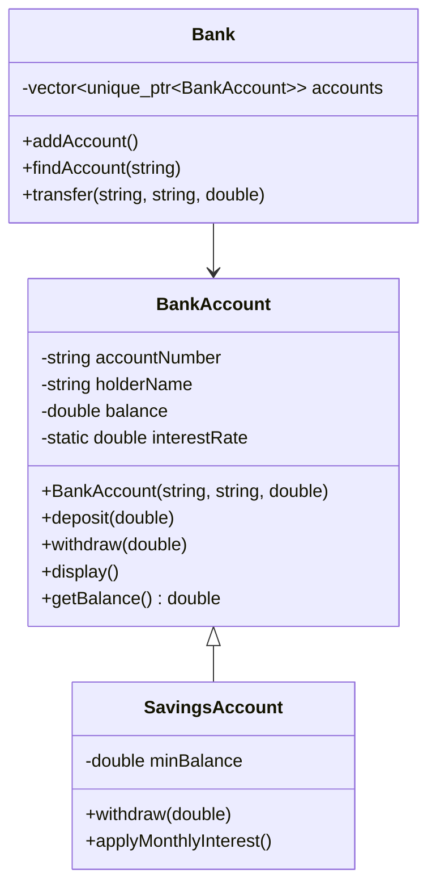
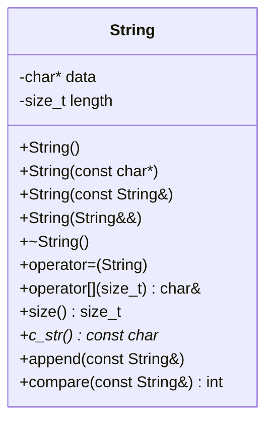
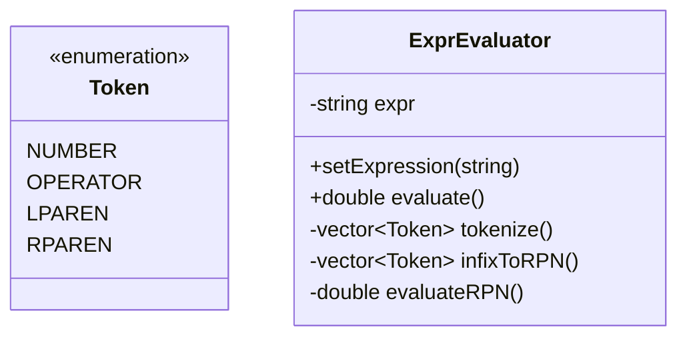
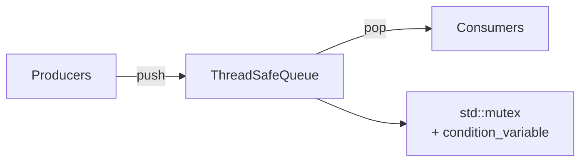

# Chapter 14: Hands‑on Projects and Problem Sets

This chapter provides practical projects organised by skill level. Each project reinforces concepts from previous chapters and encourages applying best practices. Complete these projects to gain confidence and demonstrate proficiency.

## Beginner Projects

### Project 1: Bank Account System

**Objective**: Implement a bank account management system that demonstrates encapsulation, constructors, and data validation.

**Requirements**:

1. Create a `BankAccount` class with private data members:
   - `accountNumber` (string)
   - `accountHolderName` (string)
   - `balance` (double)
   - `interestRate` (static double, shared across all accounts)

2. Provide constructors:
   - Default constructor – initialises account with zero balance.
   - Parameterised constructor – takes account number, holder name, and initial balance (must be non‑negative).
   - Copy constructor – deep copy of account (account number must be unique, so copy should generate a new number or throw exception – simpler: disable copy).

3. Implement member functions:
   - `deposit(double amount)` – increases balance (amount must be positive).
   - `withdraw(double amount)` – decreases balance (cannot go negative, cannot withdraw more than balance).
   - `calculateInterest()` – returns balance * interestRate / 100.
   - Getters for all data members (no setters except maybe for name).
   - `display()` – prints account details.

4. Demonstrate polymorphism by creating a `SavingsAccount` class derived from `BankAccount` that:
   - Has a minimum balance requirement (e.g., $500).
   - Overrides `withdraw()` to enforce minimum balance after withdrawal.
   - Adds a `monthlyInterest()` that applies interest.

5. Create a simple `Bank` class that manages a collection of `BankAccount*` (or `std::vector<std::unique_ptr<BankAccount>>`) and provides:
   - `addAccount()`
   - `findAccount()`
   - `transfer()` between accounts.

**Class Diagram**:



**Sample Test Case**:

```cpp
int main() {
    Bank bank;
    bank.addAccount(std::make_unique<SavingsAccount>("SA001", "Alice", 1000.0));
    auto* acc = bank.findAccount("SA001");
    acc->deposit(200);
    acc->withdraw(1500);  // should fail (min balance)
    acc->withdraw(300);
    acc->display();
}
```

**Extra Challenge**: Use `std::regex` to validate account number format. Add exception classes for insufficient funds, invalid amount, etc.

---

### Project 2: Polynomial Class with Operator Overloading

**Objective**: Implement a `Polynomial` class that represents a mathematical polynomial (e.g., `3x^2 + 2x + 1`). Overload relevant operators to support natural syntax.

**Requirements**:

1. Represent polynomial using `std::vector<double>` coefficients where index corresponds to power (e.g., `[1, 2, 3]` = `1 + 2x + 3x^2`).

2. Constructors:
   - Default – creates zero polynomial (empty vector).
   - From `std::initializer_list<double>` – e.g., `Polynomial p{1, 2, 3}`.
   - Copy and move constructors (default sufficient if using vector, but implement for practice).

3. Overload the following operators:

| Operator | Meaning | Return type |
|----------|---------|-------------|
| `+` (binary) | Polynomial addition | `Polynomial` |
| `-` (binary) | Polynomial subtraction | `Polynomial` |
| `*` (binary) | Polynomial multiplication | `Polynomial` |
| `+=`, `-=` | Compound assignment | `Polynomial&` |
| `==`, `!=` | Equality comparison | `bool` |
| `<<` | Stream output | `std::ostream&` |
| `>>` | Stream input (e.g., `2 3 4` for `2 + 3x + 4x^2`) | `std::istream&` |
| `()` | Evaluate polynomial at a given x: `double result = p(2.5);` | `double` |

4. Provide member functions:
   - `degree()` – highest exponent with non‑zero coefficient.
   - `derivative()` – returns a new polynomial representing the derivative.

5. Ensure operations handle polynomials of different degrees (trim trailing zero coefficients to maintain canonical form).

**Sample Usage**:

```cpp
Polynomial p1{1, 2, 3};  // 1 + 2x + 3x^2
Polynomial p2{2, 0, 1};  // 2 + x^2

Polynomial sum = p1 + p2;   // 3 + 2x + 4x^2
Polynomial diff = p1 - p2;  // -1 + 2x + 2x^2
Polynomial prod = p1 * p2;  // (1+2x+3x^2)*(2+x^2) = 2 + 4x + 7x^2 + 2x^3 + 3x^4

std::cout << prod << '\n';
double val = p1(2.5);   // 1 + 2*2.5 + 3*6.25 = 1 + 5 + 18.75 = 24.75
```

**Implementation Tips**:

- Multiplication: use nested loops and accumulate into a result vector of size `deg1+deg2+1`.
- Canonical form: after operations, remove trailing zeros from `coefficients` (but keep at least one element).
- For comparison, only compare coefficient vectors after trimming.

**Test Cases**:

```cpp
Polynomial p;
assert(p.degree() == -1); // define degree of zero polynomial as -1
Polynomial q{1, 0, 0};    // should be trimmed to {1}
assert(q.degree() == 0);
p += q;
assert(p == q);
```

---

### Project 3: Generic Dynamic Array Template (Similar to `std::vector`)

**Objective**: Implement a custom dynamic array class template `DynamicArray<T>` that mimics a subset of `std::vector` functionality. This reinforces templates, dynamic memory management, copy/move semantics, and iterators.

**Requirements**:

1. Template class:

```cpp
template <typename T>
class DynamicArray {
private:
    T* data;
    size_t capacity_;
    size_t size_;
public:
    // Constructors, destructor, assignment
    DynamicArray();
    explicit DynamicArray(size_t count);
    DynamicArray(const DynamicArray& other);
    DynamicArray(DynamicArray&& other) noexcept;
    DynamicArray& operator=(const DynamicArray& other);
    DynamicArray& operator=(DynamicArray&& other) noexcept;
    ~DynamicArray();
    
    // Element access
    T& operator[](size_t index);
    const T& operator[](size_t index) const;
    T& at(size_t index);              // with bounds checking
    const T& at(size_t index) const;
    
    // Iterators (basic)
    T* begin();
    T* end();
    const T* begin() const;
    const T* end() const;
    
    // Capacity
    size_t size() const;
    size_t capacity() const;
    bool empty() const;
    void reserve(size_t new_cap);
    void shrink_to_fit();
    
    // Modifiers
    void clear();
    void push_back(const T& value);
    void push_back(T&& value);
    void pop_back();
    void resize(size_t new_size, const T& value = T());
};
```

2. Implementation details:
   - Use `new T[]` and `delete[]`.
   - When capacity is insufficient, reallocate with growth factor 2 (or 1.5).
   - Provide strong exception guarantee for `push_back` and `resize` (use copy‑and‑swap or temporary).
   - Implement iterators using plain pointers – sufficient for forward/random access.

3. Provide a custom iterator with `operator*`, `operator++`, `operator!=`, etc. (or just use raw pointer aliases as above).

4. Include a `print()` utility (maybe free function) that uses iterators to display contents.

**Sample Usage**:

```cpp
DynamicArray<int> arr;
arr.push_back(10);
arr.push_back(20);
arr.push_back(30);
for (auto it = arr.begin(); it != arr.end(); ++it) {
    std::cout << *it << ' ';
}
arr[1] = 25;
try {
    int val = arr.at(5);  // throws std::out_of_range
} catch (const std::out_of_range& e) {
    std::cerr << e.what() << '\n';
}
```

**Testing**:
- Test with primitive types (`int`, `double`) and with custom types (e.g., `std::string`).
- Ensure move semantics are used when pushing temporaries.
- Test reallocation – add enough elements to exceed initial capacity.

**Extension**:
- Add support for `emplace_back` (variadic templates).
- Add `insert` and `erase` at arbitrary positions.

---

## Intermediate Projects (Overview)

| Project | Key Concepts |
|---------|--------------|
| Custom `String` class | Deep copy, move semantics, reference counting (optional) |
| Shape hierarchy (abstract base, polymorphic drawing) | Virtual functions, abstract classes, RTTI avoidance |
| Expression evaluator (shunting yard algorithm) | Stack, functors, inheritance for operators |
| Simple `shared_ptr` implementation | Template, reference counting, weak pointer support |

## Advanced Projects (Overview)

| Project | Key Concepts |
|---------|--------------|
| Thread‑safe queue | Concurrency, condition variables, `std::mutex` |
| Small STL‑like container with custom allocator | Allocator awareness, iterator traits |
| Event system using observer pattern | `std::function`, type erasure, weak pointers |
| Memory pool allocator | Placement new, custom `new`/`delete`, alignment |

## Problem Sets – Beginner Level

### Problem Set 1: Encapsulation and Classes

1. Create a `Fraction` class with numerator and denominator. Implement:
   - Reduction to lowest terms in constructor.
   - Arithmetic operators `+`, `-`, `*`, `/` as non‑member functions.
   - Stream output in the form `num/den`.

2. Add a `Time` class (hours, minutes, seconds). Overload `+` to add two times, and `<<` to display in `HH:MM:SS`.

### Problem Set 2: Templates

1. Write a function template `min` that returns the smaller of two values. Test with `int`, `double`, `string`.
2. Write a class template `Pair<T, U>` with `first` and `second` members. Provide a `swap` method.

### Problem Set 3: STL Practice

1. Write a program that reads a text file, counts word frequencies using `std::unordered_map`, and prints words sorted by frequency (descending) using `std::sort` with a custom comparator.
2. Use `std::priority_queue` to implement a task scheduler where tasks have a priority.

## Deliverables for Each Project

For every project, you should provide:
- Source code (`.h` and `.cpp`) with clear comments.
- A short `README` explaining design decisions.
- Unit tests (Google Test/Catch2) covering edge cases.
- Build instructions (CMake or a simple Makefile).
- Sample output.


## Intermediate Projects

### Project 4: `String` Class Implementation

**Objective**: Implement a custom `String` class that manages dynamic memory, supports deep copy, move semantics, and optionally reference counting (copy‑on‑write). This project reinforces memory management, the Rule of Five, and optimisation techniques.

**Requirements**:

1. Class structure:

```cpp
class String {
private:
    char* data;
    size_t length;
    
public:
    // Constructors
    String();                         // empty string
    String(const char* str);          // from C‑string
    String(const String& other);      // copy constructor
    String(String&& other) noexcept;  // move constructor
    
    // Assignment
    String& operator=(const String& other);   // copy assignment
    String& operator=(String&& other) noexcept; // move assignment
    
    // Destructor
    ~String();
    
    // Element access
    char& operator[](size_t index);
    const char& operator[](size_t index) const;
    
    // Capacity
    size_t size() const;
    bool empty() const;
    
    // Modifiers
    void push_back(char ch);
    void pop_back();
    void clear();
    void append(const String& other);
    void swap(String& other) noexcept;
    
    // Operations
    const char* c_str() const;
    int compare(const String& other) const;
    
    // Friends for operators
    friend String operator+(const String& lhs, const String& rhs);
    friend std::ostream& operator<<(std::ostream& os, const String& str);
    friend std::istream& operator>>(std::istream& is, String& str);
};
```

2. Implementation rules:
   - Use `new char[length+1]` and `delete[]`.
   - Copy constructor performs deep copy.
   - Move constructor transfers ownership and leaves source in valid empty state.
   - Insertion and extraction operators.

3. **Reference counting extension (optional)**:
   - Share the same character buffer among copies until one is modified (copy‑on‑write).
   - Use a shared reference count stored together with the data (e.g., `struct RefCounted { int count; char data[1]; }`).

**Class Diagram**:



**Sample Usage**:

```cpp
String s1("Hello");
String s2 = s1;          // deep copy
String s3 = std::move(s1); // s1 becomes empty
s2.push_back('!');
std::cout << s2;         // Hello!
std::cout << (s2 == s3); // false (requires operator==)
```

**Test Cases**:
- Default constructor produces empty string (`size() == 0`, `c_str()` returns `""`).
- Copy after modification does not affect original.
- Self‑assignment: `s = s`.
- Concatenation: `s1 + s2`.

**Challenge**: Implement `std::hash` specialisation for `String` to use with unordered containers.

---

### Project 5: Shape Hierarchy (Polymorphic Drawing)

**Objective**: Create an abstract `Shape` class with pure virtual functions and a set of concrete derived classes (`Circle`, `Rectangle`, `Triangle`). Demonstrate runtime polymorphism, virtual destructors, and RTTI avoidance.

**Requirements**:

1. Abstract base class:

```cpp
class Shape {
public:
    virtual double area() const = 0;
    virtual double perimeter() const = 0;
    virtual void draw() const = 0;   // output shape description
    virtual ~Shape() = default;
};
```

2. Concrete classes with appropriate data members:
   - `Circle`: radius, centre point.
   - `Rectangle`: width, height, top‑left corner.
   - `Triangle`: three points or base+height.

3. A `Canvas` class that stores `std::vector<std::unique_ptr<Shape>>` and provides:
   - `addShape(std::unique_ptr<Shape> shape)`
   - `drawAll() const` – calls `draw()` on each shape.
   - `totalArea() const` – sums areas.

4. Demonstrate polymorphism without `dynamic_cast`: use virtual functions only.

**Sample Usage**:

```cpp
Canvas canvas;
canvas.addShape(std::make_unique<Circle>(5.0));
canvas.addShape(std::make_unique<Rectangle>(4.0, 6.0));
canvas.addShape(std::make_unique<Triangle>(3.0, 4.0, 5.0));
canvas.drawAll();
std::cout << "Total area: " << canvas.totalArea() << '\n';
```

**Testing**:
- Verify correct area calculations.
- Ensure proper cleanup (no memory leaks) – use Valgrind.
- Add a `Square` derived from `Rectangle` – does it break Liskov substitution?

**Extension**:
- Add a `Transform` interface for scaling, rotation.
- Implement `operator<<` for `Shape` using double dispatch (Visitor pattern).

---

### Project 6: Expression Evaluator (Shunting Yard)

**Objective**: Implement an evaluator for arithmetic expressions that supports integers, operators `+`, `-`, `*`, `/`, parentheses, and unary minus. Use the Shunting Yard algorithm (Dijkstra) to convert infix to Reverse Polish Notation (RPN), then evaluate.

**Requirements**:

1. Two‑step processing:
   - Tokenisation: break string into tokens (numbers, operators, parentheses).
   - Shunting Yard: convert to RPN using `std::stack`.
   - Evaluation: compute result using `std::stack`.

2. Support for operator precedence (+, -: 1; *, /: 2). Left‑associative.

3. Use a `std::map` or lookup table for function pointers or functors to map operators to evaluation functions.

4. Error handling: mismatched parentheses, division by zero, invalid tokens.

**Class Design**:



**Sample Usage**:

```cpp
ExprEvaluator e("3 + 4 * (2 - 1)");
double result = e.evaluate(); // 7.0
```

**Implementation Tips**:
- Use `std::isdigit` for numbers, handle multi‑digit.
- For unary minus, detect when minus follows an operator or parenthesis.

**Testing**:
- `(5+3)*2` → 16
- `10/2` → 5
- `(11+2)` and `11+2` produce same.
- Division by zero → throw `std::runtime_error`.

---

### Project 7: Simple `shared_ptr` Implementation

**Objective**: Implement a simplified reference‑counting smart pointer `SharedPtr<T>` that mimics `std::shared_ptr` behaviour (without weak pointers, aliasing, or custom deleters). This project deepens understanding of templates, RAII, and control blocks.

**Requirements**:

1. Template class with:
   - Pointer to managed object.
   - Pointer to reference count (allocated on heap).
   - Constructor from raw pointer.
   - Copy constructor – increments reference count.
   - Copy assignment – handles self‑assignment, decrements old, increments new.
   - Move constructor – transfers ownership, nullifies source.
   - Destructor – decrements and deletes when count reaches zero.
   - `get()` – returns raw pointer.
   - `operator*` and `operator->`.
   - `use_count()` – returns current ref count.

2. Do **not** implement weak pointers or `make_shared` optimisation.

**Implementation skeleton**:

```cpp
template <typename T>
class SharedPtr {
private:
    T* ptr;
    size_t* refCount;
    
public:
    SharedPtr(T* p = nullptr) : ptr(p), refCount(new size_t(1)) {}
    SharedPtr(const SharedPtr& other) : ptr(other.ptr), refCount(other.refCount) {
        if (refCount) ++(*refCount);
    }
    SharedPtr(SharedPtr&& other) noexcept : ptr(other.ptr), refCount(other.refCount) {
        other.ptr = nullptr;
        other.refCount = nullptr;
    }
    SharedPtr& operator=(SharedPtr other) {
        swap(other);
        return *this;
    }
    ~SharedPtr() {
        if (refCount && --(*refCount) == 0) {
            delete ptr;
            delete refCount;
        }
    }
    void swap(SharedPtr& other) noexcept {
        std::swap(ptr, other.ptr);
        std::swap(refCount, other.refCount);
    }
    T* get() const { return ptr; }
    T& operator*() const { return *ptr; }
    T* operator->() const { return ptr; }
    size_t use_count() const { return refCount ? *refCount : 0; }
};
```

**Testing**:
- Ensure `use_count` increments/decrements correctly.
- Test self‑assignment.
- Test with polymorphic types.
- Verify no double‑delete.

**Advanced**: Add custom deleter (function pointer or `std::function`).

---

## Advanced Projects

### Project 8: Thread‑safe Queue for Producer‑Consumer

**Objective**: Implement a thread‑safe queue that supports multiple producers and consumers using `std::mutex`, `std::condition_variable`, and optionally `std::atomic`. This project demonstrates concurrency control.

**Requirements**:

1. Class `ThreadSafeQueue<T>` with methods:
   - `push(T value)` – adds element, notifies one waiting thread.
   - `pop()` – blocks until element available, returns front element.
   - `try_pop(T& value)` – non‑blocking, returns bool.
   - `empty()` – returns true if queue is empty (use with caution).

2. Use `std::deque` as the underlying container.

3. Implement using `std::mutex` for protection and `std::condition_variable` for notification.

4. Provide move semantics where appropriate.

**Class Diagram**:



**Implementation**:

```cpp
#include <queue>
#include <mutex>
#include <condition_variable>

template <typename T>
class ThreadSafeQueue {
private:
    std::queue<T> queue;
    mutable std::mutex mtx;
    std::condition_variable cv;
    
public:
    void push(T value) {
        {
            std::lock_guard<std::mutex> lock(mtx);
            queue.push(std::move(value));
        }
        cv.notify_one();
    }
    
    T pop() {
        std::unique_lock<std::mutex> lock(mtx);
        cv.wait(lock, [this] { return !queue.empty(); });
        T value = std::move(queue.front());
        queue.pop();
        return value;
    }
    
    bool try_pop(T& value) {
        std::lock_guard<std::mutex> lock(mtx);
        if (queue.empty()) return false;
        value = std::move(queue.front());
        queue.pop();
        return true;
    }
};
```

**Sample Usage (Producer‑Consumer)**:

```cpp
ThreadSafeQueue<int> q;
std::vector<std::thread> producers;
std::vector<std::thread> consumers;

for (int i = 0; i < 3; ++i) {
    producers.emplace_back([&q] {
        for (int j = 0; j < 10; ++j) q.push(j);
    });
}
for (int i = 0; i < 2; ++i) {
    consumers.emplace_back([&q] {
        for (int j = 0; j < 15; ++j)
            std::cout << q.pop() << '\n';
    });
}
for (auto& t : producers) t.join();
// Notify consumers to stop? Add a sentinel value or stop flag.
```

**Extension**: Add `stop()` method using `std::atomic<bool>` to unblock waiting consumers.

---

### Project 9: Small STL‑like Container (with Iterators, Allocator Support)

**Objective**: Implement a container template (e.g., `SmallVector<T, Allocator = std::allocator<T>>`) that provides a subset of `std::vector` functionality, including custom allocators and standard iterator categories.

**Requirements**:

1. Support allocator awareness:
   - Use `Allocator` to allocate/deallocate memory.
   - Use `std::allocator_traits` for portability.
   - Provide `get_allocator()`.

2. Iterators: implement `iterator` and `const_iterator` (bidirectional or random‑access) with:
   - `operator*`, `operator->`, `operator++`, `operator--` (optional), `operator+`, `operator-`, `operator+=`, etc.
   - Standard typedefs: `value_type`, `difference_type`, `iterator_category`, `reference`, `pointer`.

3. Methods: `push_back`, `pop_back`, `reserve`, `resize`, `clear`, `insert`, `erase`.

4. Use `Allocator` for construction/destruction via `std::allocator_traits::construct` / `destroy` (deprecated in C++17, use placement new directly or `std::allocator_traits::construct`).

**Simplified iterator example**:

```cpp
template <typename T>
class SmallVector {
public:
    using iterator = T*;
    using const_iterator = const T*;
    
    iterator begin() { return data; }
    iterator end() { return data + size_; }
    // ... const versions
};
```

**Allocator usage**:

```cpp
Allocator alloc;
using traits = std::allocator_traits<Allocator>;
T* p = traits::allocate(alloc, capacity);
traits::construct(alloc, p + i, value);  // construct element
traits::destroy(alloc, p + i);           // destroy element
traits::deallocate(alloc, p, capacity);
```

**Testing**:
- Test with `std::allocator` and a custom logging allocator.
- Ensure exception safety (strong guarantee for `push_back`).

---

### Project 10: Event System Using Observer Pattern and `std::function`

**Objective**: Implement a type‑safe event system where any listener can subscribe to an event and be notified with arbitrary data.

**Requirements**:

1. Create a template `Event<Args...>` that stores a list of callable objects with signature `void(Args...)`.
2. Methods:
   - `connect(std::function<void(Args...)> listener)` – adds listener.
   - `disconnect(listener)` – remove by token or ID.
   - `emit(Args... args)` – calls all stored listeners with given arguments.

3. Use `std::function` for type erasure and `std::vector` for storage.

4. Return a `Connection` object that can be used to disconnect (RAII style: destructor disconnects automatically).

**Implementation**:

```cpp
template <typename... Args>
class Event {
private:
    using Callback = std::function<void(Args...)>;
    std::vector<Callback> callbacks;
    std::vector<size_t> ids;
    size_t nextId = 0;
    
public:
    size_t connect(Callback cb) {
        callbacks.push_back(std::move(cb));
        ids.push_back(nextId);
        return nextId++;
    }
    
    void disconnect(size_t id) {
        auto it = std::find(ids.begin(), ids.end(), id);
        if (it != ids.end()) {
            size_t index = std::distance(ids.begin(), it);
            callbacks.erase(callbacks.begin() + index);
            ids.erase(it);
        }
    }
    
    void emit(Args... args) const {
        for (const auto& cb : callbacks) {
            cb(args...);
        }
    }
};

// RAII connection
template <typename... Args>
class ScopedConnection {
    Event<Args...>& event;
    size_t id;
public:
    ScopedConnection(Event<Args...>& ev, std::function<void(Args...)> cb)
        : event(ev), id(ev.connect(std::move(cb))) {}
    ~ScopedConnection() { event.disconnect(id); }
};
```

**Sample Usage**:

```cpp
Event<int> e;
auto conn = e.connect([](int x) { std::cout << x << '\n'; });
e.emit(42); // prints 42
conn.disconnect(); // or let ScopedConnection go out of scope
```

**Extension**: Support ordering of listeners (priority), and event filtering.

---

### Project 11: Memory Pool / Custom Allocator

**Objective**: Implement a memory pool that pre‑allocates a large block of memory and serves fixed‑size allocations efficiently. Then wrap it as a custom allocator for STL containers.

**Requirements**:

1. `MemoryPool` class:
   - Constructor takes block size (chunk size) and number of chunks.
   - `allocate()` – returns pointer to a free chunk (O(1) ideally).
   - `deallocate(void* p)` – returns chunk to pool.
   - Use a free‑list (linked list of available chunks).

2. Write a `PoolAllocator<T>` template conforming to the C++ Allocator requirements:
   - `allocate(n)` – returns `T*`.
   - `deallocate(T* p, n)`.
   - Rebinding: `template<typename U> struct rebind { using other = PoolAllocator<U>; };`

**Free‑list concept**:

```cpp
struct Chunk {
    Chunk* next;
};
```

Initially, free list chains all chunks. Allocation pops the head; deallocation pushes.

**Implementation sketch**:

```cpp
class MemoryPool {
    void* start;
    size_t chunkSize;
    size_t numChunks;
    Chunk* freeList;
    
public:
    MemoryPool(size_t chunkSize, size_t numChunks)
        : chunkSize(chunkSize), numChunks(numChunks) {
        start = ::operator new(chunkSize * numChunks);
        freeList = reinterpret_cast<Chunk*>(start);
        auto cur = freeList;
        for (size_t i = 0; i < numChunks - 1; ++i) {
            cur->next = reinterpret_cast<Chunk*>(
                reinterpret_cast<char*>(cur) + chunkSize);
            cur = cur->next;
        }
        cur->next = nullptr;
    }
    
    ~MemoryPool() { ::operator delete(start); }
    
    void* allocate() {
        if (!freeList) throw std::bad_alloc();
        void* p = freeList;
        freeList = freeList->next;
        return p;
    }
    
    void deallocate(void* p) {
        auto* chunk = static_cast<Chunk*>(p);
        chunk->next = freeList;
        freeList = chunk;
    }
};

template <typename T>
class PoolAllocator {
    static MemoryPool pool;
public:
    using value_type = T;
    PoolAllocator() = default;
    
    T* allocate(size_t n) {
        if (n != 1) return static_cast<T*>(::operator new(n * sizeof(T)));
        return static_cast<T*>(pool.allocate());
    }
    
    void deallocate(T* p, size_t n) {
        if (n != 1) { ::operator delete(p); return; }
        pool.deallocate(p);
    }
};

// Static pool initialisation (need to define pool size in one translation unit)
```

**Testing**: Use `std::vector<int, PoolAllocator<int>>` and verify it works.

---

## Summary – Project Difficulty and Key Skills

| Project | Level | Key Skills |
|---------|-------|------------|
| Bank Account | Beginner | Encapsulation, constructors, methods, basic inheritance |
| Polynomial | Beginner | Operator overloading, dynamic arrays, unit testing |
| Dynamic Array | Beginner | Templates, memory management, copy/move |
| String | Intermediate | Rule of Five, deep copy, move semantics |
| Shape Hierarchy | Intermediate | Polymorphism, virtual functions, abstract classes |
| Expression Evaluator | Intermediate | Stack, algorithms, tokenisation, error handling |
| SharedPtr | Intermediate | Reference counting, RAII, template |
| Thread‑safe Queue | Advanced | Concurrency, mutex, condition variables |
| STL‑like Container | Advanced | Iterators, allocators, exception safety |
| Event System | Advanced | Observer, `std::function`, RAII connections |
| Memory Pool | Advanced | Custom allocation, free‑list, allocator protocol |

Complete at least two projects from each level to gain comprehensive C++ experience. All code should be accompanied by unit tests and built with a modern compiler (C++17 or later).
