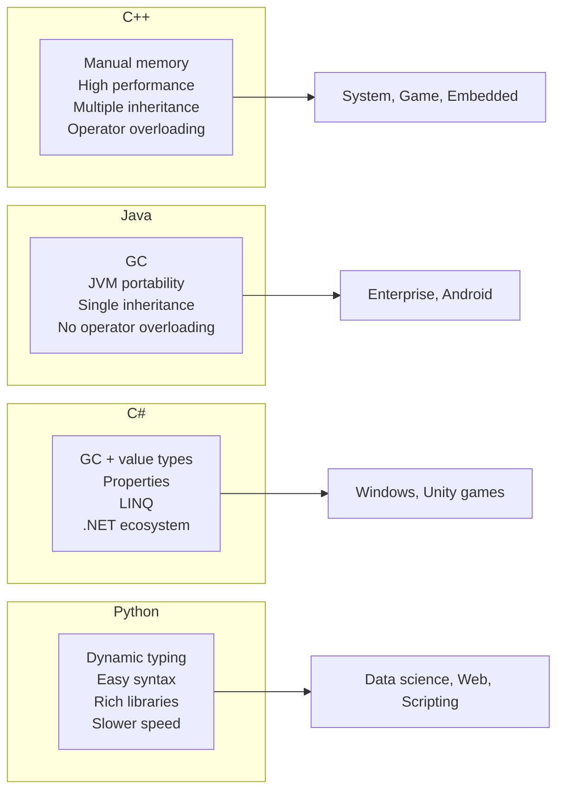

# Chapter 15: Comparison with Other OOP Languages

C++ is one of many object‑oriented languages, each with different trade‑offs. Understanding how C++ compares to Java, C#, and Python helps you choose the right tool for a given problem and adapt your knowledge when moving between languages.

## C++ vs Java

Java was designed to simplify C++ by removing features that were error‑prone or platform‑dependent. The two languages share syntax but differ fundamentally in memory management, inheritance, and type system.

### Multiple Inheritance

C++ supports multiple inheritance – a class can inherit from more than one base class. Java allows only single inheritance of classes but multiple inheritance of interfaces (using `interface`).

```cpp
// C++ – multiple inheritance
class Printable { public: virtual void print() = 0; };
class Serializable { public: virtual void serialize() = 0; };
class Document : public Printable, public Serializable {
    void print() override { /* ... */ }
    void serialize() override { /* ... */ }
};
```

```java
// Java – single inheritance, multiple interfaces
interface Printable { void print(); }
interface Serializable { void serialize(); }
class Document implements Printable, Serializable {
    public void print() { ... }
    public void serialize() { ... }
}
```

### Operator Overloading

C++ allows overloading most operators (e.g., `+`, `-`, `[]`, `()`), enabling natural syntax for user‑defined types. Java does not support operator overloading – you must use named methods like `add()` or `get()`.

```cpp
// C++ – overloaded + for complex numbers
Complex operator+(const Complex& a, const Complex& b) {
    return Complex(a.real + b.real, a.imag + b.imag);
}
Complex c = a + b;
```

```java
// Java – method call
Complex c = a.add(b);
```

### Pointers and References

C++ has explicit pointers that can be null, be reassigned, and support pointer arithmetic. Java has only references (which are more restricted, cannot be null? Actually they can, but no arithmetic). Java references are similar to C++ pointers in that they refer to objects, but you cannot perform arithmetic on them.

```cpp
int* p = nullptr;
int x = 5;
p = &x;
int* q = p + 1; // pointer arithmetic – allowed but dangerous
```

```java
// Java – references only, no arithmetic
Integer ref = null;   // can be null
ref = new Integer(5);
// Integer ref2 = ref + 1; // error – no pointer arithmetic
```

### Destructors vs Garbage Collection

C++ uses deterministic destruction via destructors. Objects on the stack are destroyed automatically when they go out of scope; heap objects are destroyed when `delete` is called. Java uses garbage collection (GC) – objects are collected when no longer reachable, but the timing is non‑deterministic. C++ destructors are used for RAII (closing files, releasing locks). Java requires explicit `close()` or `try‑with‑resources`.

```cpp
// C++ – destructor releases file
void read() {
    std::ifstream file("data.txt");
    // ... file automatically closed at the end of scope
}
```

```java
// Java – need to close explicitly (or use try‑with‑resources)
void read() {
    try (FileInputStream file = new FileInputStream("data.txt")) {
        // auto‑close in try‑with‑resources (Java 7+)
    } catch (IOException e) { }
}
```

### Stack‑Allocated Objects

C++ allows objects to be created on the stack, without `new`. Java objects are always allocated on the heap (except primitive types). Stack allocation in C++ is faster and automatically destroyed.

```cpp
MyClass obj;          // stack – no new
MyClass* p = new MyClass(); // heap
```

```java
MyClass obj = new MyClass(); // always heap, always new
```

**Comparison Table – C++ vs Java**:

| Feature | C++ | Java |
|---------|-----|------|
| Multiple inheritance of classes | Yes | No (only interfaces) |
| Operator overloading | Yes | No |
| Pointers | Yes (pointer arithmetic) | No (only references without arithmetic) |
| Memory management | Manual (`new`/`delete`) + RAII | Garbage collection |
| Destructors | Yes (deterministic) | No (finalize – deprecated) |
| Stack allocation for objects | Yes | No (objects always on heap) |
| Templates | Yes (compile‑time generics) | Generics (type erasure) |
| Reflection | Limited (RTTI) | Extensive (java.lang.reflect) |
| Compilation | To native machine code | To bytecode (JVM) |

## C++ vs C

C# was developed by Microsoft as a modern alternative to Java, but it also shares many features with C++. C# runs on the .NET runtime (CLR) and has garbage collection, but it includes value types (`struct`) that can be stack‑allocated.

### Properties vs Getters/Setters

C# has **properties** – language‑level constructs that encapsulate getters and setters. In C++, you write explicit `getX()` and `setX()` methods.

```csharp
// C# – property
public class Person {
    private string name;
    public string Name {
        get { return name; }
        set { name = value; }
    }
}
// or auto‑implemented property
public int Age { get; set; }
```

```cpp
// C++ – getter/setter methods
class Person {
    std::string name_;
public:
    std::string getName() const { return name_; }
    void setName(const std::string& n) { name_ = n; }
};
```

### Value Types and References

C# has **value types** (`struct`) allocated on the stack (or inline) and **reference types** (`class`) allocated on the heap. This is similar to C++ where you decide on a per‑object basis, but in C# the type declaration determines the behaviour.

```csharp
struct Point { public int X, Y; }  // value type
class Circle { public Point Center; public int Radius; } // reference type
```

C++ gives you full control: an object can be stack‑allocated or heap‑allocated regardless of its type definition.

Other differences:

| Feature | C++ | C# |
|---------|-----|-----|
| Multiple inheritance | Yes | No (interfaces only) |
| Operator overloading | Yes | Limited (some operators, not all) |
| Deterministic destruction | Yes (destructors) | No (garbage collection, `IDisposable`) |
| Templates vs Generics | Templates (compile‑time, specialisation) | Generics (runtime, type safety) |
| Pointers | Yes (unsafe context) | Yes (but in `unsafe` blocks, rarely used) |
| Preprocessor | Yes (`#define`, `#ifdef`) | No (but has conditional compilation attributes) |

## C++ vs Python

Python is a dynamically‑typed, interpreted language. C++ is statically‑typed and compiled. The design philosophies are very different.

### Static Typing vs Dynamic Typing

C++ requires types to be declared at compile time. Python determines types at runtime.

```cpp
// C++ – static typing
int x = 5;
x = "hello"; // error: cannot assign const char* to int
```

```python
# Python – dynamic typing
x = 5   # int
x = "hello"  # perfectly fine, x now str
```

C++ templates provide compile‑time polymorphism; Python’s duck typing provides runtime flexibility.

### Performance

C++ is generally much faster than Python because it compiles to native machine code, has no interpreter overhead, and allows low‑level optimisations. Python is slower but offers faster development time and easier syntax.

| Aspect | C++ | Python |
|--------|-----|--------|
| Execution speed | Very fast (native code) | Slower (interpreted, often 10‑100x slower) |
| Compilation | Ahead‑of‑time | Just‑in‑time (CPython, but still interpreted) |
| Memory control | Manual (via RAII, custom allocators) | Automatic (garbage collection) |
| Type checking | At compile time | At runtime |
| Code verbosity | Higher | Lower |
| Metaprogramming | Templates, constexpr | Dynamic, decorators, metaclasses |

### Use Cases

- **C++**: Performance‑critical systems, game engines, real‑time applications, embedded systems, large‑scale numeric computation.
- **Python**: Scripting, data science (NumPy, pandas), web backends (Django, Flask), rapid prototyping.

## Where C++ Shines

C++ is the language of choice for domains that require:

### System Programming
Operating systems (Windows kernel components, Linux drivers), compilers, embedded firmware. C++ gives direct hardware access, deterministic memory management, and zero‑overhead abstractions.

### Real‑Time Systems
Robotics, avionics, industrial control, trading systems. C++ provides predictable performance, no garbage collection pauses, and fine‑grained control over thread scheduling and memory layout.

### Game Engines
Unreal Engine, Unity (core), proprietary engines. C++’s performance, manual memory control, and ability to interface with graphics APIs (DirectX, Vulkan) make it dominant in game development.

### Embedded Systems
Microcontrollers, IoT devices, automotive (AUTOSAR). C++ can generate compact, efficient code, and modern C++ (14/17/20) is increasingly used in safety‑critical embedded contexts (with guidelines like MISRA C++).

### High‑Performance Computing (HPC)
Numerical simulations, weather forecasting, AI inference (not training). C++ combined with libraries like Eigen, Blaze, or CUDA for GPUs.

### Database Engines
MySQL (InnoDB), RocksDB, MongoDB (C++ server). C++ allows custom memory allocators, zero‑copy I/O, and lock‑free data structures.

## Summary Diagram – Language Comparison



## When to Choose Which Language

| If you need … | Choose … | Reason |
|---------------|----------|--------|
| Maximum performance, fine memory control | C++ | Zero‑overhead abstractions, no GC |
| Cross‑platform portability with robust tooling | Java | JVM, vast ecosystem |
| Rapid Windows development, Unity games | C# | .NET integration, modern features |
| Quick prototyping, data analysis | Python | Dynamic typing, huge library ecosystem |
| Real‑time / embedded with constrained resources | C++ | Deterministic, small footprint |

C++ coexists with these languages – many large systems use C++ for performance‑critical components and Python/Java for higher‑level logic. Knowing C++ deepens your understanding of how other languages manage memory and performance under the hood.