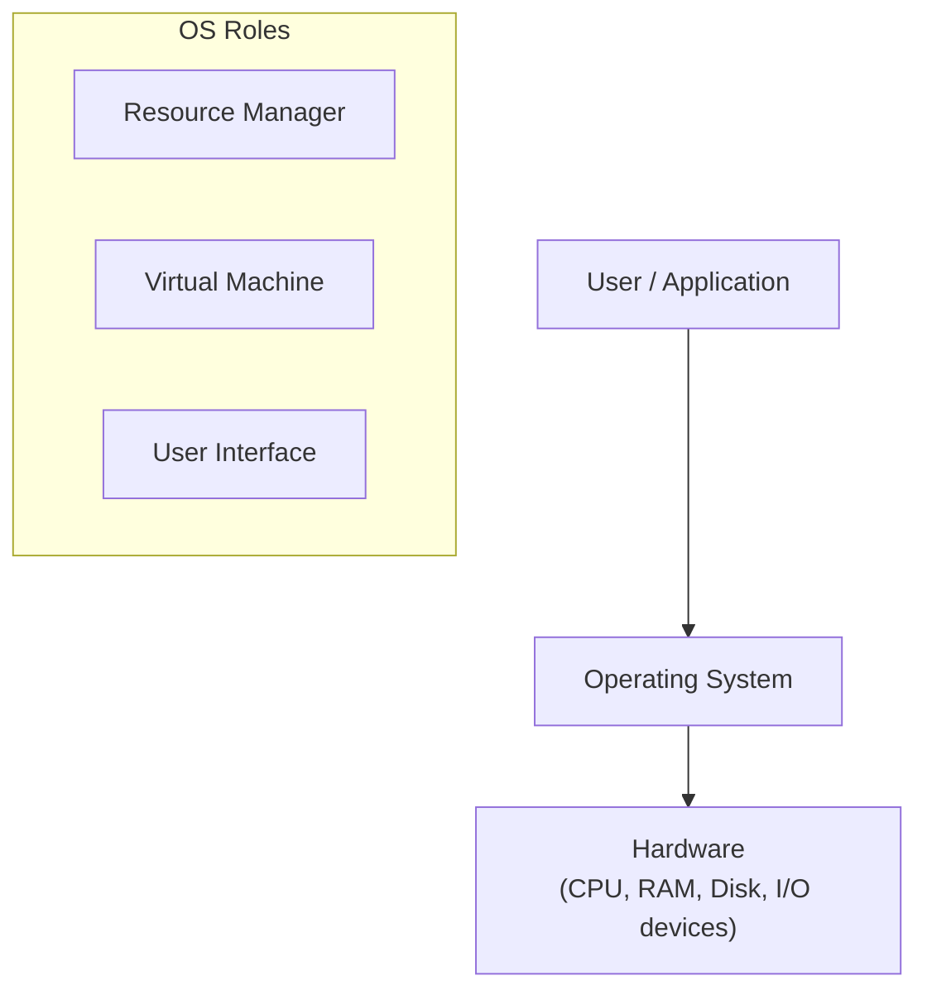
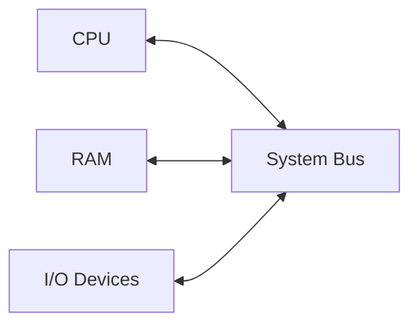
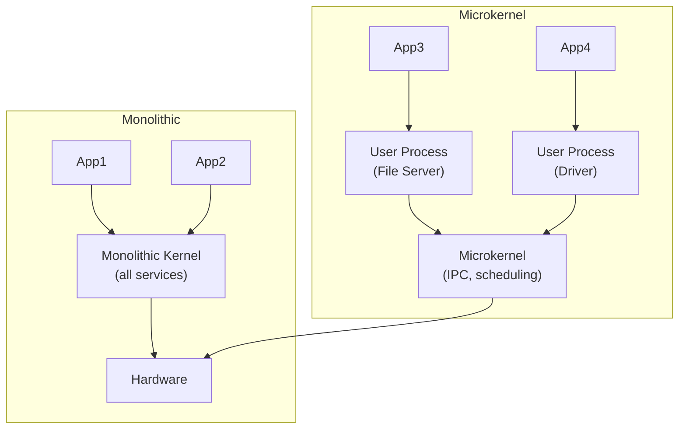
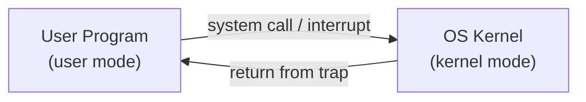
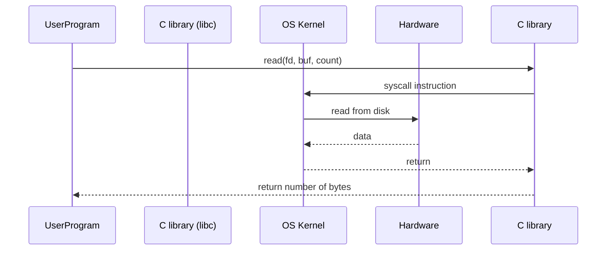
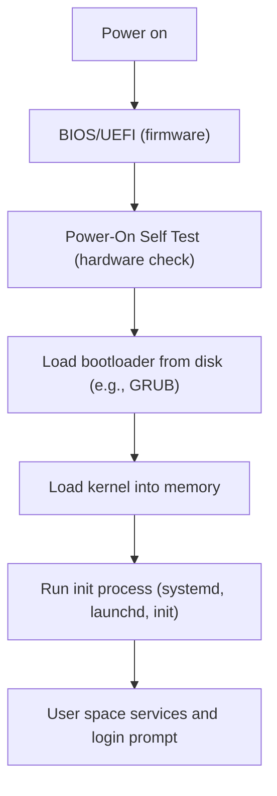

# Chapter 1: Introduction to Operating Systems

An operating system (OS) is the most fundamental software that runs on a computer. It manages hardware resources and provides a foundation for application programs. This chapter explains the core concepts, architecture, and services of modern operating systems, with real‑life examples to ground the ideas.

---

## What is an Operating System?

An operating system is a software layer that sits between the user (or application programs) and the computer hardware. Its main job is to abstract the messy details of hardware and provide a clean, convenient, and efficient environment for programs to execute.

**Think of it as a hotel manager**:  
The guests (applications) ask for rooms, food, cleaning, etc. The manager (OS) decides who gets which room, when the kitchen operates, and ensures that guests don’t disturb each other. The actual physical rooms, elevators, and kitchen (hardware) are managed by the staff without guests needing to know the plumbing or electrical wiring.

**Examples of operating systems** you encounter daily:
- **Windows** (desktops, laptops)
- **Linux** (servers, Android phones, embedded devices)
- **macOS** (Apple desktops/laptops)
- **iOS** (iPhones, iPads)
- **Android** (phones, tablets, smart TVs)

---

## Roles of an Operating System

An OS plays three major roles.

### 1. Resource Manager

Hardware resources (CPU, memory, disk, network) are limited. The OS allocates them fairly and efficiently among competing programs.

### 2. Virtual Machine

The OS creates an abstraction of the hardware that is simpler to program. For instance, you see files and folders instead of raw disk sectors; you see a window with a cursor instead of pixel buffers and interrupts.

### 3. Interface (between user and hardware)

The OS provides a user interface – command‑line (CLI) or graphical (GUI) – through which you can run programs, manage files, and configure settings.

The following diagram shows the structural layers:

---

## Computer System Architecture

A computer system consists of four main hardware components. They communicate over a system bus.

### CPU (Central Processing Unit)

- Executes instructions (arithmetic, logic, control).
- Contains several cores (each can run a separate program/thread).
- Has a small, fast cache memory.

### Memory (RAM – Random Access Memory)

- Stores data and instructions that the CPU actively uses.
- Volatile (loses content on power off).
- Divided into bytes, each with a unique address.

### I/O Devices

- Input: keyboard, mouse, microphone, scanner.
- Output: monitor, printer, speakers.
- Storage: hard disk, SSD, USB drive (also treated as I/O).
- Network: Ethernet, Wi‑Fi (specialised I/O).

### System Bus

- The communication highway that connects CPU, memory, and I/O controllers.
- Includes address bus, data bus, and control bus.

**Real‑life analogy**: A restaurant kitchen (CPU) prepares dishes using ingredients from a refrigerator (memory). Waiters (I/O) bring orders from customers and take finished food out. The kitchen pass (bus) is where orders and dishes are handed.

---

## OS Structure: Monolithic, Layered, Microkernel, Hybrid

Operating systems are built in different architectural styles, each with trade‑offs between performance, security, and maintainability.

### Monolithic Kernel

All OS services run in a single kernel address space (kernel mode). This is fast because there is little overhead for communication, but a bug in any part can crash the whole system.

- **Examples**: Linux, older UNIX, MS‑DOS.
- **Real‑life**: A small shop where the owner does everything – cooks, cleans, handles money. Efficient but exhausting; one mistake spoils everything.

### Layered Kernel

The OS is divided into layers, each built on top of the layer below. Lower layers provide services to upper layers. This improves modularity but can be slow due to layer‑crossing overhead.

- **Example**: THE system (Dijkstra, 1968).

### Microkernel

Only essential services (IPC, memory management, basic scheduling) run in kernel mode. Drivers, file systems, and networking run as user‑mode processes. This is more secure and stable, but slower due to context switches.

- **Examples**: QNX, L4, MINIX (the inspiration for Linux’s early design).
- **Real‑life**: A large organisation where each department (security, catering, IT) is independent. If catering fails, the company still runs.

### Hybrid Kernel

A compromise – most services live in kernel for speed, but some run in user space. Combines the performance of monolithic kernels with some modularity of microkernels.

- **Examples**: Windows NT (and later Windows versions), macOS XNU.

---

## User Mode vs Kernel Mode

CPUs have at least two privilege levels to protect the OS from buggy or malicious programs.

- **Kernel mode** (also called supervisor mode, ring 0):
  - Can execute **privileged instructions** (e.g., halt CPU, change memory mapping, access I/O devices directly).
  - Has access to the entire physical memory.
  - The OS kernel runs here.

- **User mode** (ring 3 on x86):
  - Cannot execute privileged instructions.
  - Access to memory is restricted to the process’s own address space.
  - Applications run here.

**How does the CPU know which mode it’s in?**  
A **mode bit** in the CPU status register indicates kernel (0) or user (1).

**Switching from user mode to kernel mode**:
- **System call** (e.g., read a file) – the program executes a special instruction (`syscall`, `int 0x80`).
- **Interrupt** (e.g., timer, keyboard press).
- **Exception** (e.g., division by zero, page fault).

When a switch happens, the CPU saves the current state and jumps to a predefined kernel handler. After handling, it returns to user mode.

**Real‑life analogy**:  
- **User mode**: Allowed to walk in the shopping mall (public areas). You can’t enter the cash vault or the electrical room.  
- **Kernel mode**: Security staff can go anywhere, open any door, and shut down the ventilation.  
- **System call**: You ask a security guard to open a locked door for you.

---

## System Calls and API

A **system call** is a request from a user program to the OS for a privileged service (e.g., open a file, create a process, allocate memory). System calls are the only way a user program can access kernel functionality.

**Common system calls** (Linux/UNIX):

| Category | Examples |
|----------|----------|
| Process control | `fork()`, `exec()`, `wait()`, `exit()` |
| File management | `open()`, `read()`, `write()`, `close()` |
| Device management | `ioctl()`, `read()`, `write()` |
| Information maintenance | `getpid()`, `time()` |
| Communication | `socket()`, `send()`, `recv()` |

**API (Application Programming Interface)** – a set of functions provided by a library (like the C standard library) that often wraps system calls. An API may call one or more system calls, or do work without any system call.

- **Example**: `printf()` in C calls `write()` system call, but also does formatting.
- **Why use an API?** Portability – the same API can be implemented on different OSes with different system calls.

**Sequence of a system call (e.g., reading from a file)**:

**Real‑life example**:  
You (application) want to withdraw money from a bank. You fill a withdrawal slip (API call). The teller (system call handler) checks your balance (kernel), goes to the vault (hardware), and gives you cash. You never enter the vault yourself.

---

## OS Services and Utilities

Operating systems provide a set of core **services** that make life easier for users and programmers.

| Service | Description | Example |
|---------|-------------|---------|
| Program execution | Load a program into memory and run it | Double‑click an `.exe` or run `./a.out` |
| I/O operations | Read/write files, devices | `printf`, `scanf`, disk access |
| File system manipulation | Create, delete, rename files/directories | `mkdir`, `rm`, file explorer |
| Communication | Data exchange between processes (on same machine or network) | Pipes, sockets, shared memory |
| Error detection | Handle hardware errors, memory faults, division by zero | Segmentation fault handler |
| Resource allocation | Assign CPU time, memory, devices | Scheduler, memory manager |
| Accounting | Keep track of resource usage per user | `top`, `ps`, system logs |
| Protection | Prevent unauthorised access | File permissions, memory protection |

**Utilities** are user‑level programs that come with the OS (e.g., `ls`, `cp`, `grep`, Task Manager). They use system calls to perform their work.

**Real‑life**: A hotel provides services: luggage storage (resource allocation), wake‑up calls (communication), laundry (I/O). Utilities are like the concierge desk – they rely on the hotel’s internal systems.

---

## Booting Process

Booting (short for “bootstrap”) is the sequence of operations that loads the operating system into memory and starts it when you turn on the computer.

### Step‑by‑step boot flow

### Detailed explanation

1. **Power‑on** – The CPU starts in real mode (limited memory access) and jumps to a fixed memory address where the BIOS firmware resides.

2. **BIOS or UEFI** – Basic Input/Output System (older) or Unified Extensible Firmware Interface (modern) initialises the hardware: sets up clocks, initialises memory controller, detects disks.

3. **POST (Power‑On Self Test)** – Checks that critical hardware (CPU, RAM, disk controllers) works. If a fatal error occurs, it beeps or shows a message.

4. **Bootloader loading** – BIOS/UEFI reads the first sector of the boot disk (Master Boot Record, or EFI System Partition) and loads a small program called the bootloader (e.g., GRUB, Windows Boot Manager). The bootloader then loads a larger bootloader (stage 2) from the disk.

5. **Kernel loading** – The bootloader reads the OS kernel (e.g., `vmlinuz` on Linux) into memory, possibly with an initial RAM disk (initrd) containing drivers needed to mount the real file system.

6. **Kernel initialisation** – The kernel starts, sets up CPU modes (switches to protected/long mode), initialises memory management, interrupt handlers, device drivers, and mounts the root file system (`/` on Linux).

7. **Init process** – The kernel starts the first user‑mode process, traditionally `/sbin/init` (now often `systemd`, `launchd`, or `init`). This process brings up all other system services (networking, logging, graphical interface).

8. **Login** – Finally, the system presents a login prompt (text or graphical). After successful login, you get a shell or desktop environment.

---

## Summary

| Concept | Key takeaway |
|---------|--------------|
| OS definition | Software that manages hardware, provides virtual machine, gives interface |
| Roles | Resource manager, virtual machine, interface |
| Computer architecture | CPU, RAM, I/O devices connected via bus |
| OS structures | Monolithic (fast, fragile), microkernel (stable, slower), hybrid (balanced) |
| User vs kernel mode | Privilege separation; system calls switch modes |
| System call | Request for kernel service; API abstracts it |
| OS services | Program execution, I/O, file system, communication, accounting, protection |
| Booting | Power‑on → BIOS/UEFI → bootloader → kernel → init → login |

Understanding these fundamentals is crucial before diving into process management, scheduling, and memory management – the topics of the next chapters.