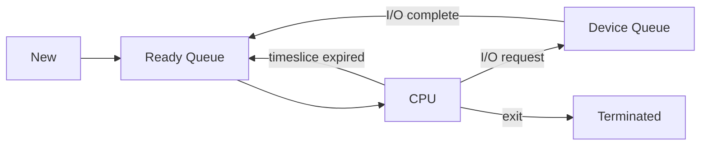
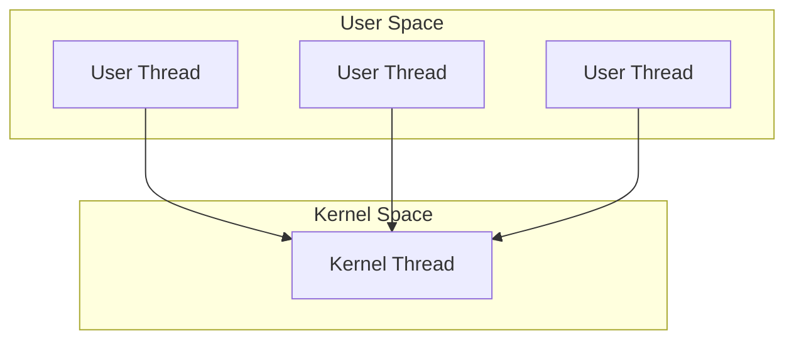
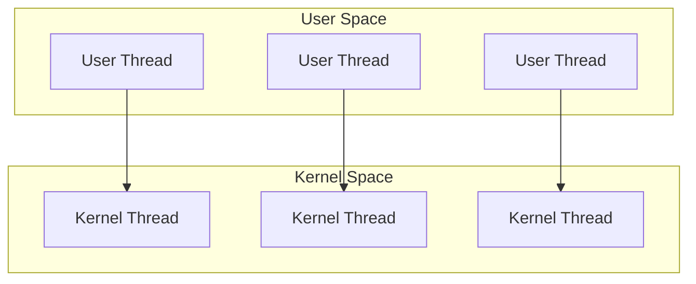
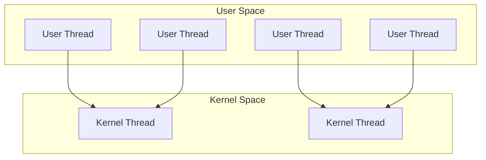

# Chapter 2: Process Management

A process is the core concept of any operating system. This chapter explains what a process is, how the OS manages it, and how modern systems use threads to improve performance and responsiveness.

---

## Process Concept: Program vs Process

A **program** is a passive entity – a file on disk containing instructions and data (e.g., `a.out`, `chrome.exe`). A **process** is an active entity – a program in execution, with its own memory, registers, and state.

**Key distinction**:
- Program: static, stored on disk, no resources allocated.
- Process: dynamic, loaded into memory, owned by the OS.

**Real‑life analogy**: A recipe (program) is just text on paper. When you follow the recipe – heat the pan, chop onions, stir – that’s a process. The same recipe can be cooked by many chefs simultaneously, each as a separate process.

---

## Process States

As a process executes, it changes state. The OS tracks these states to manage CPU and memory efficiently.

| State | Description |
|-------|-------------|
| **New** | The process is being created (e.g., `fork()` called but not yet ready). |
| **Ready** | Process is in memory, waiting to be assigned to the CPU. |
| **Running** | Instructions are actually being executed on the CPU. |
| **Waiting** | Process is blocked, waiting for some event (I/O completion, signal). |
| **Terminated** | Process has finished execution (e.g., `exit()` called). |

<p align="center">
  
</p>

**Real‑life analogy**: A customer in a restaurant:
- **New** – Enters the door, not yet seated.
- **Ready** – Waiting in queue for a table.
- **Running** – Sitting at table, eating.
- **Waiting** – Waiting for the waiter to bring the bill.
- **Terminated** – Leaves the restaurant.

---

## Process Control Block (PCB)

For each process, the OS maintains a data structure called the **Process Control Block** (also called task control block). It contains all the information needed to manage the process.

**Contents of PCB**:

| Field | Description |
|-------|-------------|
| Process ID (PID) | Unique numerical identifier. |
| Program counter | Address of the next instruction to execute. |
| CPU registers | All general‑purpose registers, stack pointer, etc. |
| Memory limits | Base and limit registers, page tables. |
| Open file list | File descriptors and their permissions. |
| I/O status | Devices assigned to this process. |
| Process state | New, ready, running, waiting, terminated. |
| Priority | Scheduling priority (if any). |
| Accounting info | CPU time used, process owner, etc. |

When the OS pauses a process (e.g., to run another), it saves the process’s CPU state into its PCB. When it resumes, it restores from the PCB.

---

## Process Scheduling Queues

The OS maintains several queues to manage processes throughout their lifecycle.

| Queue | Purpose |
|-------|---------|
| **Job queue** | All processes in the system (on disk or in memory). |
| **Ready queue** | Processes in the **Ready** state, waiting for CPU. Stored as a linked list of PCBs. |
| **Device queue** | Processes waiting for a specific I/O device (e.g., disk, printer). Each device has its own queue. |

**Flow**: New process → Ready queue → CPU (Running) → if I/O → Device queue → back to Ready queue → Terminated.



---

## Context Switching

**Context switching** is the act of saving the state (PCB) of the currently running process and loading the saved state of another process. It allows the CPU to switch between processes efficiently, giving the illusion of concurrency.

**Steps**:
1. Save CPU registers and program counter of the current process into its PCB.
2. Update the PCB state (e.g., from Running → Ready).
3. Move the PCB to the appropriate queue (ready or device queue).
4. Select another process from the ready queue (via scheduler).
5. Load its PCB into CPU registers, including program counter.
6. Start executing the new process.

**Overhead**: Context switching is pure overhead – the CPU does no useful work while switching. The cost depends on hardware support (how many registers to save) and memory management (TLB flush).

**Real‑life analogy**: A professor grading assignments. When a student asks a question, the professor saves their place in the current paper (PCB), turns to the student (new process), answers, then returns to the previous paper (restores state).

---

## Process Creation and Termination

### Creation

A process can create another process using the `fork()` system call (Unix/Linux) or `CreateProcess()` (Windows). The creating process is the **parent**, the new one is the **child**.

**`fork()`** (Unix/Linux):
- Creates an exact copy of the parent process (text, data, heap, stack).
- Child gets a new PID and its own memory space.
- `fork()` returns:
  - `0` to the child process.
  - Child’s PID to the parent.
  - `-1` on error.

**`exec()` family** – Replaces the current process’s memory with a new program. Typically used after `fork()` to run a different program.

```c
pid_t pid = fork();
if (pid == 0) {
    // Child process
    execlp("/bin/ls", "ls", NULL);
} else {
    // Parent process
    wait(NULL);
}
```

**`fork()` vs `exec()`**:
- `fork()` clones the calling process.
- `exec()` loads a new program, discarding the old one.

### Termination

A process terminates via `exit()` system call. Reasons:
- Normal completion (return from `main` or `exit`).
- Error or fatal condition.
- Killed by another process (e.g., `kill` on Unix).

When a process terminates, the OS:
- Releases all its resources (memory, open files, I/O buffers).
- Removes its PCB from queues.
- Informs the parent (via `wait()` or signal).

**Zombie process**: A child that has terminated but whose parent has not yet called `wait()`. The PCB is kept (to store exit status).  
**Orphan process**: A child whose parent terminates before the child. On Unix, such children are adopted by the `init` process (PID 1), which calls `wait()` on them.

---

## Process Hierarchies

Operating systems typically organise processes into **trees**. The root is the first process (e.g., `init` or `systemd` on Linux, `launchd` on macOS).

- **Parent** creates **children**.
- Children can create their own children – a hierarchy.
- The OS can propagate signals (e.g., `SIGTERM`) down the tree.

**Example** (Unix):
```
init (PID 1)
├─ systemd-logind
├─ sshd
│   └─ bash (user login)
│       └─ gcc (compiler)
└─ chrome
    ├─ chrome (tab process)
    └─ chrome (GPU process)
```

**Real‑life analogy**: A company CEO (init) who hires managers (parents), who hire employees (children). If a manager leaves, employees may be reassigned to the CEO (orphan adoption).

---

## Process vs Thread

A **thread** is a lightweight unit of execution within a process. A process has at least one thread (the main thread). Multiple threads within the same process share the process’s memory and resources.

| Feature | Process | Thread |
|---------|---------|--------|
| Memory space | Separate address space per process | Shared address space within a process |
| Resource overhead | High (PCB, page tables, file descriptors) | Low (only stack, registers, program counter) |
| Creation time | Slow (copy memory, set up data structures) | Fast (share most resources) |
| Context switch | Expensive (TLB flush, memory remapping) | Cheap (same address space, no TLB flush) |
| Communication | IPC (pipes, sockets, shared memory) | Direct via shared variables |
| Isolation | Strong (one process cannot corrupt another) | Weak (one thread can crash the whole process) |
| Examples | Running two browser windows (separate processes) | Tab inside a browser (multiple threads) |

**Real‑life analogy**: 
- **Process** = An entire house: separate kitchen, bathroom, bedroom – isolated from other houses.
- **Thread** = A person living in that house: all people share the kitchen, bathroom, etc. They can talk directly, but one person burning the kitchen affects everyone in the house.

---

## User‑Level Threads vs Kernel‑Level Threads

Threads can be implemented at two different levels.

### User‑Level Threads (ULT)

- Managed entirely by a user‑space library (e.g., POSIX Pthreads on some implementations).
- The kernel is unaware of their existence – it sees only a single process.
- **Advantages**: Very fast creation and switching (no kernel mode switch). Portable.
- **Disadvantages**: If one thread blocks on I/O, the entire process blocks (the kernel cannot schedule another thread from the same process). Cannot utilise multiple CPU cores.

### Kernel‑Level Threads (KLT)

- Managed directly by the OS kernel. The kernel knows each thread individually.
- **Advantages**: True concurrency across cores; one thread blocking does not block others.
- **Disadvantages**: Slower to create and switch (requires system calls). More overhead per thread.

| | User‑Level | Kernel‑Level |
|--|------------|---------------|
| Management | User library | OS kernel |
| Switch speed | Very fast (no kernel mode) | Slower (needs syscall) |
| Blocking I/O | Blocks entire process | Blocks only that thread |
| Multiprocessor support | None (process runs on one CPU) | Full (threads on different cores) |
| Typical example | Old Java green threads | Modern Linux (NPTL), Windows threads |

---

## Multithreading Models

The relationship between user‑level threads and kernel‑level threads is defined by three classic models.

### 1. Many‑to‑One Model

- Many user threads mapped to a single kernel thread.
- The kernel sees only one thread per process.
- **Pros**: Very lightweight.
- **Cons**: No parallelism (only one thread runs at a time); blocking I/O stops all.
- **Example**: Ancient Unix thread libraries (obsolete).



### 2. One‑to‑One Model

- Each user thread maps to a distinct kernel thread.
- **Pros**: True parallelism (each user thread can run on a different core); blocking I/O does not affect others.
- **Cons**: Creates kernel overhead per thread; limited by kernel thread limits.
- **Examples**: Linux (NPTL), Windows, macOS.



### 3. Many‑to‑Many Model

- Many user threads multiplexed onto a smaller or equal number of kernel threads.
- Allows parallelism up to the number of kernel threads.
- **Pros**: Balances performance and overhead; user threads can be created freely.
- **Cons**: Complex to implement (scheduler activations needed).
- **Example**: Original Solaris, older hybrid implementations (now largely replaced by one‑to‑one due to cheap kernel threads).



**Two‑level model** (variation): Allows a user thread to be bound to a specific kernel thread (e.g., for real‑time tasks), while others are multiplexed.

---

## Summary

| Concept | Key takeaway |
|---------|--------------|
| Program vs process | Program is passive on disk; process is active in memory with its own state. |
| Process states | new → ready → running → waiting → terminated. |
| PCB | Kernel data structure storing all per‑process information. |
| Scheduling queues | Job, ready, device queues to manage process flow. |
| Context switching | Saving and restoring PCB to switch CPU between processes. |
| Process creation | `fork()` clones, `exec()` replaces memory image. |
| Process termination | `exit()` releases resources; parent `wait()` for status. |
| Process hierarchy | Tree structure rooted at `init`/`systemd`. |
| Process vs thread | Threads share memory within a process; threads are lighter. |
| User vs kernel threads | ULT: user‑managed, fast, no parallelism; KLT: kernel‑managed, slower, full concurrency. |
| Multithreading models | Many‑to‑one (obsolete), one‑to‑one (modern), many‑to‑many (compromise). |

Understanding processes and threads is essential before tackling CPU scheduling and memory management – the next chapters in the journey.