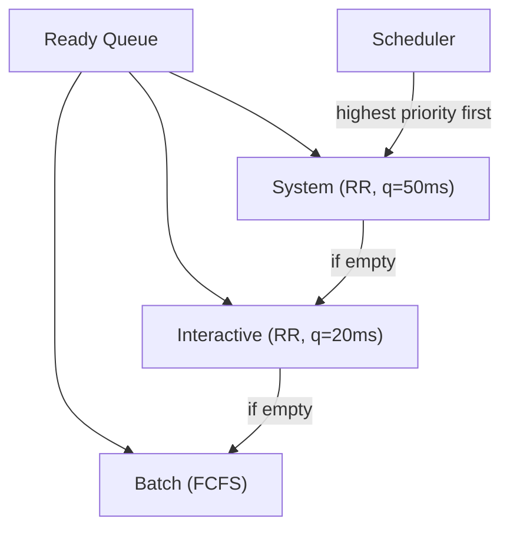
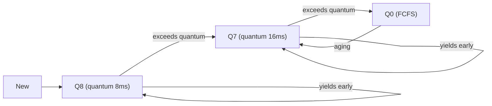

# Chapter 3: CPU Scheduling

CPU scheduling is the foundation of multitasking. The operating system decides which process (or thread) gets to use the CPU and for how long. This chapter explains the goals, algorithms, and trade‑offs that make modern computers feel responsive and efficient.

---

## Scheduling Criteria

To compare scheduling algorithms, we use several measurable criteria. The OS designer tries to optimise (maximise or minimise) these values.

| Criterion | Definition | Goal |
|-----------|------------|------|
| **CPU utilisation** | Percentage of time the CPU is busy executing useful work. | Maximise (keep CPU as busy as possible). |
| **Throughput** | Number of processes completed per unit time (e.g., jobs per second). | Maximise. |
| **Turnaround time** | Total time from process arrival to completion (waiting + execution + I/O). | Minimise. |
| **Waiting time** | Total time a process spends waiting in the ready queue. | Minimise. |
| **Response time** | Time from request submission (e.g., keystroke) to first response (not completion). | Minimise (important for interactive systems). |

**Real‑life analogy**: A coffee shop:
- **CPU utilisation** – How busy the barista is (80% busy is good, 100% means customers wait).
- **Throughput** – Number of coffees made per hour.
- **Turnaround time** – Time from when you enter the queue until you drink your coffee.
- **Waiting time** – Time you spend in the queue before the barista starts your order.
- **Response time** – Time from when you order until the barista says “I’ll start right away” (first acknowledgment).

---

## Preemptive vs Non‑Preemptive Scheduling

**Non‑preemptive scheduling**: Once a process gets the CPU, it holds it until it either terminates or voluntarily yields (e.g., by waiting for I/O). The scheduler cannot forcibly remove it.

**Preemptive scheduling**: The scheduler can interrupt a running process and give the CPU to another. This decision can be based on a timer (time quantum) or a higher‑priority process arriving.

| Aspect | Non‑preemptive | Preemptive |
|--------|----------------|------------|
| Control | Process decides when to release CPU | OS decides when to take CPU away |
| Overhead | Low (fewer context switches) | Higher (more context switches) |
| Fairness | Poor – a long process can starve others | Good – each process gets a slice |
| Response time | Poor for interactive tasks | Excellent |
| Example | Batch systems (old mainframes) | All modern OSes (Linux, Windows, macOS) |

**Real‑life analogy**:
- **Non‑preemptive** – A meeting room: the first team that books it stays until they leave voluntarily.
- **Preemptive** – A classroom with a bell: every 50 minutes the class changes, regardless of whether the teacher wants to continue.

> **Note**: Most modern schedulers are **preemptive** – they use timer interrupts to enforce fair CPU sharing.

---

## Scheduling Algorithms

We now examine classic CPU scheduling algorithms. Each has strengths and weaknesses.

### First‑Come, First‑Served (FCFS)

The simplest algorithm: processes are executed in the order they arrive – like a queue (FIFO).

- **Non‑preemptive**.
- **Advantage**: Easy to implement.
- **Disadvantage**: The “convoy effect” – a long process blocks all shorter ones behind it, leading to high average waiting time.

**Example** (arrival times: all at time 0):

| Process | Burst time |
|---------|------------|
| P1 | 24 |
| P2 | 3 |
| P3 | 3 |

Gantt chart:  
`| P1 | P2 | P3 |`  
Waiting times: P1 = 0, P2 = 24, P3 = 27. Average = (0+24+27)/3 = 17.

**Real‑life**: A single checkout counter in a store – customers served in order. If one customer has a full trolley, everyone behind waits.

---

### Shortest Job First (SJF)

Run the process with the **smallest next CPU burst** first. It is provably optimal for minimising average waiting time (for non‑preemptive).

#### Non‑Preemptive SJF

Once a process starts, it runs to completion. At each scheduling decision, the scheduler picks the shortest job among the arrived processes.

**Example** (arrival times: all at 0):

| Process | Burst time |
|---------|------------|
| P1 | 6 |
| P2 | 8 |
| P3 | 7 |
| P4 | 3 |

Order: P4 (3), P1 (6), P3 (7), P2 (8).  
Waiting times: P4 = 0, P1 = 3, P3 = 9, P2 = 16. Average = 7 (much better than FCFS).

#### Preemptive SJF (Shortest Remaining Time First – SRTF)

If a new process arrives with a burst shorter than the **remaining time** of the current process, the scheduler preempts the current one. This yields even better average waiting time.

**Example** (with arrival times):

| Process | Arrival | Burst |
|---------|---------|-------|
| P1 | 0 | 8 |
| P2 | 1 | 4 |
| P3 | 2 | 9 |
| P4 | 3 | 5 |

Gantt (SRTF):  
`| P1 | P2 | P4 | P1 | P3 |`  
Timeline: 0‑1(P1), 1‑5(P2), 5‑10(P4), 10‑17(P1), 17‑26(P3).  
Average waiting time = (10‑1) + (1‑1) + (17‑2) + (5‑3) … calculate – usually minimal.

**Disadvantage**: **Starvation** – long jobs may never run if short jobs keep arriving. Also, needing accurate future burst time estimation is difficult (but can be predicted using exponential averaging).

**Real‑life analogy**: A hospital emergency room – triage treats the most critical (shortest) patients first, but a new critical arrival can preempt a less critical one.

---

### Round Robin (RR)

Designed for time‑sharing systems. Each process gets a small unit of CPU time called a **time quantum** (or timeslice, typically 10–100 ms). After the quantum expires, the process is preempted and moved to the back of the ready queue.

- **Preemptive** (by timer).
- **Advantage**: Good response time and fairness.
- **Disadvantage**: Performance heavily depends on quantum size.
  - Too large → degenerates to FCFS.
  - Too small → too many context switches, high overhead.

**Rule of thumb**: Quantum should be large compared to context‑switch time (e.g., 10–100 ms vs ~1–10 µs switch).

**Example**: Quantum = 4 ms. Processes arrive at time 0: P1 (burst 24), P2 (3), P3 (3).  
Gantt:  
`| P1 | P2 | P3 | P1 | P1 | P1 | P1 | P1 |`  
(4)(4)(4)(4)(4)(4)(4) – Actually P2 and P3 finish quickly. Detailed: 0‑4 P1, 4‑7 P2, 7‑10 P3, 10‑14 P1, 14‑18 P1, 18‑22 P1, 22‑24 P1.  
Waiting times: P1 = (4+10‑4? Better to compute formally – but concept clear.)

```mermaid
gantt
    title Round Robin (Quantum=4)
    dateFormat X
    axisFormat %s
    section Processes
    P1 : 0, 4
    P2 : 4, 7
    P3 : 7, 10
    P1 : 10, 14
    P1 : 14, 18
    P1 : 18, 22
    P1 : 22, 24
```

---

### Priority Scheduling

Each process is assigned a priority (integer). The CPU is allocated to the process with the **highest priority** (assuming lower number = higher priority).

- Can be **preemptive** or **non‑preemptive**.
- **Problem**: **Starvation** – low‑priority processes may never run.
- **Solution**: **Aging** – gradually increase the priority of waiting processes over time.

**Example** (non‑preemptive, higher number = higher priority):

| Process | Burst | Priority |
|---------|-------|----------|
| P1 | 10 | 3 (low) |
| P2 | 1 | 1 (high) |
| P3 | 2 | 2 (medium) |

Order: P2, P3, P1. Waiting times: P2=0, P3=1, P1=3. Average = 1.33.

With **aging**: If P1 waits too long, its priority rises (3→2→1) so it eventually gets CPU.

**Real‑life**: Airport boarding – first class (high priority) boards before economy. But after some waiting, economy might be called (aging).

---

### Multilevel Queue Scheduling

Processes are categorised into different **queues** based on their type (e.g., foreground interactive, background batch). Each queue has its own scheduling algorithm.

- **Permanent** assignment – a process stays in its queue.
- **Scheduling between queues**: Usually fixed‑priority preemptive – higher‑priority queues run first.

**Example**:
- Queue 0: **System processes** – RR, quantum 50 ms.
- Queue 1: **Interactive (foreground)** – RR, quantum 20 ms.
- Queue 2: **Batch (background)** – FCFS.

If Queue 0 is non‑empty, it runs; if empty, Queue 1 runs; otherwise Queue 2.

- **Advantage**: Clear separation, suitable for systems with obvious process classes.
- **Disadvantage**: Inflexible – a process cannot change queues.

---

### Multilevel Feedback Queue (MLFQ)

The most general and widely used scheduling algorithm (e.g., in classic UNIX, modern BSD, and Windows). It **dynamically** moves processes between queues based on their behaviour.

**Rules** (typical):
1. Multiple queues with different priorities. Higher‑priority queues get shorter time quanta.
2. New processes enter the highest‑priority queue.
3. If a process uses its entire quantum, it drops to a lower‑priority queue.
4. If a process yields the CPU before quantum expires (e.g., for I/O), it stays in the same queue or moves up.
5. After a long waiting time, a process can be boosted to a higher queue (aging).

**Example configuration**:
- Q8 (highest priority): RR, quantum 8 ms – for interactive (short) jobs.
- Q7: RR, quantum 16 ms.
- …
- Q0: FCFS – for CPU‑bound long jobs.

**Result**:
- I/O‑bound (interactive) processes get fast response.
- CPU‑bound processes gradually fall to lower queues, not starving interactive ones.

**Real‑life**: A restaurant with multiple lines – a quick coffee order goes to the express counter (high priority). If an order takes too long, it moves to a slower line. Orders that have been waiting too long get expedited.

---

## Thread Scheduling

Modern operating systems schedule **threads**, not processes. The distinction depends on the threading model (see Chapter 2).

- **User‑level threads (ULT)**: The kernel schedules the **process** that contains many user threads. The user thread library internally schedules threads onto the single kernel thread. The kernel is unaware of the threads – so one blocking thread blocks the entire process.

- **Kernel‑level threads (KLT)**: The kernel schedules each thread individually. This allows true parallelism across cores and independent blocking.

**Process‑Contention Scope (PCS)**: Scheduling among user threads within the same process (managed by user library).  
**System‑Contention Scope (SCS)**: Scheduling among kernel threads across all processes (managed by OS).

**Example**: In Linux (NPTL), `pthread_create` creates kernel threads. The scheduler uses the same algorithms (e.g., CFS – Completely Fair Scheduler) on threads, not processes.

**Real‑life**: A company (process) with multiple employees (threads). If the company is a black‑box to outside (user‑level), outsiders only see the company, not individuals. If the company registers each employee (kernel‑level), outsiders can manage each separately.

---

## Real‑Time Scheduling

Real‑time systems must guarantee that tasks meet their **deadlines** (e.g., airbag deployment, industrial robots). Two categories:

- **Hard real‑time**: Missing a deadline causes catastrophic failure.
- **Soft real‑time**: Missing a deadline degrades performance but not fatal.

Real‑time scheduling often uses **priority‑based preemptive** algorithms with static or dynamic priorities.

### Rate‑Monotonic Scheduling (RMS)

**Assumptions**:
- All tasks are periodic (released at fixed intervals).
- Deadline = period (job must complete before next release).
- Tasks are independent, preemptive.
- No context‑switch overhead (theoretical model).

**Rule**: Assign **higher priority to tasks with shorter periods**. This is an optimal static‑priority algorithm for such systems.

**Example**:
| Task | Period (ms) | Execution time (ms) |
|------|-------------|---------------------|
| T1 | 50 | 10 |
| T2 | 100 | 25 |
| T3 | 200 | 30 |

Rate‑monotonic priorities: T1 (period 50) highest, T2 (100) middle, T3 (200) lowest.

**Schedulability condition** (simplified): For a set of n periodic tasks, RMS is feasible if total utilisation ≤ n × (2^(1/n) − 1). For n=2, 2 × (√2 − 1) ≈ 0.828. In practice, many systems use this bound.

**Limitation**: Not optimal for tasks with different deadlines (if deadline < period). Still widely used in safety‑critical systems.

### Earliest Deadline First (EDF)

**Dynamic priority**: At any time, the task with the **earliest absolute deadline** runs next.

- **Optimal** for uniprocessors – if any schedule meets deadlines, EDF will also (with preemption).
- **Utilisation** can approach 100% (unlike RMS’s 69% for many tasks).
- **Disadvantage**: Overhead of sorting deadlines; potential for overload causing many missed deadlines (unpredictable).

**Example**:
| Task | Arrival | Execution | Deadline |
|------|---------|-----------|----------|
| T1 | 0 | 5 | 10 |
| T2 | 0 | 8 | 12 |

At time 0: T1 deadline=10, T2=12 → run T1. At time 5: T1 finishes, run T2 until completion at 13, which misses T2’s deadline 12. EDF would have chosen T2 first? Actually need to check – classic example shows EDF optimal but not infallible.

**Better example**: T1 (0, 4, 8), T2 (0, 6, 12). EDF runs T1 first, then T2 – both meet deadlines. If T2 had earlier deadline, it would run first.

**Comparison**:

| | Rate‑Monotonic (RMS) | EDF |
|--|----------------------|-----|
| Priority | Static (fixed) | Dynamic |
| Implementation | Simple (fixed priorities) | Needs deadline sorting |
| Utilisation bound (n→∞) | ≈ 69% | 100% |
| Overload behaviour | Predictable (low‑priority tasks starve first) | Unpredictable (may miss many deadlines) |
| Use case | Hard real‑time, safety‑critical | Soft real‑time, multimedia |

**Real‑life example**: 
- **RMS** – A mail carrier with fixed rounds: shorter routes get higher priority.
- **EDF** – A journalist with article deadlines: the article due soonest is written next, even if it arrived later.

---

## Summary

| Concept | Key takeaway |
|---------|--------------|
| Scheduling criteria | CPU utilisation, throughput, turnaround time, waiting time, response time. |
| Preemptive vs non‑preemptive | Preemptive = OS can interrupt; non‑preemptive = process yields voluntarily. |
| FCFS | Simple but suffers from convoy effect. |
| SJF (SRTF) | Optimal for minimising average waiting time; requires burst time prediction. |
| Round Robin | Fair, excellent response; quantum size critical. |
| Priority scheduling | Starvation mitigated by aging. |
| Multilevel queue | Fixed categories; rigid. |
| Multilevel feedback queue | Dynamic movement between queues; used in modern OSes. |
| Thread scheduling | Kernel‑level threads scheduled individually; user‑level threads only via process. |
| RMS | Static priorities based on period; utilisation bound ~69%. |
| EDF | Dynamic priorities based on deadlines; optimal but more overhead. |

Understanding CPU scheduling is key to grasping how an OS balances responsiveness, fairness, and throughput. The next chapter dives into the equally critical topic of memory management.