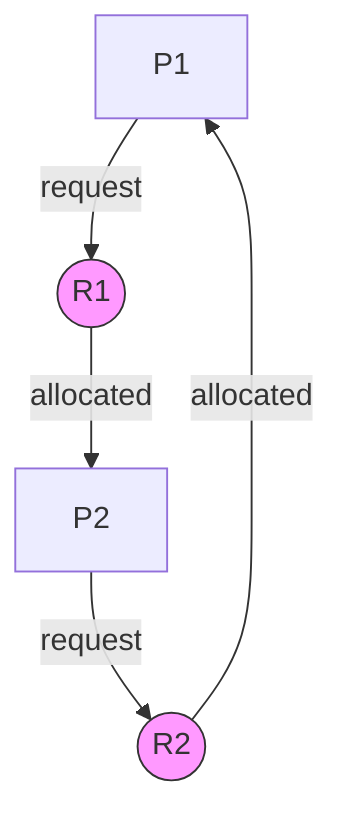

# Chapter 5: Deadlocks

In a multiprogramming environment, processes compete for resources. Sometimes, a set of processes gets stuck forever, each waiting for a resource held by another in the set. This situation is a **deadlock**. This chapter explains how deadlocks occur, how to represent them, and the classic strategies to prevent, avoid, detect, or ignore them.

---

## Deadlock Characterization

A deadlock occurs when two or more processes are each waiting indefinitely for an event (usually resource release) that can only be caused by another waiting process. For a deadlock to happen, **four necessary conditions** must hold simultaneously.

### The Four Conditions

| Condition | Description |
|-----------|-------------|
| **Mutual exclusion** | At least one resource must be held in non‑shareable mode. Only one process can use the resource at a time. |
| **Hold and wait** | A process holding at least one resource is waiting to acquire additional resources held by other processes. |
| **No preemption** | Resources cannot be forcibly taken away from a process. Only the holding process can release them voluntarily. |
| **Circular wait** | There exists a set {P₀, P₁, …, Pₙ} such that P₀ waits for a resource held by P₁, P₁ waits for P₂, …, Pₙ waits for P₀. |

**Real‑life analogy**: Two cars meet at a four‑way stop intersection.
- **Mutual exclusion** – Only one car can occupy the intersection at a time.
- **Hold and wait** – Each car holds its position (already in the intersection or at the line) and waits for the other to move.
- **No preemption** – No traffic officer can push a car aside.
- **Circular wait** – Car A waits for Car B to clear the intersection; Car B waits for Car A to clear. Both block.

---

## Resource Allocation Graph

A **Resource Allocation Graph (RAG)** is a directed graph that visually represents the state of resource allocation. It helps detect whether deadlock exists.

- **Vertices**: Two types
  - Process vertices (circles): P₁, P₂, …, Pₙ
  - Resource vertices (squares): R₁, R₂, …, Rₘ (each has several identical instances)
- **Edges**:
  - **Request edge** (Pᵢ → Rⱼ): Process Pᵢ has requested an instance of Rⱼ and is waiting.
  - **Assignment edge** (Rⱼ → Pᵢ): An instance of Rⱼ has been allocated to Pᵢ.

**Example graph** (no deadlock):

```
P1 → R1 (request), R1 → P2 (assignment), P2 → R2 (request), R2 → P1 (assignment)
```

**Deadlock detection with RAG**:
- If the graph has **no cycles** → no deadlock.
- If the graph has a cycle **and** each resource type has only one instance → deadlock exists.
- If a resource type has multiple instances, a cycle may indicate potential deadlock, but not necessarily (processes could be waiting but not circularly).



**Real‑life analogy**: A whiteboard showing who holds which resource (e.g., printer, scanner) and who is waiting for what. An arrow from a person to a resource means “I want that”; an arrow from resource to person means “this person has it”. If you see a circle of arrows, people may be deadlocked.

---

## Methods for Handling Deadlocks

Operating systems use one of four approaches to deal with deadlocks, ranging from idealistic to pragmatic.

| Approach | Philosophy | Overhead | Practicality |
|----------|------------|----------|--------------|
| **Prevention** | Ensure at least one condition never holds | High | Rarely used |
| **Avoidance** | Allocate resources carefully using extra info | Medium | Feasible for fixed resources |
| **Detection & Recovery** | Allow deadlock, then break it | Medium | Common in databases |
| **Ignorance (Ostrich)** | Assume deadlocks won’t happen | None | Most general‑purpose OSes (Windows, Linux) |

---

### 1. Deadlock Prevention

Prevention ensures that **at least one** of the four necessary conditions is impossible. The OS designs resource allocation to break conditions.

**Breaking Mutual Exclusion** – Not generally possible. Some resources are inherently non‑shareable (e.g., printer). But for read‑only files, shared access can be allowed.

**Breaking Hold and Wait** – Require a process to request **all** resources it will ever need at once, or release all held resources before requesting more.
- **Drawback**: Low resource utilisation; starvation possible.

**Breaking No Preemption** – If a process holding some resources requests another that is unavailable, the OS forcibly takes away the currently held resources (preempts) and makes the process restart.
- **Drawback**: Difficult to implement if resources have state (e.g., a partially written file).

**Breaking Circular Wait** – Impose a **total ordering** of all resource types. Each process must request resources in increasing order (e.g., tape drive (1) then printer (2) then disk (3)). A process requesting a higher‑numbered resource must already hold all lower‑numbered ones.
- **Practical**: Used in some systems. For example, the `lock order` rules in the Linux kernel.

**Real‑life**: A restaurant that eliminates circular wait by assigning numbers to tables: you must eat at table 1 before table 2, and never go from table 3 back to table 2.

---

### 2. Deadlock Avoidance (Banker’s Algorithm)

The **Banker’s Algorithm** (Dijkstra, 1965) avoids deadlock by simulating resource allocation before granting it. The OS requires each process to declare its **maximum** resource needs in advance.

**Key concept – Safe state**: A state is safe if there exists a sequence of processes such that each process, when given its maximum remaining need, can finish with the currently available resources plus resources held by previously finished processes.

If granting a request leads to an **unsafe state**, the OS delays the request (process waits).

**Data structures** (for n processes, m resource types):

- `Available[m]`: available instances of each resource.
- `Max[n][m]`: maximum demand of each process.
- `Allocation[n][m]`: currently allocated to each process.
- `Need[n][m]` = `Max[i][j] - Allocation[i][j]`: remaining need.

**Safety Algorithm** (find if safe state exists):

1. `Work = Available`, `Finish[n] = false`.
2. Find an i such that `Finish[i]==false` and `Need[i] <= Work`.
3. `Work = Work + Allocation[i]`, `Finish[i]=true`. Go to step 2.
4. If all `Finish[i]==true`, state is safe.

**Resource‑Request Algorithm** for process Pᵢ requesting `Request[i]`:
1. If `Request[i] > Need[i]`, error (exceeded maximum).
2. If `Request[i] > Available`, wait.
3. Pretend to allocate: `Available -= Request[i]`, `Allocation[i] += Request[i]`, `Need[i] -= Request[i]`.
4. Run Safety Algorithm. If safe, allocate for real; else roll back and Pᵢ waits.

**Example** (single resource type):

| Process | Allocation | Max | Need |
|---------|------------|-----|------|
| P0 | 0 | 10 | 10 |
| P1 | 3 | 5  | 2   |
| P2 | 2 | 8  | 6   |

Initially Available = 3. Safety sequence: P1 (needs 2, available 3) → finish, release 3+3=6 available → P2 (needs 6) → finish, release 6+2=8 → P0 (needs 10? wait, available 8 < 10, so unsafe!) Actually this example is unsafe. Proper calculation shows the algorithm works.

**Limitations**:
- Fixed number of processes/resources.
- Processes must declare maximum needs – often impossible.
- Overhead of O(m × n²) on each request.

**Real‑life**: A bank (OS) that never lends money if it cannot guarantee to satisfy all future customer withdrawal requests. The banker knows each customer’s credit limit.

---

### 3. Deadlock Detection and Recovery

Allow deadlock to occur, detect it, and then break it. Used in systems where deadlock is rare or where processes are long‑running.

**Detection with Single Instance per Resource** – Use the **Wait‑for Graph**: a reduced version of the resource allocation graph where resource nodes are removed; an edge Pᵢ → Pⱼ means Pᵢ waits for a resource held by Pⱼ. Periodic graph cycle detection (e.g., depth‑first search) identifies deadlock.

**Detection with Multiple Instances** – Use an algorithm similar to Banker’s but without `Max` – just look for processes that can finish with current available resources. If none can finish, deadlock exists.

**Recovery Options**:

| Method | Description | Problem |
|--------|-------------|---------|
| **Process termination** | Abort all deadlocked processes (or one by one) | Expensive; losing work. |
| **Resource preemption** | Take resources from a process and give to another | Need to rollback process to safe checkpoint, possible starvation. |

In practice, many systems opt to simply restart the system or kill processes manually.

**Real‑life**: A system administrator who notices all servers are stuck – kills a process (the “sledgehammer”) or restarts a service.

---

### 4. Deadlock Ignorance (Ostrich Algorithm)

The **Ostrich Algorithm** assumes deadlocks are so rare that the overhead of prevention, avoidance, or detection is not worth the cost. The OS does nothing to handle deadlocks.

- Used in **most general‑purpose OSes** (Windows, Linux, macOS) for most resource types.
- Why? Deadlocks typically occur due to programmer bugs, not OS design. The OS provides locking primitives; it's the programmer’s responsibility to avoid circular wait.
- If a deadlock happens, the system freezes or crashes – user reboots.

**Real‑life**: Putting your head in the sand. The ostrich ignores the problem. For many applications (e.g., your web browser deadlocking – you just restart it), this is acceptable.

---

## Summary

| Concept | Key takeaway |
|---------|--------------|
| Deadlock conditions | Mutual exclusion, hold and wait, no preemption, circular wait (all four needed). |
| Resource allocation graph | Visual tool to represent processes, resources, requests, and allocations. |
| Deadlock prevention | Break one of the four conditions (e.g., resource ordering, request all at once). |
| Deadlock avoidance | Banker’s algorithm – ensure system stays in safe state; requires max needs. |
| Deadlock detection | Periodic check (wait‑for graph or detection algorithm); then recover by termination or preemption. |
| Deadlock ignorance | Do nothing – used by Windows, Linux for most resources; user reboots. |

Understanding deadlocks closes the loop on concurrency control. The next chapter moves to the physical side of the OS: memory management.