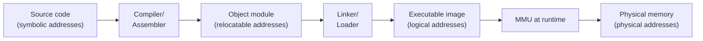
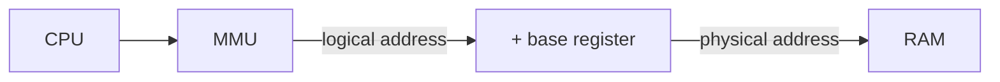
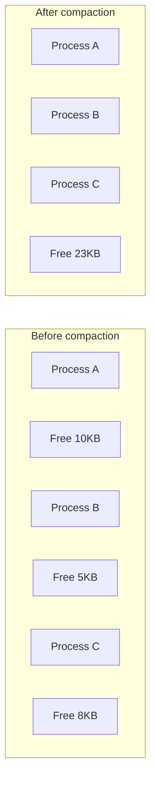
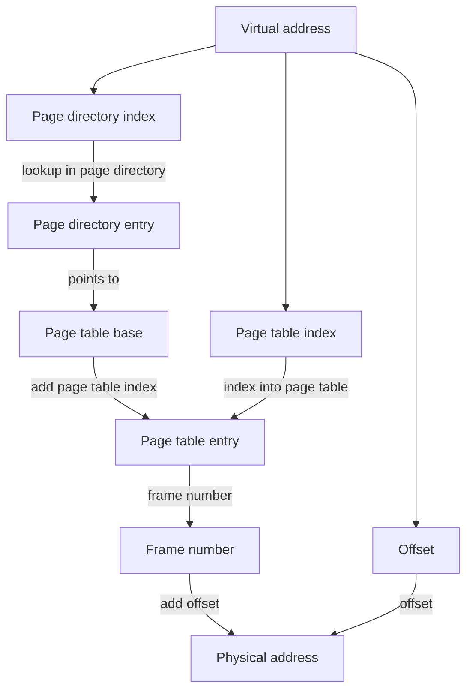
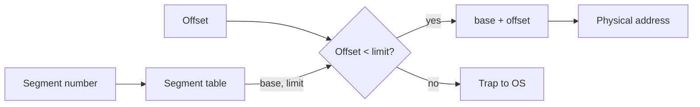

# Chapter 6: Memory Management

Memory is the physical heart of a computer system. The operating system must allocate memory to processes efficiently, protect one process from another, and create the illusion of a large, private address space. This chapter explains the hardware and OS techniques that make modern memory management possible.

---

## Memory Hierarchy

Not all memory is equal. A typical computer has a hierarchy of storage, from fast and expensive to slow and cheap.

| Level | Technology | Typical size | Access time | Managed by |
|-------|------------|--------------|-------------|------------|
| Registers | CPU internal | Few hundred bytes | 0.2‑0.5 ns | Compiler |
| Cache (L1, L2, L3) | SRAM | 32KB – 32MB | 1‑10 ns | Hardware |
| Main memory (RAM) | DRAM | 4GB – 512GB | 50‑100 ns | OS |
| Swap space (disk) | SSD/HDD | 100GB – 2TB | 0.1‑10 ms | OS |
| File storage | SSD/HDD | 256GB – multiple TB | ms – seconds | User/OS |

The OS’s memory manager hides this complexity, making main memory appear as a uniform, linear array of bytes, and optionally extending it to disk (virtual memory, covered in Chapter 7).

**Real‑life analogy**: A desk (registers) holds what you are working on right now. A bookshelf nearby (cache) holds reference books. A filing cabinet (RAM) holds current projects. A warehouse (disk) holds archived files. You move data up the hierarchy when actively needed.

---

## Address Binding

Programs reference memory using addresses. The binding of these symbolic addresses to actual physical memory locations can happen at different times.



### Three Binding Times

| Binding time | When | Example | Pros / Cons |
|--------------|------|---------|--------------|
| **Compile time** | Addresses fixed at compilation | Absolute code (e.g., MS‑DOS .COM) | Fast but inflexible; program must load at a specific address. |
| **Load time** | Relocation by loader at program load | Relocatable code (e.g., `.exe` with base address) | Flexible; however, once loaded, address cannot move. |
| **Execution time** | Binding delayed until runtime; uses MMU | Modern OSes (Linux, Windows) | Maximum flexibility; allows swapping and paging. |

**Real‑life analogy**: 
- **Compile time**: A train timetable fixed to exact platform numbers.
- **Load time**: A conference seating plan – seats assigned when you arrive, but you cannot move later.
- **Execution time**: A taxi – your pickup location is determined when you call (runtime).

---

## Logical vs Physical Address Space

- **Logical address** (virtual address): Generated by the CPU while a program executes. The program sees only this address space.
- **Physical address**: The actual location in RAM hardware. The OS and MMU translate logical to physical addresses.

**Memory Management Unit (MMU)**: Hardware that performs runtime address translation. For example, a simple MMU uses a **base (relocation) register**:

```
physical address = logical address + base register
```



With a bounds (limit) register, the OS can protect processes: if `logical address >= limit`, trap to OS.

**Real‑life analogy**: A hotel room key labelled “Room 412” (logical address). The hotel’s internal map (MMU) translates that to actual physical room 1012 on the third floor. You never need to know the physical location.

---

## Memory Allocation

When a process is created, the OS must allocate memory for its code, data, and stack.

### Contiguous Allocation

Each process occupies a single contiguous block of physical memory.

#### Fixed Partitions (Static)

Memory is divided into fixed‑size regions at boot time. A process is loaded into a partition large enough to hold it.

- **Pros**: Simple, no external fragmentation.
- **Cons**: Internal fragmentation (wasted space inside a partition), limited number of active processes.

#### Dynamic Partitions (Variable)

Partitions are created dynamically to exactly match a process’s size. The OS maintains a list of free holes.

**Placement algorithms** for selecting a hole:
- **First‑fit**: Use the first hole large enough. Fast, generally good.
- **Best‑fit**: Use the smallest hole that fits. Tends to create tiny useless holes.
- **Worst‑fit**: Use the largest hole. Leaves larger remaining holes.

**Real‑life**: Parking on a busy street (dynamic partitions). First‑fit: take the first spot you see. Best‑fit: measure every spot to find the one that exactly fits your car – you waste time.

### Fragmentation

| Type | Description | Cause |
|------|-------------|-------|
| **Internal fragmentation** | Wasted space inside an allocated partition. Example: fixed partition size 8MB, process needs 5MB → 3MB wasted. | Fixed partitions; also page alignment in paging. |
| **External fragmentation** | Total free memory is sufficient to satisfy a request, but no single contiguous block is large enough. | Dynamic partitioning – holes become scattered. |

**Compaction**: Shuffle memory contents to combine small holes into one large hole. Only possible with dynamic (execution‑time) binding. Expensive because it requires moving processes.



---

## Paging

Paging solves external fragmentation by dividing physical memory into fixed‑size blocks called **frames** (typically 4KB) and logical memory into same‑size blocks called **pages**. A process’s pages can be scattered across non‑contiguous frames.

**Key idea**: Logical address = (page number, page offset). The OS maps page number to frame number via a **page table**.

### Address Translation

Given logical address with `m` bits, page size `2^n` bytes:
- **Page number (p)** = top `(m - n)` bits.
- **Page offset (d)** = lower `n` bits.

Example: 32‑bit address, 4KB pages (2^12). Page number = bits 31‑12, offset = bits 11‑0.


### Page Table Entry (PTE)

Each PTE typically contains:

| Field | Meaning |
|-------|---------|
| **Frame number** | Physical frame where the page resides. |
| **Valid (present) bit** | Page is in memory (1) or swapped to disk (0). |
| **Dirty (modified) bit** | Page has been written to (needs write‑back to disk on eviction). |
| **Reference (accessed) bit** | Page has been read or written (used for page replacement algorithms). |
| **Protection bits** | Read, write, execute permissions. |

### Multi‑level Page Tables

A single page table for a 64‑bit address space would be impossibly large (2^64 / page size entries). Multi‑level page tables reduce memory overhead by only allocating levels that are actually used.

Example: 2‑level page table on x86‑32 (10+10+12 bits). Virtual address split:
- Level 1 (page directory index): 10 bits → selects a page directory entry pointing to a page table.
- Level 2 (page table index): 10 bits → selects a PTE in that table.
- Offset: 12 bits.



**Advantage**: Sparse address spaces waste very little memory – only directory and the page tables that are actually used.

### Inverted Page Table

Instead of one page table per process, an **inverted page table** has one entry per physical frame. Each entry stores (process ID, page number) mapping. Used in PowerPC, UltraSPARC, and some IBM systems.

- **Size**: (physical memory size / frame size) entries – fixed and small.
- **Lookup**: Hashing the (PID, page number) pair to find the entry. Slower than multi‑level tables.

### Translation Lookaside Buffer (TLB)

Page tables are stored in RAM. Accessing memory would require two RAM accesses (page table + actual data) – too slow. The TLB is a **hardware cache** that stores recently used page‑to‑frame translations.

**TLB hit**: Translation found in TLB – single memory access.  
**TLB miss**: Must walk page table (in RAM) – two or more accesses, then cache the mapping.

Typical TLB: 32‑512 entries, fully associative or set‑associative.

**TLB coverage**: TLB entries × page size = maximum memory that can be accessed without page table walk. For 4KB pages and 64 TLB entries = 256KB.

Large pages (e.g., 2MB or 1GB) improve TLB coverage and are used for memory‑intensive workloads (databases, virtual machines).

**Context switch and TLB**: When switching processes, the TLB contains entries belonging to the old process. Solutions:
- Flush TLB (costly).
- Tagged TLB: each entry includes an Address Space ID (ASID) to differentiate processes.

**Real‑life analogy**: 
- **Paging** = A filing system where each file (page) can be stored in any drawer (frame), with an index (page table).
- **TLB** = A small sticky note on your desk listing the most‑used file locations, so you don’t need to open the big index every time.

---

## Segmentation

Segmentation gives the programmer a view of memory as consisting of **variable‑sized segments** – code, data, stack, heap, etc. – each with its own base and limit.

### Segment Table

Each process has a segment table. A logical address is `<segment-number, offset>`. The segment table entry contains:
- **Base**: Starting physical address of the segment.
- **Limit**: Length of the segment.

The MMU checks that `offset < limit`, then computes `physical = base + offset`.



**Advantages**:
- Segments grow and shrink separately (e.g., stack expansion).
- Protection per segment (code=read‑only, data=read‑write).
- Sharing: two processes can share a code segment by referencing the same base/limit.

**Disadvantage**: External fragmentation – segments are contiguous variable‑sized blocks.

### Segmentation with Paging (Intel x86)

The x86 architecture (and many others) combines segmentation and paging: segmentation provides multiple logical address spaces, and each segment is divided into pages.

**Process**:
1. Logical address → `<selector, offset>`.
2. Segment descriptor (from Global Descriptor Table or Local Descriptor Table) gives base and limit of the segment. The OS may set segment base to 0 to effectively disable segmentation.
3. The resulting linear address (formerly called virtual address) is then translated to physical address via paging (multi‑level page tables).

This two‑step approach is complex but gives flexibility. Most modern OSes (Linux, Windows) use a **flat memory model**: one segment (or a few) covering the entire address space, relying almost entirely on paging for protection and translation.

**Real‑life analogy**: 
- **Segmentation alone** = You have separate boxes (code box, data box, stack box) of different sizes. You can rearrange the boxes in a warehouse.
- **Segmentation + paging** = You have boxes, but each box is further divided into smaller standard‑size containers (pages) that can be stored in different shelves in the warehouse.

---

## Summary

| Concept | Key takeaway |
|---------|--------------|
| Memory hierarchy | Registers → cache → RAM → swap → storage; trade‑off speed vs size. |
| Address binding | Can be compile time, load time, or execution time (most modern). |
| Logical vs physical | Logical = program’s view; physical = real RAM; MMU translates. |
| Contiguous allocation | Fixed or dynamic partitions; suffers fragmentation. |
| Fragmentation | Internal (wasted inside block) and external (scattered holes). |
| Paging | Fixed‑size pages and frames; eliminates external fragmentation; page table maps pages to frames. |
| Page table entries | Contain frame number, valid, dirty, reference bits. |
| Multi‑level page tables | Reduce memory overhead for sparse address spaces. |
| Inverted page table | One entry per physical frame; used in some architectures. |
| TLB | Hardware cache for address translations; critical for performance. |
| Segmentation | Variable‑sized segments (code, data, stack) with protection and sharing. |
| x86 combination | Segmentation provides base/limit, then paging for fine‑grain translation. |

Understanding memory management is fundamental to paging, swapping, and virtual memory – the subject of the next chapter.