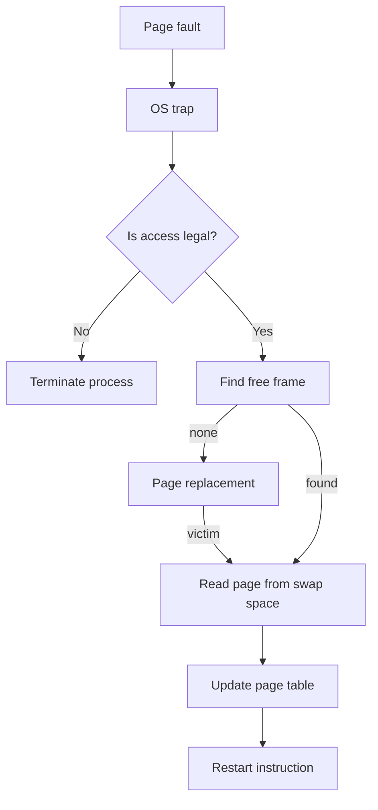
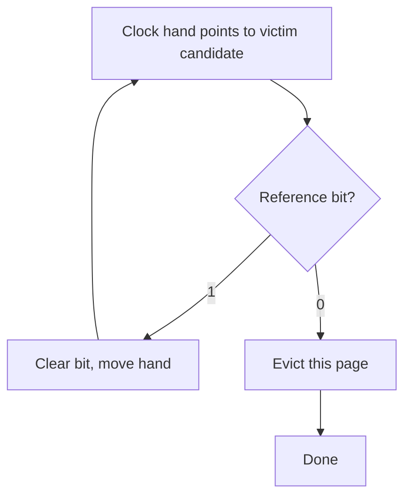

# Chapter 7: Virtual Memory

Virtual memory is a technique that separates the logical address space of a process from physical memory. It allows programs to be larger than physical RAM, enables efficient sharing, and simplifies memory management. This chapter explains how virtual memory works, how the OS handles page faults, and the algorithms used to decide which pages stay in memory.

---

## Demand Paging

**Demand paging** loads pages into physical memory only when they are accessed (on demand), not when the process starts. This reduces memory usage and speeds up process startup.

Under demand paging, the page table has a **valid‑invalid bit** per entry:
- **Valid (1)**: The page is in physical memory (frame allocated).
- **Invalid (0)**: The page is not in memory – either never loaded or swapped out to disk (swap space).

When the program tries to access an invalid page, the hardware traps to the OS – this is a **page fault**.

**Lazy swapper** (pager): The OS that only brings pages into memory when needed. Compare to a swapper that moves whole processes.

**Real‑life analogy**: A university library that does not bring every book from storage to the reading room at once. Only when you request a book (page fault) does a librarian fetch it from the basement.

---

## Page Fault Handling

Steps taken when a page fault occurs:

1. The hardware traps to the OS kernel, saving the program counter and process state.
2. The OS determines which virtual page was accessed (from the faulting address).
3. The OS checks if the access is legal (within address space, correct permissions). If illegal, the process is terminated (segmentation fault).
4. The OS finds a free physical frame. If none, a page replacement algorithm selects a victim frame (Chapter 7.4).
5. The OS schedules a disk read to bring the required page from swap space into the chosen frame.
6. While the disk I/O is in progress, the process is blocked. The OS may context‑switch to another process.
7. When the disk I/O completes, the OS updates the page table entry: valid bit = 1, frame number set.
8. The OS restarts the faulting instruction, which now successfully accesses the page.

**Performance of demand paging**: Effective access time = (1 − p) × memory access time + p × page fault time. Even a tiny page fault rate (p ≈ 0.0001) can slow the system significantly because disk access is ~10⁶ times slower than RAM.

---

## Copy‑on‑Write (COW)

The **fork()** system call traditionally copied the entire parent address space to the child – expensive and slow. **Copy‑on‑write** defers copying: both parent and child share the same physical pages marked as read‑only. When either tries to write to a page, a page fault occurs, and the OS makes a private copy of that page for the writing process.

- **Advantage**: Very fast fork. Unmodified pages are never copied.
- **Use case**: Common after fork, the child immediately calls `exec()` – no copying at all.
- **Implementation**: Page table entries have a COW flag. On write fault, copy the page, update both page tables to read‑write (or keep original read‑only).

**Real‑life analogy**: A teacher gives the same textbook to two students. As long as neither writes in it, they share. When one wants to underline a sentence, that student gets a photocopy of that page (copy‑on‑write).

---

## Page Replacement Algorithms

When a page fault occurs and there is no free frame, the OS must **evict** a page from memory. Page replacement algorithms aim to choose the page that will cause the fewest future faults.

### 1. FIFO (First‑In, First‑Out)

Evict the page that has been in memory the longest. Implemented as a circular queue.

- **Advantage**: Simple.
- **Disadvantage**: Poor performance; suffers from **Belady’s anomaly** – increasing number of frames can increase page faults.

**Belady’s anomaly** example for FIFO (reference string: 1,2,3,4,1,2,5,1,2,3,4,5):
- 3 frames → 9 faults.
- 4 frames → 10 faults (worse!).

### 2. Optimal Algorithm (MIN, OPT, or Belady’s)

Evict the page that will not be used for the **longest time** in the future. This is provably optimal for minimizing page faults.

- **Advantage**: Best possible performance (lower bound).
- **Disadvantage**: Impossible to implement in practice – requires knowledge of the future. Used as a benchmark to compare other algorithms.

### 3. LRU (Least Recently Used)

Evict the page that has not been used for the longest time (based on past behaviour). This approximates OPT by assuming that pages used recently will be used again soon (temporal locality).

**Implementation approaches**:
- **Counters**: Each page table entry has a last‑use time field; at each memory access, update the time. On eviction, scan for smallest time. Expensive.
- **Stack**: Maintain a stack of page references; move accessed page to top. Bottom page is LRU. Hardware support needed for fast updates.

**LRU does not suffer from Belady’s anomaly**; it is a stack algorithm.

### 4. Clock (Second‑Chance) Algorithm

A practical approximation of LRU that uses a **reference bit** (accessed bit) per page. Pages are arranged in a circular list; a hand pointer moves around.

- If the page’s reference bit = 1, clear it (give a second chance) and move hand.
- If the page’s reference bit = 0, evict it.

**Enhanced Clock (NUR – Not Used Recently)**: Use both reference bit and dirty bit. Prefer to evict clean (not dirty) pages to avoid writing to disk.

### 5. LFU (Least Frequently Used) and MFU (Most Frequently Used)

- **LFU**: Evict the page with the smallest access count. Assumes pages used many times will be used again.
- **MFU**: Evict the page with the largest access count. Assumes pages with high count are already cached and will not be needed soon.

Both suffer from implementation overhead (counters can grow large). Also, LFU can retain pages that were heavily used early but never again (no aging). A modified version (LFU with aging) decays counters over time.

**Comparison of algorithms**:

| Algorithm | Implementation complexity | Performance | Works in practice? |
|-----------|--------------------------|-------------|--------------------|
| FIFO | Very low | Poor, Belady anomaly | Only for very simple systems |
| Optimal | Not feasible | Best (theoretical) | Benchmark only |
| LRU | High (hardware or costly) | Very good | Yes, if hardware support |
| Clock | Low (software with reference bit) | Good (close to LRU) | Most common in OSes |
| LFU | Medium | Fair (can cache obsolete pages) | Rare |

**Real‑life analogy**: 
- **FIFO** = A queue at a ticket counter; the person who arrived first is served first, even if they are buying a complicated ticket.
- **LRU** = A bookshelf where you put books you read back on the left; the rightmost book has been untouched longest.
- **Clock** = A security guard who walks around a building, checking each room’s “recently used” light; if light is on, he turns it off and moves on; if off, he evicts the room.

---

## Thrashing and Working Set Model

**Thrashing** occurs when a process spends more time **page faulting** than executing. The disk becomes the bottleneck; CPU utilisation drops dramatically.

**Cause**: The process does not have enough physical frames to hold its **locality** – the set of pages it actively uses. The OS repeatedly evicts pages that will be immediately needed again.

**Working Set Model** (Denning, 1968): The working set of a process at time t is the set of pages referenced in the last Δ references (or time interval). If a process’s working set size exceeds available frames, thrashing occurs.

**Strategies to prevent thrashing**:
- **Working set algorithm**: Keep track of each process’s working set; only allow a process to run if its working set fits in memory.
- **Page Fault Frequency (PFF)**: Set upper and lower bounds on allowed page fault rates. If a process faults too often, give it more frames; if fault rate is very low, take frames away.
- **Suspend a process**: If the sum of working sets exceeds total memory, swap out a process entirely.

**Real‑life analogy**: A chef with only 2 sq ft of counter space trying to prepare a 10‑ingredient dish. He constantly moves pots on and off the stove (thrashing) and gets little cooking done. The solution: give him more counter space (frames) or reduce the recipe (working set).

---

## Page Size Selection

Choosing the page size involves trade‑offs. Most systems use 4 KB, 8 KB, or 16 KB pages (or larger, e.g., 2 MB “huge pages”).

| Factor | Small pages | Large pages |
|--------|-------------|-------------|
| Internal fragmentation | Less (waste at page boundary) | More (last page of process) |
| Page table size | Larger (more entries) | Smaller |
| I/O overhead | More transfers | Fewer, bigger transfers |
| Locality | Better (waste less on rarely used parts) | Worse (brings in extra unused data) |
| TLB coverage | Lower (fixed number of TLB entries) | Higher (each entry maps more memory) |

Modern OSes support multiple page sizes (superpages, huge pages) to allow applications (e.g., databases, VMs) to request larger pages for better TLB performance.

---

## TLB Reach and Coverage

**TLB reach** = (number of TLB entries) × (page size). This is the amount of memory that can be mapped by the TLB at once. If a program’s active working set fits within the TLB reach, TLB misses are rare.

**Example**: 64 TLB entries × 4 KB page = 256 KB TLB reach. A database with a 10 MB working set would thrash the TLB.

**Solutions**:
- Increase page size (e.g., 2 MB huge pages → 64 entries × 2 MB = 128 MB reach).
- Increase TLB size (more entries, expensive in hardware).
- Use multiple TLB levels (L1 and L2 TLBs).

**TLB coverage** refers to the proportion of memory accesses handled without a page table walk. High coverage improves performance.

---

## Memory‑Mapped Files

Memory‑mapped files allow a file on disk to be mapped directly into a process’s virtual address space. Reads and writes to that memory region are automatically reflected in the file (with page caching).

**How it works**:
1. The OS sets up page table entries for the mapped range.
2. Initially, all pages are marked invalid (or demand‑paged).
3. When the process accesses a page, a page fault occurs.
4. The OS reads the corresponding file block from disk into a physical frame.
5. If the page is modified (dirty), the OS writes it back to the file when the page is evicted or the file is unmapped.

**System calls**: `mmap()` (Unix), `CreateFileMapping()` + `MapViewOfFile()` (Windows).

**Advantages**:
- Simplifies file I/O – treat file as memory (no explicit `read` or `write` calls).
- Efficient sharing: multiple processes can map the same file and share pages.
- The OS handles caching and I/O automatically.

**Real‑life analogy**: A shared whiteboard in an office. Each person (process) sees the same board content (file). When someone writes on it (memory write), everyone sees the change when they look. The cleaner (OS) saves the board to a photo (disk) periodically.

---

## Summary

| Concept | Key takeaway |
|---------|--------------|
| Demand paging | Load pages only when accessed; reduces memory usage. |
| Page fault | Trap when accessing invalid page; OS brings in the page. |
| Copy‑on‑write | Share pages between fork()’d processes until a write occurs. |
| Page replacement | FIFO (simple, Belady anomaly), Optimal (unimplementable), LRU (good but costly), Clock (practical), LFU/MFU (rare). |
| Thrashing | Excessive paging due to insufficient frames for working set. |
| Working set model | Active pages of a process; thrashing occurs if working set > available frames. |
| Page size trade‑off | Small pages: less fragmentation, bigger page tables; large pages: better TLB reach, more internal waste. |
| TLB reach | Entries × page size; must cover working set for good performance. |
| Memory‑mapped files | Map file into address space; I/O happens automatically on page faults. |

Virtual memory completes the memory management picture. The next chapter moves to I/O and file systems, where these principles are applied to storage devices.